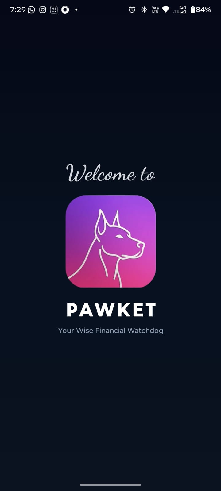
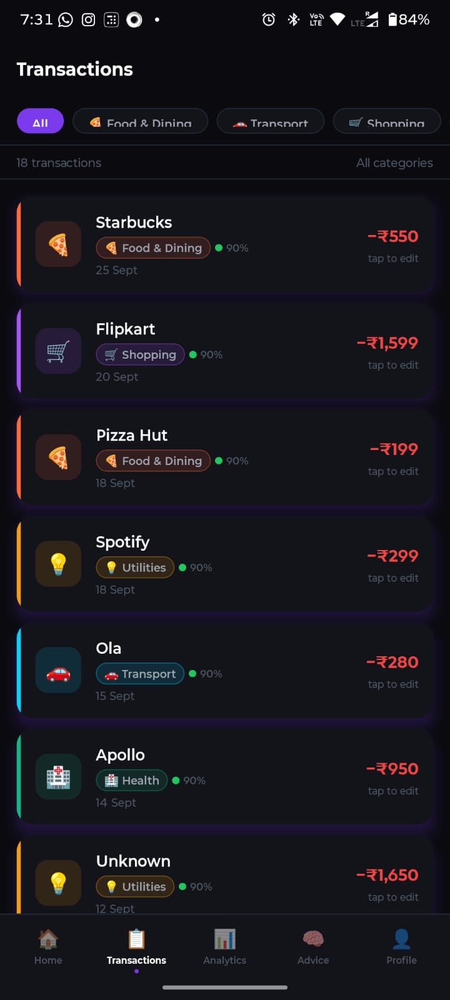
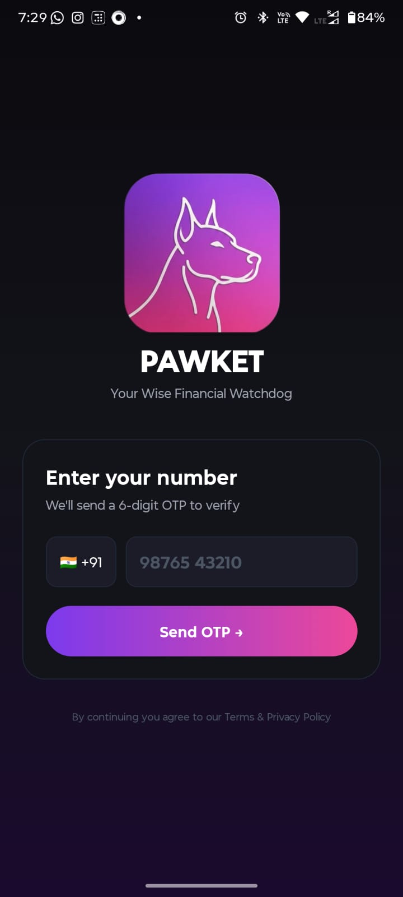

# New session - 2026-08-10T08:53:33.708Z

**Session ID:** ses_0151f6e73ffer789gaWR2WsLn2
**Created:** 8/10/2026, 2:23:33 PM
**Updated:** 8/10/2026, 3:01:27 PM

---

## User

Read all the files understand the project first then i will tell you what to do 

---

## Assistant (Plan · MiMo V2.5 Free · 29.9s)

---

## User

countinue 

---

## Assistant (Plan · MiMo V2.5 Free · 6.3s)

---

## User

what have you understood about the project 

---

## Assistant (Plan · MiMo V2.5 Free · 6.3s)

---

## User

Read all the files understand the project first then i will tell you what to do 

---

## Assistant (Plan · MiMo V2.5 Free · 13.7s)

_Thinking:_

The user wants me to read all the files in the project and understand it first, then they will tell me what to do. I need to explore the project structure and understand what it is. Let me start by reading the directory structure and key files. I'll use the read tool to explore the root directory and then read important files like package.json, README, etc. Since I'm in plan mode, I can only read files and not make any changes. Let me start by exploring the project structure.

**Tool: read**

**Input:**
```json
{
  "filePath": "D:\\project\\PAWKET"
}
```

**Output:**
```
<path>D:\project\PAWKET</path>
<type>directory</type>
<entries>
.expo/
.git/
.gitignore
app.json
application-11cedfae-a3ce-4671-bc42-17ead1be84c4.apk
backend/
Dockerfile
dockerignore
eas.json
fly.toml
ml_pipeline/
mobile/
node_modules/
package-lock.json
package.json
README.md

(16 entries)
</entries>
```

---

## Assistant (Plan · MiMo V2.5 Free · 16.4s)

_Thinking:_

Let me read the key files in parallel to understand the project.

**Tool: read**

**Input:**
```json
{
  "filePath": "D:\\project\\PAWKET\\README.md"
}
```

**Output:**
```
<path>D:\project\PAWKET\README.md</path>
<type>file</type>
<content>
1: # 🐕 PAWKET — Your Wise Financial Watchdog
2: 
3: > An AI-powered personal finance app that automatically reads your bank SMS, categorises spending, detects patterns, and gives personalised financial advice.
4: 
5: ---
6: 
7: ## 📱 Screenshots
8: 
9: <!-- Add screenshots here after first build -->
10: <!--  -->
11: <!--  -->
12: <!--  -->
13: 
14: ---
15: 
16: ## ✨ Features
17: 
18: - **Auto SMS Reading** — reads bank messages on first launch, no manual entry
19: - **ML Categorisation** — 99% accuracy, 10 categories (food, EMI, transport, investment...)
20: - **Smart Deduplication** — detects UPI app + bank duplicate SMS automatically
21: - **Confidence Scoring** — shows prediction confidence with colour-coded dots 🟢🟡🔴
22: - **User Corrections** — tap any transaction to fix category (active learning)
23: - **Monthly Analytics** — KPIs, category breakdown, daily trend, top merchants
24: - **50/30/20 Advice** — personalised financial advice based on your spending + goals
25: - **Recurring Detection** — automatically identifies EMIs, subscriptions, rent
26: - **Profile System** — name, gender, age, financial goals, income
27: - **OTP Login** — phone number authentication, your data stays private
28: - **Animated Welcome** — Doberman logo traces itself on every launch
29: - **Bold Dark UI** — Cred-inspired design, electric violet + hot pink
30: 
31: ---
32: 
33: ## 🏗️ Architecture
34: 
35: ```
36: PAWKET/
37: ├── ml_pipeline/          Python — trains the two ML models
38: │   ├── label_rules.py    keyword rules for categorisation
39: │   ├── train_filter.py   bank vs spam classifier
40: │   ├── train_category.py spending category classifier
41: │   └── evaluate.py       model evaluation + reports
42: │
43: ├── backend/              Python FastAPI — REST API server
44: │   ├── routers/          parse, analytics, advice, correct, profile, auth
45: │   ├── services/         parser, categorizer, analytics, finance_rules, deduplication
46: │   ├── ml/               loads trained .pkl models at startup
47: │   └── database/         SQLite via SQLAlchemy
48: │
49: └── mobile/               React Native (Expo) — Android + iOS app
50:     ├── src/screens/      Dashboard, Analytics, Transactions, Advice, Profile
51:     ├── src/services/     API calls, SMS reader, auth
52:     ├── src/store/        Zustand global state
53:     └── src/components/   TransactionCard, KPICard, CategoryPicker...
54: ```
55: 
56: ---
57: 
58: ## 🤖 ML Models
59: 
60: | Model | Task | Accuracy |
61: |---|---|---|
62: | Filter model | Bank SMS vs spam/OTP | **98%** |
63: | Category model | 10-category spending classifier | **99%** |
64: 
65: **Tech:** TF-IDF + SGDClassifier (scikit-learn)
66: **Training data:** ~100,000 real Indian SMS messages
67: **Categories:** food · transport · shopping · health · emi · investment · transfer · utilities · education · daily_expense
68: 
69: ---
70: 
71: ## 🚀 Getting Started
72: 
73: ### 1. Train the ML models
74: 
75: ```bash
76: cd ml_pipeline
77: pip install -r requirements.txt
78: 
79: # Put your SMS dataset in ml_pipeline/data/SMS-Data.csv
80: py train_filter.py --data data/SMS-Data.csv
81: py train_category.py --data data/SMS-Data.csv
82: py evaluate.py --data data/SMS-Data.csv
83: 
84: # Copy models to backend
85: xcopy models ..\backend\ml\models /E /I
86: ```
87: 
88: ### 2. Run the backend
89: 
90: ```bash
91: cd backend
92: pip install -r requirements.txt
93: py -m uvicorn main:app --reload --host 0.0.0.0 --port 8000
94: 
95: # API docs available at:
96: # http://localhost:8000/docs
97: ```
98: 
99: ### 3. Run the mobile app
100: 
101: ```bash
102: cd mobile
103: npm install
104: npx expo start
105: ```
106: 
107: Scan the QR code with **Expo Go** on your phone.
108: 
109: For a full build with SMS reading:
110: ```bash
111: eas build --platform android --profile preview
112: ```
113: 
114: ---
115: 
116: ## 🌐 Deployment
117: 
118: Backend is deployed on **Render**: `https://pawket-backend.onrender.com`
119: 
120: To deploy your own:
121: 1. Push backend to GitHub
122: 2. Connect to [render.com](https://render.com)
123: 3. Select the `backend/` folder
124: 4. Deploy — `render.yaml` handles the rest
125: 
126: After deployment update the mobile app:
127: ```bash
128: cd backend
129: py update_api_url.py https://your-app.onrender.com
130: ```
131: 
132: ---
133: 
134: ## 🔑 Environment Variables
135: 
136: Create `backend/.env`:
137: ```
138: ML_MODELS_DIR=ml/models
139: DATABASE_URL=sqlite:///./finance.db
140: CORS_ORIGINS=*
141: ```
142: 
143: ---
144: 
145: ## 📦 Tech Stack
146: 
147: | Layer | Tech |
148: |---|---|
149: | ML | Python, scikit-learn, TF-IDF, SGDClassifier |
150: | Backend | FastAPI, SQLAlchemy, SQLite, Pydantic |
151: | Mobile | React Native, Expo, Zustand, React Navigation |
152: | Auth | Phone OTP, JWT-style session tokens |
153: | Deployment | Render (backend), EAS Build (mobile) |
154: 
155: ---
156: 
157: ## 🗺️ Roadmap
158: 
159: - [ ] Push notifications for large transactions
160: - [ ] Budget alerts when category limit exceeded
161: - [ ] Export to PDF / CSV
162: - [ ] Compare month vs previous month
163: - [ ] Multi-bank account support
164: - [ ] Web dashboard
165: - [ ] iOS App Store release
166: 
167: ---
168: 
169: ## 👨‍💻 Author
170: 
171: **Satyam Pani**
172: Built with Claude AI assistance
173: 
174: ---
175: 
176: ## 📄 License
177: 
178: MIT License — free to use, modify, and distribute.

(End of file - total 178 lines)
</content>
```

**Tool: read**

**Input:**
```json
{
  "filePath": "D:\\project\\PAWKET\\package.json"
}
```

**Output:**
```
<path>D:\project\PAWKET\package.json</path>
<type>file</type>
<content>
1: {
2:   "devDependencies": {
3:     "babel-preset-expo": "^55.0.19"
4:   }
5: }

(End of file - total 5 lines)
</content>
```

**Tool: read**

**Input:**
```json
{
  "filePath": "D:\\project\\PAWKET\\app.json"
}
```

**Output:**
```
<path>D:\project\PAWKET\app.json</path>
<type>file</type>
<content>
1: {
2:   "expo": {}
3: }

(End of file - total 3 lines)
</content>
```

**Tool: read**

**Input:**
```json
{
  "filePath": "D:\\project\\PAWKET\\fly.toml"
}
```

**Output:**
```
<path>D:\project\PAWKET\fly.toml</path>
<type>file</type>
<content>
1: [app]
2: name = "pawket-backend"
3: primary_region = "bom"  # Mumbai — closest to India
4: 
5: [build]
6:   builder = "paketobuildpacks/builder:base"
7: 
8: [env]
9:   ML_MODELS_DIR = "ml/models"
10:   DATABASE_URL = "sqlite:///./finance.db"
11:   CORS_ORIGINS = "*"
12:   PORT = "8080"
13: 
14: [http_service]
15:   internal_port = 8080
16:   force_https = true
17:   auto_stop_machines = false
18:   auto_start_machines = true
19:   min_machines_running = 1
20: 
21: [[vm]]
22:   memory = "512mb"
23:   cpu_kind = "shared"
24:   cpus = 1

(End of file - total 24 lines)
</content>
```

**Tool: read**

**Input:**
```json
{
  "filePath": "D:\\project\\PAWKET\\Dockerfile"
}
```

**Output:**
```
<path>D:\project\PAWKET\Dockerfile</path>
<type>file</type>
<content>
1: FROM python:3.11-slim
2: 
3: WORKDIR /app
4: 
5: # Install dependencies
6: COPY requirements.txt .
7: RUN pip install --no-cache-dir -r requirements.txt
8: 
9: # Copy all backend files
10: COPY . .
11: 
12: # Expose port
13: EXPOSE 8080
14: 
15: # Start FastAPI
16: CMD ["uvicorn", "main:app", "--host", "0.0.0.0", "--port", "8080"]

(End of file - total 16 lines)
</content>
```

**Tool: read**

**Input:**
```json
{
  "filePath": "D:\\project\\PAWKET\\eas.json"
}
```

**Output:**
```
<path>D:\project\PAWKET\eas.json</path>
<type>file</type>
<content>
1: {
2:   "cli": {
3:     "version": ">= 18.13.1",
4:     "appVersionSource": "remote"
5:   },
6:   "build": {
7:     "development": {
8:       "developmentClient": true,
9:       "distribution": "internal"
10:     },
11:     "preview": {
12:       "distribution": "internal"
13:     },
14:     "production": {
15:       "autoIncrement": true
16:     }
17:   },
18:   "submit": {
19:     "production": {}
20:   }
21: }

(End of file - total 21 lines)
</content>
```

**Tool: read**

**Input:**
```json
{
  "filePath": "D:\\project\\PAWKET\\.gitignore"
}
```

**Output:**
```
<path>D:\project\PAWKET\.gitignore</path>
<type>file</type>
<content>
1: __pycache__/
2: *.pyc
3: .env
4: venv/
5: mobile/node_modules/
6: mobile/.expo/
7: backend/finance.db
8: ml_pipeline/data/
9: .DS_Store
10: Thumbs.db

(End of file - total 10 lines)
</content>
```

**Tool: read**

**Input:**
```json
{
  "filePath": "D:\\project\\PAWKET\\dockerignore"
}
```

**Output:**
```
<path>D:\project\PAWKET\dockerignore</path>
<type>file</type>
<content>
1: __pycache__/
2: *.pyc
3: .env
4: finance.db
5: .git/

(End of file - total 5 lines)
</content>
```

**Tool: read**

**Input:**
```json
{
  "filePath": "D:\\project\\PAWKET\\backend"
}
```

**Output:**
```
<path>D:\project\PAWKET\backend</path>
<type>directory</type>
<entries>
__init__.py
__pycache__/
.gitattributes
database/
Dockerfile
finance_rules/
finance.db
git
main.py
ml/
models/
parser/
requirements.txt
routers/
services/

(15 entries)
</entries>
```

**Tool: read**

**Input:**
```json
{
  "filePath": "D:\\project\\PAWKET\\mobile"
}
```

**Output:**
```
<path>D:\project\PAWKET\mobile</path>
<type>directory</type>
<entries>
.env
.expo/
.git/
App.js
app.json
assets/
babel.config.js
components/
eas.json
hooks/
metro.config.js
navigation/
node_modules/
package-lock.json
package.json
README.md
screens/
services/
sms-plugin.js
src/
store/
svg.d.ts

(22 entries)
</entries>
```

**Tool: read**

**Input:**
```json
{
  "filePath": "D:\\project\\PAWKET\\ml_pipeline"
}
```

**Output:**
```
<path>D:\project\PAWKET\ml_pipeline</path>
<type>directory</type>
<entries>
__pycache__/
data/
evaluate.py
label_rules.py
models/
README.md
requirements.txt
train_category.py
train_filter.py

(9 entries)
</entries>
```

---

## Assistant (Plan · MiMo V2.5 Free · 41.8s)

_Thinking:_

Let me now dive deeper into each of the three main components: ml_pipeline, backend, and mobile.

Now let me dive deeper into all three main components:

**Tool: read**

**Input:**
```json
{
  "filePath": "D:\\project\\PAWKET\\backend\\main.py"
}
```

**Output:**
```
<path>D:\project\PAWKET\backend\main.py</path>
<type>file</type>
<content>
1: import os
2: from contextlib import asynccontextmanager
3: from fastapi import FastAPI
4: from fastapi.middleware.cors import CORSMiddleware
5: from dotenv import load_dotenv
6: 
7: load_dotenv()
8: 
9: from database.database import create_tables
10: from ml.ml_loader import ml_models
11: from routers.auth import router as auth_router
12: from routers.parse import router as parse_router
13: from routers.analytics import router as analytics_router
14: from routers.correct import router as correct_router
15: from routers.advice import router as advice_router
16: from routers.profile import router as profile_router
17: 
18: @asynccontextmanager
19: async def lifespan(app: FastAPI):
20:     print("\n[startup] Creating database tables...")
21:     create_tables()
22:     print("[startup] Loading ML models...")
23:     ml_models.load(os.getenv("ML_MODELS_DIR", "ml/models"))
24:     print("[startup] Ready.\n")
25:     yield
26: 
27: app = FastAPI(title="Finance App API", version="1.0.0", lifespan=lifespan)
28: 
29: app.add_middleware(CORSMiddleware,
30:     allow_origins=os.getenv("CORS_ORIGINS", "*").split(","),
31:     allow_credentials=True, allow_methods=["*"], allow_headers=["*"])
32: 
33: app.include_router(auth_router)
34: app.include_router(profile_router)
35: app.include_router(parse_router)
36: app.include_router(analytics_router)
37: app.include_router(correct_router)
38: app.include_router(advice_router)
39: 
40: @app.get("/", tags=["health"])
41: def root():
42:     return {"status": "ok", "ml_loaded": ml_models.loaded, "docs": "/docs"}
43: 
44: @app.get("/health", tags=["health"])
45: def health():
46:     return {"status": "ok", "ml_loaded": ml_models.loaded}

(End of file - total 46 lines)
</content>
```

**Tool: read**

**Input:**
```json
{
  "filePath": "D:\\project\\PAWKET\\backend\\requirements.txt"
}
```

**Output:**
```
<path>D:\project\PAWKET\backend\requirements.txt</path>
<type>file</type>
<content>
1: fastapi>=0.111.0
2: uvicorn[standard]>=0.29.0
3: python-dotenv>=1.0.0
4: 
5: pandas>=2.0.0
6: numpy>=1.26.0
7: scikit-learn>=1.4.0
8: joblib>=1.3.0
9: 
10: pydantic>=2.0.0
11: 
12: sqlalchemy>=2.0.0
13: psycopg2-binary>=2.9.0
14: 
15: passlib[bcrypt]>=1.7.4
16: bcrypt>=4.0.0
17: 
18: python-jose[cryptography]>=3.3.0
19: 
20: python-multipart>=0.0.9
21: email-validator>=2.1.0

(End of file - total 21 lines)
</content>
```

**Tool: read**

**Input:**
```json
{
  "filePath": "D:\\project\\PAWKET\\backend\\routers"
}
```

**Output:**
```
<path>D:\project\PAWKET\backend\routers</path>
<type>directory</type>
<entries>
__init__.py
__pycache__/
advice.py
analytics.py
auth.js
auth.py
correct.py
parse.py
profile.py

(9 entries)
</entries>
```

**Tool: read**

**Input:**
```json
{
  "filePath": "D:\\project\\PAWKET\\backend\\services"
}
```

**Output:**
```
<path>D:\project\PAWKET\backend\services</path>
<type>directory</type>
<entries>
__pycache__/
analytics.py
categorizer.py
deduplication.py
finance_rules.py
parser.py

(6 entries)
</entries>
```

**Tool: read**

**Input:**
```json
{
  "filePath": "D:\\project\\PAWKET\\backend\\ml"
}
```

**Output:**
```
<path>D:\project\PAWKET\backend\ml</path>
<type>directory</type>
<entries>
__init__.py
__pycache__/
ml_loader.py
models/

(4 entries)
</entries>
```

**Tool: read**

**Input:**
```json
{
  "filePath": "D:\\project\\PAWKET\\backend\\database"
}
```

**Output:**
```
<path>D:\project\PAWKET\backend\database</path>
<type>directory</type>
<entries>
__init__.py
__pycache__/
database.py

(3 entries)
</entries>
```

**Tool: read**

**Input:**
```json
{
  "filePath": "D:\\project\\PAWKET\\backend\\parser"
}
```

**Output:**
```
<path>D:\project\PAWKET\backend\parser</path>
<type>directory</type>
<entries>


(0 entries)
</entries>
```

**Tool: read**

**Input:**
```json
{
  "filePath": "D:\\project\\PAWKET\\backend\\finance_rules"
}
```

**Output:**
```
<path>D:\project\PAWKET\backend\finance_rules</path>
<type>directory</type>
<entries>


(0 entries)
</entries>
```

**Tool: read**

**Input:**
```json
{
  "filePath": "D:\\project\\PAWKET\\ml_pipeline\\train_filter.py"
}
```

**Output:**
```
<path>D:\project\PAWKET\ml_pipeline\train_filter.py</path>
<type>file</type>
<content>
1: """
2: train_filter.py
3: ---------------
4: Trains a binary classifier:
5:     1  →  financial / bank SMS
6:     0  →  spam / OTP / promotional / personal
7: 
8: Run this first. It saves:
9:     models/filter_model.pkl
10:     models/filter_vectorizer.pkl
11: 
12: Usage:
13:     python train_filter.py --data path/to/SMS-Data.csv
14: """
15: 
16: import argparse
17: import os
18: import joblib
19: import pandas as pd
20: from sklearn.feature_extraction.text import TfidfVectorizer
21: from sklearn.linear_model import SGDClassifier
22: from sklearn.model_selection import train_test_split, cross_val_score
23: from sklearn.metrics import (
24:     classification_report,
25:     confusion_matrix,
26:     ConfusionMatrixDisplay,
27: )
28: from sklearn.pipeline import Pipeline
29: import matplotlib
30: matplotlib.use("Agg")           # headless — no display needed
31: import matplotlib.pyplot as plt
32: 
33: from label_rules import is_financial
34: 
35: 
36: # ---------------------------------------------------------------------------
37: # CLI
38: # ---------------------------------------------------------------------------
39: 
40: def parse_args():
41:     parser = argparse.ArgumentParser(description="Train the SMS filter model")
42:     parser.add_argument(
43:         "--data",
44:         required=True,
45:         help="Path to SMS-Data.csv",
46:     )
47:     parser.add_argument(
48:         "--out",
49:         default="models",
50:         help="Output directory for .pkl files (default: models/)",
51:     )
52:     parser.add_argument(
53:         "--test-size",
54:         type=float,
55:         default=0.2,
56:         help="Fraction of data for testing (default: 0.2)",
57:     )
58:     return parser.parse_args()
59: 
60: 
61: # ---------------------------------------------------------------------------
62: # Data loading & labeling
63: # ---------------------------------------------------------------------------
64: 
65: def load_and_label(csv_path: str) -> pd.DataFrame:
66:     print(f"[1/5] Loading data from: {csv_path}")
67:     df = pd.read_csv(csv_path)
68: 
69:     # Keep only the 'text' column, drop empty rows
70:     if "text" not in df.columns:
71:         raise ValueError("CSV must have a 'text' column.")
72: 
73:     df = df.dropna(subset=["text"]).copy()
74:     df["text"] = df["text"].astype(str).str.strip()
75:     df = df[df["text"].str.len() > 0].reset_index(drop=True)
76: 
77:     print(f"    Total rows after cleaning: {len(df):,}")
78: 
79:     # Apply rule-based labeling
80:     print("[2/5] Labeling rows with rule-based logic...")
81:     df["label"] = df["text"].apply(is_financial)
82: 
83:     pos = df["label"].sum()
84:     neg = len(df) - pos
85:     print(f"    Financial (1): {pos:,}  |  Non-financial (0): {neg:,}")
86:     print(f"    Class ratio  : {pos/len(df)*100:.1f}% financial")
87: 
88:     return df
89: 
90: 
91: # ---------------------------------------------------------------------------
92: # Training
93: # ---------------------------------------------------------------------------
94: 
95: def train(df: pd.DataFrame, test_size: float):
96:     print("[3/5] Splitting into train / test sets...")
97:     X_train, X_test, y_train, y_test = train_test_split(
98:         df["text"], df["label"],
99:         test_size=test_size,
100:         random_state=42,
101:         stratify=df["label"],   # keeps class ratio same in both splits
102:     )
103:     print(f"    Train: {len(X_train):,}  |  Test: {len(X_test):,}")
104: 
105:     print("[4/5] Training TF-IDF + SGD pipeline...")
106:     pipeline = Pipeline([
107:         (
108:             "tfidf",
109:             TfidfVectorizer(
110:                 ngram_range=(1, 2),     # unigrams + bigrams
111:                 max_features=30_000,
112:                 sublinear_tf=True,      # log(tf) — helps with frequent words
113:                 strip_accents="unicode",
114:                 min_df=2,               # ignore very rare terms
115:             ),
116:         ),
117:         (
118:             "clf",
119:             SGDClassifier(
120:                 loss="log_loss",        # gives probability output
121:                 alpha=1e-4,
122:                 max_iter=100,
123:                 random_state=42,
124:                 class_weight="balanced",  # handles class imbalance
125:                 n_jobs=-1,
126:             ),
127:         ),
128:     ])
129: 
130:     pipeline.fit(X_train, y_train)
131: 
132:     return pipeline, X_test, y_test
133: 
134: 
135: # ---------------------------------------------------------------------------
136: # Evaluation
137: # ---------------------------------------------------------------------------
138: 
139: def evaluate(pipeline, X_test, y_test, out_dir: str):
140:     print("[5/5] Evaluating on test set...")
141: 
142:     y_pred = pipeline.predict(X_test)
143: 
144:     print("\n" + "="*60)
145:     print("CLASSIFICATION REPORT")
146:     print("="*60)
147:     print(classification_report(
148:         y_test, y_pred,
149:         target_names=["Non-financial (0)", "Financial (1)"],
150:     ))
151: 
152:     # Confusion matrix → saved as PNG
153:     cm = confusion_matrix(y_test, y_pred)
154:     disp = ConfusionMatrixDisplay(
155:         confusion_matrix=cm,
156:         display_labels=["Non-financial", "Financial"],
157:     )
158:     fig, ax = plt.subplots(figsize=(6, 5))
159:     disp.plot(ax=ax, cmap="Blues", colorbar=False)
160:     ax.set_title("Filter Model — Confusion Matrix")
161:     plt.tight_layout()
162:     cm_path = os.path.join(out_dir, "filter_confusion_matrix.png")
163:     plt.savefig(cm_path, dpi=120)
164:     plt.close()
165:     print(f"    Confusion matrix saved → {cm_path}")
166: 
167:     # Quick sanity check on real-world examples
168:     samples = [
169:         ("INR 500 debited from your account via UPI", 1),
170:         ("Your OTP is 123456 for login", 0),
171:         ("Earn up to Rs 18000 per month with Zomato delivery", 0),
172:         ("Rs.95.15 on Zomato charged via Simpl", 1),
173:         ("Received Rs.600.00 in your a/c from One97 Communications", 1),
174:         ("Lucknow ya Kolkata? Watch LIVE with Vi cricket pack", 0),
175:         ("Your EMI of Rs 3200 has been debited", 1),
176:         ("Use OTP 459679 to log into Swiggy", 0),
177:     ]
178: 
179:     print("\nSANITY CHECKS")
180:     print("-"*60)
181:     preds = pipeline.predict([s[0] for s in samples])
182:     probs = pipeline.predict_proba([s[0] for s in samples])
183:     all_pass = True
184:     for (text, expected), pred, prob in zip(samples, preds, probs):
185:         status = "✓" if pred == expected else "✗ FAIL"
186:         if pred != expected:
187:             all_pass = False
188:         print(f"  {status}  [{prob[1]:.2f}]  {text[:60]}")
189:     print()
190:     if all_pass:
191:         print("  All sanity checks passed!")
192:     else:
193:         print("  Some checks failed — review label_rules.py")
194: 
195: 
196: # ---------------------------------------------------------------------------
197: # Save
198: # ---------------------------------------------------------------------------
199: 
200: def save(pipeline, out_dir: str):
201:     os.makedirs(out_dir, exist_ok=True)
202:     model_path = os.path.join(out_dir, "filter_model.pkl")
203:     joblib.dump(pipeline, model_path)
204:     print(f"\nModel saved → {model_path}")
205: 
206: 
207: # ---------------------------------------------------------------------------
208: # Main
209: # ---------------------------------------------------------------------------
210: 
211: if __name__ == "__main__":
212:     args = parse_args()
213:     df = load_and_label(args.data)
214:     pipeline, X_test, y_test = train(df, args.test_size)
215:     evaluate(pipeline, X_test, y_test, args.out)
216:     save(pipeline, args.out)
217:     print("\nDone. Run train_category.py next.\n")

(End of file - total 217 lines)
</content>
```

**Tool: read**

**Input:**
```json
{
  "filePath": "D:\\project\\PAWKET\\ml_pipeline\\train_category.py"
}
```

**Output:**
```
<path>D:\project\PAWKET\ml_pipeline\train_category.py</path>
<type>file</type>
<content>
1: """
2: train_category.py
3: -----------------
4: Trains a multi-class classifier for spending categories:
5:     food | transport | shopping | health | emi |
6:     investment | transfer | utilities | education | others
7: 
8: Only runs on rows that the filter model would mark as financial (label=1).
9: This keeps the category model focused — it never sees spam/OTP messages.
10: 
11: Saves:
12:     models/category_model.pkl
13:     models/category_report.txt
14: 
15: Usage:
16:     python train_category.py --data path/to/SMS-Data.csv
17: """
18: 
19: import argparse
20: import os
21: import joblib
22: import pandas as pd
23: from sklearn.feature_extraction.text import TfidfVectorizer
24: from sklearn.linear_model import SGDClassifier
25: from sklearn.model_selection import train_test_split, StratifiedKFold, cross_val_score
26: from sklearn.metrics import classification_report, confusion_matrix, ConfusionMatrixDisplay
27: from sklearn.pipeline import Pipeline
28: import matplotlib
29: matplotlib.use("Agg")
30: import matplotlib.pyplot as plt
31: import numpy as np
32: 
33: from label_rules import is_financial, label_category
34: 
35: 
36: # ---------------------------------------------------------------------------
37: # CLI
38: # ---------------------------------------------------------------------------
39: 
40: def parse_args():
41:     parser = argparse.ArgumentParser(description="Train the SMS category model")
42:     parser.add_argument("--data", required=True, help="Path to SMS-Data.csv")
43:     parser.add_argument("--out", default="models", help="Output directory (default: models/)")
44:     parser.add_argument("--test-size", type=float, default=0.2)
45:     return parser.parse_args()
46: 
47: 
48: # ---------------------------------------------------------------------------
49: # Data loading & labeling
50: # ---------------------------------------------------------------------------
51: 
52: def load_and_label(csv_path: str) -> pd.DataFrame:
53:     print(f"[1/5] Loading data from: {csv_path}")
54:     df = pd.read_csv(csv_path)
55: 
56:     if "text" not in df.columns:
57:         raise ValueError("CSV must have a 'text' column.")
58: 
59:     df = df.dropna(subset=["text"]).copy()
60:     df["text"] = df["text"].astype(str).str.strip()
61:     df = df[df["text"].str.len() > 0].reset_index(drop=True)
62:     print(f"    Total rows after cleaning: {len(df):,}")
63: 
64:     # Step 1: keep only financial messages
65:     print("[2/5] Filtering to financial messages only...")
66:     df["is_financial"] = df["text"].apply(is_financial)
67:     df = df[df["is_financial"] == 1].copy().reset_index(drop=True)
68:     print(f"    Financial rows kept: {len(df):,}")
69: 
70:     # Step 2: assign category
71:     print("    Labeling categories...")
72:     df["category"] = df["text"].apply(label_category)
73: 
74:     # Show distribution
75:     dist = df["category"].value_counts()
76:     print("\n    Category distribution:")
77:     for cat, count in dist.items():
78:         bar = "█" * min(40, int(count / dist.max() * 40))
79:         print(f"    {cat:<12} {count:>6,}  {bar}")
80: 
81:     # Warn if any category is very underrepresented
82:     min_samples_needed = 20
83:     low = dist[dist < min_samples_needed]
84:     if not low.empty:
85:         print(f"\n    ⚠  Low-sample categories (< {min_samples_needed}): {list(low.index)}")
86:         print("       Consider adding more keyword patterns in label_rules.py")
87: 
88:     print()
89:     return df
90: 
91: 
92: # ---------------------------------------------------------------------------
93: # Training
94: # ---------------------------------------------------------------------------
95: 
96: def train(df: pd.DataFrame, test_size: float):
97:     print("[3/5] Splitting into train / test sets...")
98: 
99:     # Drop categories with too few samples to stratify
100:     min_count = 5
101:     valid_cats = df["category"].value_counts()
102:     valid_cats = valid_cats[valid_cats >= min_count].index
103:     dropped = df[~df["category"].isin(valid_cats)]["category"].unique()
104:     if len(dropped):
105:         print(f"    Dropping very rare categories (< {min_count} samples): {dropped}")
106:     df = df[df["category"].isin(valid_cats)].reset_index(drop=True)
107: 
108:     X_train, X_test, y_train, y_test = train_test_split(
109:         df["text"], df["category"],
110:         test_size=test_size,
111:         random_state=42,
112:         stratify=df["category"],
113:     )
114:     print(f"    Train: {len(X_train):,}  |  Test: {len(X_test):,}")
115: 
116:     print("[4/5] Training TF-IDF + SGD pipeline...")
117:     pipeline = Pipeline([
118:         (
119:             "tfidf",
120:             TfidfVectorizer(
121:                 ngram_range=(1, 2),
122:                 max_features=40_000,
123:                 sublinear_tf=True,
124:                 strip_accents="unicode",
125:                 min_df=2,
126:             ),
127:         ),
128:         (
129:             "clf",
130:             SGDClassifier(
131:                 loss="log_loss",
132:                 alpha=5e-5,
133:                 max_iter=200,
134:                 random_state=42,
135:                 class_weight="balanced",
136:                 n_jobs=-1,
137:             ),
138:         ),
139:     ])
140: 
141:     pipeline.fit(X_train, y_train)
142: 
143:     # 5-fold cross-validation on training data
144:     print("    Running 5-fold cross-validation...")
145:     cv = StratifiedKFold(n_splits=5, shuffle=True, random_state=42)
146:     cv_scores = cross_val_score(pipeline, df["text"], df["category"], cv=cv, scoring="f1_macro", n_jobs=-1)
147:     print(f"    CV F1 (macro): {cv_scores.mean():.3f} ± {cv_scores.std():.3f}")
148: 
149:     return pipeline, X_test, y_test, df
150: 
151: 
152: # ---------------------------------------------------------------------------
153: # Evaluation
154: # ---------------------------------------------------------------------------
155: 
156: def evaluate(pipeline, X_test, y_test, out_dir: str):
157:     print("[5/5] Evaluating on test set...")
158: 
159:     y_pred = pipeline.predict(X_test)
160:     categories = sorted(y_test.unique())
161: 
162:     report_str = classification_report(y_test, y_pred, target_names=categories)
163:     print("\n" + "="*60)
164:     print("CLASSIFICATION REPORT")
165:     print("="*60)
166:     print(report_str)
167: 
168:     # Save report to file
169:     report_path = os.path.join(out_dir, "category_report.txt")
170:     with open(report_path, "w") as f:
171:         f.write(report_str)
172:     print(f"    Report saved → {report_path}")
173: 
174:     # Confusion matrix
175:     cm = confusion_matrix(y_test, y_pred, labels=categories)
176:     fig, ax = plt.subplots(figsize=(10, 8))
177:     disp = ConfusionMatrixDisplay(confusion_matrix=cm, display_labels=categories)
178:     disp.plot(ax=ax, cmap="Blues", colorbar=True, xticks_rotation=45)
179:     ax.set_title("Category Model — Confusion Matrix")
180:     plt.tight_layout()
181:     cm_path = os.path.join(out_dir, "category_confusion_matrix.png")
182:     plt.savefig(cm_path, dpi=120)
183:     plt.close()
184:     print(f"    Confusion matrix saved → {cm_path}")
185: 
186:     # Sanity checks per category
187:     samples = [
188:         ("INR 250 debited via UPI at Swiggy", "food"),
189:         ("Rs 95 on Zomato charged via Simpl", "food"),
190:         ("Uber trip ended. Rs 180 charged to your card", "transport"),
191:         ("IRCTC booking confirmed. Rs 1200 debited", "transport"),
192:         ("Amazon order placed. Rs 599 debited", "shopping"),
193:         ("Apollo Pharmacy Rs 340 paid via UPI", "health"),
194:         ("Your EMI of Rs 3200 has been debited from your account", "emi"),
195:         ("SIP of Rs 2000 processed for HDFC Mutual Fund", "investment"),
196:         ("Sent Rs 500 to Rahul via PhonePe", "transfer"),
197:         ("Jio postpaid bill Rs 399 paid", "utilities"),
198:         ("Unacademy subscription Rs 1000 debited", "education"),
199:     ]
200: 
201:     print("\nSANITY CHECKS")
202:     print("-"*60)
203:     texts = [s[0] for s in samples]
204:     expected = [s[1] for s in samples]
205:     preds = pipeline.predict(texts)
206:     probs = pipeline.predict_proba(texts)
207:     classes = pipeline.classes_
208: 
209:     all_pass = True
210:     for text, exp, pred, prob_row in zip(texts, expected, preds, probs):
211:         conf = prob_row[list(classes).index(pred)]
212:         status = "✓" if pred == exp else f"✗ FAIL (got: {pred})"
213:         if pred != exp:
214:             all_pass = False
215:         print(f"  {status}  [{conf:.2f}]  {text[:60]}")
216: 
217:     print()
218:     if all_pass:
219:         print("  All sanity checks passed!")
220:     else:
221:         print("  Some checks failed — review label_rules.py keyword patterns")
222: 
223: 
224: # ---------------------------------------------------------------------------
225: # Save
226: # ---------------------------------------------------------------------------
227: 
228: def save(pipeline, out_dir: str):
229:     os.makedirs(out_dir, exist_ok=True)
230:     model_path = os.path.join(out_dir, "category_model.pkl")
231:     joblib.dump(pipeline, model_path)
232:     print(f"\nModel saved → {model_path}")
233: 
234: 
235: # ---------------------------------------------------------------------------
236: # Main
237: # ---------------------------------------------------------------------------
238: 
239: if __name__ == "__main__":
240:     args = parse_args()
241:     df = load_and_label(args.data)
242:     pipeline, X_test, y_test, df_filtered = train(df, args.test_size)
243:     evaluate(pipeline, X_test, y_test, args.out)
244:     save(pipeline, args.out)
245:     print("\nDone. Both models trained. Move models/ folder to backend/ml/\n")

(End of file - total 245 lines)
</content>
```

**Tool: read**

**Input:**
```json
{
  "filePath": "D:\\project\\PAWKET\\ml_pipeline\\evaluate.py"
}
```

**Output:**
```
<path>D:\project\PAWKET\ml_pipeline\evaluate.py</path>
<type>file</type>
<content>
1: """
2: evaluate.py
3: -----------
4: Loads the saved .pkl models and runs a detailed evaluation.
5: Use this any time you retrain to compare model versions.
6: 
7: Usage:
8:     python evaluate.py --data path/to/SMS-Data.csv
9: """
10: 
11: import argparse
12: import os
13: import joblib
14: import pandas as pd
15: from sklearn.metrics import classification_report, accuracy_score
16: from label_rules import is_financial, label_category
17: 
18: 
19: def parse_args():
20:     parser = argparse.ArgumentParser()
21:     parser.add_argument("--data", required=True)
22:     parser.add_argument("--models", default="models", help="Folder with .pkl files")
23:     return parser.parse_args()
24: 
25: 
26: def main():
27:     args = parse_args()
28: 
29:     # ---- Load models ----
30:     filter_path   = os.path.join(args.models, "filter_model.pkl")
31:     category_path = os.path.join(args.models, "category_model.pkl")
32: 
33:     if not os.path.exists(filter_path) or not os.path.exists(category_path):
34:         print("ERROR: Models not found. Run train_filter.py and train_category.py first.")
35:         return
36: 
37:     print("Loading models...")
38:     filter_pipeline   = joblib.load(filter_path)
39:     category_pipeline = joblib.load(category_path)
40: 
41:     # ---- Load data ----
42:     print(f"Loading data from {args.data}...")
43:     df = pd.read_csv(args.data)
44:     df = df.dropna(subset=["text"]).copy()
45:     df["text"] = df["text"].astype(str).str.strip()
46:     df = df[df["text"].str.len() > 0].reset_index(drop=True)
47: 
48:     # ---- Filter evaluation ----
49:     print("\n" + "="*60)
50:     print("FILTER MODEL")
51:     print("="*60)
52:     df["true_filter"] = df["text"].apply(is_financial)
53:     df["pred_filter"] = filter_pipeline.predict(df["text"])
54:     print(classification_report(
55:         df["true_filter"], df["pred_filter"],
56:         target_names=["Non-financial", "Financial"],
57:     ))
58: 
59:     # ---- Category evaluation (on financial messages only) ----
60:     fin_df = df[df["true_filter"] == 1].copy()
61:     fin_df["true_category"] = fin_df["text"].apply(label_category)
62:     fin_df["pred_category"] = category_pipeline.predict(fin_df["text"])
63: 
64:     print("="*60)
65:     print("CATEGORY MODEL  (on financial messages only)")
66:     print("="*60)
67:     print(classification_report(
68:         fin_df["true_category"],
69:         fin_df["pred_category"],
70:     ))
71: 
72:     # ---- End-to-end pipeline accuracy ----
73:     print("="*60)
74:     print("END-TO-END PIPELINE")
75:     print("="*60)
76:     print("Simulating full pipeline: filter → category...")
77: 
78:     results = []
79:     for text in df["text"]:
80:         is_fin = filter_pipeline.predict([text])[0]
81:         if is_fin == 1:
82:             cat = category_pipeline.predict([text])[0]
83:             conf = max(category_pipeline.predict_proba([text])[0])
84:         else:
85:             cat = "ignored"
86:             conf = 0.0
87:         results.append({"text": text, "is_financial": is_fin, "category": cat, "confidence": conf})
88: 
89:     results_df = pd.DataFrame(results)
90:     fin_count = results_df["is_financial"].sum()
91:     print(f"  Total messages : {len(results_df):,}")
92:     print(f"  Financial      : {fin_count:,}  ({fin_count/len(results_df)*100:.1f}%)")
93:     print(f"  Non-financial  : {len(results_df)-fin_count:,}")
94:     print()
95:     print("  Category breakdown of detected financial messages:")
96:     cat_counts = results_df[results_df["is_financial"]==1]["category"].value_counts()
97:     for cat, count in cat_counts.items():
98:         print(f"    {cat:<14} {count:>6,}")
99: 
100:     avg_conf = results_df[results_df["is_financial"]==1]["confidence"].mean()
101:     print(f"\n  Average category confidence: {avg_conf:.3f}")
102:     print()
103: 
104: 
105: if __name__ == "__main__":
106:     main()

(End of file - total 106 lines)
</content>
```

**Tool: read**

**Input:**
```json
{
  "filePath": "D:\\project\\PAWKET\\ml_pipeline\\label_rules.py"
}
```

**Output:**
```
<path>D:\project\PAWKET\ml_pipeline\label_rules.py</path>
<type>file</type>
<content>
1: """
2: label_rules.py
3: --------------
4: Single source of truth for all keyword-based labeling.
5: Both train_filter.py and train_category.py import from here.
6: When you want to improve accuracy, edit this file only.
7: """
8: 
9: import re
10: 
11: 
12: # ---------------------------------------------------------------------------
13: # FILTER RULES  (is this a financial/bank SMS at all?)
14: # ---------------------------------------------------------------------------
15: 
16: # Strong signals that a message is a bank / financial transaction
17: FINANCIAL_POSITIVE_PATTERNS = [
18:     r"\bINR\b",
19:     r"\bRs\.?\s*\d",           # Rs 500 / Rs. 500 / Rs500
20:     r"\bdebited\b",
21:     r"\bcredited\b",
22:     r"\bdebit\b",
23:     r"\bcredit\b",
24:     r"\bwithdrawn\b",
25:     r"\bwithdrawal\b",
26:     r"\btransfer(red)?\b",
27:     r"\bpayment\b",
28:     r"\bpaid\b",
29:     r"\breceived\b",
30:     r"\brefund\b",
31:     r"\bemi\b",
32:     r"\bdue\b",
33:     r"\ba/c\b",
34:     r"\baccount\b",
35:     r"\bbalance\b",
36:     r"\bavl bal\b",
37:     r"\bavailable balance\b",
38:     r"\bupi\b",
39:     r"\bneft\b",
40:     r"\bimps\b",
41:     r"\brtgs\b",
42:     r"\batm\b",
43:     r"\bpos\b",
44:     r"\bspent\b",
45:     r"\btransaction\b",
46:     r"\bcharged\b",
47:     r"\bmobile banking\b",
48:     r"\bnet banking\b",
49:     r"\bwalletf?\b",
50:     r"\bpayment successful\b",
51:     r"\border (placed|confirmed|delivered)\b",
52:     r"\binvoice\b",
53:     r"\bsimpl\b",
54:     r"\blazypay\b",
55:     r"\bpaytm\b",
56:     r"\bphonepe\b",
57:     r"\bgpay\b",
58:     r"\bgoogle pay\b",
59:     r"\bbill (paid|generated|due)\b",
60:     r"\brecharge\b",            # mobile/DTH recharge = money spent
61: ]
62: 
63: # Patterns that are strong signals the SMS is NOT financial
64: # (OTPs, promotional, spam, social updates)
65: FINANCIAL_NEGATIVE_PATTERNS = [
66:     r"\botp\b",
67:     r"\bone.time.password\b",
68:     r"\bverification code\b",
69:     r"\bverify\b",
70:     r"\bis your (zomato|swiggy|uber|ola|paytm|amazon)\b",
71:     r"\bclick here\b",
72:     r"\bdownload (the )?app\b",
73:     r"\bearn up to\b",
74:     r"\bjoin now\b",
75:     r"\bwatch (this )?video\b",
76:     r"\bfree\b.{0,30}\boffer\b",
77:     r"\bwin\b.{0,20}\bprize\b",
78:     r"\bcongratulations\b",
79:     r"\byou('ve| have) won\b",
80:     r"\bsubscribe\b",
81:     r"\bunsubscribe\b",
82:     r"\bupdate your (email|id|profile)\b",
83: ]
84: 
85: 
86: def is_financial(text: str) -> int:
87:     """
88:     Returns 1 if the SMS is a financial/bank message, 0 otherwise.
89:     Logic: must match at least one positive pattern AND
90:            not be dominated by negative patterns.
91:     """
92:     t = text.lower()
93: 
94:     neg_hits = sum(1 for p in FINANCIAL_NEGATIVE_PATTERNS if re.search(p, t))
95:     pos_hits = sum(1 for p in FINANCIAL_POSITIVE_PATTERNS if re.search(p, t))
96: 
97:     # Hard veto: clear OTP / verification message
98:     if re.search(r"\botp\b|\bverification code\b|\bone.time.password\b", t):
99:         return 0
100: 
101:     # Needs at least 1 positive signal and more positive than negative
102:     if pos_hits >= 1 and pos_hits > neg_hits:
103:         return 1
104: 
105:     return 0
106: 
107: 
108: # ---------------------------------------------------------------------------
109: # CATEGORY RULES  (what kind of spending is this?)
110: # ---------------------------------------------------------------------------
111: 
112: # Order matters — first match wins.
113: # Put more-specific rules before more-general ones.
114: 
115: CATEGORY_RULES = [
116:     # ---- Food & Dining ----
117:     (
118:         "food",
119:         [
120:             r"\bswiggy\b", r"\bzomato\b", r"\bubereats\b", r"\bfaasos\b",
121:             r"\bdunzo\b", r"\bblinkit\b", r"\bzepto\b", r"\binstamrt\b",
122:             r"\bbigbasket\b", r"\bgrofer\b", r"\bjiomart\b",
123:             r"\brestaurant\b", r"\bcafe\b", r"\bdining\b", r"\bfood\b",
124:             r"\bpizza\b", r"\bburger\b", r"\bmcdonald\b", r"\bkfc\b",
125:             r"\bdomino\b", r"\bsubway\b", r"\bstarbucks\b", r"\bccd\b",
126:             r"\bgroceri\b", r"\bsupermarket\b", r"\bbakery\b",
127:         ],
128:     ),
129:     # ---- Transport & Travel ----
130:     (
131:         "transport",
132:         [
133:             r"\buber\b", r"\bola\b", r"\brapido\b", r"\bnamma metro\b",
134:             r"\btrip ended\b", r"\bride completed\b", r"\bride ended\b",
135:             r"\bmetro\b", r"\bauto\b", r"\bcab\b", r"\btaxi\b",
136:             r"\birctc\b", r"\btrain\b", r"\bflight\b", r"\bairline\b",
137:             r"\bindigo\b", r"\bspicejet\b", r"\bair india\b", r"\bvistara\b",
138:             r"\bbus\b", r"\bboat\b", r"\bferry\b",
139:             r"\bmakemytrip\b", r"\byatra\b", r"\bgoibibo\b", r"\bcleartrip\b",
140:             r"\bfuel\b", r"\bpetrol\b", r"\bdiesel\b", r"\bparking\b",
141:             r"\btoll\b", r"\bfastag\b",
142:         ],
143:     ),
144:     # ---- Shopping & E-commerce ----
145:     (
146:         "shopping",
147:         [
148:             r"\bamazon\b", r"\bflipkart\b", r"\bmyntra\b", r"\bajio\b",
149:             r"\bmeesho\b", r"\bnykaa\b", r"\bpuma\b", r"\bnikee?\b",
150:             r"\badidas\b", r"\bzara\b", r"\bh&m\b", r"\bwestside\b",
151:             r"\bshoppin\b", r"\bpurchase\b", r"\border (placed|confirmed)\b",
152:             r"\bdelivery\b", r"\bshipment\b",
153:         ],
154:     ),
155:     # ---- Health & Medical ----
156:     (
157:         "health",
158:         [
159:             r"\bpharmac\b", r"\bmedical\b", r"\bhospital\b", r"\bclinic\b",
160:             r"\bdoctor\b", r"\blab\b", r"\btest report\b", r"\bdiagnostic\b",
161:             r"\bapollo\b", r"\bnetmeds\b", r"\b1mg\b", r"\bpharmeas\b",
162:             r"\bpharmeasy\b", r"\bmedicine\b", r"\bconsultation\b",
163:             r"\bhealthcare\b", r"\binsurance premium\b", r"\bhealth insurance\b",
164:             r"\bpharmacy\b", r"\bdental\b", r"\bsurgery\b", r"\bmedplus\b",
165:         ],
166:     ),
167:     # ---- EMI & Loans ----
168:     (
169:         "emi",
170:         [
171:             r"\bemi\b", r"\bloan\b", r"\brepayment\b", r"\bloan emi\b",
172:             r"\binstalment\b", r"\binstallment\b", r"\bcredit card (due|bill|payment)\b",
173:             r"\bcard payment\b", r"\bno cost emi\b", r"\bpersonal loan\b",
174:             r"\bhome loan\b", r"\bcar loan\b", r"\bbajaj finserv\b",
175:             r"\bhdfc loan\b", r"\bicici loan\b",
176:         ],
177:     ),
178:     # ---- Investment & Savings ----
179:     (
180:         "investment",
181:         [
182:             r"\bzerodha\b", r"\bgroww\b", r"\bupstox\b", r"\bkuvera\b",
183:             r"\bcoin by zerodha\b", r"\bmutual fund\b", r"\bsip\b",
184:             r"\bnifty\b", r"\bsensex\b", r"\bstock\b", r"\bshare\b",
185:             r"\bdividend\b", r"\bfd\b", r"\bfixed deposit\b", r"\brd\b",
186:             r"\brecurring deposit\b", r"\bnps\b", r"\bppf\b", r"\belss\b",
187:             r"\bgold bond\b", r"\bcrypto\b", r"\bhdfc mutual\b",
188:             r"\bsip.*processed\b", r"\binvestment.*processed\b",
189:         ],
190:     ),
191:     # ---- Friends & Peer Transfers (UPI person-to-person) ----
192:     (
193:         "transfer",
194:         [
195:             r"\bsent to\b", r"\breceived from\b", r"\bpaid to\b",
196:             r"\btransferred to\b", r"\bsplit\b", r"\bsettle\b",
197:             r"\bphonepe\b.{0,40}\bsent\b",
198:             r"\bgpay\b.{0,40}\bsent\b",
199:             r"\bpaytm\b.{0,40}\bsent\b",
200:             r"\bsent rs\b", r"\bpaid rs\b.{0,30}\bto\b",
201:             r"\bp2p\b",
202:         ],
203:     ),
204:     # ---- Utilities & Bills ----
205:     (
206:         "utilities",
207:         [
208:             r"\belectricity\b", r"\bwater bill\b", r"\bgas bill\b",
209:             r"\bbroadband\b", r"\bwifi\b", r"\binternet\b", r"\bcable tv\b",
210:             r"\bdth\b", r"\btata sky\b", r"\bdish tv\b", r"\bairtel\b",
211:             r"\bjio\b", r"\bvi\b.{0,10}\brecharge\b", r"\bbsnl\b",
212:             r"\bmobile recharge\b", r"\bpostpaid\b", r"\bpostpaid bill\b",
213:             r"\bprepaid\b", r"\bprepaid recharge\b",
214:             r"\bnetflix\b", r"\bprime\b", r"\bhotstar\b", r"\bspotify\b",
215:             r"\bott\b", r"\bsubscription\b",
216:             r"\bbill paid\b", r"\bbill payment\b",
217:         ],
218:     ),
219:     # ---- Education ----
220:     (
221:         "education",
222:         [
223:             r"\bbyju\b", r"\bunacademy\b", r"\bvedantu\b", r"\bcourser\b",
224:             r"\budemy\b", r"\btuition\b", r"\bschool fee\b", r"\bcollege fee\b",
225:             r"\bfees?\b.{0,20}\bpaid\b", r"\badmission\b", r"\bexam fee\b",
226:             r"\bcourse fee\b", r"\bcoaching\b", r"\bskillshare\b",
227:             r"\bunacademy subscription\b", r"\beducation fee\b",
228:         ],
229:     ),
230: ]
231: 
232: 
233: def label_category(text: str) -> str:
234:     """
235:     Returns a category string for a given SMS text.
236:     Falls back to 'others' if no rule matches.
237:     """
238:     t = text.lower()
239:     for category, patterns in CATEGORY_RULES:
240:         for pattern in patterns:
241:             if re.search(pattern, t):
242:                 return category
243:     return "others"

(End of file - total 243 lines)
</content>
```

**Tool: read**

**Input:**
```json
{
  "filePath": "D:\\project\\PAWKET\\ml_pipeline\\requirements.txt"
}
```

**Output:**
```
<path>D:\project\PAWKET\ml_pipeline\requirements.txt</path>
<type>file</type>
<content>
1: pandas>=2.0.0
2: scikit-learn>=1.4.0
3: joblib>=1.3.0
4: matplotlib>=3.8.0
5: numpy>=1.26.0

(End of file - total 5 lines)
</content>
```

**Tool: read**

**Input:**
```json
{
  "filePath": "D:\\project\\PAWKET\\mobile\\package.json"
}
```

**Output:**
```
<path>D:\project\PAWKET\mobile\package.json</path>
<type>file</type>
<content>
1: {
2:   "name": "pawket",
3:   "version": "1.0.0",
4:   "main": "expo/AppEntry.js",
5:   "scripts": {
6:     "start": "expo start",
7:     "android": "expo start --android",
8:     "ios": "expo start --ios"
9:   },
10:   "dependencies": {
11:     "@expo-google-fonts/dancing-script": "^0.4.2",
12:     "@expo/config-plugins": "^56.0.8",
13:     "@react-native-async-storage/async-storage": "^2.1.2",
14:     "@react-navigation/bottom-tabs": "^6.6.1",
15:     "@react-navigation/native": "^6.1.18",
16:     "@react-navigation/native-stack": "^6.11.0",
17:     "expo": "~54.0.0",
18:     "expo-font": "~13.0.4",
19:     "expo-linear-gradient": "~15.0.8",
20:     "expo-sms": "~12.0.1",
21:     "expo-status-bar": "~3.0.9",
22:     "react": "19.1.0",
23:     "react-native": "0.81.5",
24:     "react-native-get-sms-android": "^1.0.12",
25:     "react-native-safe-area-context": "~5.6.0",
26:     "react-native-screens": "~4.16.0",
27:     "react-native-svg": "15.12.1",
28:     "zustand": "^4.5.2"
29:   },
30:   "devDependencies": {
31:     "@babel/core": "^7.25.0",
32:     "babel-preset-expo": "~13.0.0",
33:     "react-native-svg-transformer": "^1.5.3"
34:   }
35: }

(End of file - total 35 lines)
</content>
```

**Tool: read**

**Input:**
```json
{
  "filePath": "D:\\project\\PAWKET\\mobile\\App.js"
}
```

**Output:**
```
<path>D:\project\PAWKET\mobile\App.js</path>
<type>file</type>
<content>
1: // App.js
2: import React, { useState, useEffect } from 'react';
3: import { StatusBar, View, ActivityIndicator } from 'react-native';
4: import { SafeAreaProvider } from 'react-native-safe-area-context';
5: import { getToken, getMe } from './src/services/auth';
6: import WelcomeScreen    from './src/screens/WelcomeScreen';
7: import LoginScreen      from './src/screens/LoginScreen';
8: import OnboardingScreen from './src/screens/OnboardingScreen';
9: import AppNavigator     from './src/navigation/AppNavigator';
10: 
11: export default function App() {
12:   // Always show welcome first, then check auth
13:   const [showWelcome, setShowWelcome] = useState(true);
14:   const [authState, setAuthState]     = useState('loading');
15: 
16:   // Check auth in background while welcome plays
17:   useEffect(() => {
18:     (async () => {
19:       try {
20:         const token = await getToken();
21:         if (!token) { setAuthState('login'); return; }
22:         const me = await getMe();
23:         setAuthState(me?.user_id ? 'app' : 'login');
24:       } catch {
25:         setAuthState('login');
26:       }
27:     })();
28:   }, []);
29: 
30:   // Welcome finishes → show whatever auth state resolved to
31:   function handleWelcomeDone() {
32:     setShowWelcome(false);
33:   }
34: 
35:   // Loading spinner (only if welcome done but auth still resolving)
36:   if (!showWelcome && authState === 'loading') return (
37:     <View style={{ flex:1, backgroundColor:'#0A0A0F', alignItems:'center', justifyContent:'center' }}>
38:       <StatusBar barStyle="light-content" backgroundColor="#0A0A0F" />
39:       <ActivityIndicator size="large" color="#7C3AED" />
40:     </View>
41:   );
42: 
43:   return (
44:     <SafeAreaProvider>
45:       <StatusBar barStyle="light-content" backgroundColor="#0A0A0F" />
46: 
47:       {/* Welcome always renders on top until done */}
48:       {showWelcome && <WelcomeScreen onFinish={handleWelcomeDone} />}
49: 
50:       {/* Auth flow underneath — renders in background */}
51:       {!showWelcome && authState === 'login' && (
52:         <LoginScreen
53:           onLoginSuccess={({ isNewUser }) =>
54:             setAuthState(isNewUser ? 'onboarding' : 'app')
55:           }
56:         />
57:       )}
58: 
59:       {!showWelcome && authState === 'onboarding' && (
60:         <OnboardingScreen onDone={() => setAuthState('app')} />
61:       )}
62: 
63:       {!showWelcome && authState === 'app' && (
64:         <AppNavigator onLogout={() => setAuthState('login')} />
65:       )}
66:     </SafeAreaProvider>
67:   );
68: }

(End of file - total 68 lines)
</content>
```

**Tool: read**

**Input:**
```json
{
  "filePath": "D:\\project\\PAWKET\\mobile\\src"
}
```

**Output:**
```
<path>D:\project\PAWKET\mobile\src</path>
<type>directory</type>
<entries>
components/
constants/
navigation/
screens/
services/
store/

(6 entries)
</entries>
```

**Tool: read**

**Input:**
```json
{
  "filePath": "D:\\project\\PAWKET\\mobile\\screens"
}
```

**Output:**
```
<path>D:\project\PAWKET\mobile\screens</path>
<type>directory</type>
<entries>
LoginScreen.js
OnboardingScreen.js

(2 entries)
</entries>
```

**Tool: read**

**Input:**
```json
{
  "filePath": "D:\\project\\PAWKET\\mobile\\navigation"
}
```

**Output:**
```
<path>D:\project\PAWKET\mobile\navigation</path>
<type>directory</type>
<entries>


(0 entries)
</entries>
```

**Tool: read**

**Input:**
```json
{
  "filePath": "D:\\project\\PAWKET\\mobile\\services"
}
```

**Output:**
```
<path>D:\project\PAWKET\mobile\services</path>
<type>directory</type>
<entries>


(0 entries)
</entries>
```

**Tool: read**

**Input:**
```json
{
  "filePath": "D:\\project\\PAWKET\\mobile\\store"
}
```

**Output:**
```
<path>D:\project\PAWKET\mobile\store</path>
<type>directory</type>
<entries>


(0 entries)
</entries>
```

**Tool: read**

**Input:**
```json
{
  "filePath": "D:\\project\\PAWKET\\mobile\\components"
}
```

**Output:**
```
<path>D:\project\PAWKET\mobile\components</path>
<type>directory</type>
<entries>


(0 entries)
</entries>
```

---

## Assistant (Plan · MiMo V2.5 Free · 21.1s)

_Thinking:_

Let me now read the backend files in detail - the routers, services, ml, and database files.

Now let me read all the backend routers, services, ML loader, and database files, plus the mobile source files:

**Tool: read**

**Input:**
```json
{
  "filePath": "D:\\project\\PAWKET\\backend\\database\\database.py"
}
```

**Output:**
```
<path>D:\project\PAWKET\backend\database\database.py</path>
<type>file</type>
<content>
1: from sqlalchemy import create_engine, Column, Integer, Float, String, DateTime, Boolean, Text, ForeignKey, Index
2: from sqlalchemy.ext.declarative import declarative_base
3: from sqlalchemy.orm import sessionmaker
4: from datetime import datetime
5: import os
6: 
7: DATABASE_URL = os.getenv("DATABASE_URL", "sqlite:///./finance.db")
8: engine = create_engine(DATABASE_URL, connect_args={"check_same_thread": False})
9: SessionLocal = sessionmaker(autocommit=False, autoflush=False, bind=engine)
10: Base = declarative_base()
11: 
12: class User(Base):
13:     __tablename__ = "users"
14:     id           = Column(Integer, primary_key=True, index=True)
15:     phone        = Column(String, unique=True, nullable=False, index=True)
16:     created_at   = Column(DateTime, default=datetime.utcnow)
17:     last_login   = Column(DateTime, nullable=True)
18:     last_sync_at = Column(DateTime, nullable=True)
19:     is_active    = Column(Boolean, default=True)
20:     # Profile fields
21:     name         = Column(String, nullable=True)
22:     email        = Column(String, nullable=True)
23:     gender       = Column(String, nullable=True)   # male | female | other
24:     age          = Column(Integer, nullable=True)
25:     financial_goal = Column(String, nullable=True) # save_more | debt_free | invest | buy_home | retire_early | emergency_fund
26:     profile_photo  = Column(Text, nullable=True)   # base64 or URL
27:     monthly_income = Column(Float, nullable=True)
28: 
29: class OTPRecord(Base):
30:     __tablename__ = "otp_records"
31:     id         = Column(Integer, primary_key=True, index=True)
32:     phone      = Column(String, nullable=False, index=True)
33:     otp        = Column(String, nullable=False)
34:     created_at = Column(DateTime, default=datetime.utcnow)
35:     expires_at = Column(DateTime, nullable=False)
36:     is_used    = Column(Boolean, default=False)
37: 
38: class Session(Base):
39:     __tablename__ = "sessions"
40:     id         = Column(Integer, primary_key=True, index=True)
41:     user_id    = Column(Integer, ForeignKey("users.id"), nullable=False)
42:     token      = Column(String, unique=True, nullable=False, index=True)
43:     created_at = Column(DateTime, default=datetime.utcnow)
44:     expires_at = Column(DateTime, nullable=False)
45:     is_active  = Column(Boolean, default=True)
46: 
47: class Transaction(Base):
48:     __tablename__ = "transactions"
49:     id                      = Column(Integer, primary_key=True, index=True)
50:     user_id                 = Column(Integer, ForeignKey("users.id"), nullable=False, index=True)
51:     sms_id                  = Column(String, nullable=True)
52:     raw_text                = Column(Text, nullable=False)
53:     amount                  = Column(Float, nullable=True)
54:     merchant                = Column(String, nullable=True)
55:     bank                    = Column(String, nullable=True)
56:     transaction_type        = Column(String, nullable=True)
57:     received_at             = Column(DateTime, nullable=True)
58:     created_at              = Column(DateTime, default=datetime.utcnow)
59:     predicted_category      = Column(String, nullable=True)
60:     ml_confidence           = Column(Float, nullable=True)
61:     all_scores              = Column(Text, nullable=True)
62:     pattern_category        = Column(String, nullable=True)
63:     final_category          = Column(String, nullable=True)
64:     user_corrected_category = Column(String, nullable=True)
65:     corrected_at            = Column(DateTime, nullable=True)
66:     is_corrected            = Column(Boolean, default=False)
67:     is_recurring            = Column(Boolean, default=False)
68:     recurring_group_id      = Column(Integer, nullable=True)
69: 
70: class RecurringPattern(Base):
71:     __tablename__ = "recurring_patterns"
72:     id               = Column(Integer, primary_key=True, index=True)
73:     user_id          = Column(Integer, ForeignKey("users.id"), nullable=False)
74:     label            = Column(String)
75:     merchant         = Column(String, nullable=True)
76:     amount           = Column(Float)
77:     amount_variance  = Column(Float, default=0)
78:     category         = Column(String)
79:     frequency_days   = Column(Integer)
80:     first_seen       = Column(DateTime)
81:     last_seen        = Column(DateTime)
82:     occurrence_count = Column(Integer, default=1)
83: 
84: class MonthlySummary(Base):
85:     __tablename__ = "monthly_summaries"
86:     id                 = Column(Integer, primary_key=True, index=True)
87:     user_id            = Column(Integer, ForeignKey("users.id"), nullable=False)
88:     month              = Column(String)
89:     total_spend        = Column(Float, default=0)
90:     total_credit       = Column(Float, default=0)
91:     transaction_count  = Column(Integer, default=0)
92:     category_breakdown = Column(Text)
93:     updated_at         = Column(DateTime, default=datetime.utcnow)
94: 
95: Index("ix_txn_user_received",  Transaction.user_id, Transaction.received_at)
96: Index("ix_txn_user_sms",       Transaction.user_id, Transaction.sms_id)
97: Index("ix_txn_user_cat",       Transaction.user_id, Transaction.final_category)
98: Index("ix_monthly_user_month", MonthlySummary.user_id, MonthlySummary.month)
99: 
100: def get_db():
101:     db = SessionLocal()
102:     try:
103:         yield db
104:     finally:
105:         db.close()
106: 
107: def create_tables():
108:     Base.metadata.create_all(bind=engine)
109:     print("[DB] Tables created / verified.")

(End of file - total 109 lines)
</content>
```

**Tool: read**

**Input:**
```json
{
  "filePath": "D:\\project\\PAWKET\\backend\\ml\\ml_loader.py"
}
```

**Output:**
```
<path>D:\project\PAWKET\backend\ml\ml_loader.py</path>
<type>file</type>
<content>
1: """
2: ml/ml_loader.py
3: ---------------
4: Loads both trained models at startup.
5: All services import from here — models are loaded once, reused everywhere.
6: """
7: 
8: import os
9: import joblib
10: from pathlib import Path
11: 
12: 
13: class MLModels:
14:     def __init__(self):
15:         self.filter_pipeline   = None
16:         self.category_pipeline = None
17:         self.loaded            = False
18: 
19:     def load(self, models_dir: str = "ml/models"):
20:         path = Path(models_dir)
21: 
22:         filter_path   = path / "filter_model.pkl"
23:         category_path = path / "category_model.pkl"
24: 
25:         if not filter_path.exists():
26:             raise FileNotFoundError(
27:                 f"Filter model not found at {filter_path}\n"
28:                 "Run ml_pipeline/train_filter.py first, then copy models/ here."
29:             )
30:         if not category_path.exists():
31:             raise FileNotFoundError(
32:                 f"Category model not found at {category_path}\n"
33:                 "Run ml_pipeline/train_category.py first, then copy models/ here."
34:             )
35: 
36:         print(f"[ML] Loading filter model from   {filter_path}")
37:         self.filter_pipeline   = joblib.load(filter_path)
38: 
39:         print(f"[ML] Loading category model from {category_path}")
40:         self.category_pipeline = joblib.load(category_path)
41: 
42:         self.loaded = True
43:         print("[ML] Both models loaded successfully.")
44: 
45:     def predict_filter(self, text: str) -> tuple[int, float]:
46:         """
47:         Returns (label, confidence)
48:         label: 1 = financial, 0 = not financial
49:         """
50:         prob  = self.filter_pipeline.predict_proba([text])[0]
51:         label = int(prob[1] >= 0.5)
52:         return label, float(prob[1])
53: 
54:     def predict_category(self, text: str) -> tuple[str, float, dict]:
55:         """
56:         Returns (category, confidence, all_scores)
57:         all_scores: {category: probability}
58:         """
59:         classes     = self.category_pipeline.classes_
60:         probs       = self.category_pipeline.predict_proba([text])[0]
61:         all_scores  = {c: round(float(p), 4) for c, p in zip(classes, probs)}
62:         best_idx    = probs.argmax()
63:         category    = classes[best_idx]
64:         confidence  = float(probs[best_idx])
65:         return category, confidence, all_scores
66: 
67: 
68: # Single global instance — imported by all services
69: ml_models = MLModels()

(End of file - total 69 lines)
</content>
```

**Tool: read**

**Input:**
```json
{
  "filePath": "D:\\project\\PAWKET\\backend\\routers\\auth.py"
}
```

**Output:**
```
<path>D:\project\PAWKET\backend\routers\auth.py</path>
<type>file</type>
<content>
1: import random
2: import secrets
3: from datetime import datetime, timedelta
4: from typing import Optional
5: from fastapi import APIRouter, Depends, HTTPException, Header
6: from sqlalchemy.orm import Session
7: from database.database import get_db, User, OTPRecord, Session as SessionModel
8: from models.auth_schemas import OTPRequest, OTPVerify, AuthResponse, UserProfile, SyncStatusUpdate
9: 
10: router = APIRouter(prefix="/auth", tags=["auth"])
11: OTP_EXPIRY_MINUTES = 10
12: SESSION_EXPIRY_DAYS = 30
13: 
14: def generate_otp():
15:     return str(random.randint(100000, 999999))
16: 
17: def send_otp_sms(phone, otp):
18:     print(f"\n{'='*40}\n[OTP] Phone: {phone}  OTP: {otp}\n{'='*40}\n")
19: 
20: def create_session(db, user_id):
21:     token = secrets.token_urlsafe(32)
22:     s = SessionModel(user_id=user_id, token=token,
23:         created_at=datetime.utcnow(),
24:         expires_at=datetime.utcnow() + timedelta(days=SESSION_EXPIRY_DAYS),
25:         is_active=True)
26:     db.add(s)
27:     db.commit()
28:     return token
29: 
30: def get_user_from_token(token, db):
31:     s = db.query(SessionModel).filter(
32:         SessionModel.token==token,
33:         SessionModel.is_active==True,
34:         SessionModel.expires_at > datetime.utcnow()).first()
35:     if not s:
36:         return None
37:     return db.query(User).filter(User.id==s.user_id).first()
38: 
39: def require_auth(authorization: str = Header(...), db: Session = Depends(get_db)):
40:     if not authorization.startswith("Bearer "):
41:         raise HTTPException(status_code=401, detail="Invalid authorization header.")
42:     token = authorization.split(" ", 1)[1]
43:     user = get_user_from_token(token, db)
44:     if not user:
45:         raise HTTPException(status_code=401, detail="Invalid or expired session.")
46:     return user
47: 
48: @router.post("/request-otp", response_model=AuthResponse)
49: def request_otp(req: OTPRequest, db: Session = Depends(get_db)):
50:     phone = req.phone.strip()
51:     if not phone.startswith("+") or len(phone) < 10:
52:         raise HTTPException(status_code=400, detail="Phone must be in format +91XXXXXXXXXX")
53:     db.query(OTPRecord).filter(OTPRecord.phone==phone, OTPRecord.is_used==False).update({"is_used": True})
54:     db.commit()
55:     otp = generate_otp()
56:     db.add(OTPRecord(phone=phone, otp=otp, created_at=datetime.utcnow(),
57:         expires_at=datetime.utcnow()+timedelta(minutes=OTP_EXPIRY_MINUTES), is_used=False))
58:     db.commit()
59:     send_otp_sms(phone, otp)
60:     return AuthResponse(success=True, message=f"OTP sent. [DEV: {otp}]")
61: 
62: @router.post("/verify-otp", response_model=AuthResponse)
63: def verify_otp(req: OTPVerify, db: Session = Depends(get_db)):
64:     phone = req.phone.strip()
65:     record = db.query(OTPRecord).filter(
66:         OTPRecord.phone==phone, OTPRecord.otp==req.otp,
67:         OTPRecord.is_used==False, OTPRecord.expires_at > datetime.utcnow()).first()
68:     if not record:
69:         raise HTTPException(status_code=400, detail="Invalid or expired OTP.")
70:     record.is_used = True
71:     db.commit()
72:     user = db.query(User).filter(User.phone==phone).first()
73:     is_new = user is None
74:     if is_new:
75:         user = User(phone=phone, created_at=datetime.utcnow())
76:         db.add(user)
77:         db.commit()
78:         db.refresh(user)
79:     user.last_login = datetime.utcnow()
80:     db.commit()
81:     token = create_session(db, user.id)
82:     return AuthResponse(success=True, user_id=user.id, phone=user.phone,
83:         token=token, is_new_user=is_new, message="Login successful.")
84: 
85: @router.get("/me", response_model=UserProfile)
86: def get_me(user: User = Depends(require_auth), db: Session = Depends(get_db)):
87:     from database.database import Transaction
88:     count = db.query(Transaction).filter(Transaction.user_id==user.id).count()
89:     return UserProfile(user_id=user.id, phone=user.phone,
90:         created_at=user.created_at, last_sync_at=user.last_sync_at,
91:         transaction_count=count)
92: 
93: @router.post("/sync-status")
94: def update_sync_status(req: SyncStatusUpdate, user: User = Depends(require_auth), db: Session = Depends(get_db)):
95:     user.last_sync_at = datetime.utcnow()
96:     db.commit()
97:     return {"success": True, "synced_count": req.synced_count}
98: 
99: @router.delete("/logout")
100: def logout(authorization: str = Header(...), db: Session = Depends(get_db)):
101:     if not authorization.startswith("Bearer "):
102:         raise HTTPException(status_code=401, detail="Invalid header.")
103:     token = authorization.split(" ", 1)[1]
104:     db.query(SessionModel).filter(SessionModel.token==token).update({"is_active": False})
105:     db.commit()
106:     return {"success": True}

(End of file - total 106 lines)
</content>
```

**Tool: read**

**Input:**
```json
{
  "filePath": "D:\\project\\PAWKET\\backend\\routers\\parse.py"
}
```

**Output:**
```
<path>D:\project\PAWKET\backend\routers\parse.py</path>
<type>file</type>
<content>
1: import json
2: from datetime import datetime
3: from fastapi import APIRouter, Depends, HTTPException
4: from sqlalchemy.orm import Session
5: from database.database import get_db, Transaction, User
6: from models.schemas import ParseRequest, ParseResponse
7: from services.parser import parse_sms
8: from services.categorizer import categorize
9: from services.deduplication import is_duplicate
10: from ml.ml_loader import ml_models
11: from routers.auth import require_auth
12: 
13: router = APIRouter(prefix="/parse", tags=["parse"])
14: 
15: 
16: def _process_one(text, sms_id, received_at, user_id, db):
17:     """Shared logic for single and batch parse."""
18:     text = text.strip()
19:     if not text:
20:         return "empty", None
21: 
22:     is_financial, _ = ml_models.predict_filter(text)
23:     if not is_financial:
24:         return "ignored", None
25: 
26:     parsed   = parse_sms(text)
27:     received = received_at or parsed.get("received_at") or datetime.utcnow()
28:     amount   = parsed.get("amount")
29:     txn_type = parsed.get("transaction_type", "debit")
30: 
31:     # Smart deduplication — catches UPI app + bank SMS duplicates
32:     if is_duplicate(db, user_id, amount, txn_type, received, sms_id, text):
33:         return "duplicate", None
34: 
35:     cat = categorize(
36:         text=text, amount=amount,
37:         received_at=received, merchant=parsed.get("merchant"),
38:     )
39: 
40:     txn = Transaction(
41:         user_id            = user_id,
42:         sms_id             = sms_id,
43:         raw_text           = text,
44:         amount             = amount,
45:         merchant           = parsed.get("merchant"),
46:         bank               = parsed.get("bank"),
47:         transaction_type   = txn_type,
48:         received_at        = received,
49:         predicted_category = cat["predicted_category"],
50:         ml_confidence      = cat["confidence"],
51:         all_scores         = json.dumps(cat["all_scores"]),
52:         pattern_category   = cat["pattern_category"],
53:         final_category     = cat["final_category"],
54:         is_corrected       = False,
55:     )
56:     db.add(txn)
57:     return "parsed", txn
58: 
59: 
60: @router.post("", response_model=ParseResponse)
61: def parse_endpoint(req: ParseRequest, user: User = Depends(require_auth), db: Session = Depends(get_db)):
62:     if not ml_models.loaded:
63:         raise HTTPException(status_code=503, detail="ML models not loaded.")
64: 
65:     status, txn = _process_one(
66:         req.text, req.sms_id, req.received_at, user.id, db
67:     )
68: 
69:     if status == "empty":
70:         raise HTTPException(status_code=400, detail="SMS text is empty.")
71: 
72:     if status in ("ignored", "duplicate"):
73:         return ParseResponse(
74:             status=status,
75:             message="Not a financial SMS." if status == "ignored" else "Duplicate transaction skipped.",
76:             sms_id=req.sms_id, transaction_id=None,
77:             amount=None, merchant=None, transaction_type=None,
78:             received_at=None, bank=None, predicted_category=None,
79:             confidence=None, confidence_tier=None, all_scores=None,
80:             pattern_category=None, final_category=None,
81:         )
82: 
83:     db.commit()
84:     db.refresh(txn)
85: 
86:     parsed = parse_sms(req.text)
87:     cat    = categorize(text=req.text, amount=txn.amount, received_at=txn.received_at, merchant=txn.merchant)
88: 
89:     return ParseResponse(
90:         status="parsed", sms_id=req.sms_id, transaction_id=txn.id,
91:         amount=txn.amount, merchant=txn.merchant,
92:         transaction_type=txn.transaction_type, received_at=txn.received_at,
93:         bank=txn.bank, predicted_category=cat["predicted_category"],
94:         confidence=cat["confidence"], confidence_tier=cat["confidence_tier"],
95:         all_scores=cat["all_scores"], pattern_category=cat["pattern_category"],
96:         final_category=cat["final_category"], message=None,
97:     )
98: 
99: 
100: @router.post("/batch")
101: def parse_batch(req: list[ParseRequest], user: User = Depends(require_auth), db: Session = Depends(get_db)):
102:     if len(req) > 500:
103:         raise HTTPException(status_code=400, detail="Max 500 messages per batch.")
104: 
105:     parsed_count = ignored_count = duplicate_count = 0
106: 
107:     for item in req:
108:         status, _ = _process_one(
109:             item.text, item.sms_id, item.received_at, user.id, db
110:         )
111:         if status == "parsed":
112:             parsed_count += 1
113:         elif status == "ignored" or status == "empty":
114:             ignored_count += 1
115:         elif status == "duplicate":
116:             duplicate_count += 1
117: 
118:     db.commit()
119: 
120:     return {
121:         "parsed":     parsed_count,
122:         "ignored":    ignored_count,
123:         "duplicates": duplicate_count,
124:         "total":      len(req),
125:     }
126: 
127: 
128: @router.get("/dedup-scan")
129: def dedup_scan(user: User = Depends(require_auth), db: Session = Depends(get_db)):
130:     """
131:     Scans existing transactions and returns potential duplicate groups.
132:     Call this to clean up data imported before deduplication was active.
133:     """
134:     from services.deduplication import find_duplicate_groups
135:     groups = find_duplicate_groups(db, user.id)
136:     return {
137:         "duplicate_groups": len(groups),
138:         "total_to_delete":  sum(len(g["delete_ids"]) for g in groups),
139:         "groups":           groups[:20],  # return first 20 for review
140:     }
141: 
142: 
143: @router.delete("/dedup-clean")
144: def dedup_clean(user: User = Depends(require_auth), db: Session = Depends(get_db)):
145:     """
146:     Automatically removes detected duplicates, keeping the first occurrence.
147:     """
148:     from services.deduplication import find_duplicate_groups
149:     groups = find_duplicate_groups(db, user.id)
150:     total_deleted = 0
151:     for group in groups:
152:         for del_id in group["delete_ids"]:
153:             db.query(Transaction).filter(
154:                 Transaction.id == del_id,
155:                 Transaction.user_id == user.id,
156:             ).delete()
157:             total_deleted += 1
158:     db.commit()
159:     return {"deleted": total_deleted, "groups_cleaned": len(groups)}

(End of file - total 159 lines)
</content>
```

**Tool: read**

**Input:**
```json
{
  "filePath": "D:\\project\\PAWKET\\backend\\routers\\analytics.py"
}
```

**Output:**
```
<path>D:\project\PAWKET\backend\routers\analytics.py</path>
<type>file</type>
<content>
1: from fastapi import APIRouter, Depends, Query
2: from sqlalchemy.orm import Session
3: from sqlalchemy import extract, func
4: from datetime import datetime
5: from database.database import get_db, Transaction, User
6: from services.analytics import get_monthly_analytics
7: from routers.auth import require_auth
8: 
9: router = APIRouter(prefix="/analytics", tags=["analytics"])
10: 
11: @router.get("")
12: def analytics_endpoint(month: str = Query(default=None), user: User = Depends(require_auth), db: Session = Depends(get_db)):
13:     if not month:
14:         month = datetime.utcnow().strftime("%Y-%m")
15:     try:
16:         datetime.strptime(month, "%Y-%m")
17:     except ValueError:
18:         return {"error": "Invalid month format. Use YYYY-MM"}
19:     return get_monthly_analytics(db, month, user.id)
20: 
21: @router.get("/months")
22: def available_months(user: User = Depends(require_auth), db: Session = Depends(get_db)):
23:     rows = (db.query(func.strftime("%Y-%m", Transaction.received_at).label("month"),
24:         func.count(Transaction.id).label("count"))
25:         .filter(Transaction.user_id==user.id, Transaction.received_at.isnot(None))
26:         .group_by("month").order_by("month").all())
27:     return {"months": [{"month": r.month, "count": r.count} for r in rows]}
28: 
29: @router.get("/transactions")
30: def get_transactions(month: str = Query(default=None), category: str = Query(default=None),
31:     limit: int = Query(default=50), offset: int = Query(default=0),
32:     user: User = Depends(require_auth), db: Session = Depends(get_db)):
33:     query = db.query(Transaction).filter(Transaction.user_id==user.id)
34:     if month:
35:         try:
36:             year, mon = int(month.split("-")[0]), int(month.split("-")[1])
37:             query = query.filter(extract("year", Transaction.received_at)==year,
38:                 extract("month", Transaction.received_at)==mon)
39:         except: pass
40:     if category:
41:         query = query.filter(Transaction.final_category==category)
42:     total = query.count()
43:     txns = query.order_by(Transaction.received_at.desc()).offset(offset).limit(limit).all()
44:     return {"total": total, "offset": offset, "limit": limit, "transactions": [
45:         {"id": t.id, "amount": t.amount, "merchant": t.merchant, "bank": t.bank,
46:          "transaction_type": t.transaction_type,
47:          "received_at": t.received_at.isoformat() if t.received_at else None,
48:          "final_category": t.final_category, "predicted_category": t.predicted_category,
49:          "confidence": t.ml_confidence, "is_corrected": t.is_corrected,
50:          "user_corrected_category": t.user_corrected_category} for t in txns]}

(End of file - total 50 lines)
</content>
```

**Tool: read**

**Input:**
```json
{
  "filePath": "D:\\project\\PAWKET\\backend\\routers\\correct.py"
}
```

**Output:**
```
<path>D:\project\PAWKET\backend\routers\correct.py</path>
<type>file</type>
<content>
1: from datetime import datetime
2: from fastapi import APIRouter, Depends, HTTPException
3: from sqlalchemy.orm import Session
4: from database.database import get_db, Transaction, User
5: from models.schemas import CorrectRequest, CorrectResponse
6: from routers.auth import require_auth
7: 
8: router = APIRouter(prefix="/correct", tags=["correct"])
9: VALID_CATEGORIES = {"food","transport","shopping","health","emi","investment","transfer","utilities","education","daily_expense","others"}
10: 
11: @router.patch("", response_model=CorrectResponse)
12: def correct_category(req: CorrectRequest, user: User = Depends(require_auth), db: Session = Depends(get_db)):
13:     txn = db.query(Transaction).filter(Transaction.id==req.transaction_id, Transaction.user_id==user.id).first()
14:     if not txn:
15:         raise HTTPException(status_code=404, detail="Transaction not found.")
16:     if req.correct_category not in VALID_CATEGORIES:
17:         raise HTTPException(status_code=400, detail="Invalid category.")
18:     old = txn.final_category or txn.predicted_category
19:     txn.user_corrected_category = req.correct_category
20:     txn.final_category = req.correct_category
21:     txn.is_corrected = True
22:     txn.corrected_at = datetime.utcnow()
23:     db.commit()
24:     return CorrectResponse(success=True, transaction_id=txn.id, old_category=old, new_category=req.correct_category)
25: 
26: @router.get("/categories")
27: def list_categories():
28:     return {"categories": sorted(VALID_CATEGORIES), "display_names": {
29:         "food":"🍕 Food & Dining","transport":"🚗 Transport","shopping":"🛒 Shopping",
30:         "health":"🏥 Health","emi":"🏦 EMI & Loans","investment":"📈 Investment",
31:         "transfer":"👥 Transfers","utilities":"💡 Utilities & Bills",
32:         "education":"📚 Education","daily_expense":"☕ Daily Expenses","others":"📦 Others"}}

(End of file - total 32 lines)
</content>
```

**Tool: read**

**Input:**
```json
{
  "filePath": "D:\\project\\PAWKET\\backend\\routers\\advice.py"
}
```

**Output:**
```
<path>D:\project\PAWKET\backend\routers\advice.py</path>
<type>file</type>
<content>
1: from fastapi import APIRouter, Depends, Query
2: from sqlalchemy.orm import Session
3: from datetime import datetime
4: from database.database import get_db, User
5: from services.analytics import get_monthly_analytics
6: from services.finance_rules import analyze_5030_20, compute_category_budgets, detect_recurring, generate_insights, estimate_income
7: from routers.auth import require_auth
8: 
9: router = APIRouter(prefix="/advice", tags=["advice"])
10: 
11: GOAL_TIPS = {
12:     "save_more":      "Since your goal is to save more, focus on cutting want-based spending.",
13:     "debt_free":      "Your goal is to be debt free — every extra rupee on EMI saves you interest.",
14:     "invest":         "To grow your investments, redirect food and shopping savings into SIPs.",
15:     "buy_home":       "For your home buying goal, build a dedicated savings bucket this month.",
16:     "retire_early":   "Early retirement needs aggressive saving — aim for 30%+ savings rate.",
17:     "emergency_fund": "Build 6 months of expenses as emergency fund before other investments.",
18: }
19: 
20: @router.get("")
21: def advice_endpoint(month: str = Query(default=None), income: float = Query(default=None),
22:     user: User = Depends(require_auth), db: Session = Depends(get_db)):
23: 
24:     if not month:
25:         month = datetime.utcnow().strftime("%Y-%m")
26: 
27:     analytics = get_monthly_analytics(db, month, user.id)
28:     if not analytics.get("transactions"):
29:         return {"month": month, "message": "No transactions found for this month."}
30: 
31:     transactions    = analytics["transactions"]
32:     category_totals = analytics.get("category_totals", {})
33:     kpis            = analytics.get("kpis", {})
34: 
35:     # Use profile income if available, else estimate
36:     estimated_income = income or user.monthly_income or estimate_income(transactions)
37: 
38:     # Build personalised greeting
39:     name   = user.name or "there"
40:     gender = user.gender or ""
41:     pronoun = "his" if gender == "male" else "her" if gender == "female" else "their"
42:     greeting = f"Hi {name}! Here's {pronoun} financial summary for {month}."
43: 
44:     # Goal-based tip
45:     goal_tip = GOAL_TIPS.get(user.financial_goal, "") if user.financial_goal else ""
46: 
47:     # Generate insights with user context
48:     insights = generate_insights(
49:         category_totals   = category_totals,
50:         estimated_income  = estimated_income,
51:         transaction_count = kpis.get("transaction_count", 0),
52:         recurring         = detect_recurring(transactions),
53:         correction_rate   = kpis.get("correction_rate", 0),
54:         user_name         = name,
55:         user_goal         = user.financial_goal,
56:     )
57: 
58:     # Add goal-specific insight at the top
59:     if goal_tip:
60:         insights.insert(0, {
61:             "type":     "tip",
62:             "title":    f"Your Goal: {user.financial_goal.replace('_', ' ').title()}",
63:             "message":  goal_tip,
64:             "category": None,
65:         })
66: 
67:     return {
68:         "month":            month,
69:         "greeting":         greeting,
70:         "estimated_income": round(estimated_income, 2),
71:         "budget_rule":      analyze_5030_20(category_totals, estimated_income),
72:         "category_budgets": compute_category_budgets(category_totals, estimated_income),
73:         "insights":         insights,
74:         "recurring_detected": detect_recurring(transactions),
75:         "user_profile": {
76:             "name":           user.name,
77:             "gender":         user.gender,
78:             "age":            user.age,
79:             "financial_goal": user.financial_goal,
80:         }
81:     }

(End of file - total 81 lines)
</content>
```

**Tool: read**

**Input:**
```json
{
  "filePath": "D:\\project\\PAWKET\\backend\\routers\\profile.py"
}
```

**Output:**
```
<path>D:\project\PAWKET\backend\routers\profile.py</path>
<type>file</type>
<content>
1: from fastapi import APIRouter, Depends, HTTPException
2: from sqlalchemy.orm import Session
3: from pydantic import BaseModel
4: from typing import Optional
5: from database.database import get_db, User, Transaction
6: from routers.auth import require_auth
7: 
8: router = APIRouter(prefix="/profile", tags=["profile"])
9: 
10: VALID_GOALS = {
11:     "save_more":      "Save More Money",
12:     "debt_free":      "Become Debt Free",
13:     "invest":         "Grow Investments",
14:     "buy_home":       "Buy a Home",
15:     "retire_early":   "Retire Early",
16:     "emergency_fund": "Build Emergency Fund",
17: }
18: 
19: GOAL_ADVICE = {
20:     "save_more": {
21:         "tip": "Try saving at least 20% of your income every month.",
22:         "focus": "Cut wants spending — aim for 50/30/20 rule.",
23:     },
24:     "debt_free": {
25:         "tip": "Pay more than the minimum on your EMIs to clear debt faster.",
26:         "focus": "Prioritise EMI payments before discretionary spending.",
27:     },
28:     "invest": {
29:         "tip": "Start a SIP of at least ₹500/month — consistency beats timing.",
30:         "focus": "Redirect shopping and food savings into mutual funds.",
31:     },
32:     "buy_home": {
33:         "tip": "Save at least 20% of property value as down payment.",
34:         "focus": "Reduce lifestyle inflation and build a dedicated home fund.",
35:     },
36:     "retire_early": {
37:         "tip": "Invest 30%+ of income — the earlier you start, the better.",
38:         "focus": "Maximise NPS and ELSS investments for tax-efficient growth.",
39:     },
40:     "emergency_fund": {
41:         "tip": "Build 6 months of expenses as emergency fund before investing.",
42:         "focus": "Park money in liquid funds or high-interest savings accounts.",
43:     },
44: }
45: 
46: class ProfileUpdate(BaseModel):
47:     name:           Optional[str]   = None
48:     email:          Optional[str]   = None
49:     gender:         Optional[str]   = None
50:     age:            Optional[int]   = None
51:     financial_goal: Optional[str]   = None
52:     profile_photo:  Optional[str]   = None
53:     monthly_income: Optional[float] = None
54: 
55: class ProfileResponse(BaseModel):
56:     user_id:        int
57:     phone:          str
58:     name:           Optional[str]
59:     email:          Optional[str]
60:     gender:         Optional[str]
61:     age:            Optional[int]
62:     financial_goal: Optional[str]
63:     financial_goal_label: Optional[str]
64:     profile_photo:  Optional[str]
65:     monthly_income: Optional[float]
66:     transaction_count: int
67:     member_since:   str
68:     goal_advice:    Optional[dict]
69: 
70: @router.get("", response_model=ProfileResponse)
71: def get_profile(user: User = Depends(require_auth), db: Session = Depends(get_db)):
72:     count = db.query(Transaction).filter(Transaction.user_id == user.id).count()
73:     goal_advice = GOAL_ADVICE.get(user.financial_goal) if user.financial_goal else None
74:     return ProfileResponse(
75:         user_id        = user.id,
76:         phone          = user.phone,
77:         name           = user.name,
78:         email          = user.email,
79:         gender         = user.gender,
80:         age            = user.age,
81:         financial_goal = user.financial_goal,
82:         financial_goal_label = VALID_GOALS.get(user.financial_goal) if user.financial_goal else None,
83:         profile_photo  = user.profile_photo,
84:         monthly_income = user.monthly_income,
85:         transaction_count = count,
86:         member_since   = user.created_at.strftime("%b %Y"),
87:         goal_advice    = goal_advice,
88:     )
89: 
90: @router.patch("")
91: def update_profile(req: ProfileUpdate, user: User = Depends(require_auth), db: Session = Depends(get_db)):
92:     if req.name           is not None: user.name           = req.name.strip()
93:     if req.email          is not None: user.email          = req.email.strip()
94:     if req.gender         is not None: user.gender         = req.gender
95:     if req.age            is not None: user.age            = req.age
96:     if req.financial_goal is not None:
97:         if req.financial_goal not in VALID_GOALS:
98:             raise HTTPException(status_code=400, detail=f"Invalid goal. Choose from: {list(VALID_GOALS.keys())}")
99:         user.financial_goal = req.financial_goal
100:     if req.profile_photo  is not None: user.profile_photo  = req.profile_photo
101:     if req.monthly_income is not None: user.monthly_income = req.monthly_income
102:     db.commit()
103:     return {"success": True, "message": "Profile updated."}
104: 
105: @router.get("/goals")
106: def list_goals():
107:     return {"goals": [{"key": k, "label": v} for k, v in VALID_GOALS.items()]}

(End of file - total 107 lines)
</content>
```

**Tool: read**

**Input:**
```json
{
  "filePath": "D:\\project\\PAWKET\\backend\\services\\parser.py"
}
```

**Output:**
```
<path>D:\project\PAWKET\backend\services\parser.py</path>
<type>file</type>
<content>
1: """
2: services/parser.py
3: ------------------
4: Extracts structured fields from raw SMS text using regex.
5: No ML here — pure pattern matching.
6: 
7: Returns a dict with: amount, merchant, bank, transaction_type, received_at
8: """
9: 
10: import re
11: from datetime import datetime
12: from typing import Optional
13: 
14: 
15: # ---------------------------------------------------------------------------
16: # Amount extraction
17: # ---------------------------------------------------------------------------
18: 
19: AMOUNT_PATTERNS = [
20:     r"(?:INR|Rs\.?|₹)\s*([\d,]+(?:\.\d{1,2})?)",   # INR 500 / Rs. 500 / ₹500
21:     r"([\d,]+(?:\.\d{1,2})?)\s*(?:INR|Rs\.?|₹)",   # 500 INR / 500 Rs
22:     r"(?:debited|credited|paid|spent|charged)\s+(?:with\s+)?(?:INR|Rs\.?|₹)?\s*([\d,]+(?:\.\d{1,2})?)",
23:     r"(?:amount|amt)\s*(?:of\s+)?(?:INR|Rs\.?|₹)?\s*([\d,]+(?:\.\d{1,2})?)",
24: ]
25: 
26: def extract_amount(text: str) -> Optional[float]:
27:     for pattern in AMOUNT_PATTERNS:
28:         match = re.search(pattern, text, re.IGNORECASE)
29:         if match:
30:             raw = match.group(1).replace(",", "")
31:             try:
32:                 return float(raw)
33:             except ValueError:
34:                 continue
35:     return None
36: 
37: 
38: # ---------------------------------------------------------------------------
39: # Transaction type  (debit vs credit)
40: # ---------------------------------------------------------------------------
41: 
42: DEBIT_KEYWORDS = [
43:     "debited", "debit", "paid", "payment", "spent", "charged",
44:     "withdrawn", "withdrawal", "purchase", "sent", "transferred to",
45: ]
46: CREDIT_KEYWORDS = [
47:     "credited", "credit", "received", "refund", "cashback",
48:     "transferred from", "deposited", "added",
49: ]
50: 
51: def extract_type(text: str) -> str:
52:     t = text.lower()
53:     for kw in CREDIT_KEYWORDS:
54:         if kw in t:
55:             return "credit"
56:     for kw in DEBIT_KEYWORDS:
57:         if kw in t:
58:             return "debit"
59:     return "debit"  # default assumption
60: 
61: 
62: # ---------------------------------------------------------------------------
63: # Bank / sender extraction
64: # ---------------------------------------------------------------------------
65: 
66: BANK_PATTERNS = {
67:     "HDFC Bank":   r"\bhdfc\b",
68:     "ICICI Bank":  r"\bicici\b",
69:     "SBI":         r"\bsbi\b|\bstate bank\b",
70:     "Axis Bank":   r"\baxis bank\b",
71:     "Kotak":       r"\bkotak\b",
72:     "Yes Bank":    r"\byes bank\b",
73:     "PNB":         r"\bpnb\b|\bpunjab national\b",
74:     "IDFC First":  r"\bidfc\b",
75:     "IndusInd":    r"\bindusind\b",
76:     "Bank of Baroda": r"\bbob\b|\bbank of baroda\b",
77:     "Paytm":       r"\bpaytm\b|\bppbl\b",
78:     "PhonePe":     r"\bphonepe\b",
79:     "GPay":        r"\bgpay\b|\bgoogle pay\b",
80:     "Simpl":       r"\bsimpl\b",
81:     "LazyPay":     r"\blazypay\b",
82: }
83: 
84: def extract_bank(text: str) -> Optional[str]:
85:     t = text.lower()
86:     for bank, pattern in BANK_PATTERNS.items():
87:         if re.search(pattern, t):
88:             return bank
89:     return None
90: 
91: 
92: # ---------------------------------------------------------------------------
93: # Merchant extraction
94: # ---------------------------------------------------------------------------
95: 
96: # Known merchant keywords — ordered by specificity
97: KNOWN_MERCHANTS = [
98:     # Food
99:     "Swiggy", "Zomato", "Blinkit", "Zepto", "BigBasket",
100:     "Dunzo", "Faasos", "McDonald", "KFC", "Domino", "Subway",
101:     "Starbucks", "Pizza Hut",
102:     # Transport
103:     "Uber", "Ola", "Rapido", "IRCTC", "IndiGo", "SpiceJet",
104:     "Air India", "Vistara", "MakeMyTrip", "Yatra", "Goibibo",
105:     "Fastag",
106:     # Shopping
107:     "Amazon", "Flipkart", "Myntra", "Meesho", "Nykaa", "Ajio",
108:     # Health
109:     "Apollo", "Netmeds", "PharmEasy", "1mg", "MedPlus",
110:     # Finance
111:     "Zerodha", "Groww", "Upstox",
112:     # Utilities
113:     "Airtel", "Jio", "Netflix", "Hotstar", "Spotify", "Prime",
114: ]
115: 
116: MERCHANT_PATTERN = "|".join(re.escape(m) for m in KNOWN_MERCHANTS)
117: 
118: # Generic "at <merchant>" patterns
119: AT_PATTERNS = [
120:     r"(?:at|@)\s+([A-Z][A-Za-z0-9\s&]{2,30}?)(?:\s+on|\s+for|\s+via|\.|,|$)",
121:     r"(?:paid to|sent to|transferred to)\s+([A-Z][A-Za-z0-9\s&]{2,30}?)(?:\s+on|\s+for|\s+via|\.|,|$)",
122:     r"(?:purchase at|txn at|spent at)\s+([A-Z][A-Za-z0-9\s&]{2,30}?)(?:\s+on|\s+for|\s+via|\.|,|$)",
123: ]
124: 
125: def extract_merchant(text: str) -> Optional[str]:
126:     # First: check known merchants
127:     match = re.search(MERCHANT_PATTERN, text, re.IGNORECASE)
128:     if match:
129:         return match.group(0).title()
130: 
131:     # Second: generic "at <name>" pattern
132:     for pattern in AT_PATTERNS:
133:         match = re.search(pattern, text)
134:         if match:
135:             merchant = match.group(1).strip()
136:             if len(merchant) > 2:
137:                 return merchant
138: 
139:     return None
140: 
141: 
142: # ---------------------------------------------------------------------------
143: # Date extraction
144: # ---------------------------------------------------------------------------
145: 
146: DATE_PATTERNS = [
147:     r"(\d{1,2}[-/]\d{1,2}[-/]\d{2,4})",                    # 05/07/2024
148:     r"(\d{1,2}\s+(?:Jan|Feb|Mar|Apr|May|Jun|Jul|Aug|Sep|Oct|Nov|Dec)\s+\d{4})",
149:     r"(\d{4}-\d{2}-\d{2})",                                 # 2024-05-07
150: ]
151: 
152: DATE_FORMATS = [
153:     "%d-%m-%Y", "%d/%m/%Y", "%d-%m-%y", "%d/%m/%y",
154:     "%d %b %Y", "%d %B %Y",
155:     "%Y-%m-%d",
156: ]
157: 
158: def extract_date(text: str) -> Optional[datetime]:
159:     for pattern in DATE_PATTERNS:
160:         match = re.search(pattern, text, re.IGNORECASE)
161:         if match:
162:             raw = match.group(1)
163:             for fmt in DATE_FORMATS:
164:                 try:
165:                     return datetime.strptime(raw, fmt)
166:                 except ValueError:
167:                     continue
168:     return None
169: 
170: 
171: # ---------------------------------------------------------------------------
172: # Account number (masked) — useful for grouping by account
173: # ---------------------------------------------------------------------------
174: 
175: def extract_account(text: str) -> Optional[str]:
176:     match = re.search(r"(?:a/c|acct?|account)\s*(?:no\.?|number)?\s*[xX*]{0,6}(\d{4})", text, re.IGNORECASE)
177:     if match:
178:         return f"XX{match.group(1)}"
179:     match = re.search(r"[xX*]{2,}\d{4}", text)
180:     if match:
181:         return match.group(0).upper()
182:     return None
183: 
184: 
185: # ---------------------------------------------------------------------------
186: # Main parse function
187: # ---------------------------------------------------------------------------
188: 
189: def parse_sms(text: str) -> dict:
190:     """
191:     Parses a single SMS string and returns all extracted fields.
192:     Returns empty/None values for fields it can't extract — never raises.
193:     """
194:     return {
195:         "amount":           extract_amount(text),
196:         "merchant":         extract_merchant(text),
197:         "bank":             extract_bank(text),
198:         "transaction_type": extract_type(text),
199:         "received_at":      extract_date(text),
200:         "account":          extract_account(text),
201:     }

(End of file - total 201 lines)
</content>
```

**Tool: read**

**Input:**
```json
{
  "filePath": "D:\\project\\PAWKET\\backend\\services\\categorizer.py"
}
```

**Output:**
```
<path>D:\project\PAWKET\backend\services\categorizer.py</path>
<type>file</type>
<content>
1: """
2: services/categorizer.py
3: -----------------------
4: Two-stage categorization:
5:   Stage 1 — ML model predicts category + confidence
6:   Stage 2 — Pattern engine overrides "others" using amount + time signals
7: 
8: Final category priority:
9:   user_corrected_category  (always wins — user is the ground truth)
10:   > pattern_category       (amount/time heuristics)
11:   > predicted_category     (ML model)
12: """
13: 
14: import re
15: from datetime import datetime
16: from typing import Optional
17: from ml.ml_loader import ml_models
18: from models.schemas import get_confidence_tier
19: 
20: 
21: # ---------------------------------------------------------------------------
22: # Stage 2 — Pattern engine
23: # Runs only when ML says "others" OR confidence is below 0.60
24: # ---------------------------------------------------------------------------
25: 
26: # Amount brackets → likely categories
27: AMOUNT_RULES = [
28:     # (min, max, hour_start, hour_end, category, reason)
29:     # Small morning spend → transport (auto/metro/bus)
30:     (5,    80,   5,  10, "transport",     "small morning payment"),
31:     # Small midday spend → food (chai/lunch)
32:     (10,   200,  11, 15, "food",          "midday small payment"),
33:     # Small evening spend → food (tea/snacks/dinner)
34:     (10,   300,  18, 23, "food",          "evening small payment"),
35:     # Very small any time → daily expense (cigarette, biscuit, etc.)
36:     (1,    99,   0,  23, "daily_expense", "micro transaction"),
37:     # Medium any time → shopping
38:     (100,  500,  0,  23, "shopping",      "medium transaction"),
39:     # Large → likely EMI or rent
40:     (5000, 999999, 0, 23, "emi",          "large recurring amount"),
41: ]
42: 
43: # Sender ID patterns → bank category signals
44: SENDER_CATEGORY_MAP = {
45:     r"swiggy|zomato|blinkit|zepto": "food",
46:     r"uber|ola|rapido|irctc":       "transport",
47:     r"amazon|flipkart|myntra":      "shopping",
48:     r"apollo|netmeds|pharmeasy":    "health",
49:     r"zerodha|groww|upstox":        "investment",
50:     r"netflix|hotstar|spotify":     "utilities",
51:     r"airtel|jio|vi|bsnl":         "utilities",
52: }
53: 
54: 
55: def pattern_engine(
56:     text: str,
57:     amount: Optional[float],
58:     received_at: Optional[datetime],
59:     merchant: Optional[str],
60: ) -> Optional[str]:
61:     """
62:     Returns a category string if pattern logic can determine one,
63:     otherwise returns None (let ML prediction stand).
64:     """
65:     t = text.lower()
66: 
67:     # 1. Sender/merchant keyword match (fast path)
68:     for pattern, category in SENDER_CATEGORY_MAP.items():
69:         if re.search(pattern, t):
70:             return category
71: 
72:     # 2. Amount + time-of-day rules
73:     if amount is not None:
74:         hour = received_at.hour if received_at else 13  # default midday
75: 
76:         for min_amt, max_amt, h_start, h_end, category, _ in AMOUNT_RULES:
77:             if min_amt <= amount <= max_amt and h_start <= hour <= h_end:
78:                 return category
79: 
80:     return None
81: 
82: 
83: # ---------------------------------------------------------------------------
84: # Recurring detection helper
85: # ---------------------------------------------------------------------------
86: 
87: def is_likely_recurring(amount: float, existing_amounts: list[float]) -> bool:
88:     """
89:     Returns True if this amount matches a pattern in recent transactions.
90:     Used to flag EMI / rent / subscriptions.
91:     """
92:     if not existing_amounts or amount is None:
93:         return False
94:     matches = [a for a in existing_amounts if abs(a - amount) / max(a, 1) < 0.05]
95:     return len(matches) >= 2  # same amount seen 2+ times before
96: 
97: 
98: # ---------------------------------------------------------------------------
99: # Main categorize function
100: # ---------------------------------------------------------------------------
101: 
102: def categorize(
103:     text: str,
104:     amount: Optional[float] = None,
105:     received_at: Optional[datetime] = None,
106:     merchant: Optional[str] = None,
107:     user_corrected_category: Optional[str] = None,
108: ) -> dict:
109:     """
110:     Full two-stage categorization.
111: 
112:     Returns:
113:         predicted_category  — ML output
114:         confidence          — ML confidence (0-1)
115:         confidence_tier     — high / medium / low
116:         all_scores          — all category probabilities
117:         pattern_category    — pattern engine output (may be None)
118:         final_category      — what the app displays
119:     """
120: 
121:     # --- Stage 1: ML model ---
122:     ml_category, confidence, all_scores = ml_models.predict_category(text)
123:     confidence_tier = get_confidence_tier(confidence)
124: 
125:     # --- Stage 2: Pattern engine ---
126:     # Run if ML said "others" OR confidence is low
127:     pattern_cat = None
128:     if ml_category == "others" or confidence < 0.60:
129:         pattern_cat = pattern_engine(text, amount, received_at, merchant)
130: 
131:     # --- Final category resolution ---
132:     # Priority: user correction > pattern engine > ML
133:     if user_corrected_category:
134:         final = user_corrected_category
135:     elif pattern_cat:
136:         final = pattern_cat
137:     else:
138:         final = ml_category
139: 
140:     return {
141:         "predicted_category": ml_category,
142:         "confidence":         round(confidence, 4),
143:         "confidence_tier":    confidence_tier,
144:         "all_scores":         all_scores,
145:         "pattern_category":   pattern_cat,
146:         "final_category":     final,
147:     }

(End of file - total 147 lines)
</content>
```

**Tool: read**

**Input:**
```json
{
  "filePath": "D:\\project\\PAWKET\\backend\\services\\analytics.py"
}
```

**Output:**
```
<path>D:\project\PAWKET\backend\services\analytics.py</path>
<type>file</type>
<content>
1: """
2: services/analytics.py
3: ---------------------
4: Computes all analytics from the database.
5: Called by the /analytics router.
6: """
7: 
8: from sqlalchemy.orm import Session
9: from sqlalchemy import extract, func
10: from datetime import datetime, date
11: from collections import defaultdict
12: import json
13: 
14: from database.database import Transaction
15: 
16: 
17: def get_monthly_analytics(db: Session, month: str) -> dict:
18:     """
19:     month: "2024-05"
20:     Returns full analytics dict for that month.
21:     """
22:     year, mon = int(month.split("-")[0]), int(month.split("-")[1])
23: 
24:     # Fetch all transactions for the month
25:     txns = db.query(Transaction).filter(
26:         extract("year",  Transaction.received_at) == year,
27:         extract("month", Transaction.received_at) == mon,
28:     ).all()
29: 
30:     if not txns:
31:         return {"month": month, "kpis": {}, "category_breakdown": [],
32:                 "daily_trend": [], "top_merchants": [], "transactions": []}
33: 
34:     debits  = [t for t in txns if t.transaction_type == "debit"  and t.amount]
35:     credits = [t for t in txns if t.transaction_type == "credit" and t.amount]
36: 
37:     debit_amounts = [t.amount for t in debits]
38:     total_spend   = sum(debit_amounts)
39:     total_credit  = sum(t.amount for t in credits)
40: 
41:     # KPIs
42:     sorted_amounts = sorted(debit_amounts)
43:     n = len(sorted_amounts)
44:     median = (
45:         (sorted_amounts[n//2 - 1] + sorted_amounts[n//2]) / 2
46:         if n % 2 == 0 and n > 0
47:         else sorted_amounts[n//2] if n > 0 else 0
48:     )
49: 
50:     corrected_count = sum(1 for t in txns if t.is_corrected)
51:     correction_rate = corrected_count / len(txns) if txns else 0
52: 
53:     category_totals = defaultdict(float)
54:     category_counts = defaultdict(int)
55:     for t in debits:
56:         cat = t.final_category or "others"
57:         category_totals[cat] += t.amount
58:         category_counts[cat] += 1
59: 
60:     top_category     = max(category_totals, key=category_totals.get) if category_totals else ""
61:     top_category_amt = category_totals.get(top_category, 0)
62: 
63:     merchant_counts = defaultdict(int)
64:     for t in debits:
65:         if t.merchant:
66:             merchant_counts[t.merchant] += 1
67:     repeat_merchants = sum(1 for c in merchant_counts.values() if c > 1)
68: 
69:     kpis = {
70:         "total_spend":        round(total_spend, 2),
71:         "total_credit":       round(total_credit, 2),
72:         "net":                round(total_credit - total_spend, 2),
73:         "transaction_count":  len(txns),
74:         "avg_transaction":    round(total_spend / len(debits), 2) if debits else 0,
75:         "largest_transaction":round(max(debit_amounts), 2) if debit_amounts else 0,
76:         "smallest_transaction":round(min(debit_amounts), 2) if debit_amounts else 0,
77:         "median_transaction": round(median, 2),
78:         "most_spent_category":top_category,
79:         "most_spent_amount":  round(top_category_amt, 2),
80:         "repeat_merchants":   repeat_merchants,
81:         "uncategorized_count":category_counts.get("others", 0),
82:         "correction_rate":    round(correction_rate, 4),
83:     }
84: 
85:     # Category breakdown
86:     category_breakdown = []
87:     for cat, total in sorted(category_totals.items(), key=lambda x: -x[1]):
88:         category_breakdown.append({
89:             "category":        cat,
90:             "total":           round(total, 2),
91:             "count":           category_counts[cat],
92:             "percentage":      round(total / total_spend * 100, 1) if total_spend else 0,
93:             "avg_transaction": round(total / category_counts[cat], 2) if category_counts[cat] else 0,
94:         })
95: 
96:     # Daily trend
97:     daily = defaultdict(float)
98:     daily_cat = defaultdict(str)
99:     for t in debits:
100:         if t.received_at:
101:             day = t.received_at.strftime("%Y-%m-%d")
102:             daily[day] += t.amount
103:             daily_cat[day] = t.final_category or "others"
104: 
105:     daily_trend = [
106:         {"date": d, "amount": round(amt, 2), "category": daily_cat[d]}
107:         for d, amt in sorted(daily.items())
108:     ]
109: 
110:     # Top merchants
111:     merchant_spend = defaultdict(float)
112:     for t in debits:
113:         if t.merchant:
114:             merchant_spend[t.merchant] += t.amount
115: 
116:     top_merchants = [
117:         {"merchant": m, "total": round(amt, 2), "count": merchant_counts[m]}
118:         for m, amt in sorted(merchant_spend.items(), key=lambda x: -x[1])[:10]
119:     ]
120: 
121:     # Raw transactions for advice engine
122:     txn_list = [
123:         {
124:             "id":               t.id,
125:             "amount":           t.amount,
126:             "merchant":         t.merchant,
127:             "transaction_type": t.transaction_type,
128:             "final_category":   t.final_category,
129:             "received_at":      t.received_at.isoformat() if t.received_at else None,
130:         }
131:         for t in txns
132:     ]
133: 
134:     return {
135:         "month":              month,
136:         "kpis":               kpis,
137:         "category_breakdown": category_breakdown,
138:         "daily_trend":        daily_trend,
139:         "top_merchants":      top_merchants,
140:         "category_totals":    dict(category_totals),
141:         "transactions":       txn_list,
142:     }

(End of file - total 142 lines)
</content>
```

**Tool: read**

**Input:**
```json
{
  "filePath": "D:\\project\\PAWKET\\backend\\services\\deduplication.py"
}
```

**Output:**
```
<path>D:\project\PAWKET\backend\services\deduplication.py</path>
<type>file</type>
<content>
1: """
2: services/deduplication.py
3: --------------------------
4: Smart deduplication for Indian financial SMS.
5: 
6: Problem: UPI transactions generate 2 SMS — one from the UPI app
7: (PhonePe, GPay) and one from the bank. Same transaction, two messages.
8: 
9: Solution: If a transaction with the same amount (±₹1), same type
10: (debit/credit), and within 5 minutes already exists for this user
11: → it's a duplicate. Skip it.
12: 
13: Also handles: same SMS text arriving twice (exact duplicate).
14: """
15: 
16: from datetime import datetime, timedelta
17: from sqlalchemy.orm import Session
18: from database.database import Transaction
19: 
20: AMOUNT_TOLERANCE   = 1.0    # ₹1 tolerance for rounding differences
21: TIME_WINDOW_MINS   = 5      # minutes — UPI + bank SMS arrive within seconds
22: 
23: 
24: def is_duplicate(
25:     db:       Session,
26:     user_id:  int,
27:     amount:   float,
28:     txn_type: str,
29:     received_at: datetime,
30:     sms_id:   str = None,
31:     raw_text: str = None,
32: ) -> bool:
33:     """
34:     Returns True if this transaction already exists in the database.
35: 
36:     Checks in order:
37:     1. Exact SMS ID match (fastest)
38:     2. Exact text match (same SMS delivered twice)
39:     3. Amount + type + time window match (UPI app vs bank SMS)
40:     """
41: 
42:     # 1. Exact SMS ID
43:     if sms_id:
44:         exists = db.query(Transaction.id).filter(
45:             Transaction.user_id == user_id,
46:             Transaction.sms_id  == sms_id,
47:         ).first()
48:         if exists:
49:             return True
50: 
51:     # 2. Exact text match
52:     if raw_text:
53:         exists = db.query(Transaction.id).filter(
54:             Transaction.user_id  == user_id,
55:             Transaction.raw_text == raw_text,
56:         ).first()
57:         if exists:
58:             return True
59: 
60:     # 3. Amount + type + time window
61:     if amount is not None and received_at is not None:
62:         window_start = received_at - timedelta(minutes=TIME_WINDOW_MINS)
63:         window_end   = received_at + timedelta(minutes=TIME_WINDOW_MINS)
64: 
65:         similar = db.query(Transaction.id).filter(
66:             Transaction.user_id        == user_id,
67:             Transaction.transaction_type == txn_type,
68:             Transaction.amount.between(amount - AMOUNT_TOLERANCE, amount + AMOUNT_TOLERANCE),
69:             Transaction.received_at.between(window_start, window_end),
70:         ).first()
71: 
72:         if similar:
73:             return True
74: 
75:     return False
76: 
77: 
78: def find_duplicate_groups(db: Session, user_id: int) -> list[dict]:
79:     """
80:     Scans existing transactions and finds potential duplicate groups.
81:     Returns list of groups for admin review.
82:     Used for cleaning up existing data.
83:     """
84:     txns = db.query(Transaction).filter(
85:         Transaction.user_id == user_id,
86:         Transaction.amount.isnot(None),
87:     ).order_by(Transaction.received_at).all()
88: 
89:     groups = []
90:     used_ids = set()
91: 
92:     for i, t1 in enumerate(txns):
93:         if t1.id in used_ids:
94:             continue
95:         group = [t1]
96:         for t2 in txns[i+1:]:
97:             if t2.id in used_ids:
98:                 continue
99:             if t2.transaction_type != t1.transaction_type:
100:                 continue
101:             if abs((t2.amount or 0) - (t1.amount or 0)) > AMOUNT_TOLERANCE:
102:                 continue
103:             if t1.received_at and t2.received_at:
104:                 diff = abs((t2.received_at - t1.received_at).total_seconds())
105:                 if diff > TIME_WINDOW_MINS * 60:
106:                     break  # sorted by time, no point continuing
107:                 group.append(t2)
108:                 used_ids.add(t2.id)
109:         if len(group) > 1:
110:             used_ids.add(t1.id)
111:             groups.append({
112:                 "amount":      t1.amount,
113:                 "type":        t1.transaction_type,
114:                 "received_at": t1.received_at.isoformat() if t1.received_at else None,
115:                 "count":       len(group),
116:                 "ids":         [t.id for t in group],
117:                 "keep_id":     group[0].id,  # keep the first one
118:                 "delete_ids":  [t.id for t in group[1:]],
119:             })
120: 
121:     return groups

(End of file - total 121 lines)
</content>
```

**Tool: read**

**Input:**
```json
{
  "filePath": "D:\\project\\PAWKET\\backend\\services\\finance_rules.py"
}
```

**Output:**
```
<path>D:\project\PAWKET\backend\services\finance_rules.py</path>
<type>file</type>
<content>
1: """
2: services/finance_rules.py
3: -------------------------
4: Pure financial logic — no ML, no DB queries.
5: Takes analytics data as input, returns budgets, advice, and insights.
6: 
7: Rules implemented:
8:   - 50/30/20 budget rule
9:   - Per-category budget limits
10:   - Recurring payment detection
11:   - Spending pattern insights
12:   - Saving suggestions
13: """
14: 
15: from typing import Optional
16: 
17: 
18: # ---------------------------------------------------------------------------
19: # Category classification for 50/30/20
20: # "needs" = essential, "wants" = lifestyle, "savings" = investment/savings
21: # ---------------------------------------------------------------------------
22: 
23: NEEDS_CATEGORIES  = {"emi", "utilities", "health", "transport", "education"}
24: WANTS_CATEGORIES  = {"food", "shopping", "daily_expense", "transfer"}
25: SAVING_CATEGORIES = {"investment"}
26: 
27: 
28: # ---------------------------------------------------------------------------
29: # Suggested budget limits — % of monthly income per category
30: # These are starting points; app can let user customise them
31: # ---------------------------------------------------------------------------
32: 
33: CATEGORY_BUDGET_PERCENT = {
34:     "food":          0.15,   # 15% of income
35:     "transport":     0.08,
36:     "shopping":      0.10,
37:     "health":        0.05,
38:     "emi":           0.35,   # EMIs typically cap at 35-40% (RBI guideline)
39:     "investment":    0.20,
40:     "utilities":     0.08,
41:     "education":     0.05,
42:     "transfer":      0.05,
43:     "daily_expense": 0.05,
44:     "others":        0.05,
45: }
46: 
47: # Absolute minimum monthly savings goal
48: MIN_SAVINGS_PERCENT = 0.10
49: 
50: 
51: # ---------------------------------------------------------------------------
52: # 50/30/20 analysis
53: # ---------------------------------------------------------------------------
54: 
55: def analyze_5030_20(
56:     category_totals: dict[str, float],
57:     estimated_income: float,
58: ) -> dict:
59:     """
60:     Compares actual spending to the 50/30/20 rule.
61:     Returns actual vs target for needs / wants / savings.
62:     """
63:     needs_actual  = sum(category_totals.get(c, 0) for c in NEEDS_CATEGORIES)
64:     wants_actual  = sum(category_totals.get(c, 0) for c in WANTS_CATEGORIES)
65:     saving_actual = sum(category_totals.get(c, 0) for c in SAVING_CATEGORIES)
66: 
67:     needs_limit   = estimated_income * 0.50
68:     wants_limit   = estimated_income * 0.30
69:     saving_limit  = estimated_income * 0.20
70: 
71:     def status(actual, limit):
72:         if actual <= limit * 1.05:
73:             return "on_track"
74:         return "over"
75: 
76:     return {
77:         "rule_name":      "50/30/20",
78:         "needs_limit":    round(needs_limit, 2),
79:         "wants_limit":    round(wants_limit, 2),
80:         "savings_limit":  round(saving_limit, 2),
81:         "needs_actual":   round(needs_actual, 2),
82:         "wants_actual":   round(wants_actual, 2),
83:         "savings_actual": round(saving_actual, 2),
84:         "needs_status":   status(needs_actual, needs_limit),
85:         "wants_status":   status(wants_actual, wants_limit),
86:         "savings_status": status(saving_actual, saving_limit),
87:     }
88: 
89: 
90: # ---------------------------------------------------------------------------
91: # Per-category budget limits
92: # ---------------------------------------------------------------------------
93: 
94: def compute_category_budgets(
95:     category_totals: dict[str, float],
96:     estimated_income: float,
97: ) -> list[dict]:
98:     budgets = []
99:     for category, percent in CATEGORY_BUDGET_PERCENT.items():
100:         limit  = round(estimated_income * percent, 2)
101:         actual = round(category_totals.get(category, 0), 2)
102:         over   = round(actual - limit, 2) if actual > limit else None
103: 
104:         budgets.append({
105:             "category":        category,
106:             "suggested_limit": limit,
107:             "actual_spend":    actual,
108:             "status":          "over" if actual > limit else "on_track",
109:             "over_by":         over,
110:         })
111: 
112:     return sorted(budgets, key=lambda x: x["actual_spend"], reverse=True)
113: 
114: 
115: # ---------------------------------------------------------------------------
116: # Recurring payment detection
117: # ---------------------------------------------------------------------------
118: 
119: def detect_recurring(transactions: list[dict]) -> list[dict]:
120:     """
121:     Groups transactions by (merchant or amount) and detects monthly patterns.
122:     Returns list of detected recurring payments with suggested category.
123:     """
124:     from collections import defaultdict
125:     import math
126: 
127:     # Group by merchant first, then by rounded amount
128:     merchant_groups = defaultdict(list)
129:     amount_groups   = defaultdict(list)
130: 
131:     for txn in transactions:
132:         if txn.get("transaction_type") == "credit":
133:             continue
134:         if txn.get("merchant"):
135:             merchant_groups[txn["merchant"].lower()].append(txn)
136:         if txn.get("amount"):
137:             # Round to nearest 10 for grouping
138:             rounded = round(txn["amount"] / 10) * 10
139:             amount_groups[rounded].append(txn)
140: 
141:     recurring = []
142: 
143:     # Merchant-based recurring
144:     for merchant, txns in merchant_groups.items():
145:         if len(txns) >= 2:
146:             amounts = [t["amount"] for t in txns if t.get("amount")]
147:             if not amounts:
148:                 continue
149:             avg_amount  = sum(amounts) / len(amounts)
150:             variance    = max(amounts) - min(amounts)
151: 
152:             # Low variance = likely fixed recurring payment
153:             if variance < avg_amount * 0.10:
154:                 recurring.append({
155:                     "label":       merchant.title(),
156:                     "merchant":    merchant.title(),
157:                     "amount":      round(avg_amount, 2),
158:                     "occurrences": len(txns),
159:                     "type":        "merchant_recurring",
160:                     "category":    txns[0].get("final_category", "emi"),
161:                 })
162: 
163:     # Amount-based recurring (no merchant name)
164:     for rounded_amt, txns in amount_groups.items():
165:         merchants = [t.get("merchant") for t in txns if t.get("merchant")]
166:         if len(txns) >= 2 and len(merchants) == 0:
167:             # No merchant name — likely a bank transfer / EMI
168:             recurring.append({
169:                 "label":       f"Fixed payment of ₹{rounded_amt}",
170:                 "merchant":    None,
171:                 "amount":      float(rounded_amt),
172:                 "occurrences": len(txns),
173:                 "type":        "amount_recurring",
174:                 "category":    "emi",
175:             })
176: 
177:     return recurring
178: 
179: 
180: # ---------------------------------------------------------------------------
181: # Insight generator
182: # ---------------------------------------------------------------------------
183: 
184: def generate_insights(
185:     category_totals: dict[str, float],
186:     estimated_income: float,
187:     transaction_count: int,
188:     recurring: list[dict],
189:     correction_rate: float,
190: ) -> list[dict]:
191:     insights = []
192: 
193:     total_spend = sum(category_totals.values())
194: 
195:     # 1. Overspending warnings
196:     for category, percent in CATEGORY_BUDGET_PERCENT.items():
197:         actual = category_totals.get(category, 0)
198:         limit  = estimated_income * percent
199:         if actual > limit * 1.20:   # 20% over budget
200:             insights.append({
201:                 "type":     "warning",
202:                 "title":    f"High {category.title()} Spend",
203:                 "message":  f"You spent ₹{actual:,.0f} on {category} this month — "
204:                             f"₹{actual - limit:,.0f} over your ₹{limit:,.0f} budget.",
205:                 "category": category,
206:             })
207: 
208:     # 2. Savings check
209:     savings_actual  = category_totals.get("investment", 0)
210:     savings_target  = estimated_income * 0.20
211:     if savings_actual < savings_target * 0.50:
212:         insights.append({
213:             "type":     "warning",
214:             "title":    "Low Savings This Month",
215:             "message":  f"You invested ₹{savings_actual:,.0f} — aim for at least "
216:                         f"₹{savings_target:,.0f} (20% of income).",
217:             "category": "investment",
218:         })
219: 
220:     # 3. Food heavy
221:     food_pct = category_totals.get("food", 0) / max(total_spend, 1) * 100
222:     if food_pct > 25:
223:         insights.append({
224:             "type":     "tip",
225:             "title":    "Food Budget Running High",
226:             "message":  f"{food_pct:.0f}% of your spending is on food. "
227:                         "Cooking at home 2–3 days a week could save you "
228:                         f"₹{category_totals.get('food', 0) * 0.3:,.0f} next month.",
229:             "category": "food",
230:         })
231: 
232:     # 4. Recurring detected
233:     if recurring:
234:         total_recurring = sum(r["amount"] for r in recurring)
235:         insights.append({
236:             "type":     "tip",
237:             "title":    f"{len(recurring)} Recurring Payments Detected",
238:             "message":  f"₹{total_recurring:,.0f}/month in fixed payments. "
239:                         "Review if all subscriptions are still needed.",
240:             "category": None,
241:         })
242: 
243:     # 5. Achievement — low correction rate means model is accurate
244:     if correction_rate < 0.05 and transaction_count > 20:
245:         insights.append({
246:             "type":    "achievement",
247:             "title":   "Great Categorization Accuracy",
248:             "message": "Less than 5% of your transactions needed correction. "
249:                        "Your finance model is well tuned!",
250:             "category": None,
251:         })
252: 
253:     # 6. Many uncategorized
254:     others_pct = category_totals.get("others", 0) / max(total_spend, 1) * 100
255:     if others_pct > 20:
256:         insights.append({
257:             "type":    "tip",
258:             "title":   "Help Us Categorize Better",
259:             "message": f"{others_pct:.0f}% of transactions are uncategorized. "
260:                        "Tap any transaction to assign the right category — "
261:                        "it improves future predictions.",
262:             "category": None,
263:         })
264: 
265:     return insights
266: 
267: 
268: # ---------------------------------------------------------------------------
269: # Income estimator
270: # ---------------------------------------------------------------------------
271: 
272: def estimate_income(transactions: list[dict]) -> float:
273:     """
274:     Estimates monthly income from credit transactions.
275:     Looks for a large, regular credit — likely salary.
276:     Falls back to 3x total spend if no salary detected.
277:     """
278:     credits = [
279:         t["amount"] for t in transactions
280:         if t.get("transaction_type") == "credit"
281:         and t.get("amount", 0) > 5000
282:     ]
283: 
284:     if credits:
285:         # Largest credit is probably salary
286:         return max(credits)
287: 
288:     # Fallback: assume total spend is ~60% of income (saving 40%)
289:     total_spend = sum(
290:         t.get("amount", 0) for t in transactions
291:         if t.get("transaction_type") == "debit"
292:     )
293:     return total_spend / 0.60 if total_spend > 0 else 30000  # default 30k

(End of file - total 293 lines)
</content>
```

---

## Assistant (Plan · MiMo V2.5 Free · 35.3s)

_Thinking:_

Now let me read the remaining mobile files - the src directory components.

Now let me read the mobile source files:

**Tool: read**

**Input:**
```json
{
  "filePath": "D:\\project\\PAWKET\\mobile\\src\\screens"
}
```

**Output:**
```
<path>D:\project\PAWKET\mobile\src\screens</path>
<type>directory</type>
<entries>
AddSMSScreen.js
AdviceScreen.js
AnalyticsScreen.js
application-93c61c3c-a56e-4f73-b6b9-c3a34226e585.apk
DashboardScreen.js
LoginScreen.js
OnboardingScreen.js
ProfileScreen.js
TransactionsScreen.js
WelcomeScreen.js

(10 entries)
</entries>
```

**Tool: read**

**Input:**
```json
{
  "filePath": "D:\\project\\PAWKET\\mobile\\src\\services"
}
```

**Output:**
```
<path>D:\project\PAWKET\mobile\src\services</path>
<type>directory</type>
<entries>
api.js
auth.js
auth.py
smsReader.js

(4 entries)
</entries>
```

**Tool: read**

**Input:**
```json
{
  "filePath": "D:\\project\\PAWKET\\mobile\\src\\store"
}
```

**Output:**
```
<path>D:\project\PAWKET\mobile\src\store</path>
<type>directory</type>
<entries>
useStore.js

(1 entries)
</entries>
```

**Tool: read**

**Input:**
```json
{
  "filePath": "D:\\project\\PAWKET\\mobile\\src\\navigation"
}
```

**Output:**
```
<path>D:\project\PAWKET\mobile\src\navigation</path>
<type>directory</type>
<entries>
AppNavigator.js

(1 entries)
</entries>
```

**Tool: read**

**Input:**
```json
{
  "filePath": "D:\\project\\PAWKET\\mobile\\src\\components"
}
```

**Output:**
```
<path>D:\project\PAWKET\mobile\src\components</path>
<type>directory</type>
<entries>
DogLogoTrace.js
index.js

(2 entries)
</entries>
```

**Tool: read**

**Input:**
```json
{
  "filePath": "D:\\project\\PAWKET\\mobile\\src\\constants"
}
```

**Output:**
```
<path>D:\project\PAWKET\mobile\src\constants</path>
<type>directory</type>
<entries>
theme.js

(1 entries)
</entries>
```

**Tool: read**

**Input:**
```json
{
  "filePath": "D:\\project\\PAWKET\\mobile\\sms-plugin.js"
}
```

**Output:**
```
<path>D:\project\PAWKET\mobile\sms-plugin.js</path>
<type>file</type>
<content>
1: // sms-plugin.js
2: // Custom Expo config plugin to properly add SMS reading to Android
3: const { withAndroidManifest } = require('@expo/config-plugins');
4: 
5: module.exports = function withSMSPermissions(config) {
6:   return withAndroidManifest(config, async (config) => {
7:     const androidManifest = config.modResults;
8:     const mainApplication = androidManifest.manifest;
9: 
10:     // Add SMS permissions if not already there
11:     const permissions = mainApplication['uses-permission'] || [];
12:     
13:     const smsPermissions = [
14:       'android.permission.READ_SMS',
15:       'android.permission.RECEIVE_SMS',
16:     ];
17: 
18:     smsPermissions.forEach(permission => {
19:       const exists = permissions.some(
20:         p => p.$?.['android:name'] === permission
21:       );
22:       if (!exists) {
23:         permissions.push({
24:           $: { 'android:name': permission }
25:         });
26:       }
27:     });
28: 
29:     mainApplication['uses-permission'] = permissions;
30:     return config;
31:   });
32: };

(End of file - total 32 lines)
</content>
```

**Tool: read**

**Input:**
```json
{
  "filePath": "D:\\project\\PAWKET\\mobile\\hooks"
}
```

**Output:**
```
<path>D:\project\PAWKET\mobile\hooks</path>
<type>directory</type>
<entries>


(0 entries)
</entries>
```

**Tool: read**

**Input:**
```json
{
  "filePath": "D:\\project\\PAWKET\\mobile\\app.json"
}
```

**Output:**
```
<path>D:\project\PAWKET\mobile\app.json</path>
<type>file</type>
<content>
1: {
2:   "expo": {
3:     "name": "PAWKET",
4:     "slug": "pawket",
5:     "version": "1.0.0",
6:     "orientation": "portrait",
7:     "userInterfaceStyle": "dark",
8:     "android": {
9:       "package": "com.satyampani.financeapp",
10:       "versionCode": 2,
11:       "permissions": [
12:         "android.permission.READ_SMS",
13:         "android.permission.RECEIVE_SMS",
14:         "android.permission.RECEIVE_BOOT_COMPLETED"
15:       ]
16:     },
17:     "ios": {
18:       "supportsTablet": false,
19:       "bundleIdentifier": "com.satyampani.financeapp"
20:     },
21:     "plugins": [
22:       "./sms-plugin"
23:     ],
24:     "extra": {
25:       "eas": {
26:         "projectId": "f16c55c6-7583-43a3-8272-f8493b2f7e88"
27:       }
28:     }
29:   }
30: }

(End of file - total 30 lines)
</content>
```

**Tool: read**

**Input:**
```json
{
  "filePath": "D:\\project\\PAWKET\\mobile\\babel.config.js"
}
```

**Output:**
```
<path>D:\project\PAWKET\mobile\babel.config.js</path>
<type>file</type>
<content>
1: module.exports = function (api) {
2:   api.cache(true);
3:   return {
4:     presets: ['babel-preset-expo'],
5:     plugins: [],
6:   };
7: };

(End of file - total 7 lines)
</content>
```

**Tool: read**

**Input:**
```json
{
  "filePath": "D:\\project\\PAWKET\\mobile\\metro.config.js"
}
```

**Output:**
```
<path>D:\project\PAWKET\mobile\metro.config.js</path>
<type>file</type>
<content>
1: const { getDefaultConfig } = require('expo/metro-config');
2: 
3: module.exports = (() => {
4:   const config = getDefaultConfig(__dirname);
5: 
6:   const { transformer, resolver } = config;
7: 
8:   config.transformer = {
9:     ...transformer,
10:     babelTransformerPath: require.resolve(
11:       'react-native-svg-transformer/expo'
12:     ),
13:   };
14: 
15:   config.resolver = {
16:     ...resolver,
17:     assetExts: resolver.assetExts.filter(
18:       (ext) => ext !== 'svg'
19:     ),
20:     sourceExts: [...resolver.sourceExts, 'svg'],
21:   };
22: 
23:   return config;
24: })();

(End of file - total 24 lines)
</content>
```

---

## Assistant (Plan · MiMo V2.5 Free · 19.3s)

_Thinking:_

Let me read the remaining mobile source files to get a full picture.

Now let me read all the mobile screen files and service/store files:

**Tool: read**

**Input:**
```json
{
  "filePath": "D:\\project\\PAWKET\\mobile\\src\\screens\\WelcomeScreen.js"
}
```

**Output:**
```
<path>D:\project\PAWKET\mobile\src\screens\WelcomeScreen.js</path>
<type>file</type>
<content>
1: import React, { useEffect, useRef } from 'react';
2: import {
3:   View,
4:   Animated,
5:   StyleSheet,
6:   Easing,
7:   Image,
8:   StatusBar,
9: } from 'react-native';
10: 
11: import { LinearGradient } from 'expo-linear-gradient';
12: 
13: import {
14:   useFonts,
15:   DancingScript_600SemiBold,
16: } from '@expo-google-fonts/dancing-script';
17: 
18: export default function WelcomeScreen({ onFinish }) {
19:   const [fontsLoaded] = useFonts({
20:     DancingScript_600SemiBold,
21:   });
22: 
23:   const screenOpacity = useRef(
24:     new Animated.Value(1)
25:   ).current;
26: 
27:   const welcomeOpacity = useRef(
28:     new Animated.Value(0)
29:   ).current;
30: 
31:   const welcomeTranslate = useRef(
32:     new Animated.Value(-14)
33:   ).current;
34: 
35:   const logoOpacity = useRef(
36:     new Animated.Value(0)
37:   ).current;
38: 
39:   const logoScale = useRef(
40:     new Animated.Value(0.68)
41:   ).current;
42: 
43:   const titleOpacity = useRef(
44:     new Animated.Value(0)
45:   ).current;
46: 
47:   const taglineOpacity = useRef(
48:     new Animated.Value(0)
49:   ).current;
50: 
51:   useEffect(() => {
52:     Animated.sequence([
53:       Animated.parallel([
54:         Animated.timing(welcomeOpacity, {
55:           toValue: 1,
56:           duration: 180,
57:           easing: Easing.out(Easing.quad),
58:           useNativeDriver: true,
59:         }),
60: 
61:         Animated.timing(welcomeTranslate, {
62:           toValue: 0,
63:           duration: 180,
64:           easing: Easing.out(Easing.quad),
65:           useNativeDriver: true,
66:         }),
67:       ]),
68: 
69:       Animated.parallel([
70:         Animated.timing(logoOpacity, {
71:           toValue: 1,
72:           duration: 160,
73:           useNativeDriver: true,
74:         }),
75: 
76:         Animated.spring(logoScale, {
77:           toValue: 1,
78:           friction: 5,
79:           tension: 85,
80:           useNativeDriver: true,
81:         }),
82:       ]),
83: 
84:       Animated.timing(titleOpacity, {
85:         toValue: 1,
86:         duration: 220,
87:         easing: Easing.out(Easing.ease),
88:         useNativeDriver: true,
89:       }),
90: 
91:       Animated.timing(taglineOpacity, {
92:         toValue: 1,
93:         duration: 180,
94:         useNativeDriver: true,
95:       }),
96: 
97: Animated.delay(1650),
98: 
99:       Animated.timing(screenOpacity, {
100:         toValue: 0,
101:         duration: 240,
102:         easing: Easing.in(Easing.ease),
103:         useNativeDriver: true,
104:       }),
105:     ]).start(() => onFinish?.());
106:   }, []);
107: 
108:   if (!fontsLoaded) return null;
109: 
110:   return (
111:     <Animated.View
112:       style={[
113:         styles.root,
114:         { opacity: screenOpacity },
115:       ]}
116:     >
117:       <StatusBar
118:         barStyle="light-content"
119:         backgroundColor="#050816"
120:       />
121: 
122:       <LinearGradient
123:         colors={['#050816', '#07111F', '#0B1220']}
124:         style={StyleSheet.absoluteFill}
125:       />
126: 
127:       <Animated.Text
128:         style={[
129:           styles.welcomeText,
130:           {
131:             opacity: welcomeOpacity,
132:             transform: [
133:               { translateX: welcomeTranslate },
134:             ],
135:           },
136:         ]}
137:       >
138:         Welcome to
139:       </Animated.Text>
140: 
141:       <Animated.View
142:         style={[
143:           styles.logoCard,
144:           {
145:             opacity: logoOpacity,
146:             transform: [{ scale: logoScale }],
147:           },
148:         ]}
149:       >
150:         <Image
151:           source={require('../../assets/logo.png')}
152:           style={styles.logoImage}
153:           resizeMode="contain"
154:         />
155:       </Animated.View>
156: 
157:       <Animated.Text
158:         style={[
159:           styles.title,
160:           { opacity: titleOpacity },
161:         ]}
162:       >
163:         PAWKET
164:       </Animated.Text>
165: 
166:       <Animated.Text
167:         style={[
168:           styles.tagline,
169:           { opacity: taglineOpacity },
170:         ]}
171:       >
172:         Your Wise Financial Watchdog
173:       </Animated.Text>
174:     </Animated.View>
175:   );
176: }
177: 
178: const styles = StyleSheet.create({
179:   root: {
180:     ...StyleSheet.absoluteFillObject,
181:     justifyContent: 'center',
182:     alignItems: 'center',
183:     paddingHorizontal: 24,
184:     backgroundColor: '#050816',
185:   },
186: 
187:   welcomeText: {
188:     color: '#D1D5DB',
189:     fontSize: 42,
190:     fontFamily: 'DancingScript_600SemiBold',
191:     marginBottom: 18,
192:     letterSpacing: 0.3,
193:   },
194: 
195:   logoCard: {
196:     width: 180,
197:     height: 180,
198:     alignItems: 'center',
199:     justifyContent: 'center',
200: 
201:     shadowColor: '#000000',
202:     shadowOpacity: 0.45,
203:     shadowRadius: 22,
204:     shadowOffset: {
205:       width: 0,
206:       height: 14,
207:     },
208: 
209:     elevation: 24,
210:     marginBottom: 18,
211:   },
212: 
213:   logoImage: {
214:     width: 180,
215:     height: 180,
216:   },
217: 
218:   title: {
219:     color: '#FFFFFF',
220:     fontSize: 36,
221:     fontWeight: '900',
222:     letterSpacing: 5,
223:     marginBottom: 8,
224:   },
225: 
226:   tagline: {
227:     color: '#94A3B8',
228:     fontSize: 14,
229:     letterSpacing: 0.4,
230:     textAlign: 'center',
231:   },
232: });

(End of file - total 232 lines)
</content>
```

**Tool: read**

**Input:**
```json
{
  "filePath": "D:\\project\\PAWKET\\mobile\\src\\screens\\LoginScreen.js"
}
```

**Output:**
```
<path>D:\project\PAWKET\mobile\src\screens\LoginScreen.js</path>
<type>file</type>
<content>
1: // src/screens/LoginScreen.js
2: import React, { useState, useRef } from 'react';
3: import {
4:   View,
5:   Text,
6:   StyleSheet,
7:   TextInput,
8:   TouchableOpacity,
9:   KeyboardAvoidingView,
10:   Platform,
11:   ActivityIndicator,
12:   Alert,
13:   Image,
14: } from 'react-native';
15: 
16: import { LinearGradient } from 'expo-linear-gradient';
17: import { requestOTP, verifyOTP, saveToken, saveUser } from '../services/auth';
18: import { COLORS, FONTS, RADIUS } from '../constants/theme';
19: 
20: export default function LoginScreen({ onLoginSuccess }) {
21:   const [step, setStep] = useState('phone');
22:   const [phone, setPhone] = useState('');
23:   const [otp, setOtp] = useState(['', '', '', '', '', '']);
24:   const [loading, setLoading] = useState(false);
25:   const [devOtp, setDevOtp] = useState('');
26:   const otpRefs = useRef([]);
27: 
28:   async function handleSendOTP() {
29:     const cleaned = phone.replace(/\s/g, '');
30: 
31:     if (cleaned.length < 10) {
32:       Alert.alert('Invalid Number', 'Enter a valid 10-digit mobile number.');
33:       return;
34:     }
35: 
36:     const fullPhone = cleaned.startsWith('+')
37:       ? cleaned
38:       : `+91${cleaned}`;
39: 
40:     setLoading(true);
41: 
42:     try {
43:       const res = await requestOTP(fullPhone);
44: 
45:       if (res.success) {
46:         const match = res.message?.match(/DEV: (\d{6})/);
47: 
48:         if (match) setDevOtp(match[1]);
49: 
50:         setStep('otp');
51:       } else {
52:         Alert.alert('Error', res.message || 'Could not send OTP.');
53:       }
54:     } catch (e) {
55:       Alert.alert('Error', e.message);
56:     } finally {
57:       setLoading(false);
58:     }
59:   }
60: 
61:   async function handleVerifyOTP() {
62:     const otpString = otp.join('');
63: 
64:     if (otpString.length !== 6) {
65:       Alert.alert('Enter OTP', 'Please enter the 6-digit OTP.');
66:       return;
67:     }
68: 
69:     const cleaned = phone.replace(/\s/g, '');
70:     const fullPhone = cleaned.startsWith('+')
71:       ? cleaned
72:       : `+91${cleaned}`;
73: 
74:     setLoading(true);
75: 
76:     try {
77:       const res = await verifyOTP(fullPhone, otpString);
78: 
79:       if (res.success && res.token) {
80:         await saveToken(res.token);
81: 
82:         await saveUser({
83:           user_id: res.user_id,
84:           phone: res.phone,
85:         });
86: 
87:         onLoginSuccess({
88:           isNewUser: res.is_new_user,
89:         });
90:       } else {
91:         Alert.alert(
92:           'Wrong OTP',
93:           'The OTP is incorrect or expired.'
94:         );
95: 
96:         setOtp(['', '', '', '', '', '']);
97:         otpRefs.current[0]?.focus();
98:       }
99:     } catch (e) {
100:       Alert.alert('Error', e.message);
101:     } finally {
102:       setLoading(false);
103:     }
104:   }
105: 
106:   function handleOtpChange(val, index) {
107:     const newOtp = [...otp];
108: 
109:     newOtp[index] = val;
110: 
111:     setOtp(newOtp);
112: 
113:     if (val && index < 5) {
114:       otpRefs.current[index + 1]?.focus();
115:     }
116: 
117:     if (!val && index > 0) {
118:       otpRefs.current[index - 1]?.focus();
119:     }
120:   }
121: 
122:   return (
123:     <KeyboardAvoidingView
124:       style={styles.root}
125:       behavior={Platform.OS === 'ios' ? 'padding' : undefined}
126:     >
127:       <LinearGradient
128:         colors={['#0A0A0F', '#13131A', '#1a0a2e']}
129:         style={StyleSheet.absoluteFill}
130:       />
131: 
132:       <View style={styles.logoArea}>
133:         <Image
134: source={require('../../assets/logo.png')}
135:   style={styles.logoImage}
136:   resizeMode="contain"
137: />
138: 
139:         <Text style={styles.appName}>PAWKET</Text>
140: 
141:         <Text style={styles.tagline}>
142:           Your Wise Financial Watchdog
143:         </Text>
144:       </View>
145: 
146:       <View style={styles.card}>
147:         {step === 'phone' ? (
148:           <>
149:             <Text style={styles.cardTitle}>
150:               Enter your number
151:             </Text>
152: 
153:             <Text style={styles.cardSub}>
154:               We'll send a 6-digit OTP to verify
155:             </Text>
156: 
157:             <View style={styles.phoneRow}>
158:               <View style={styles.countryCode}>
159:                 <Text style={styles.countryText}>
160:                   🇮🇳 +91
161:                 </Text>
162:               </View>
163: 
164:               <TextInput
165:   style={styles.phoneInput}
166:   value={phone}
167:   onChangeText={setPhone}
168:   placeholder="98765 43210"
169:   placeholderTextColor={COLORS.textMuted}
170:   keyboardType="phone-pad"
171:   maxLength={10}
172: />
173:             </View>
174: 
175:             <TouchableOpacity
176:               style={styles.btn}
177:               onPress={handleSendOTP}
178:               disabled={loading}
179:               activeOpacity={0.8}
180:             >
181:               <LinearGradient
182:                 colors={['#7C3AED', '#EC4899']}
183:                 start={{ x: 0, y: 0 }}
184:                 end={{ x: 1, y: 0 }}
185:                 style={styles.btnGrad}
186:               >
187:                 {loading ? (
188:                   <ActivityIndicator color="#fff" />
189:                 ) : (
190:                   <Text style={styles.btnText}>
191:                     Send OTP →
192:                   </Text>
193:                 )}
194:               </LinearGradient>
195:             </TouchableOpacity>
196:           </>
197:         ) : (
198:           <>
199:             <Text style={styles.cardTitle}>
200:               Enter OTP
201:             </Text>
202: 
203:             <Text style={styles.cardSub}>
204:               Sent to +91 {phone}
205:             </Text>
206: 
207:             {devOtp ? (
208:               <View style={styles.devHint}>
209:                 <Text style={styles.devHintText}>
210:                   DEV MODE — OTP: {devOtp}
211:                 </Text>
212:               </View>
213:             ) : null}
214: 
215:             <View style={styles.otpRow}>
216:               {otp.map((digit, i) => (
217:                 <TextInput
218:                   key={i}
219:                   ref={(r) => (otpRefs.current[i] = r)}
220:                   style={[
221:                     styles.otpBox,
222:                     digit && styles.otpBoxFilled,
223:                   ]}
224:                   value={digit}
225:                   onChangeText={(v) =>
226:                     handleOtpChange(v.slice(-1), i)
227:                   }
228:                   keyboardType="numeric"
229:                   maxLength={1}
230:                   textAlign="center"
231:                   autoFocus={i === 0}
232:                 />
233:               ))}
234:             </View>
235: 
236:             <TouchableOpacity
237:               style={styles.btn}
238:               onPress={handleVerifyOTP}
239:               disabled={loading}
240:               activeOpacity={0.8}
241:             >
242:               <LinearGradient
243:                 colors={['#7C3AED', '#EC4899']}
244:                 start={{ x: 0, y: 0 }}
245:                 end={{ x: 1, y: 0 }}
246:                 style={styles.btnGrad}
247:               >
248:                 {loading ? (
249:                   <ActivityIndicator color="#fff" />
250:                 ) : (
251:                   <Text style={styles.btnText}>
252:                     Verify & Login →
253:                   </Text>
254:                 )}
255:               </LinearGradient>
256:             </TouchableOpacity>
257: 
258:             <TouchableOpacity
259:               style={styles.backBtn}
260:               onPress={() => {
261:                 setStep('phone');
262:                 setOtp(['', '', '', '', '', '']);
263:                 setDevOtp('');
264:               }}
265:             >
266:               <Text style={styles.backBtnText}>
267:                 ← Change number
268:               </Text>
269:             </TouchableOpacity>
270:           </>
271:         )}
272:       </View>
273: 
274:       <Text style={styles.footer}>
275:         By continuing you agree to our Terms & Privacy Policy
276:       </Text>
277:     </KeyboardAvoidingView>
278:   );
279: }
280: 
281: const styles = StyleSheet.create({
282:   root: {
283:     flex: 1,
284:     justifyContent: 'center',
285:     padding: 24,
286:   },
287: 
288:   logoArea: {
289:     alignItems: 'center',
290:     marginBottom: 40,
291:   },
292: 
293:   logoImage: {
294:     width: 170,
295:     height: 170,
296:     marginBottom: 8,
297:   },
298: 
299:   appName: {
300:     color: '#FFFFFF',
301:     fontSize: 32,
302:     fontWeight: '900',
303:   },
304: 
305:   tagline: {
306:     color: '#9CA3AF',
307:     fontSize: 14,
308:     marginTop: 4,
309:   },
310: 
311:   card: {
312:     backgroundColor: '#13131A',
313:     borderRadius: 24,
314:     padding: 24,
315:     borderWidth: 1,
316:     borderColor: '#1F2937',
317:   },
318: 
319:   cardTitle: {
320:     color: '#FFFFFF',
321:     fontSize: 22,
322:     fontWeight: '700',
323:     marginBottom: 6,
324:   },
325: 
326:   cardSub: {
327:     color: '#9CA3AF',
328:     fontSize: 14,
329:     marginBottom: 24,
330:   },
331: 
332:   phoneRow: {
333:     flexDirection: 'row',
334:     gap: 10,
335:     marginBottom: 20,
336:   },
337: 
338:   countryCode: {
339:     backgroundColor: '#1C1C28',
340:     borderRadius: 12,
341:     padding: 14,
342:     justifyContent: 'center',
343:     borderWidth: 1,
344:     borderColor: '#1F2937',
345:   },
346: 
347:   countryText: {
348:     color: '#FFFFFF',
349:     fontSize: 15,
350:   },
351: 
352:   phoneInput: {
353:     flex: 1,
354:     backgroundColor: '#1C1C28',
355:     borderRadius: 12,
356:     padding: 14,
357:     color: '#FFFFFF',
358:     fontSize: 18,
359:     fontWeight: '700',
360:     borderWidth: 1,
361:     borderColor: '#1F2937',
362:   },
363: 
364:   devHint: {
365:     backgroundColor: '#F59E0B22',
366:     borderRadius: 12,
367:     padding: 10,
368:     marginBottom: 16,
369:     borderWidth: 1,
370:     borderColor: '#F59E0B55',
371:   },
372: 
373:   devHintText: {
374:     color: '#F59E0B',
375:     fontSize: 13,
376:     fontWeight: '700',
377:     textAlign: 'center',
378:   },
379: 
380:   otpRow: {
381:     flexDirection: 'row',
382:     gap: 8,
383:     marginBottom: 24,
384:     justifyContent: 'center',
385:   },
386: 
387:   otpBox: {
388:     width: 44,
389:     height: 54,
390:     backgroundColor: '#1C1C28',
391:     borderRadius: 12,
392:     color: '#FFFFFF',
393:     fontSize: 24,
394:     fontWeight: '700',
395:     borderWidth: 1,
396:     borderColor: '#1F2937',
397:   },
398: 
399:   otpBoxFilled: {
400:     borderColor: '#7C3AED',
401:   },
402: 
403:   btn: {
404:     borderRadius: 999,
405:     overflow: 'hidden',
406:   },
407: 
408:   btnGrad: {
409:     padding: 16,
410:     alignItems: 'center',
411:   },
412: 
413:   btnText: {
414:     color: '#fff',
415:     fontSize: 16,
416:     fontWeight: '700',
417:   },
418: 
419:   backBtn: {
420:     alignItems: 'center',
421:     marginTop: 16,
422:   },
423: 
424:   backBtnText: {
425:     color: '#6B7280',
426:     fontSize: 13,
427:   },
428: 
429:   footer: {
430:     color: '#4B5563',
431:     fontSize: 11,
432:     textAlign: 'center',
433:     marginTop: 32,
434:   },
435: });

(End of file - total 435 lines)
</content>
```

**Tool: read**

**Input:**
```json
{
  "filePath": "D:\\project\\PAWKET\\mobile\\src\\screens\\OnboardingScreen.js"
}
```

**Output:**
```
<path>D:\project\PAWKET\mobile\src\screens\OnboardingScreen.js</path>
<type>file</type>
<content>
1: // src/screens/OnboardingScreen.js
2: import React, { useState } from 'react';
3: import {
4:   View,
5:   Text,
6:   StyleSheet,
7:   Platform,
8:   PermissionsAndroid,
9: } from 'react-native';
10: 
11: import { LinearGradient } from 'expo-linear-gradient';
12: 
13: import { readSMSAndroid } from '../services/smsReader';
14: import { parseSMSBatch } from '../services/api';
15: import { updateSyncStatus } from '../services/auth';
16: import { GradientButton } from '../components';
17: 
18: const BATCH_SIZE = 100;
19: 
20: export default function OnboardingScreen({ onDone }) {
21:   const [step, setStep] = useState('permission');
22: 
23:   const [progress, setProgress] = useState({
24:     current: 0,
25:     total: 0,
26:     parsed: 0,
27:   });
28: 
29:   async function requestAndImport() {
30:     if (Platform.OS === 'android') {
31:       const granted = await PermissionsAndroid.request(
32:         PermissionsAndroid.PERMISSIONS.READ_SMS,
33:         {
34:           title: 'Read SMS Permission',
35: 
36:           message:
37:             'PAWKET needs to read your SMS to automatically detect and categorise your transactions. Your messages are processed privately and never shared.',
38: 
39:           buttonPositive: 'Allow',
40:           buttonNegative: 'Skip',
41:         }
42:       );
43: 
44:       if (granted !== PermissionsAndroid.RESULTS.GRANTED) {
45:         onDone();
46:         return;
47:       }
48:     }
49: 
50:     setStep('importing');
51: 
52:     try {
53:       const smsList = await readSMSAndroid(90);
54: 
55:       if (smsList.length === 0) {
56:         await updateSyncStatus(0);
57:         setStep('done');
58:         return;
59:       }
60: 
61:       setProgress({
62:         current: 0,
63:         total: smsList.length,
64:         parsed: 0,
65:       });
66: 
67:       let totalParsed = 0;
68: 
69:       for (let i = 0; i < smsList.length; i += BATCH_SIZE) {
70:         const batch = smsList
71:           .slice(i, i + BATCH_SIZE)
72:           .map((sms) => ({
73:             text: sms.text,
74:             sms_id: sms.smsId,
75:             received_at: sms.receivedAt,
76:           }));
77: 
78:         try {
79:           const result = await parseSMSBatch(batch);
80: 
81:           totalParsed += result.parsed || 0;
82:         } catch (e) {
83:           console.warn('Batch error:', e.message);
84:         }
85: 
86:         setProgress({
87:           current: Math.min(i + BATCH_SIZE, smsList.length),
88:           total: smsList.length,
89:           parsed: totalParsed,
90:         });
91:       }
92: 
93:       await updateSyncStatus(totalParsed);
94: 
95:       setStep('done');
96:     } catch (e) {
97:       console.warn('Import error:', e.message);
98:       setStep('done');
99:     }
100:   }
101: 
102:   const pct =
103:     progress.total > 0
104:       ? Math.round((progress.current / progress.total) * 100)
105:       : 0;
106: 
107:   return (
108:     <View style={styles.root}>
109:       <LinearGradient
110:         colors={['#0A0A0F', '#1a0a2e']}
111:         style={StyleSheet.absoluteFill}
112:       />
113: 
114:       {step === 'permission' && (
115:         <View style={styles.content}>
116:           <Text style={styles.bigEmoji}>📱</Text>
117: 
118:           <Text style={styles.title}>
119:             Set up your finances
120:           </Text>
121: 
122:           <Text style={styles.sub}>
123:             PAWKET will read your bank SMS messages
124:             to automatically track your spending.
125:             {'\n\n'}
126:             Your messages are processed on your
127:             private server and never shared.
128:           </Text>
129: 
130:           <View style={styles.featureList}>
131:             {[
132:               ['🏦', 'Auto-detects bank transactions'],
133:               ['🏷️', 'Categorises spending intelligently'],
134:               ['📊', 'Shows monthly analytics instantly'],
135:               ['🔒', 'Your data stays private'],
136:             ].map(([emoji, text]) => (
137:               <View key={text} style={styles.featureRow}>
138:                 <Text style={styles.featureEmoji}>
139:                   {emoji}
140:                 </Text>
141: 
142:                 <Text style={styles.featureText}>
143:                   {text}
144:                 </Text>
145:               </View>
146:             ))}
147:           </View>
148: 
149:           <GradientButton
150:             label="Allow SMS Access & Import"
151:             onPress={requestAndImport}
152:           />
153: 
154:           <Text
155:             style={styles.skipText}
156:             onPress={onDone}
157:           >
158:             Skip for now →
159:           </Text>
160:         </View>
161:       )}
162: 
163:       {step === 'importing' && (
164:         <View style={styles.content}>
165:           <Text style={styles.bigEmoji}>⚡</Text>
166: 
167:           <Text style={styles.title}>
168:             Importing your transactions
169:           </Text>
170: 
171:           <Text style={styles.sub}>
172:             Reading your last 90 days of messages...
173:           </Text>
174: 
175:           <View style={styles.progressBarBg}>
176:             <LinearGradient
177:               colors={['#7C3AED', '#EC4899']}
178:               start={{ x: 0, y: 0 }}
179:               end={{ x: 1, y: 0 }}
180:               style={[
181:                 styles.progressBarFill,
182:                 { width: `${pct}%` },
183:               ]}
184:             />
185:           </View>
186: 
187:           <Text style={styles.progressText}>
188:             {pct}% — {progress.current} of{' '}
189:             {progress.total} messages
190:           </Text>
191: 
192:           <Text style={styles.parsedText}>
193:             ✓ {progress.parsed} transactions found
194:           </Text>
195: 
196:           <Text style={styles.importNote}>
197:             This only happens once. Future syncs are
198:             instant.
199:           </Text>
200:         </View>
201:       )}
202: 
203:       {step === 'done' && (
204:         <View style={styles.content}>
205:           <Text style={styles.bigEmoji}>🎉</Text>
206: 
207:           <Text style={styles.title}>
208:             You're all set!
209:           </Text>
210: 
211:           <Text style={styles.sub}>
212:             Found {progress.parsed} transactions.
213:             {'\n'}
214:             Your dashboard is ready.
215:           </Text>
216: 
217:           <GradientButton
218:             label="Go to Dashboard →"
219:             onPress={onDone}
220:           />
221:         </View>
222:       )}
223:     </View>
224:   );
225: }
226: 
227: const styles = StyleSheet.create({
228:   root: {
229:     flex: 1,
230:     justifyContent: 'center',
231:   },
232: 
233:   content: {
234:     padding: 32,
235:     alignItems: 'center',
236:   },
237: 
238:   bigEmoji: {
239:     fontSize: 72,
240:     marginBottom: 24,
241:   },
242: 
243:   title: {
244:     color: '#FFFFFF',
245:     fontSize: 26,
246:     fontWeight: '900',
247:     textAlign: 'center',
248:     marginBottom: 12,
249:   },
250: 
251:   sub: {
252:     color: '#9CA3AF',
253:     fontSize: 15,
254:     textAlign: 'center',
255:     lineHeight: 22,
256:     marginBottom: 32,
257:   },
258: 
259:   featureList: {
260:     alignSelf: 'stretch',
261:     marginBottom: 32,
262:     gap: 14,
263:   },
264: 
265:   featureRow: {
266:     flexDirection: 'row',
267:     alignItems: 'center',
268:     gap: 14,
269:   },
270: 
271:   featureEmoji: {
272:     fontSize: 22,
273:   },
274: 
275:   featureText: {
276:     color: '#FFFFFF',
277:     fontSize: 15,
278:     fontWeight: '500',
279:   },
280: 
281:   progressBarBg: {
282:     width: '100%',
283:     height: 10,
284:     backgroundColor: '#1C1C28',
285:     borderRadius: 999,
286:     marginBottom: 12,
287:     overflow: 'hidden',
288:   },
289: 
290:   progressBarFill: {
291:     height: 10,
292:     borderRadius: 999,
293:   },
294: 
295:   progressText: {
296:     color: '#FFFFFF',
297:     fontSize: 16,
298:     fontWeight: '700',
299:     marginBottom: 6,
300:   },
301: 
302:   parsedText: {
303:     color: '#22C55E',
304:     fontSize: 14,
305:     fontWeight: '600',
306:     marginBottom: 24,
307:   },
308: 
309:   importNote: {
310:     color: '#6B7280',
311:     fontSize: 12,
312:     textAlign: 'center',
313:   },
314: 
315:   skipText: {
316:     color: '#6B7280',
317:     fontSize: 13,
318:     marginTop: 20,
319:     padding: 10,
320:   },
321: });

(End of file - total 321 lines)
</content>
```

**Tool: read**

**Input:**
```json
{
  "filePath": "D:\\project\\PAWKET\\mobile\\src\\screens\\DashboardScreen.js"
}
```

**Output:**
```
<path>D:\project\PAWKET\mobile\src\screens\DashboardScreen.js</path>
<type>file</type>
<content>
1: // src/screens/DashboardScreen.js
2: import React, { useEffect, useState, useCallback } from 'react';
3: import {
4:   View, Text, ScrollView, StyleSheet,
5:   RefreshControl, TouchableOpacity, StatusBar,
6: } from 'react-native';
7: import { LinearGradient } from 'expo-linear-gradient';
8: import { useFocusEffect } from '@react-navigation/native';
9: 
10: import { getAnalytics, getTransactions, correctCategory } from '../services/api';
11: import useStore from '../store/useStore';
12: import { COLORS, FONTS, RADIUS, SHADOW, CATEGORY_META } from '../constants/theme';
13: import {
14:   KPICard, TransactionCard, CategoryBadge,
15:   CategoryPicker, SectionHeader, Loader, EmptyState,
16: } from '../components';
17: 
18: export default function DashboardScreen({ navigation }) {
19:   const {
20:     selectedMonth, analytics, setAnalytics,
21:     transactions, setTransactions,
22:     analyticsLoading, setAnalyticsLoading,
23:   } = useStore();
24: 
25:   const [refreshing, setRefreshing]     = useState(false);
26:   const [pickerVisible, setPickerVisible] = useState(false);
27:   const [selectedTxn, setSelectedTxn]   = useState(null);
28: 
29:   const load = useCallback(async () => {
30:     setAnalyticsLoading(true);
31:     try {
32:       const [analyticsData, txnData] = await Promise.all([
33:         getAnalytics(selectedMonth),
34:         getTransactions({ month: selectedMonth, limit: 8 }),
35:       ]);
36:       setAnalytics(analyticsData);
37:       setTransactions(txnData.transactions || [], txnData.total || 0);
38:     } catch (e) {
39:       console.warn('Dashboard load error:', e.message);
40:     } finally {
41:       setAnalyticsLoading(false);
42:     }
43:   }, [selectedMonth]);
44: 
45:   useFocusEffect(useCallback(() => { load(); }, [load]));
46: 
47:   const onRefresh = async () => { setRefreshing(true); await load(); setRefreshing(false); };
48: 
49:   const handleCorrect = (txn) => { setSelectedTxn(txn); setPickerVisible(true); };
50: 
51:   const handleCategorySelect = async (category) => {
52:     setPickerVisible(false);
53:     if (!selectedTxn) return;
54:     try {
55:       await correctCategory(selectedTxn.id, category);
56:       useStore.getState().updateTransactionCategory(selectedTxn.id, category);
57:     } catch (e) {
58:       console.warn('Correction error:', e.message);
59:     }
60:   };
61: 
62:   const kpis = analytics?.kpis || {};
63:   const breakdown = analytics?.category_breakdown || [];
64:   const topCategory = breakdown[0];
65: 
66:   if (analyticsLoading && !analytics) return <Loader text="Loading your finances..." />;
67: 
68:   return (
69:     <View style={styles.root}>
70:       <StatusBar barStyle="light-content" backgroundColor={COLORS.bg} />
71: 
72:       <ScrollView
73:         showsVerticalScrollIndicator={false}
74:         refreshControl={<RefreshControl refreshing={refreshing} onRefresh={onRefresh} tintColor={COLORS.gradientA} />}
75:         contentContainerStyle={styles.scroll}
76:       >
77:         {/* Hero card */}
78:         <LinearGradient
79:           colors={['#7C3AED', '#EC4899', '#F59E0B']}
80:           start={{ x: 0, y: 0 }} end={{ x: 1, y: 1 }}
81:           style={styles.hero}
82:         >
83:           <Text style={styles.heroLabel}>Total Spent</Text>
84:           <Text style={styles.heroAmount}>
85:             ₹{kpis.total_spend?.toLocaleString('en-IN') || '0'}
86:           </Text>
87:           <View style={styles.heroRow}>
88:             <View style={styles.heroStat}>
89:               <Text style={styles.heroStatLabel}>Income</Text>
90:               <Text style={styles.heroStatValue}>+₹{kpis.total_credit?.toLocaleString('en-IN') || '0'}</Text>
91:             </View>
92:             <View style={styles.heroStatDivider} />
93:             <View style={styles.heroStat}>
94:               <Text style={styles.heroStatLabel}>Net</Text>
95:               <Text style={[styles.heroStatValue, { color: kpis.net >= 0 ? '#86EFAC' : '#FCA5A5' }]}>
96:                 {kpis.net >= 0 ? '+' : ''}₹{kpis.net?.toLocaleString('en-IN') || '0'}
97:               </Text>
98:             </View>
99:             <View style={styles.heroStatDivider} />
100:             <View style={styles.heroStat}>
101:               <Text style={styles.heroStatLabel}>Transactions</Text>
102:               <Text style={styles.heroStatValue}>{kpis.transaction_count || 0}</Text>
103:             </View>
104:           </View>
105: 
106:           {/* Month selector */}
107:           <TouchableOpacity
108:             style={styles.monthBadge}
109:             onPress={() => navigation.navigate('Analytics')}
110:           >
111:             <Text style={styles.monthBadgeText}>
112:               {new Date(selectedMonth + '-01').toLocaleString('en-IN', { month: 'long', year: 'numeric' })}  ▼
113:             </Text>
114:           </TouchableOpacity>
115:         </LinearGradient>
116: 
117:         {/* KPI row */}
118:         <View style={styles.kpiRow}>
119:           <KPICard label="Avg/txn"   value={`₹${kpis.avg_transaction?.toFixed(0) || 0}`} accent={COLORS.gradientA} />
120:           <KPICard label="Largest"   value={`₹${kpis.largest_transaction?.toLocaleString('en-IN') || 0}`} accent={COLORS.gradientB} />
121:           <KPICard label="Uncategorised" value={kpis.uncategorized_count || 0} accent={COLORS.medium} />
122:         </View>
123: 
124:         {/* Top category */}
125:         {topCategory && (
126:           <TouchableOpacity
127:             style={styles.topCatCard}
128:             onPress={() => navigation.navigate('Analytics')}
129:             activeOpacity={0.8}
130:           >
131:             <View style={styles.topCatLeft}>
132:               <Text style={styles.topCatEmoji}>
133:                 {CATEGORY_META[topCategory.category]?.emoji || '📦'}
134:               </Text>
135:               <View>
136:                 <Text style={styles.topCatLabel}>Top Category</Text>
137:                 <Text style={styles.topCatName}>{CATEGORY_META[topCategory.category]?.label || topCategory.category}</Text>
138:               </View>
139:             </View>
140:             <View style={styles.topCatRight}>
141:               <Text style={styles.topCatAmount}>₹{topCategory.total?.toLocaleString('en-IN')}</Text>
142:               <Text style={styles.topCatPct}>{topCategory.percentage}% of spend</Text>
143:             </View>
144:           </TouchableOpacity>
145:         )}
146: 
147:         {/* Category ring chart (simplified bar) */}
148:         {breakdown.length > 0 && (
149:           <>
150:             <SectionHeader
151:               title="Spending Breakdown"
152:               right={
153:                 <TouchableOpacity onPress={() => navigation.navigate('Analytics')}>
154:                   <Text style={styles.seeAll}>See all →</Text>
155:                 </TouchableOpacity>
156:               }
157:             />
158:             <View style={styles.breakdownBar}>
159:               {breakdown.slice(0, 6).map((item) => {
160:                 const meta = CATEGORY_META[item.category] || CATEGORY_META.others;
161:                 return (
162:                   <View
163:                     key={item.category}
164:                     style={[styles.breakdownSegment, { flex: item.percentage, backgroundColor: meta.color }]}
165:                   />
166:                 );
167:               })}
168:             </View>
169:             <View style={styles.breakdownLegend}>
170:               {breakdown.slice(0, 6).map((item) => {
171:                 const meta = CATEGORY_META[item.category] || CATEGORY_META.others;
172:                 return (
173:                   <View key={item.category} style={styles.legendItem}>
174:                     <View style={[styles.legendDot, { backgroundColor: meta.color }]} />
175:                     <Text style={styles.legendLabel}>{meta.label}</Text>
176:                     <Text style={styles.legendPct}>{item.percentage}%</Text>
177:                   </View>
178:                 );
179:               })}
180:             </View>
181:           </>
182:         )}
183: 
184:         {/* Recent transactions */}
185:         <SectionHeader
186:           title="Recent Transactions"
187:           right={
188:             <TouchableOpacity onPress={() => navigation.navigate('Transactions')}>
189:               <Text style={styles.seeAll}>See all →</Text>
190:             </TouchableOpacity>
191:           }
192:         />
193: 
194:         {transactions.length === 0 ? (
195:           <EmptyState
196:             emoji="💸"
197:             title="No transactions yet"
198:             sub="Tap the + button to add your first SMS"
199:           />
200:         ) : (
201:           transactions.map((txn) => (
202:             <TransactionCard key={txn.id} txn={txn} onCorrect={handleCorrect} />
203:           ))
204:         )}
205: 
206:         <View style={{ height: 100 }} />
207:       </ScrollView>
208: 
209:       {/* Category correction picker */}
210:       <CategoryPicker
211:         visible={pickerVisible}
212:         transaction={selectedTxn}
213:         onSelect={handleCategorySelect}
214:         onClose={() => setPickerVisible(false)}
215:       />
216:     </View>
217:   );
218: }
219: 
220: const styles = StyleSheet.create({
221:   root:   { flex: 1, backgroundColor: COLORS.bg },
222:   scroll: { padding: 16 },
223: 
224:   hero: {
225:     borderRadius: RADIUS.xl, padding: 24, marginBottom: 16,
226:     ...SHADOW.glow,
227:   },
228:   heroLabel:  { color: 'rgba(255,255,255,0.7)', fontSize: 14, ...FONTS.medium, marginBottom: 4 },
229:   heroAmount: { color: '#fff', fontSize: 40, ...FONTS.black, marginBottom: 16 },
230:   heroRow:    { flexDirection: 'row', alignItems: 'center', marginBottom: 16 },
231:   heroStat:   { flex: 1, alignItems: 'center' },
232:   heroStatLabel: { color: 'rgba(255,255,255,0.6)', fontSize: 11, ...FONTS.medium },
233:   heroStatValue: { color: '#fff', fontSize: 15, ...FONTS.bold, marginTop: 2 },
234:   heroStatDivider: { width: 1, height: 30, backgroundColor: 'rgba(255,255,255,0.2)' },
235:   monthBadge: {
236:     alignSelf: 'flex-start',
237:     backgroundColor: 'rgba(255,255,255,0.15)',
238:     borderRadius: RADIUS.full, paddingHorizontal: 14, paddingVertical: 6,
239:   },
240:   monthBadgeText: { color: '#fff', fontSize: 13, ...FONTS.semi },
241: 
242:   kpiRow: { flexDirection: 'row', marginBottom: 16 },
243: 
244:   topCatCard: {
245:     flexDirection: 'row', justifyContent: 'space-between', alignItems: 'center',
246:     backgroundColor: COLORS.bgCard, borderRadius: RADIUS.lg,
247:     padding: 16, marginBottom: 20, ...SHADOW.card,
248:   },
249:   topCatLeft:   { flexDirection: 'row', alignItems: 'center', gap: 12 },
250:   topCatEmoji:  { fontSize: 32 },
251:   topCatLabel:  { color: COLORS.textMuted, fontSize: 11, ...FONTS.medium },
252:   topCatName:   { color: COLORS.textPrimary, fontSize: 16, ...FONTS.bold },
253:   topCatRight:  { alignItems: 'flex-end' },
254:   topCatAmount: { color: COLORS.textPrimary, fontSize: 18, ...FONTS.bold },
255:   topCatPct:    { color: COLORS.textMuted, fontSize: 11, marginTop: 2 },
256: 
257:   breakdownBar: {
258:     flexDirection: 'row', height: 10, borderRadius: RADIUS.full,
259:     overflow: 'hidden', marginBottom: 12,
260:   },
261:   breakdownSegment: { height: '100%' },
262:   breakdownLegend:  { flexDirection: 'row', flexWrap: 'wrap', gap: 8, marginBottom: 20 },
263:   legendItem:  { flexDirection: 'row', alignItems: 'center', gap: 4 },
264:   legendDot:   { width: 8, height: 8, borderRadius: 4 },
265:   legendLabel: { color: COLORS.textSecondary, fontSize: 11 },
266:   legendPct:   { color: COLORS.textMuted, fontSize: 11, marginLeft: 2 },
267: 
268:   seeAll: { color: COLORS.gradientA, fontSize: 13, ...FONTS.semi },
269: });

(End of file - total 269 lines)
</content>
```

**Tool: read**

**Input:**
```json
{
  "filePath": "D:\\project\\PAWKET\\mobile\\src\\screens\\AnalyticsScreen.js"
}
```

**Output:**
```
<path>D:\project\PAWKET\mobile\src\screens\AnalyticsScreen.js</path>
<type>file</type>
<content>
1: // src/screens/AnalyticsScreen.js
2: import React, { useEffect, useState } from 'react';
3: import {
4:   View, Text, ScrollView, StyleSheet,
5:   TouchableOpacity, Dimensions,
6: } from 'react-native';
7: import { LinearGradient } from 'expo-linear-gradient';
8: import { getAnalytics, getMonths } from '../services/api';
9: import useStore from '../store/useStore';
10: import { COLORS, FONTS, RADIUS, SHADOW, CATEGORY_META } from '../constants/theme';
11: import { SectionHeader, Loader, EmptyState, KPICard } from '../components';
12: 
13: const { width } = Dimensions.get('window');
14: const CHART_W = width - 32;
15: 
16: export default function AnalyticsScreen() {
17:   const { selectedMonth, setSelectedMonth, analytics, setAnalytics,
18:           availableMonths, setAvailableMonths } = useStore();
19: 
20:   const [loading, setLoading] = useState(false);
21:   const [showMonthPicker, setShowMonthPicker] = useState(false);
22: 
23:   useEffect(() => {
24:     loadMonths();
25:   }, []);
26: 
27:   useEffect(() => {
28:     loadAnalytics();
29:   }, [selectedMonth]);
30: 
31:   async function loadMonths() {
32:     try {
33:       const data = await getMonths();
34:       setAvailableMonths(data.months || []);
35:     } catch (e) {}
36:   }
37: 
38:   async function loadAnalytics() {
39:     setLoading(true);
40:     try {
41:       const data = await getAnalytics(selectedMonth);
42:       setAnalytics(data);
43:     } catch (e) {
44:       console.warn(e.message);
45:     } finally {
46:       setLoading(false);
47:     }
48:   }
49: 
50:   if (loading) return <Loader text="Crunching numbers..." />;
51: 
52:   const kpis      = analytics?.kpis || {};
53:   const breakdown = analytics?.category_breakdown || [];
54:   const trend     = analytics?.daily_trend || [];
55:   const merchants = analytics?.top_merchants || [];
56: 
57:   const maxTrend = Math.max(...trend.map((t) => t.amount), 1);
58: 
59:   return (
60:     <View style={styles.root}>
61:       <ScrollView showsVerticalScrollIndicator={false} contentContainerStyle={styles.scroll}>
62: 
63:         {/* Month selector */}
64:         <TouchableOpacity style={styles.monthSelector} onPress={() => setShowMonthPicker(!showMonthPicker)}>
65:           <LinearGradient colors={[COLORS.gradientA, COLORS.gradientB]} start={{ x: 0, y: 0 }} end={{ x: 1, y: 0 }} style={styles.monthGrad}>
66:             <Text style={styles.monthText}>
67:               {new Date(selectedMonth + '-01').toLocaleString('en-IN', { month: 'long', year: 'numeric' })}  ▼
68:             </Text>
69:           </LinearGradient>
70:         </TouchableOpacity>
71: 
72:         {showMonthPicker && (
73:           <View style={styles.monthList}>
74:             {availableMonths.map((m) => (
75:               <TouchableOpacity
76:                 key={m.month}
77:                 style={[styles.monthItem, m.month === selectedMonth && styles.monthItemActive]}
78:                 onPress={() => { setSelectedMonth(m.month); setShowMonthPicker(false); }}
79:               >
80:                 <Text style={[styles.monthItemText, m.month === selectedMonth && { color: COLORS.gradientA }]}>
81:                   {new Date(m.month + '-01').toLocaleString('en-IN', { month: 'long', year: 'numeric' })}
82:                 </Text>
83:                 <Text style={styles.monthItemCount}>{m.count} txns</Text>
84:               </TouchableOpacity>
85:             ))}
86:           </View>
87:         )}
88: 
89:         {!analytics || breakdown.length === 0 ? (
90:           <EmptyState emoji="📊" title="No data for this month" sub="Add transactions to see analytics" />
91:         ) : (
92:           <>
93:             {/* KPI grid */}
94:             <SectionHeader title="Key Numbers" />
95:             <View style={styles.kpiGrid}>
96:               <KPICard label="Total Spent"   value={`₹${kpis.total_spend?.toLocaleString('en-IN')}`}   gradient={[COLORS.gradientA, COLORS.gradientB]} />
97:               <KPICard label="Total Received" value={`₹${kpis.total_credit?.toLocaleString('en-IN')}`} accent={COLORS.high} />
98:             </View>
99:             <View style={styles.kpiGrid}>
100:               <KPICard label="Avg Transaction" value={`₹${kpis.avg_transaction?.toFixed(0)}`}       accent={COLORS.gradientC} />
101:               <KPICard label="Median"           value={`₹${kpis.median_transaction?.toFixed(0)}`}   accent={COLORS.transfer} />
102:               <KPICard label="Largest"          value={`₹${kpis.largest_transaction?.toLocaleString('en-IN')}`} accent={COLORS.low} />
103:             </View>
104: 
105:             {/* Spending by category */}
106:             <SectionHeader title="By Category" />
107:             {breakdown.map((item) => {
108:               const meta = CATEGORY_META[item.category] || CATEGORY_META.others;
109:               return (
110:                 <View key={item.category} style={styles.catRow}>
111:                   <Text style={styles.catEmoji}>{meta.emoji}</Text>
112:                   <View style={styles.catInfo}>
113:                     <View style={styles.catInfoTop}>
114:                       <Text style={styles.catName}>{meta.label}</Text>
115:                       <Text style={styles.catAmt}>₹{item.total?.toLocaleString('en-IN')}</Text>
116:                     </View>
117:                     <View style={styles.catBarBg}>
118:                       <View style={[styles.catBarFill, { width: `${item.percentage}%`, backgroundColor: meta.color }]} />
119:                     </View>
120:                     <Text style={styles.catMeta}>{item.count} transactions · avg ₹{item.avg_transaction?.toFixed(0)}</Text>
121:                   </View>
122:                 </View>
123:               );
124:             })}
125: 
126:             {/* Daily spend trend */}
127:             {trend.length > 0 && (
128:               <>
129:                 <SectionHeader title="Daily Spend Trend" />
130:                 <View style={styles.trendChart}>
131:                   {trend.slice(-20).map((day, i) => {
132:                     const h = Math.max((day.amount / maxTrend) * 100, 4);
133:                     const meta = CATEGORY_META[day.category] || CATEGORY_META.others;
134:                     return (
135:                       <View key={day.date} style={styles.trendBar}>
136:                         <View style={[styles.trendFill, { height: h, backgroundColor: meta.color }]} />
137:                         <Text style={styles.trendDate}>
138:                           {new Date(day.date).getDate()}
139:                         </Text>
140:                       </View>
141:                     );
142:                   })}
143:                 </View>
144:               </>
145:             )}
146: 
147:             {/* Top merchants */}
148:             {merchants.length > 0 && (
149:               <>
150:                 <SectionHeader title="Top Merchants" />
151:                 {merchants.slice(0, 6).map((m, i) => (
152:                   <View key={m.merchant} style={styles.merchantRow}>
153:                     <View style={styles.merchantRank}>
154:                       <Text style={styles.merchantRankText}>#{i + 1}</Text>
155:                     </View>
156:                     <Text style={styles.merchantName} numberOfLines={1}>{m.merchant}</Text>
157:                     <View style={styles.merchantRight}>
158:                       <Text style={styles.merchantAmt}>₹{m.total?.toLocaleString('en-IN')}</Text>
159:                       <Text style={styles.merchantCount}>{m.count}x</Text>
160:                     </View>
161:                   </View>
162:                 ))}
163:               </>
164:             )}
165:           </>
166:         )}
167: 
168:         <View style={{ height: 100 }} />
169:       </ScrollView>
170:     </View>
171:   );
172: }
173: 
174: const styles = StyleSheet.create({
175:   root:   { flex: 1, backgroundColor: COLORS.bg },
176:   scroll: { padding: 16 },
177: 
178:   monthSelector: { marginBottom: 16 },
179:   monthGrad: { borderRadius: RADIUS.full, paddingVertical: 12, paddingHorizontal: 20, alignSelf: 'flex-start' },
180:   monthText: { color: '#fff', fontSize: 15, ...FONTS.bold },
181: 
182:   monthList: { backgroundColor: COLORS.bgCard, borderRadius: RADIUS.lg, marginBottom: 16, overflow: 'hidden' },
183:   monthItem: { flexDirection: 'row', justifyContent: 'space-between', padding: 16, borderBottomWidth: 1, borderBottomColor: COLORS.border },
184:   monthItemActive: { backgroundColor: COLORS.bgElevated },
185:   monthItemText:  { color: COLORS.textPrimary, fontSize: 14, ...FONTS.medium },
186:   monthItemCount: { color: COLORS.textMuted, fontSize: 12 },
187: 
188:   kpiGrid: { flexDirection: 'row', marginBottom: 8 },
189: 
190:   catRow: { flexDirection: 'row', alignItems: 'flex-start', marginBottom: 16 },
191:   catEmoji: { fontSize: 22, marginRight: 12, marginTop: 2 },
192:   catInfo: { flex: 1 },
193:   catInfoTop: { flexDirection: 'row', justifyContent: 'space-between', marginBottom: 6 },
194:   catName: { color: COLORS.textPrimary, fontSize: 14, ...FONTS.semi },
195:   catAmt:  { color: COLORS.textPrimary, fontSize: 14, ...FONTS.bold },
196:   catBarBg:   { height: 6, backgroundColor: COLORS.bgElevated, borderRadius: RADIUS.full, marginBottom: 4 },
197:   catBarFill: { height: 6, borderRadius: RADIUS.full },
198:   catMeta: { color: COLORS.textMuted, fontSize: 11 },
199: 
200:   trendChart: { flexDirection: 'row', alignItems: 'flex-end', height: 120, backgroundColor: COLORS.bgCard, borderRadius: RADIUS.lg, padding: 12, marginBottom: 20, gap: 3 },
201:   trendBar:   { flex: 1, alignItems: 'center', justifyContent: 'flex-end' },
202:   trendFill:  { width: '80%', borderRadius: 3, minHeight: 4 },
203:   trendDate:  { color: COLORS.textMuted, fontSize: 9, marginTop: 4 },
204: 
205:   merchantRow:   { flexDirection: 'row', alignItems: 'center', backgroundColor: COLORS.bgCard, borderRadius: RADIUS.md, padding: 14, marginBottom: 8 },
206:   merchantRank:  { width: 28, height: 28, borderRadius: 14, backgroundColor: COLORS.bgElevated, alignItems: 'center', justifyContent: 'center', marginRight: 12 },
207:   merchantRankText: { color: COLORS.gradientA, fontSize: 12, ...FONTS.bold },
208:   merchantName:  { flex: 1, color: COLORS.textPrimary, fontSize: 14, ...FONTS.medium },
209:   merchantRight: { alignItems: 'flex-end' },
210:   merchantAmt:   { color: COLORS.textPrimary, fontSize: 14, ...FONTS.bold },
211:   merchantCount: { color: COLORS.textMuted, fontSize: 11 },
212: });

(End of file - total 212 lines)
</content>
```

**Tool: read**

**Input:**
```json
{
  "filePath": "D:\\project\\PAWKET\\mobile\\src\\screens\\TransactionsScreen.js"
}
```

**Output:**
```
<path>D:\project\PAWKET\mobile\src\screens\TransactionsScreen.js</path>
<type>file</type>
<content>
1: // src/screens/TransactionsScreen.js
2: import React, { useEffect, useState, useCallback } from 'react';
3: import {
4:   View, Text, StyleSheet, FlatList,
5:   TouchableOpacity, TextInput,
6: } from 'react-native';
7: import { getTransactions, correctCategory } from '../services/api';
8: import useStore from '../store/useStore';
9: import { COLORS, FONTS, RADIUS, CATEGORY_META } from '../constants/theme';
10: import { TransactionCard, CategoryPicker, Loader, EmptyState } from '../components';
11: 
12: const ALL_CATS = ['all', ...Object.keys(CATEGORY_META)];
13: 
14: export default function TransactionsScreen() {
15:   const { selectedMonth, transactions, txnTotal, txnLoading,
16:           setTransactions, setTxnLoading, updateTransactionCategory } = useStore();
17: 
18:   const [filterCat, setFilterCat] = useState('all');
19:   const [page, setPage]           = useState(0);
20:   const [pickerVisible, setPickerVisible] = useState(false);
21:   const [selectedTxn, setSelectedTxn]     = useState(null);
22: 
23:   const LIMIT = 30;
24: 
25:   const load = useCallback(async (cat = filterCat, pg = 0) => {
26:     setTxnLoading(true);
27:     try {
28:       const data = await getTransactions({
29:         month:    selectedMonth,
30:         category: cat === 'all' ? undefined : cat,
31:         limit:    LIMIT,
32:         offset:   pg * LIMIT,
33:       });
34:       if (pg === 0) setTransactions(data.transactions || [], data.total || 0);
35:       else setTransactions([...transactions, ...(data.transactions || [])], data.total || 0);
36:     } catch (e) {
37:       console.warn(e.message);
38:     } finally {
39:       setTxnLoading(false);
40:     }
41:   }, [selectedMonth, filterCat]);
42: 
43:   useEffect(() => { setPage(0); load(filterCat, 0); }, [selectedMonth, filterCat]);
44: 
45:   const handleCorrect = (txn) => { setSelectedTxn(txn); setPickerVisible(true); };
46: 
47:   const handleCategorySelect = async (category) => {
48:     setPickerVisible(false);
49:     if (!selectedTxn) return;
50:     try {
51:       await correctCategory(selectedTxn.id, category);
52:       updateTransactionCategory(selectedTxn.id, category);
53:     } catch (e) { console.warn(e.message); }
54:   };
55: 
56:   const loadMore = () => {
57:     if (transactions.length < txnTotal && !txnLoading) {
58:       const next = page + 1;
59:       setPage(next);
60:       load(filterCat, next);
61:     }
62:   };
63: 
64:   return (
65:     <View style={styles.root}>
66:       {/* Category filter chips */}
67:       <FlatList
68:         data={ALL_CATS}
69:         horizontal
70:         showsHorizontalScrollIndicator={false}
71:         keyExtractor={(k) => k}
72:         contentContainerStyle={styles.chips}
73:         renderItem={({ item }) => {
74:           const active = filterCat === item;
75:           const meta   = CATEGORY_META[item];
76:           return (
77:             <TouchableOpacity
78:               style={[styles.chip, active && { backgroundColor: meta?.color || COLORS.gradientA, borderColor: 'transparent' }]}
79:               onPress={() => setFilterCat(item)}
80:             >
81:               <Text style={[styles.chipText, active && { color: '#fff' }]}>
82:                 {meta ? `${meta.emoji} ${meta.label}` : 'All'}
83:               </Text>
84:             </TouchableOpacity>
85:           );
86:         }}
87:         style={styles.filterRow}
88:       />
89: 
90:       {/* Summary bar */}
91:       <View style={styles.summaryBar}>
92:         <Text style={styles.summaryText}>{txnTotal} transactions</Text>
93:         <Text style={styles.summaryText}>{filterCat !== 'all' ? CATEGORY_META[filterCat]?.label : 'All categories'}</Text>
94:       </View>
95: 
96:       {/* List */}
97:       {txnLoading && transactions.length === 0 ? (
98:         <Loader text="Loading transactions..." />
99:       ) : transactions.length === 0 ? (
100:         <EmptyState emoji="🔍" title="No transactions found" sub="Try a different filter or month" />
101:       ) : (
102:         <FlatList
103:           data={transactions}
104:           keyExtractor={(t) => String(t.id)}
105:           contentContainerStyle={styles.list}
106:           renderItem={({ item }) => (
107:             <TransactionCard txn={item} onCorrect={handleCorrect} />
108:           )}
109:           onEndReached={loadMore}
110:           onEndReachedThreshold={0.3}
111:           ListFooterComponent={
112:             txnLoading ? <Loader /> : transactions.length < txnTotal
113:               ? <Text style={styles.loadMore}>Loading more...</Text>
114:               : <Text style={styles.endText}>All caught up ✓</Text>
115:           }
116:         />
117:       )}
118: 
119:       <CategoryPicker
120:         visible={pickerVisible}
121:         transaction={selectedTxn}
122:         onSelect={handleCategorySelect}
123:         onClose={() => setPickerVisible(false)}
124:       />
125:     </View>
126:   );
127: }
128: 
129: const styles = StyleSheet.create({
130:   root:       { flex: 1, backgroundColor: COLORS.bg },
131:   filterRow:  { maxHeight: 56, borderBottomWidth: 1, borderBottomColor: COLORS.border },
132:   chips:      { paddingHorizontal: 16, paddingVertical: 10, gap: 8 },
133:   chip: {
134:     paddingHorizontal: 14, paddingVertical: 6,
135:     borderRadius: RADIUS.full, borderWidth: 1,
136:     borderColor: COLORS.border, backgroundColor: COLORS.bgCard,
137:   },
138:   chipText:   { color: COLORS.textSecondary, fontSize: 12, ...FONTS.medium },
139: 
140:   summaryBar: {
141:     flexDirection: 'row', justifyContent: 'space-between',
142:     paddingHorizontal: 16, paddingVertical: 8,
143:     borderBottomWidth: 1, borderBottomColor: COLORS.border,
144:   },
145:   summaryText: { color: COLORS.textMuted, fontSize: 12 },
146: 
147:   list:     { padding: 16 },
148:   loadMore: { textAlign: 'center', color: COLORS.textMuted, padding: 16 },
149:   endText:  { textAlign: 'center', color: COLORS.high, padding: 16, fontSize: 13 },
150: });

(End of file - total 150 lines)
</content>
```

**Tool: read**

**Input:**
```json
{
  "filePath": "D:\\project\\PAWKET\\mobile\\src\\screens\\AdviceScreen.js"
}
```

**Output:**
```
<path>D:\project\PAWKET\mobile\src\screens\AdviceScreen.js</path>
<type>file</type>
<content>
1: // src/screens/AdviceScreen.js
2: import React, { useEffect, useState } from 'react';
3: import {
4:   View, Text, ScrollView, StyleSheet,
5:   TouchableOpacity, TextInput,
6: } from 'react-native';
7: import { LinearGradient } from 'expo-linear-gradient';
8: import { getAdvice } from '../services/api';
9: import useStore from '../store/useStore';
10: import { COLORS, FONTS, RADIUS, SHADOW, CATEGORY_META } from '../constants/theme';
11: import { SectionHeader, Loader, EmptyState, GradientButton } from '../components';
12: 
13: const INSIGHT_COLORS = {
14:   warning:     { bg: '#EF444422', border: '#EF4444', icon: '⚠️' },
15:   tip:         { bg: '#F59E0B22', border: '#F59E0B', icon: '💡' },
16:   achievement: { bg: '#22C55E22', border: '#22C55E', icon: '🏆' },
17: };
18: 
19: export default function AdviceScreen() {
20:   const { selectedMonth, advice, setAdvice, userIncome, setUserIncome } = useStore();
21:   const [loading, setLoading]       = useState(false);
22:   const [incomeInput, setIncomeInput] = useState('');
23:   const [editingIncome, setEditingIncome] = useState(false);
24: 
25:   useEffect(() => { load(); }, [selectedMonth]);
26: 
27:   async function load() {
28:     setLoading(true);
29:     try {
30:       const data = await getAdvice(selectedMonth, userIncome);
31:       setAdvice(data);
32:     } catch (e) {
33:       console.warn(e.message);
34:     } finally {
35:       setLoading(false);
36:     }
37:   }
38: 
39:   async function submitIncome() {
40:     const inc = parseFloat(incomeInput);
41:     if (!inc || inc <= 0) return;
42:     setUserIncome(inc);
43:     setEditingIncome(false);
44:     setLoading(true);
45:     try {
46:       const data = await getAdvice(selectedMonth, inc);
47:       setAdvice(data);
48:     } catch (e) {} finally { setLoading(false); }
49:   }
50: 
51:   if (loading) return <Loader text="Analysing your finances..." />;
52:   if (!advice || advice.message) {
53:     return <EmptyState emoji="🧠" title="No advice yet" sub="Add transactions first to get financial insights." />;
54:   }
55: 
56:   const rule    = advice.budget_rule || {};
57:   const budgets = advice.category_budgets || [];
58:   const insights = advice.insights || [];
59:   const recurring = advice.recurring_detected || [];
60: 
61:   const ruleItems = [
62:     { label: 'Needs (50%)',   actual: rule.needs_actual,   limit: rule.needs_limit,   status: rule.needs_status,   color: COLORS.transport },
63:     { label: 'Wants (30%)',   actual: rule.wants_actual,   limit: rule.wants_limit,   status: rule.wants_status,   color: COLORS.shopping },
64:     { label: 'Savings (20%)', actual: rule.savings_actual, limit: rule.savings_limit, status: rule.savings_status, color: COLORS.investment },
65:   ];
66: 
67:   return (
68:     <View style={styles.root}>
69:       <ScrollView showsVerticalScrollIndicator={false} contentContainerStyle={styles.scroll}>
70: 
71:         {/* Income card */}
72:         <LinearGradient colors={['#1C1C28', '#13131A']} style={styles.incomeCard}>
73:           <Text style={styles.incomeLabel}>Estimated Monthly Income</Text>
74:           {editingIncome ? (
75:             <View style={styles.incomeInputRow}>
76:               <TextInput
77:                 style={styles.incomeInput}
78:                 value={incomeInput}
79:                 onChangeText={setIncomeInput}
80:                 placeholder="Enter income"
81:                 placeholderTextColor={COLORS.textMuted}
82:                 keyboardType="numeric"
83:                 autoFocus
84:               />
85:               <GradientButton label="Set" onPress={submitIncome} small />
86:             </View>
87:           ) : (
88:             <TouchableOpacity onPress={() => { setIncomeInput(String(advice.estimated_income || '')); setEditingIncome(true); }}>
89:               <Text style={styles.incomeAmount}>₹{advice.estimated_income?.toLocaleString('en-IN')}</Text>
90:               <Text style={styles.incomeEdit}>Tap to update →</Text>
91:             </TouchableOpacity>
92:           )}
93:         </LinearGradient>
94: 
95:         {/* 50/30/20 rule */}
96:         <SectionHeader title="50 / 30 / 20 Rule" />
97:         <View style={styles.ruleCard}>
98:           {ruleItems.map((item) => {
99:             const pct = Math.min((item.actual / Math.max(item.limit, 1)) * 100, 100);
100:             const over = item.status === 'over';
101:             return (
102:               <View key={item.label} style={styles.ruleItem}>
103:                 <View style={styles.ruleTop}>
104:                   <Text style={styles.ruleLabel}>{item.label}</Text>
105:                   <Text style={[styles.ruleStatus, { color: over ? COLORS.low : COLORS.high }]}>
106:                     {over ? '⬆ Over' : '✓ On Track'}
107:                   </Text>
108:                 </View>
109:                 <View style={styles.ruleBarBg}>
110:                   <View style={[styles.ruleBarFill, { width: `${pct}%`, backgroundColor: over ? COLORS.low : item.color }]} />
111:                 </View>
112:                 <View style={styles.ruleBottom}>
113:                   <Text style={styles.ruleAmt}>₹{item.actual?.toLocaleString('en-IN')}</Text>
114:                   <Text style={styles.ruleLimit}>limit ₹{item.limit?.toLocaleString('en-IN')}</Text>
115:                 </View>
116:               </View>
117:             );
118:           })}
119:         </View>
120: 
121:         {/* Category budgets */}
122:         <SectionHeader title="Category Budgets" />
123:         {budgets.filter(b => b.actual_spend > 0).map((b) => {
124:           const meta = CATEGORY_META[b.category] || CATEGORY_META.others;
125:           const over = b.status === 'over';
126:           const pct  = Math.min((b.actual_spend / Math.max(b.suggested_limit, 1)) * 100, 100);
127:           return (
128:             <View key={b.category} style={[styles.budgetCard, over && styles.budgetCardOver]}>
129:               <View style={styles.budgetTop}>
130:                 <View style={styles.budgetLeft}>
131:                   <Text style={styles.budgetEmoji}>{meta.emoji}</Text>
132:                   <Text style={styles.budgetName}>{meta.label}</Text>
133:                 </View>
134:                 {over && <Text style={styles.overTag}>+₹{b.over_by?.toLocaleString('en-IN')} over</Text>}
135:               </View>
136:               <View style={styles.ruleBarBg}>
137:                 <View style={[styles.ruleBarFill, { width: `${pct}%`, backgroundColor: over ? COLORS.low : meta.color }]} />
138:               </View>
139:               <View style={styles.budgetBottom}>
140:                 <Text style={styles.ruleAmt}>₹{b.actual_spend?.toLocaleString('en-IN')} spent</Text>
141:                 <Text style={styles.ruleLimit}>budget ₹{b.suggested_limit?.toLocaleString('en-IN')}</Text>
142:               </View>
143:             </View>
144:           );
145:         })}
146: 
147:         {/* Insights */}
148:         {insights.length > 0 && (
149:           <>
150:             <SectionHeader title="Insights" />
151:             {insights.map((ins, i) => {
152:               const style = INSIGHT_COLORS[ins.type] || INSIGHT_COLORS.tip;
153:               return (
154:                 <View key={i} style={[styles.insightCard, { backgroundColor: style.bg, borderLeftColor: style.border }]}>
155:                   <Text style={styles.insightIcon}>{style.icon}</Text>
156:                   <View style={styles.insightContent}>
157:                     <Text style={styles.insightTitle}>{ins.title}</Text>
158:                     <Text style={styles.insightMsg}>{ins.message}</Text>
159:                   </View>
160:                 </View>
161:               );
162:             })}
163:           </>
164:         )}
165: 
166:         {/* Recurring */}
167:         {recurring.length > 0 && (
168:           <>
169:             <SectionHeader title="Recurring Payments Detected" />
170:             {recurring.map((r, i) => (
171:               <View key={i} style={styles.recurCard}>
172:                 <Text style={styles.recurEmoji}>🔄</Text>
173:                 <View style={styles.recurInfo}>
174:                   <Text style={styles.recurLabel}>{r.label}</Text>
175:                   <Text style={styles.recurMeta}>{r.occurrences}x detected · {CATEGORY_META[r.category]?.label || r.category}</Text>
176:                 </View>
177:                 <Text style={styles.recurAmt}>₹{r.amount?.toLocaleString('en-IN')}</Text>
178:               </View>
179:             ))}
180:           </>
181:         )}
182: 
183:         <View style={{ height: 100 }} />
184:       </ScrollView>
185:     </View>
186:   );
187: }
188: 
189: const styles = StyleSheet.create({
190:   root:   { flex: 1, backgroundColor: COLORS.bg },
191:   scroll: { padding: 16 },
192: 
193:   incomeCard: { borderRadius: RADIUS.lg, padding: 20, marginBottom: 20, borderWidth: 1, borderColor: COLORS.border },
194:   incomeLabel:  { color: COLORS.textMuted, fontSize: 12, ...FONTS.medium, marginBottom: 8 },
195:   incomeAmount: { color: COLORS.textPrimary, fontSize: 32, ...FONTS.black },
196:   incomeEdit:   { color: COLORS.gradientA, fontSize: 12, marginTop: 4 },
197:   incomeInputRow: { flexDirection: 'row', alignItems: 'center', gap: 12, marginTop: 8 },
198:   incomeInput: {
199:     flex: 1, backgroundColor: COLORS.bgElevated, borderRadius: RADIUS.md,
200:     padding: 12, color: COLORS.textPrimary, fontSize: 16, borderWidth: 1, borderColor: COLORS.border,
201:   },
202: 
203:   ruleCard:  { backgroundColor: COLORS.bgCard, borderRadius: RADIUS.lg, padding: 16, marginBottom: 20, gap: 16 },
204:   ruleItem:  {},
205:   ruleTop:   { flexDirection: 'row', justifyContent: 'space-between', marginBottom: 8 },
206:   ruleLabel: { color: COLORS.textPrimary, fontSize: 14, ...FONTS.semi },
207:   ruleStatus:{ fontSize: 12, ...FONTS.semi },
208:   ruleBarBg: { height: 8, backgroundColor: COLORS.bgElevated, borderRadius: RADIUS.full, marginBottom: 6 },
209:   ruleBarFill:{ height: 8, borderRadius: RADIUS.full },
210:   ruleBottom: { flexDirection: 'row', justifyContent: 'space-between' },
211:   ruleAmt:   { color: COLORS.textPrimary, fontSize: 13, ...FONTS.semi },
212:   ruleLimit: { color: COLORS.textMuted, fontSize: 12 },
213: 
214:   budgetCard: {
215:     backgroundColor: COLORS.bgCard, borderRadius: RADIUS.md,
216:     padding: 14, marginBottom: 10, borderWidth: 1, borderColor: COLORS.border,
217:   },
218:   budgetCardOver: { borderColor: COLORS.low + '55' },
219:   budgetTop:  { flexDirection: 'row', justifyContent: 'space-between', alignItems: 'center', marginBottom: 10 },
220:   budgetLeft: { flexDirection: 'row', alignItems: 'center', gap: 8 },
221:   budgetEmoji:{ fontSize: 18 },
222:   budgetName: { color: COLORS.textPrimary, fontSize: 14, ...FONTS.semi },
223:   overTag:    { color: COLORS.low, fontSize: 11, ...FONTS.bold, backgroundColor: COLORS.low + '22', paddingHorizontal: 8, paddingVertical: 3, borderRadius: RADIUS.full },
224:   budgetBottom: { flexDirection: 'row', justifyContent: 'space-between', marginTop: 6 },
225: 
226:   insightCard: { flexDirection: 'row', borderRadius: RADIUS.md, borderLeftWidth: 4, padding: 14, marginBottom: 10, gap: 12 },
227:   insightIcon: { fontSize: 20, marginTop: 2 },
228:   insightContent: { flex: 1 },
229:   insightTitle: { color: COLORS.textPrimary, fontSize: 14, ...FONTS.bold, marginBottom: 4 },
230:   insightMsg:   { color: COLORS.textSecondary, fontSize: 13, lineHeight: 18 },
231: 
232:   recurCard: { flexDirection: 'row', alignItems: 'center', backgroundColor: COLORS.bgCard, borderRadius: RADIUS.md, padding: 14, marginBottom: 8, gap: 12 },
233:   recurEmoji: { fontSize: 20 },
234:   recurInfo:  { flex: 1 },
235:   recurLabel: { color: COLORS.textPrimary, fontSize: 14, ...FONTS.semi },
236:   recurMeta:  { color: COLORS.textMuted, fontSize: 11, marginTop: 2 },
237:   recurAmt:   { color: COLORS.textPrimary, fontSize: 15, ...FONTS.bold },
238: });

(End of file - total 238 lines)
</content>
```

**Tool: read**

**Input:**
```json
{
  "filePath": "D:\\project\\PAWKET\\mobile\\src\\screens\\ProfileScreen.js"
}
```

**Output:**
```
<path>D:\project\PAWKET\mobile\src\screens\ProfileScreen.js</path>
<type>file</type>
<content>
1: // src/screens/ProfileScreen.js
2: import React, { useState, useEffect } from 'react';
3: import {
4:   View, Text, StyleSheet, ScrollView,
5:   TouchableOpacity, TextInput, Alert,
6:   ActivityIndicator, Platform, PermissionsAndroid,
7: } from 'react-native';
8: import { LinearGradient } from 'expo-linear-gradient';
9: import { authHeaders, logout, updateSyncStatus } from '../services/auth';
10: import { API_BASE, parseSMSBatch } from '../services/api';
11: import { readSMSAndroid } from '../services/smsReader';
12: import { COLORS, FONTS, RADIUS, SHADOW } from '../constants/theme';
13: import { GradientButton } from '../components';
14: 
15: const GOALS = [
16:   { key: 'save_more',      label: 'Save More Money',      emoji: '💰' },
17:   { key: 'debt_free',      label: 'Become Debt Free',     emoji: '🔓' },
18:   { key: 'invest',         label: 'Grow Investments',     emoji: '📈' },
19:   { key: 'buy_home',       label: 'Buy a Home',           emoji: '🏠' },
20:   { key: 'retire_early',   label: 'Retire Early',         emoji: '🌴' },
21:   { key: 'emergency_fund', label: 'Build Emergency Fund', emoji: '🛡️' },
22: ];
23: 
24: const GENDERS = [
25:   { key: 'male',   label: 'Male',   emoji: '👨' },
26:   { key: 'female', label: 'Female', emoji: '👩' },
27:   { key: 'other',  label: 'Other',  emoji: '🧑' },
28: ];
29: 
30: const BATCH_SIZE = 100;
31: 
32: async function apiRequest(method, path, body = null) {
33:   const headers = await authHeaders();
34:   console.log('[Profile] Headers:', JSON.stringify(headers));
35:   const options = { method, headers };
36:   if (body) options.body = JSON.stringify(body);
37:   const res = await fetch(`${API_BASE}${path}`, options);
38:   console.log('[Profile] Response status:', res.status);
39:   return res.json();
40: }
41: 
42: export default function ProfileScreen({ onLogout }) {
43:   const [profile, setProfile]           = useState(null);
44:   const [loading, setLoading]           = useState(true);
45:   const [saving, setSaving]             = useState(false);
46:   const [editing, setEditing]           = useState(false);
47:   const [syncing, setSyncing]           = useState(false);
48:   const [syncProgress, setSyncProgress] = useState(null);
49:   const [form, setForm] = useState({
50:     name: '', email: '', gender: '', age: '',
51:     financial_goal: '', monthly_income: '',
52:   });
53: 
54:   useEffect(() => { loadProfile(); }, []);
55: 
56:   async function loadProfile() {
57:   try {
58:     // Add small delay to ensure AsyncStorage is ready
59:     await new Promise(r => setTimeout(r, 500));
60:     const data = await apiRequest('GET', '/profile');
61:     if (data.detail) {
62:       // Auth error — don't show popup, just show empty profile
63:       console.warn('Profile auth error:', data.detail);
64:       setLoading(false);
65:       return;
66:     }
67:     setProfile(data);
68:     setForm({
69:       name:           data.name || '',
70:       email:          data.email || '',
71:       gender:         data.gender || '',
72:       age:            data.age ? String(data.age) : '',
73:       financial_goal: data.financial_goal || '',
74:       monthly_income: data.monthly_income ? String(data.monthly_income) : '',
75:     });
76:   } catch (e) {
77:     console.warn('Profile load error:', e.message);
78:     // Don't show Alert — just silently fail
79:   } finally {
80:     setLoading(false);
81:   }
82: }
83: 
84:   async function saveProfile() {
85:     setSaving(true);
86:     try {
87:       await apiRequest('PATCH', '/profile', {
88:         name:           form.name || null,
89:         email:          form.email || null,
90:         gender:         form.gender || null,
91:         age:            form.age ? parseInt(form.age) : null,
92:         financial_goal: form.financial_goal || null,
93:         monthly_income: form.monthly_income ? parseFloat(form.monthly_income) : null,
94:       });
95:       await loadProfile();
96:       setEditing(false);
97:       Alert.alert('Saved', 'Profile updated successfully.');
98:     } catch (e) {
99:       Alert.alert('Error', 'Could not save profile.');
100:     } finally {
101:       setSaving(false);
102:     }
103:   }
104: 
105:   async function handleSMSImport() {
106:     if (Platform.OS !== 'android') {
107:       Alert.alert('Android Only', 'SMS import is only available on Android.');
108:       return;
109:     }
110:     Alert.alert(
111:       'Import SMS',
112:       'This will scan your last 90 days of bank SMS and add missing transactions. Duplicates are skipped automatically.',
113:       [
114:         { text: 'Cancel', style: 'cancel' },
115:         {
116:           text: 'Import', onPress: async () => {
117:             setSyncing(true);
118:             setSyncProgress({ current: 0, total: 0, parsed: 0, duplicates: 0 });
119:             try {
120:               const granted = await PermissionsAndroid.request(
121:                 PermissionsAndroid.PERMISSIONS.READ_SMS,
122:                 {
123:                   title: 'SMS Permission',
124:                   message: 'PAWKET needs to read your SMS to import transactions.',
125:                   buttonPositive: 'Allow',
126:                   buttonNegative: 'Cancel',
127:                 }
128:               );
129:               if (granted !== PermissionsAndroid.RESULTS.GRANTED) {
130:                 Alert.alert('Permission Denied', 'SMS permission required.');
131:                 setSyncing(false);
132:                 return;
133:               }
134:               const smsList = await readSMSAndroid(90);
135:               if (smsList.length === 0) {
136:                 Alert.alert('No SMS Found', 'No financial SMS found in inbox.');
137:                 setSyncing(false);
138:                 return;
139:               }
140:               setSyncProgress({ current: 0, total: smsList.length, parsed: 0, duplicates: 0 });
141:               let totalParsed = 0;
142:               let totalDuplicates = 0;
143:               for (let i = 0; i < smsList.length; i += BATCH_SIZE) {
144:                 const batch = smsList.slice(i, i + BATCH_SIZE).map(sms => ({
145:                   text: sms.text, sms_id: sms.smsId, received_at: sms.receivedAt,
146:                 }));
147:                 try {
148:                   const result = await parseSMSBatch(batch);
149:                   totalParsed     += result.parsed || 0;
150:                   totalDuplicates += result.duplicates || 0;
151:                 } catch (e) { console.warn('Batch error:', e.message); }
152:                 setSyncProgress({
153:                   current:    Math.min(i + BATCH_SIZE, smsList.length),
154:                   total:      smsList.length,
155:                   parsed:     totalParsed,
156:                   duplicates: totalDuplicates,
157:                 });
158:               }
159:               await updateSyncStatus(totalParsed);
160:               Alert.alert('Import Complete',
161:                 `Scanned ${smsList.length} messages\n✓ ${totalParsed} new transactions\n⊘ ${totalDuplicates} duplicates skipped`);
162:             } catch (e) {
163:               Alert.alert('Error', e.message);
164:             } finally {
165:               setSyncing(false);
166:               setSyncProgress(null);
167:               loadProfile();
168:             }
169:           }
170:         },
171:       ]
172:     );
173:   }
174: 
175:   async function handleLogout() {
176:     Alert.alert('Logout', 'Are you sure?', [
177:       { text: 'Cancel', style: 'cancel' },
178:       { text: 'Logout', style: 'destructive', onPress: async () => { await logout(); onLogout(); } },
179:     ]);
180:   }
181: 
182:   if (loading) return (
183:     <View style={styles.loader}><ActivityIndicator size="large" color={COLORS.gradientA} /></View>
184:   );
185: 
186:   const goal     = GOALS.find(g => g.key === profile?.financial_goal);
187:   const initials = profile?.name
188:     ? profile.name.split(' ').map(w => w[0]).join('').toUpperCase().slice(0, 2)
189:     : profile?.phone?.slice(-2) || '?';
190: 
191:   return (
192:     <ScrollView style={styles.root} contentContainerStyle={styles.scroll} showsVerticalScrollIndicator={false}>
193: 
194:       <LinearGradient colors={['#7C3AED', '#EC4899', '#F59E0B']} start={{ x: 0, y: 0 }} end={{ x: 1, y: 1 }} style={styles.header}>
195:         <View style={styles.avatarCircle}>
196:           <Text style={styles.avatarText}>{initials}</Text>
197:         </View>
198:         <Text style={styles.headerName}>{profile?.name || 'Your Name'}</Text>
199:         <Text style={styles.headerPhone}>{profile?.phone}</Text>
200:         <Text style={styles.memberSince}>Member since {profile?.member_since}</Text>
201:         <View style={styles.statsRow}>
202:           <View style={styles.stat}>
203:             <Text style={styles.statValue}>{profile?.transaction_count || 0}</Text>
204:             <Text style={styles.statLabel}>Transactions</Text>
205:           </View>
206:           <View style={styles.statDivider} />
207:           <View style={styles.stat}>
208:             <Text style={styles.statValue}>{profile?.age || '—'}</Text>
209:             <Text style={styles.statLabel}>Age</Text>
210:           </View>
211:           <View style={styles.statDivider} />
212:           <View style={styles.stat}>
213:             <Text style={styles.statValue}>{profile?.monthly_income ? `₹${(profile.monthly_income/1000).toFixed(0)}k` : '—'}</Text>
214:             <Text style={styles.statLabel}>Income</Text>
215:           </View>
216:         </View>
217:       </LinearGradient>
218: 
219:       {/* ── SMS IMPORT CARD ── */}
220:       <View style={styles.syncCard}>
221:         <View style={styles.syncLeft}>
222:           <Text style={styles.syncEmoji}>📱</Text>
223:           <View>
224:             <Text style={styles.syncTitle}>SMS Transactions</Text>
225:             <Text style={styles.syncSub}>
226:               {profile?.last_sync_at
227:                 ? `Last synced: ${new Date(profile.last_sync_at).toLocaleDateString('en-IN')}`
228:                 : 'Never synced — tap to import'}
229:             </Text>
230:           </View>
231:         </View>
232:         <TouchableOpacity style={[styles.syncBtn, syncing && { opacity: 0.6 }]} onPress={handleSMSImport} disabled={syncing}>
233:           {syncing ? <ActivityIndicator size="small" color="#fff" /> : <Text style={styles.syncBtnText}>Import</Text>}
234:         </TouchableOpacity>
235:       </View>
236: 
237:       {syncing && syncProgress && (
238:         <View style={styles.progressCard}>
239:           <View style={styles.progressBarBg}>
240:             <View style={[styles.progressBarFill, {
241:               width: syncProgress.total > 0 ? `${Math.round(syncProgress.current / syncProgress.total * 100)}%` : '0%'
242:             }]} />
243:           </View>
244:           <Text style={styles.progressText}>{syncProgress.current} / {syncProgress.total} messages</Text>
245:           <Text style={styles.progressStats}>✓ {syncProgress.parsed} new · ⊘ {syncProgress.duplicates} skipped</Text>
246:         </View>
247:       )}
248: 
249:       {goal && !editing && (
250:         <View style={styles.goalCard}>
251:           <Text style={styles.goalEmoji}>{goal.emoji}</Text>
252:           <View style={styles.goalInfo}>
253:             <Text style={styles.goalLabel}>Financial Goal</Text>
254:             <Text style={styles.goalValue}>{goal.label}</Text>
255:           </View>
256:         </View>
257:       )}
258: 
259:       {profile?.goal_advice && !editing && (
260:         <View style={styles.adviceCard}>
261:           <Text style={styles.adviceIcon}>💡</Text>
262:           <View style={styles.adviceContent}>
263:             <Text style={styles.adviceTitle}>Goal Tip</Text>
264:             <Text style={styles.adviceTip}>{profile.goal_advice.tip}</Text>
265:             <Text style={styles.adviceFocus}>{profile.goal_advice.focus}</Text>
266:           </View>
267:         </View>
268:       )}
269: 
270:       {!editing ? (
271:         <>
272:           <View style={styles.infoCard}>
273:             {[
274:               { label: 'Name',   value: profile?.name   || 'Not set' },
275:               { label: 'Email',  value: profile?.email  || 'Not set' },
276:               { label: 'Gender', value: profile?.gender ? profile.gender.charAt(0).toUpperCase() + profile.gender.slice(1) : 'Not set' },
277:               { label: 'Age',    value: String(profile?.age || 'Not set') },
278:             ].map((item, i, arr) => (
279:               <View key={item.label} style={[styles.infoRow, i < arr.length - 1 && styles.infoRowBorder]}>
280:                 <Text style={styles.infoLabel}>{item.label}</Text>
281:                 <Text style={styles.infoValue}>{item.value}</Text>
282:               </View>
283:             ))}
284:           </View>
285:           <GradientButton label="Edit Profile" onPress={() => setEditing(true)} />
286:         </>
287:       ) : (
288:         <>
289:           <Text style={styles.fieldLabel}>Full Name</Text>
290:           <TextInput style={styles.input} value={form.name} onChangeText={v => setForm(f => ({ ...f, name: v }))} placeholder="Enter your name" placeholderTextColor={COLORS.textMuted} />
291:           <Text style={styles.fieldLabel}>Email</Text>
292:           <TextInput style={styles.input} value={form.email} onChangeText={v => setForm(f => ({ ...f, email: v }))} placeholder="Enter your email" placeholderTextColor={COLORS.textMuted} keyboardType="email-address" autoCapitalize="none" />
293:           <Text style={styles.fieldLabel}>Age</Text>
294:           <TextInput style={styles.input} value={form.age} onChangeText={v => setForm(f => ({ ...f, age: v }))} placeholder="Enter your age" placeholderTextColor={COLORS.textMuted} keyboardType="numeric" />
295:           <Text style={styles.fieldLabel}>Monthly Income (₹)</Text>
296:           <TextInput style={styles.input} value={form.monthly_income} onChangeText={v => setForm(f => ({ ...f, monthly_income: v }))} placeholder="e.g. 50000" placeholderTextColor={COLORS.textMuted} keyboardType="numeric" />
297:           <Text style={styles.fieldLabel}>Gender</Text>
298:           <View style={styles.chipRow}>
299:             {GENDERS.map(g => (
300:               <TouchableOpacity key={g.key} style={[styles.chip, form.gender === g.key && styles.chipActive]} onPress={() => setForm(f => ({ ...f, gender: g.key }))}>
301:                 <Text style={styles.chipText}>{g.emoji} {g.label}</Text>
302:               </TouchableOpacity>
303:             ))}
304:           </View>
305:           <Text style={styles.fieldLabel}>Financial Goal</Text>
306:           <View style={styles.goalGrid}>
307:             {GOALS.map(g => (
308:               <TouchableOpacity key={g.key} style={[styles.goalOption, form.financial_goal === g.key && styles.goalOptionActive]} onPress={() => setForm(f => ({ ...f, financial_goal: g.key }))}>
309:                 <Text style={styles.goalOptionEmoji}>{g.emoji}</Text>
310:                 <Text style={[styles.goalOptionLabel, form.financial_goal === g.key && { color: COLORS.gradientA }]}>{g.label}</Text>
311:               </TouchableOpacity>
312:             ))}
313:           </View>
314:           <GradientButton label="Save Profile" onPress={saveProfile} loading={saving} />
315:           <TouchableOpacity style={styles.cancelBtn} onPress={() => setEditing(false)}>
316:             <Text style={styles.cancelText}>Cancel</Text>
317:           </TouchableOpacity>
318:         </>
319:       )}
320: 
321:       <TouchableOpacity style={styles.logoutBtn} onPress={handleLogout}>
322:         <Text style={styles.logoutText}>🚪 Logout</Text>
323:       </TouchableOpacity>
324:       <View style={{ height: 100 }} />
325:     </ScrollView>
326:   );
327: }
328: 
329: const styles = StyleSheet.create({
330:   root:    { flex: 1, backgroundColor: COLORS.bg },
331:   scroll:  { paddingBottom: 40 },
332:   loader:  { flex: 1, alignItems: 'center', justifyContent: 'center', backgroundColor: COLORS.bg },
333:   header:       { padding: 28, paddingTop: 50, alignItems: 'center', borderBottomLeftRadius: 28, borderBottomRightRadius: 28 },
334:   avatarCircle: { width: 80, height: 80, borderRadius: 40, backgroundColor: 'rgba(255,255,255,0.25)', alignItems: 'center', justifyContent: 'center', marginBottom: 12, borderWidth: 3, borderColor: 'rgba(255,255,255,0.5)' },
335:   avatarText:   { color: '#fff', fontSize: 28, fontWeight: '900' },
336:   headerName:   { color: '#fff', fontSize: 22, fontWeight: '800', marginBottom: 4 },
337:   headerPhone:  { color: 'rgba(255,255,255,0.7)', fontSize: 14, marginBottom: 2 },
338:   memberSince:  { color: 'rgba(255,255,255,0.5)', fontSize: 12, marginBottom: 20 },
339:   statsRow:     { flexDirection: 'row', alignItems: 'center', backgroundColor: 'rgba(255,255,255,0.15)', borderRadius: 16, padding: 16, gap: 20 },
340:   stat:         { flex: 1, alignItems: 'center' },
341:   statValue:    { color: '#fff', fontSize: 20, fontWeight: '800' },
342:   statLabel:    { color: 'rgba(255,255,255,0.6)', fontSize: 11, marginTop: 2 },
343:   statDivider:  { width: 1, height: 30, backgroundColor: 'rgba(255,255,255,0.2)' },
344:   syncCard:     { flexDirection: 'row', alignItems: 'center', justifyContent: 'space-between', backgroundColor: COLORS.bgCard, borderRadius: 16, margin: 16, padding: 16 },
345:   syncLeft:     { flexDirection: 'row', alignItems: 'center', gap: 12 },
346:   syncEmoji:    { fontSize: 28 },
347:   syncTitle:    { color: COLORS.textPrimary, fontSize: 15, fontWeight: '700' },
348:   syncSub:      { color: COLORS.textMuted, fontSize: 11, marginTop: 2 },
349:   syncBtn:      { backgroundColor: COLORS.gradientA, borderRadius: 999, paddingHorizontal: 16, paddingVertical: 8 },
350:   syncBtnText:  { color: '#fff', fontSize: 13, fontWeight: '700' },
351:   progressCard:    { marginHorizontal: 16, marginTop: -8, marginBottom: 8, backgroundColor: COLORS.bgCard, borderRadius: 12, padding: 14 },
352:   progressBarBg:   { height: 6, backgroundColor: COLORS.bgElevated, borderRadius: 999, marginBottom: 8, overflow: 'hidden' },
353:   progressBarFill: { height: 6, backgroundColor: COLORS.gradientA, borderRadius: 999 },
354:   progressText:    { color: COLORS.textPrimary, fontSize: 13, fontWeight: '600' },
355:   progressStats:   { color: COLORS.textMuted, fontSize: 11, marginTop: 4 },
356:   goalCard:    { flexDirection: 'row', alignItems: 'center', backgroundColor: COLORS.bgCard, borderRadius: 16, marginHorizontal: 16, marginBottom: 8, padding: 16, gap: 14 },
357:   goalEmoji:   { fontSize: 32 },
358:   goalInfo:    { flex: 1 },
359:   goalLabel:   { color: COLORS.textMuted, fontSize: 11 },
360:   goalValue:   { color: COLORS.textPrimary, fontSize: 16, fontWeight: '700', marginTop: 2 },
361:   adviceCard:    { flexDirection: 'row', backgroundColor: '#7C3AED22', borderRadius: 16, marginHorizontal: 16, marginBottom: 16, padding: 16, gap: 12, borderWidth: 1, borderColor: '#7C3AED44' },
362:   adviceIcon:    { fontSize: 20 },
363:   adviceContent: { flex: 1 },
364:   adviceTitle:   { color: COLORS.gradientA, fontSize: 12, fontWeight: '700', marginBottom: 4 },
365:   adviceTip:     { color: COLORS.textPrimary, fontSize: 13, fontWeight: '500', marginBottom: 4, lineHeight: 18 },
366:   adviceFocus:   { color: COLORS.textSecondary, fontSize: 12, lineHeight: 17 },
367:   infoCard:      { backgroundColor: COLORS.bgCard, borderRadius: 16, marginHorizontal: 16, marginBottom: 16, overflow: 'hidden' },
368:   infoRow:       { flexDirection: 'row', justifyContent: 'space-between', padding: 16 },
369:   infoRowBorder: { borderBottomWidth: 1, borderBottomColor: COLORS.border },
370:   infoLabel:     { color: COLORS.textMuted, fontSize: 13 },
371:   infoValue:     { color: COLORS.textPrimary, fontSize: 13, fontWeight: '600' },
372:   fieldLabel: { color: COLORS.textSecondary, fontSize: 12, fontWeight: '600', marginHorizontal: 16, marginTop: 14, marginBottom: 6, textTransform: 'uppercase', letterSpacing: 0.5 },
373:   input:      { backgroundColor: COLORS.bgCard, borderRadius: 12, padding: 14, color: COLORS.textPrimary, fontSize: 15, marginHorizontal: 16, borderWidth: 1, borderColor: COLORS.border },
374:   chipRow:    { flexDirection: 'row', marginHorizontal: 16, gap: 8 },
375:   chip:       { flex: 1, backgroundColor: COLORS.bgCard, borderRadius: 999, padding: 10, alignItems: 'center', borderWidth: 1, borderColor: COLORS.border },
376:   chipActive: { borderColor: COLORS.gradientA, backgroundColor: COLORS.gradientA + '22' },
377:   chipText:   { color: COLORS.textPrimary, fontSize: 13, fontWeight: '500' },
378:   goalGrid:         { flexDirection: 'row', flexWrap: 'wrap', marginHorizontal: 12, gap: 8, marginBottom: 8 },
379:   goalOption:       { width: '47%', backgroundColor: COLORS.bgCard, borderRadius: 12, padding: 12, alignItems: 'center', borderWidth: 1, borderColor: COLORS.border },
380:   goalOptionActive: { borderColor: COLORS.gradientA, backgroundColor: COLORS.gradientA + '22' },
381:   goalOptionEmoji:  { fontSize: 24, marginBottom: 6 },
382:   goalOptionLabel:  { color: COLORS.textSecondary, fontSize: 11, fontWeight: '500', textAlign: 'center' },
383:   cancelBtn:  { alignItems: 'center', padding: 16, marginTop: 8 },
384:   cancelText: { color: COLORS.textMuted, fontSize: 14 },
385:   logoutBtn:  { marginHorizontal: 16, marginTop: 24, backgroundColor: '#EF444422', borderRadius: 16, padding: 16, alignItems: 'center', borderWidth: 1, borderColor: '#EF444444' },
386:   logoutText: { color: '#EF4444', fontSize: 15, fontWeight: '700' },
387: });

(End of file - total 387 lines)
</content>
```

**Tool: read**

**Input:**
```json
{
  "filePath": "D:\\project\\PAWKET\\mobile\\src\\screens\\AddSMSScreen.js"
}
```

**Output:**
```
<path>D:\project\PAWKET\mobile\src\screens\AddSMSScreen.js</path>
<type>file</type>
<content>
1: // src/screens/AddSMSScreen.js
2: import React, { useState } from 'react';
3: import {
4:   View, Text, StyleSheet, TextInput,
5:   ScrollView, Platform, Alert,
6: } from 'react-native';
7: import { parseSMS } from '../services/api';
8: import { readSMSAndroid, processSMSBatch } from '../services/smsReader';
9: import { COLORS, FONTS, RADIUS, SHADOW, CATEGORY_META } from '../constants/theme';
10: import { GradientButton, CategoryBadge, ConfidenceDot } from '../components';
11: 
12: export default function AddSMSScreen() {
13:   const [smsText, setSmsText]     = useState('');
14:   const [loading, setLoading]     = useState(false);
15:   const [result, setResult]       = useState(null);
16:   const [importLoading, setImportLoading] = useState(false);
17:   const [importProgress, setImportProgress] = useState(null);
18: 
19:   // ── Manual single SMS parse ───────────────────────────────────────────────
20:   async function handleParse() {
21:     if (!smsText.trim()) return;
22:     setLoading(true);
23:     setResult(null);
24:     try {
25:       const data = await parseSMS({ text: smsText.trim() });
26:       setResult(data);
27:     } catch (e) {
28:       Alert.alert('Error', e.message);
29:     } finally {
30:       setLoading(false);
31:     }
32:   }
33: 
34:   // ── Android bulk import ───────────────────────────────────────────────────
35:   async function handleBulkImport() {
36:     if (Platform.OS !== 'android') {
37:       Alert.alert('Android Only', 'Automatic SMS reading is only available on Android. On iOS, paste your SMS manually above.');
38:       return;
39:     }
40: 
41:     Alert.alert(
42:       'Import SMS',
43:       'This will read your last 90 days of SMS messages and process all financial ones. Continue?',
44:       [
45:         { text: 'Cancel', style: 'cancel' },
46:         {
47:           text: 'Import',
48:           onPress: async () => {
49:             setImportLoading(true);
50:             setImportProgress({ current: 0, total: 0, parsed: 0, ignored: 0, errors: 0 });
51: 
52:             try {
53:               const smsList = await readSMSAndroid(90);
54:               if (smsList.length === 0) {
55:                 Alert.alert('No SMS Found', 'No financial SMS found in your inbox.');
56:                 return;
57:               }
58: 
59:               const results = await processSMSBatch(smsList, parseSMS, setImportProgress);
60:               Alert.alert(
61:                 '✅ Import Complete',
62:                 `Processed ${smsList.length} messages\n✓ ${results.parsed} transactions added\n⊘ ${results.ignored} ignored\n✗ ${results.errors} errors`
63:               );
64:             } catch (e) {
65:               Alert.alert('Import Error', e.message);
66:             } finally {
67:               setImportLoading(false);
68:               setImportProgress(null);
69:             }
70:           },
71:         },
72:       ]
73:     );
74:   }
75: 
76:   const tier = result?.confidence >= 0.85 ? 'high' : result?.confidence >= 0.60 ? 'medium' : 'low';
77: 
78:   return (
79:     <ScrollView style={styles.root} contentContainerStyle={styles.scroll} keyboardShouldPersistTaps="handled">
80: 
81:       <Text style={styles.heading}>Add Transaction</Text>
82:       <Text style={styles.sub}>Paste an SMS from your bank or payment app</Text>
83: 
84:       {/* SMS input */}
85:       <TextInput
86:         style={styles.input}
87:         value={smsText}
88:         onChangeText={setSmsText}
89:         placeholder={'e.g. INR 250 debited via UPI at Swiggy...'}
90:         placeholderTextColor={COLORS.textMuted}
91:         multiline
92:         numberOfLines={4}
93:         textAlignVertical="top"
94:       />
95: 
96:       <GradientButton label="Parse SMS" onPress={handleParse} loading={loading} />
97: 
98:       {/* Result card */}
99:       {result && (
100:         <View style={styles.resultCard}>
101:           {result.status === 'ignored' ? (
102:             <>
103:               <Text style={styles.ignoredEmoji}>⊘</Text>
104:               <Text style={styles.ignoredTitle}>Not a financial SMS</Text>
105:               <Text style={styles.ignoredSub}>This message doesn't look like a bank transaction.</Text>
106:             </>
107:           ) : (
108:             <>
109:               <View style={styles.resultHeader}>
110:                 <Text style={styles.resultStatus}>✓ Parsed Successfully</Text>
111:                 <View style={styles.tierRow}>
112:                   <ConfidenceDot tier={tier} />
113:                   <Text style={styles.tierText}>{Math.round((result.confidence || 0) * 100)}% confident</Text>
114:                 </View>
115:               </View>
116: 
117:               <View style={styles.resultRow}>
118:                 <Text style={styles.resultLabel}>Amount</Text>
119:                 <Text style={[styles.resultValue, { color: result.transaction_type === 'debit' ? COLORS.low : COLORS.high }]}>
120:                   {result.transaction_type === 'debit' ? '−' : '+'}₹{result.amount?.toLocaleString('en-IN') || '—'}
121:                 </Text>
122:               </View>
123: 
124:               <View style={styles.resultRow}>
125:                 <Text style={styles.resultLabel}>Merchant</Text>
126:                 <Text style={styles.resultValue}>{result.merchant || '—'}</Text>
127:               </View>
128: 
129:               <View style={styles.resultRow}>
130:                 <Text style={styles.resultLabel}>Bank</Text>
131:                 <Text style={styles.resultValue}>{result.bank || '—'}</Text>
132:               </View>
133: 
134:               <View style={styles.resultRow}>
135:                 <Text style={styles.resultLabel}>Category</Text>
136:                 <CategoryBadge category={result.final_category} />
137:               </View>
138: 
139:               {result.pattern_category && (
140:                 <View style={styles.resultRow}>
141:                   <Text style={styles.resultLabel}>Pattern hint</Text>
142:                   <Text style={[styles.resultValue, { color: COLORS.medium }]}>
143:                     {result.pattern_category} (amount/time)
144:                   </Text>
145:                 </View>
146:               )}
147: 
148:               {/* All scores */}
149:               {result.all_scores && (
150:                 <View style={styles.scoresSection}>
151:                   <Text style={styles.scoresTitle}>All Category Scores</Text>
152:                   {Object.entries(result.all_scores)
153:                     .sort((a, b) => b[1] - a[1])
154:                     .map(([cat, score]) => {
155:                       const meta = CATEGORY_META[cat] || CATEGORY_META.others;
156:                       return (
157:                         <View key={cat} style={styles.scoreRow}>
158:                           <Text style={styles.scoreLabel}>{meta.emoji} {meta.label}</Text>
159:                           <View style={styles.scoreBarBg}>
160:                             <View style={[styles.scoreBarFill, { width: `${score * 100}%`, backgroundColor: meta.color }]} />
161:                           </View>
162:                           <Text style={styles.scorePct}>{(score * 100).toFixed(1)}%</Text>
163:                         </View>
164:                       );
165:                     })}
166:                 </View>
167:               )}
168:             </>
169:           )}
170:         </View>
171:       )}
172: 
173:       {/* Divider */}
174:       <View style={styles.divider}>
175:         <View style={styles.dividerLine} />
176:         <Text style={styles.dividerText}>or</Text>
177:         <View style={styles.dividerLine} />
178:       </View>
179: 
180:       {/* Bulk import */}
181:       <View style={styles.importCard}>
182:         <Text style={styles.importTitle}>📱 Auto-Import from Phone</Text>
183:         <Text style={styles.importSub}>
184:           {Platform.OS === 'android'
185:             ? 'Automatically read and process all financial SMS from the last 90 days.'
186:             : 'Auto-import is Android only. On iPhone, paste SMS messages manually above.'}
187:         </Text>
188: 
189:         {importProgress && (
190:           <View style={styles.progressCard}>
191:             <Text style={styles.progressText}>
192:               Processing {importProgress.current} / {importProgress.total}
193:             </Text>
194:             <Text style={styles.progressStats}>
195:               ✓ {importProgress.parsed} saved · ⊘ {importProgress.ignored} ignored
196:             </Text>
197:           </View>
198:         )}
199: 
200:         {Platform.OS === 'android' && (
201:           <GradientButton
202:             label={importLoading ? 'Importing...' : 'Import SMS History'}
203:             onPress={handleBulkImport}
204:             loading={importLoading}
205:           />
206:         )}
207:       </View>
208: 
209:       <View style={{ height: 100 }} />
210:     </ScrollView>
211:   );
212: }
213: 
214: const styles = StyleSheet.create({
215:   root:    { flex: 1, backgroundColor: COLORS.bg },
216:   scroll:  { padding: 16 },
217:   heading: { color: COLORS.textPrimary, fontSize: 26, ...FONTS.black, marginBottom: 6 },
218:   sub:     { color: COLORS.textSecondary, fontSize: 14, marginBottom: 20 },
219: 
220:   input: {
221:     backgroundColor: COLORS.bgCard, borderRadius: RADIUS.lg,
222:     padding: 16, color: COLORS.textPrimary, fontSize: 14,
223:     borderWidth: 1, borderColor: COLORS.border,
224:     minHeight: 100, marginBottom: 16,
225:   },
226: 
227:   resultCard: { backgroundColor: COLORS.bgCard, borderRadius: RADIUS.lg, padding: 20, marginTop: 20, ...SHADOW.card },
228:   resultHeader: { flexDirection: 'row', justifyContent: 'space-between', alignItems: 'center', marginBottom: 16 },
229:   resultStatus: { color: COLORS.high, fontSize: 14, ...FONTS.bold },
230:   tierRow: { flexDirection: 'row', alignItems: 'center' },
231:   tierText: { color: COLORS.textMuted, fontSize: 12, marginLeft: 4 },
232:   resultRow: { flexDirection: 'row', justifyContent: 'space-between', alignItems: 'center', paddingVertical: 10, borderBottomWidth: 1, borderBottomColor: COLORS.border },
233:   resultLabel: { color: COLORS.textSecondary, fontSize: 13 },
234:   resultValue: { color: COLORS.textPrimary, fontSize: 14, ...FONTS.semi },
235: 
236:   ignoredEmoji: { fontSize: 48, textAlign: 'center', marginBottom: 12 },
237:   ignoredTitle: { color: COLORS.textPrimary, fontSize: 18, ...FONTS.bold, textAlign: 'center' },
238:   ignoredSub:   { color: COLORS.textMuted, fontSize: 13, textAlign: 'center', marginTop: 6 },
239: 
240:   scoresSection: { marginTop: 16 },
241:   scoresTitle:   { color: COLORS.textSecondary, fontSize: 12, ...FONTS.semi, marginBottom: 10 },
242:   scoreRow:      { flexDirection: 'row', alignItems: 'center', marginBottom: 6 },
243:   scoreLabel:    { width: 120, color: COLORS.textSecondary, fontSize: 11 },
244:   scoreBarBg:    { flex: 1, height: 5, backgroundColor: COLORS.bgElevated, borderRadius: 3, marginHorizontal: 8 },
245:   scoreBarFill:  { height: 5, borderRadius: 3 },
246:   scorePct:      { width: 38, color: COLORS.textMuted, fontSize: 10, textAlign: 'right' },
247: 
248:   divider:     { flexDirection: 'row', alignItems: 'center', marginVertical: 24 },
249:   dividerLine: { flex: 1, height: 1, backgroundColor: COLORS.border },
250:   dividerText: { color: COLORS.textMuted, marginHorizontal: 12, fontSize: 13 },
251: 
252:   importCard: { backgroundColor: COLORS.bgCard, borderRadius: RADIUS.lg, padding: 20, borderWidth: 1, borderColor: COLORS.border },
253:   importTitle: { color: COLORS.textPrimary, fontSize: 16, ...FONTS.bold, marginBottom: 8 },
254:   importSub:   { color: COLORS.textSecondary, fontSize: 13, lineHeight: 20, marginBottom: 16 },
255: 
256:   progressCard: { backgroundColor: COLORS.bgElevated, borderRadius: RADIUS.md, padding: 12, marginBottom: 16 },
257:   progressText: { color: COLORS.textPrimary, fontSize: 14, ...FONTS.semi },
258:   progressStats:{ color: COLORS.textMuted, fontSize: 12, marginTop: 4 },
259: });

(End of file - total 259 lines)
</content>
```

**Tool: read**

**Input:**
```json
{
  "filePath": "D:\\project\\PAWKET\\mobile\\src\\services\\api.js"
}
```

**Output:**
```
<path>D:\project\PAWKET\mobile\src\services\api.js</path>
<type>file</type>
<content>
1: // src/services/api.js
2: // Change this to your PC's local IP address
3: // Find it: run `ipconfig` in Windows terminal → IPv4 Address under Wi-Fi
4: export const API_BASE = 'http://192.168.0.119:8000'; // ← UPDATE THIS
5: 
6: import { authHeaders } from './auth';
7: 
8: export async function checkConnection() {
9:   try {
10:     const res = await fetch(`${API_BASE}/health`, {
11:       method: 'GET',
12:       headers: { 'Content-Type': 'application/json' },
13:     });
14:     return res.ok;
15:   } catch {
16:     return false;
17:   }
18: }
19: 
20: async function request(method, path, body = null) {
21:   try {
22:     const headers = await authHeaders();
23:     const options = { method, headers };
24:     if (body) options.body = JSON.stringify(body);
25:     const controller = new AbortController();
26:     const timeout = setTimeout(() => controller.abort(), 10000); // 10s timeout
27:     const res = await fetch(`${API_BASE}${path}`, { ...options, signal: controller.signal });
28:     clearTimeout(timeout);
29:     if (!res.ok) {
30:       const err = await res.json().catch(() => ({}));
31:       throw new Error(err.detail || `HTTP ${res.status}`);
32:     }
33:     return await res.json();
34:   } catch (e) {
35:     if (e.name === 'AbortError') {
36:       throw new Error(`Request timed out. Is the backend running at ${API_BASE}?`);
37:     }
38:     if (e.message.includes('Network request failed') || e.message.includes('fetch')) {
39:       throw new Error(
40:         `Cannot reach server at ${API_BASE}\n\n` +
41:         `Check:\n` +
42:         `1. Backend is running (py -m uvicorn main:app)\n` +
43:         `2. Phone and PC on same WiFi\n` +
44:         `3. IP is correct in api.js\n` +
45:         `4. Windows Firewall allows port 8000`
46:       );
47:     }
48:     throw e;
49:   }
50: }
51: 
52: export async function parseSMSBatch(items) {
53:   return request('POST', '/parse/batch', items);
54: }
55: 
56: export async function correctCategory(transactionId, correctCat) {
57:   return request('PATCH', '/correct', {
58:     transaction_id: transactionId,
59:     correct_category: correctCat,
60:   });
61: }
62: 
63: export async function getCategories() {
64:   return request('GET', '/correct/categories');
65: }
66: 
67: export async function getAnalytics(month) {
68:   return request('GET', `/analytics${month ? `?month=${month}` : ''}`);
69: }
70: 
71: export async function getTransactions({ month, category, limit = 50, offset = 0 } = {}) {
72:   const params = new URLSearchParams();
73:   if (month)    params.append('month', month);
74:   if (category) params.append('category', category);
75:   params.append('limit', limit);
76:   params.append('offset', offset);
77:   return request('GET', `/analytics/transactions?${params}`);
78: }
79: 
80: export async function getMonths() {
81:   return request('GET', '/analytics/months');
82: }
83: 
84: export async function getAdvice(month, income = null) {
85:   const params = new URLSearchParams();
86:   if (month)  params.append('month', month);
87:   if (income) params.append('income', income);
88:   return request('GET', `/advice?${params}`);
89: }

(End of file - total 89 lines)
</content>
```

**Tool: read**

**Input:**
```json
{
  "filePath": "D:\\project\\PAWKET\\mobile\\src\\services\\auth.js"
}
```

**Output:**
```
<path>D:\project\PAWKET\mobile\src\services\auth.js</path>
<type>file</type>
<content>
1: // src/services/auth.js
2: import AsyncStorage from '@react-native-async-storage/async-storage';
3: 
4: // ← SAME IP as api.js — update both together
5: export const API_BASE = 'https://pawket-gwqd.onrender.com';
6: 
7: const TOKEN_KEY = '@finance_token';
8: const USER_KEY  = '@finance_user';
9: 
10: export async function saveToken(token) {
11:   await AsyncStorage.setItem(TOKEN_KEY, token);
12: }
13: 
14: export async function getToken() {
15:   return await AsyncStorage.getItem(TOKEN_KEY);
16: }
17: 
18: export async function saveUser(user) {
19:   await AsyncStorage.setItem(USER_KEY, JSON.stringify(user));
20: }
21: 
22: export async function getSavedUser() {
23:   const raw = await AsyncStorage.getItem(USER_KEY);
24:   return raw ? JSON.parse(raw) : null;
25: }
26: 
27: export async function clearAuth() {
28:   await AsyncStorage.multiRemove([TOKEN_KEY, USER_KEY]);
29: }
30: 
31: export async function authHeaders() {
32:   const token = await getToken();
33:   return {
34:     'Content-Type':  'application/json',
35:     'Authorization': `Bearer ${token || ''}`,
36:   };
37: }
38: 
39: async function authRequest(path, options = {}) {
40:   try {
41:     const controller = new AbortController();
42:     const timeout = setTimeout(() => controller.abort(), 10000);
43:     const res = await fetch(`${API_BASE}${path}`, {
44:       ...options,
45:       signal: controller.signal,
46:     });
47:     clearTimeout(timeout);
48:     return res.json();
49:   } catch (e) {
50:     if (e.name === 'AbortError') {
51:       throw new Error(`Connection timed out. Backend not reachable at ${API_BASE}`);
52:     }
53:     throw new Error(
54:       `Network error: ${e.message}\n\nMake sure:\n` +
55:       `• Backend is running\n• Same WiFi\n• IP is ${API_BASE}`
56:     );
57:   }
58: }
59: 
60: export async function requestOTP(phone) {
61:   return authRequest('/auth/request-otp', {
62:     method: 'POST',
63:     headers: { 'Content-Type': 'application/json' },
64:     body: JSON.stringify({ phone }),
65:   });
66: }
67: 
68: export async function verifyOTP(phone, otp) {
69:   return authRequest('/auth/verify-otp', {
70:     method: 'POST',
71:     headers: { 'Content-Type': 'application/json' },
72:     body: JSON.stringify({ phone, otp }),
73:   });
74: }
75: 
76: export async function getMe() {
77:   const headers = await authHeaders();
78:   return authRequest('/auth/me', { headers });
79: }
80: 
81: export async function updateSyncStatus(syncedCount) {
82:   const headers = await authHeaders();
83:   return authRequest('/auth/sync-status', {
84:     method: 'POST',
85:     headers,
86:     body: JSON.stringify({ user_id: 0, synced_count: syncedCount }),
87:   });
88: }
89: 
90: export async function logout() {
91:   try {
92:     const headers = await authHeaders();
93:     await authRequest('/auth/logout', { method: 'DELETE', headers });
94:   } catch {}
95:   await clearAuth();
96: }

(End of file - total 96 lines)
</content>
```

**Tool: read**

**Input:**
```json
{
  "filePath": "D:\\project\\PAWKET\\mobile\\src\\services\\smsReader.js"
}
```

**Output:**
```
<path>D:\project\PAWKET\mobile\src\services\smsReader.js</path>
<type>file</type>
<content>
1: // src/services/smsReader.js
2: import { Platform, NativeModules, DeviceEventEmitter } from 'react-native';
3: 
4: const FINANCIAL_KEYWORDS = [
5:   'debited', 'credited', 'inr', 'rs.', 'rs ', '₹',
6:   'upi', 'neft', 'imps', 'atm', 'balance',
7:   'payment', 'transaction', 'emi', 'loan',
8:   'debit', 'credit', 'withdraw', 'transfer',
9:   'paytm', 'phonepe', 'gpay', 'simpl', 'lazypay',
10:   'a/c', 'acct', 'account', 'bank',
11: ];
12: 
13: function looksFinancial(body) {
14:   if (!body) return false;
15:   const text = body.toLowerCase();
16:   for (const kw of FINANCIAL_KEYWORDS) {
17:     if (text.includes(kw)) return true;
18:   }
19:   return false;
20: }
21: 
22: export async function readSMSAndroid(daysBack = 90) {
23:   if (Platform.OS !== 'android') return [];
24: 
25:   const minDate = Date.now() - daysBack * 24 * 60 * 60 * 1000;
26: 
27:   return new Promise((resolve) => {
28:     try {
29:       // Try react-native-get-sms-android
30:       const SmsAndroid = require('react-native-get-sms-android').default;
31: 
32:       SmsAndroid.list(
33:         JSON.stringify({
34:           box:      'inbox',
35:           minDate:  minDate,
36:           maxCount: 5000,
37:         }),
38:         (fail) => {
39:           console.warn('[SMS] Read failed:', fail);
40:           resolve([]);
41:         },
42:         (count, smsList) => {
43:           try {
44:             const parsed  = JSON.parse(smsList);
45:             const financial = parsed.filter(s => looksFinancial(s.body));
46:             const result = financial.map(sms => ({
47:               smsId:      String(sms._id),
48:               text:       sms.body,
49:               sender:     sms.address,
50:               receivedAt: new Date(parseInt(sms.date)).toISOString(),
51:             }));
52:             console.log(`[SMS] Read ${count} total, ${result.length} financial`);
53:             resolve(result);
54:           } catch (e) {
55:             console.warn('[SMS] Parse error:', e.message);
56:             resolve([]);
57:           }
58:         }
59:       );
60:     } catch (e) {
61:       console.warn('[SMS] Module load error:', e.message);
62:       resolve([]);
63:     }
64:   });
65: }

(End of file - total 65 lines)
</content>
```

**Tool: read**

**Input:**
```json
{
  "filePath": "D:\\project\\PAWKET\\mobile\\src\\store\\useStore.js"
}
```

**Output:**
```
<path>D:\project\PAWKET\mobile\src\store\useStore.js</path>
<type>file</type>
<content>
1: // src/store/useStore.js
2: // Zustand global state — shared across all screens
3: 
4: import { create } from 'zustand';
5: 
6: const useStore = create((set, get) => ({
7:   // ── Selected month ──────────────────────────────────────────────────────────
8:   selectedMonth: new Date().toISOString().slice(0, 7), // "2024-05"
9:   setSelectedMonth: (month) => set({ selectedMonth: month }),
10: 
11:   // ── Analytics data ──────────────────────────────────────────────────────────
12:   analytics:     null,
13:   analyticsLoading: false,
14:   analyticsError:   null,
15:   setAnalytics:  (data) => set({ analytics: data, analyticsError: null }),
16:   setAnalyticsLoading: (v) => set({ analyticsLoading: v }),
17:   setAnalyticsError:   (e) => set({ analyticsError: e }),
18: 
19:   // ── Advice data ─────────────────────────────────────────────────────────────
20:   advice:        null,
21:   adviceLoading: false,
22:   setAdvice:     (data) => set({ advice: data }),
23:   setAdviceLoading: (v) => set({ adviceLoading: v }),
24: 
25:   // ── Transactions list ───────────────────────────────────────────────────────
26:   transactions:  [],
27:   txnTotal:      0,
28:   txnLoading:    false,
29:   setTransactions:  (list, total) => set({ transactions: list, txnTotal: total }),
30:   setTxnLoading:    (v) => set({ txnLoading: v }),
31: 
32:   // Update a single transaction's category (after correction)
33:   updateTransactionCategory: (txnId, newCategory) => set((state) => ({
34:     transactions: state.transactions.map((t) =>
35:       t.id === txnId
36:         ? { ...t, final_category: newCategory, is_corrected: true }
37:         : t
38:     ),
39:   })),
40: 
41:   // ── SMS import state ────────────────────────────────────────────────────────
42:   importProgress: null,   // { current, total, parsed, ignored, errors }
43:   importDone:     false,
44:   setImportProgress: (p) => set({ importProgress: p }),
45:   setImportDone:     (v) => set({ importDone: v }),
46: 
47:   // ── Available months ────────────────────────────────────────────────────────
48:   availableMonths: [],
49:   setAvailableMonths: (months) => set({ availableMonths: months }),
50: 
51:   // ── User income (for advice) ────────────────────────────────────────────────
52:   userIncome: null,
53:   setUserIncome: (income) => set({ userIncome: income }),
54: }));
55: 
56: export default useStore;

(End of file - total 56 lines)
</content>
```

**Tool: read**

**Input:**
```json
{
  "filePath": "D:\\project\\PAWKET\\mobile\\src\\navigation\\AppNavigator.js"
}
```

**Output:**
```
<path>D:\project\PAWKET\mobile\src\navigation\AppNavigator.js</path>
<type>file</type>
<content>
1: import React, { useEffect, useRef } from 'react';
2: import {
3:   View,
4:   Text,
5:   StyleSheet,
6:   TouchableOpacity,
7:   AppState,
8:   Platform,
9:   Image,
10: } from 'react-native';
11: 
12: import { NavigationContainer } from '@react-navigation/native';
13: 
14: import { createBottomTabNavigator } from '@react-navigation/bottom-tabs';
15: 
16: import { createNativeStackNavigator } from '@react-navigation/native-stack';
17: 
18: import { useSafeAreaInsets } from 'react-native-safe-area-context';
19: 
20: import { readSMSAndroid } from '../services/smsReader';
21: import { parseSMSBatch } from '../services/api';
22: import { updateSyncStatus } from '../services/auth';
23: 
24: import DashboardScreen from '../screens/DashboardScreen';
25: import AnalyticsScreen from '../screens/AnalyticsScreen';
26: import TransactionsScreen from '../screens/TransactionsScreen';
27: import AdviceScreen from '../screens/AdviceScreen';
28: import ProfileScreen from '../screens/ProfileScreen';
29: 
30: import { COLORS, FONTS } from '../constants/theme';
31: 
32: const Tab = createBottomTabNavigator();
33: const Stack = createNativeStackNavigator();
34: 
35: const TAB_ITEMS = [
36:   { name: 'Dashboard', icon: '🏠', label: 'Home' },
37:   { name: 'Transactions', icon: '📋', label: 'Transactions' },
38:   { name: 'Analytics', icon: '📊', label: 'Analytics' },
39:   { name: 'Advice', icon: '🧠', label: 'Advice' },
40:   { name: 'Profile', icon: '👤', label: 'Profile' },
41: ];
42: 
43: async function syncNewSMS() {
44:   if (Platform.OS !== 'android') return;
45: 
46:   try {
47:     const smsList = await readSMSAndroid(7);
48: 
49:     if (!smsList.length) return;
50: 
51:     const batch = smsList.map((s) => ({
52:       text: s.text,
53:       sms_id: s.smsId,
54:       received_at: s.receivedAt,
55:     }));
56: 
57:     for (let i = 0; i < batch.length; i += 100) {
58:       await parseSMSBatch(batch.slice(i, i + 100));
59:     }
60: 
61:     await updateSyncStatus(smsList.length);
62:   } catch (e) {
63:     console.log('Sync error:', e.message);
64:   }
65: }
66: 
67: function CustomTabBar({ state, navigation }) {
68:   const insets = useSafeAreaInsets();
69: 
70:   return (
71:     <View
72:       style={[
73:         styles.tabBar,
74:         { paddingBottom: insets.bottom + 8 },
75:       ]}
76:     >
77:       {state.routes.map((route, index) => {
78:         const isFocused = state.index === index;
79: 
80:         const tab = TAB_ITEMS.find(
81:           (t) => t.name === route.name
82:         );
83: 
84:         return (
85:           <TouchableOpacity
86:             key={route.key}
87:             style={styles.tabItem}
88:             activeOpacity={0.7}
89:             onPress={() => {
90:               if (!isFocused)
91:                 navigation.navigate(route.name);
92:             }}
93:           >
94:             <Text
95:               style={[
96:                 styles.tabIcon,
97:                 isFocused && styles.tabIconActive,
98:               ]}
99:             >
100:               {tab?.icon}
101:             </Text>
102: 
103:             <Text
104:               style={[
105:                 styles.tabLabel,
106:                 isFocused && styles.tabLabelActive,
107:               ]}
108:             >
109:               {tab?.label}
110:             </Text>
111: 
112:             {isFocused && <View style={styles.tabDot} />}
113:           </TouchableOpacity>
114:         );
115:       })}
116:     </View>
117:   );
118: }
119: 
120: function MainTabs({ onLogout }) {
121:   const appState = useRef(AppState.currentState);
122: 
123:   useEffect(() => {
124:     syncNewSMS();
125: 
126:     const sub = AppState.addEventListener(
127:       'change',
128:       (next) => {
129:         if (
130:           appState.current.match(
131:             /inactive|background/
132:           ) &&
133:           next === 'active'
134:         ) {
135:           syncNewSMS();
136:         }
137: 
138:         appState.current = next;
139:       }
140:     );
141: 
142:     return () => sub.remove();
143:   }, []);
144: 
145:   return (
146:     <Tab.Navigator
147:       tabBar={(props) => (
148:         <CustomTabBar {...props} />
149:       )}
150:       screenOptions={{
151:         headerStyle: {
152:           backgroundColor: COLORS.bg,
153:         },
154: 
155:         headerTintColor: COLORS.textPrimary,
156: 
157:         headerTitleStyle: {
158:           ...FONTS.bold,
159:           fontSize: 18,
160:         },
161: 
162:         headerShadowVisible: false,
163:       }}
164:     >
165:       <Tab.Screen
166:   name="Dashboard"
167:   component={DashboardScreen}
168:   options={{
169:     headerTitle: () => (
170:       <View
171:         style={{
172:           flexDirection: 'row',
173:           alignItems: 'center',
174:         }}
175:       >
176:         <Image
177:           source={require('../../assets/logo.png')}
178:           style={{
179:             width: 34,
180:             height: 34,
181:             marginRight: 10,
182:           }}
183:           resizeMode="contain"
184:         />
185: 
186:         <Text
187:           style={{
188:             color: '#FFFFFF',
189:             fontSize: 22,
190:             fontWeight: '900',
191:             letterSpacing: 1,
192:           }}
193:         >
194:           PAWKET
195:         </Text>
196:       </View>
197:     ),
198:   }}
199: />
200: 
201:       <Tab.Screen
202:         name="Transactions"
203:         component={TransactionsScreen}
204:         options={{ title: 'Transactions' }}
205:       />
206: 
207:       <Tab.Screen
208:         name="Analytics"
209:         component={AnalyticsScreen}
210:         options={{ title: 'Analytics' }}
211:       />
212: 
213:       <Tab.Screen
214:         name="Advice"
215:         component={AdviceScreen}
216:         options={{ title: '🧠 Advice' }}
217:       />
218: 
219:       <Tab.Screen
220:         name="Profile"
221:         options={{ title: 'My Profile' }}
222:       >
223:         {() => (
224:           <ProfileScreen onLogout={onLogout} />
225:         )}
226:       </Tab.Screen>
227:     </Tab.Navigator>
228:   );
229: }
230: 
231: export default function AppNavigator({
232:   onLogout,
233: }) {
234:   return (
235:     <NavigationContainer
236:       theme={{
237:         dark: true,
238: 
239:         colors: {
240:           primary: COLORS.gradientA,
241:           background: COLORS.bg,
242:           card: COLORS.bgCard,
243:           text: COLORS.textPrimary,
244:           border: COLORS.border,
245:           notification: COLORS.gradientB,
246:         },
247:       }}
248:     >
249:       <Stack.Navigator
250:         screenOptions={{ headerShown: false }}
251:       >
252:         <Stack.Screen name="Main">
253:           {() => (
254:             <MainTabs onLogout={onLogout} />
255:           )}
256:         </Stack.Screen>
257:       </Stack.Navigator>
258:     </NavigationContainer>
259:   );
260: }
261: 
262: const styles = StyleSheet.create({
263:   tabBar: {
264:     flexDirection: 'row',
265:     backgroundColor: COLORS.bgCard,
266:     borderTopWidth: 1,
267:     borderTopColor: COLORS.border,
268:     paddingTop: 10,
269:     paddingHorizontal: 4,
270:   },
271: 
272:   tabItem: {
273:     flex: 1,
274:     alignItems: 'center',
275:     gap: 3,
276:   },
277: 
278:   tabIcon: {
279:     fontSize: 18,
280:     opacity: 0.5,
281:   },
282: 
283:   tabIconActive: {
284:     opacity: 1,
285:   },
286: 
287:   tabLabel: {
288:     color: COLORS.textMuted,
289:     fontSize: 9,
290:     ...FONTS.medium,
291:   },
292: 
293:   tabLabelActive: {
294:     color: COLORS.textPrimary,
295:     ...FONTS.bold,
296:   },
297: 
298:   tabDot: {
299:     position: 'absolute',
300:     bottom: -6,
301:     width: 4,
302:     height: 4,
303:     borderRadius: 2,
304:     backgroundColor: COLORS.gradientA,
305:   },
306: });

(End of file - total 306 lines)
</content>
```

**Tool: read**

**Input:**
```json
{
  "filePath": "D:\\project\\PAWKET\\mobile\\src\\constants\\theme.js"
}
```

**Output:**
```
<path>D:\project\PAWKET\mobile\src\constants\theme.js</path>
<type>file</type>
<content>
1: // src/constants/theme.js
2: // Bold, high-contrast design system — Cred-inspired dark luxury
3: 
4: export const COLORS = {
5:   // Backgrounds — deep rich darks
6:   bg:           '#0A0A0F',
7:   bgCard:       '#13131A',
8:   bgElevated:   '#1C1C28',
9:   bgSheet:      '#16161F',
10: 
11:   // Brand gradient — electric violet to hot pink
12:   gradientA:    '#7C3AED',
13:   gradientB:    '#EC4899',
14:   gradientC:    '#F59E0B',
15: 
16:   // Accent colors — one per category
17:   food:         '#FF6B35',
18:   transport:    '#00D4FF',
19:   shopping:     '#A855F7',
20:   health:       '#10B981',
21:   emi:          '#EF4444',
22:   investment:   '#22C55E',
23:   transfer:     '#3B82F6',
24:   utilities:    '#F59E0B',
25:   education:    '#8B5CF6',
26:   daily:        '#F97316',
27:   others:       '#6B7280',
28: 
29:   // Confidence tiers
30:   high:         '#22C55E',
31:   medium:       '#F59E0B',
32:   low:          '#EF4444',
33: 
34:   // Text
35:   textPrimary:   '#FFFFFF',
36:   textSecondary: '#9CA3AF',
37:   textMuted:     '#4B5563',
38: 
39:   // Borders
40:   border:        '#1F2937',
41:   borderBright:  '#374151',
42: };
43: 
44: export const CATEGORY_META = {
45:   food:          { label: 'Food & Dining',    emoji: '🍕', color: '#FF6B35' },
46:   transport:     { label: 'Transport',        emoji: '🚗', color: '#00D4FF' },
47:   shopping:      { label: 'Shopping',         emoji: '🛒', color: '#A855F7' },
48:   health:        { label: 'Health',           emoji: '🏥', color: '#10B981' },
49:   emi:           { label: 'EMI & Loans',      emoji: '🏦', color: '#EF4444' },
50:   investment:    { label: 'Investment',       emoji: '📈', color: '#22C55E' },
51:   transfer:      { label: 'Transfers',        emoji: '👥', color: '#3B82F6' },
52:   utilities:     { label: 'Utilities',        emoji: '💡', color: '#F59E0B' },
53:   education:     { label: 'Education',        emoji: '📚', color: '#8B5CF6' },
54:   daily_expense: { label: 'Daily Expenses',   emoji: '☕', color: '#F97316' },
55:   others:        { label: 'Others',           emoji: '📦', color: '#6B7280' },
56: };
57: 
58: export const FONTS = {
59:   // Use system fonts that feel premium on both platforms
60:   black:   { fontWeight: '900' },
61:   bold:    { fontWeight: '700' },
62:   semi:    { fontWeight: '600' },
63:   medium:  { fontWeight: '500' },
64:   regular: { fontWeight: '400' },
65: };
66: 
67: export const RADIUS = {
68:   sm:  8,
69:   md:  12,
70:   lg:  16,
71:   xl:  24,
72:   full: 999,
73: };
74: 
75: export const SHADOW = {
76:   card: {
77:     shadowColor: '#7C3AED',
78:     shadowOffset: { width: 0, height: 4 },
79:     shadowOpacity: 0.15,
80:     shadowRadius: 12,
81:     elevation: 8,
82:   },
83:   glow: {
84:     shadowColor: '#EC4899',
85:     shadowOffset: { width: 0, height: 0 },
86:     shadowOpacity: 0.4,
87:     shadowRadius: 20,
88:     elevation: 12,
89:   },
90: };

(End of file - total 90 lines)
</content>
```

**Tool: read**

**Input:**
```json
{
  "filePath": "D:\\project\\PAWKET\\mobile\\src\\components\\index.js"
}
```

**Output:**
```
<path>D:\project\PAWKET\mobile\src\components\index.js</path>
<type>file</type>
<content>
1: // src/components/index.js
2: // All reusable UI components
3: 
4: import React, { useState } from 'react';
5: import {
6:   View, Text, StyleSheet, TouchableOpacity,
7:   Modal, FlatList, Pressable, ActivityIndicator,
8: } from 'react-native';
9: import { LinearGradient } from 'expo-linear-gradient';
10: import { COLORS, CATEGORY_META, FONTS, RADIUS, SHADOW } from '../constants/theme';
11: 
12: // ── Confidence dot ────────────────────────────────────────────────────────────
13: export function ConfidenceDot({ tier }) {
14:   const color = {
15:     high:   COLORS.high,
16:     medium: COLORS.medium,
17:     low:    COLORS.low,
18:   }[tier] || COLORS.others;
19: 
20:   return <View style={[styles.dot, { backgroundColor: color }]} />;
21: }
22: 
23: // ── Category badge ────────────────────────────────────────────────────────────
24: export function CategoryBadge({ category, small = false }) {
25:   const meta  = CATEGORY_META[category] || CATEGORY_META.others;
26:   const size  = small ? styles.badgeSmall : styles.badge;
27:   const tsize = small ? styles.badgeTextSmall : styles.badgeText;
28: 
29:   return (
30:     <View style={[size, { backgroundColor: meta.color + '22', borderColor: meta.color + '55' }]}>
31:       <Text style={tsize}>{meta.emoji} {meta.label}</Text>
32:     </View>
33:   );
34: }
35: 
36: // ── Transaction card ──────────────────────────────────────────────────────────
37: export function TransactionCard({ txn, onCorrect }) {
38:   const meta   = CATEGORY_META[txn.final_category] || CATEGORY_META.others;
39:   const isDebit = txn.transaction_type === 'debit';
40:   const tier   = txn.confidence >= 0.85 ? 'high' : txn.confidence >= 0.60 ? 'medium' : 'low';
41: 
42:   const date = txn.received_at
43:     ? new Date(txn.received_at).toLocaleDateString('en-IN', { day: '2-digit', month: 'short' })
44:     : '—';
45: 
46:   return (
47:     <TouchableOpacity style={styles.txnCard} onPress={() => onCorrect && onCorrect(txn)} activeOpacity={0.75}>
48:       {/* Left accent bar */}
49:       <View style={[styles.txnAccent, { backgroundColor: meta.color }]} />
50: 
51:       <View style={styles.txnLeft}>
52:         <View style={[styles.txnIcon, { backgroundColor: meta.color + '22' }]}>
53:           <Text style={styles.txnEmoji}>{meta.emoji}</Text>
54:         </View>
55:       </View>
56: 
57:       <View style={styles.txnMid}>
58:         <Text style={styles.txnMerchant} numberOfLines={1}>
59:           {txn.merchant || 'Unknown'}
60:         </Text>
61:         <View style={styles.txnMeta}>
62:           <CategoryBadge category={txn.final_category} small />
63:           {txn.confidence != null && (
64:             <>
65:               <ConfidenceDot tier={tier} />
66:               <Text style={styles.txnConf}>{Math.round(txn.confidence * 100)}%</Text>
67:             </>
68:           )}
69:           {txn.is_corrected && (
70:             <Text style={styles.correctedTag}>✏️ edited</Text>
71:           )}
72:         </View>
73:         <Text style={styles.txnDate}>{date}</Text>
74:       </View>
75: 
76:       <View style={styles.txnRight}>
77:         <Text style={[styles.txnAmount, { color: isDebit ? COLORS.low : COLORS.high }]}>
78:           {isDebit ? '−' : '+'}₹{txn.amount?.toLocaleString('en-IN') || '—'}
79:         </Text>
80:         <Text style={styles.txnEdit}>tap to edit</Text>
81:       </View>
82:     </TouchableOpacity>
83:   );
84: }
85: 
86: // ── KPI card ──────────────────────────────────────────────────────────────────
87: export function KPICard({ label, value, sub, accent, gradient }) {
88:   if (gradient) {
89:     return (
90:       <LinearGradient colors={gradient} start={{ x: 0, y: 0 }} end={{ x: 1, y: 1 }} style={styles.kpiCard}>
91:         <Text style={styles.kpiValue}>{value}</Text>
92:         <Text style={[styles.kpiLabel, { color: 'rgba(255,255,255,0.7)' }]}>{label}</Text>
93:         {sub && <Text style={[styles.kpiSub, { color: 'rgba(255,255,255,0.5)' }]}>{sub}</Text>}
94:       </LinearGradient>
95:     );
96:   }
97: 
98:   return (
99:     <View style={[styles.kpiCard, { borderLeftWidth: 3, borderLeftColor: accent || COLORS.gradientA }]}>
100:       <Text style={styles.kpiValue}>{value}</Text>
101:       <Text style={styles.kpiLabel}>{label}</Text>
102:       {sub && <Text style={styles.kpiSub}>{sub}</Text>}
103:     </View>
104:   );
105: }
106: 
107: // ── Category correction bottom sheet ─────────────────────────────────────────
108: export function CategoryPicker({ visible, transaction, onSelect, onClose }) {
109:   const categories = Object.entries(CATEGORY_META);
110: 
111:   return (
112:     <Modal visible={visible} transparent animationType="slide" onRequestClose={onClose}>
113:       <Pressable style={styles.overlay} onPress={onClose} />
114:       <View style={styles.sheet}>
115:         <View style={styles.sheetHandle} />
116:         <Text style={styles.sheetTitle}>Change Category</Text>
117:         {transaction && (
118:           <Text style={styles.sheetSub}>
119:             {transaction.merchant || 'Unknown'} · ₹{transaction.amount}
120:           </Text>
121:         )}
122:         <FlatList
123:           data={categories}
124:           keyExtractor={([key]) => key}
125:           numColumns={2}
126:           contentContainerStyle={styles.catGrid}
127:           renderItem={({ item: [key, meta] }) => {
128:             const isActive = transaction?.final_category === key;
129:             return (
130:               <TouchableOpacity
131:                 style={[styles.catItem, isActive && { borderColor: meta.color, backgroundColor: meta.color + '22' }]}
132:                 onPress={() => onSelect(key)}
133:                 activeOpacity={0.7}
134:               >
135:                 <Text style={styles.catEmoji}>{meta.emoji}</Text>
136:                 <Text style={[styles.catLabel, isActive && { color: meta.color }]}>{meta.label}</Text>
137:               </TouchableOpacity>
138:             );
139:           }}
140:         />
141:       </View>
142:     </Modal>
143:   );
144: }
145: 
146: // ── Section header ────────────────────────────────────────────────────────────
147: export function SectionHeader({ title, right }) {
148:   return (
149:     <View style={styles.sectionHeader}>
150:       <Text style={styles.sectionTitle}>{title}</Text>
151:       {right}
152:     </View>
153:   );
154: }
155: 
156: // ── Loading spinner ───────────────────────────────────────────────────────────
157: export function Loader({ text }) {
158:   return (
159:     <View style={styles.loader}>
160:       <ActivityIndicator size="large" color={COLORS.gradientA} />
161:       {text && <Text style={styles.loaderText}>{text}</Text>}
162:     </View>
163:   );
164: }
165: 
166: // ── Empty state ───────────────────────────────────────────────────────────────
167: export function EmptyState({ emoji, title, sub }) {
168:   return (
169:     <View style={styles.empty}>
170:       <Text style={styles.emptyEmoji}>{emoji}</Text>
171:       <Text style={styles.emptyTitle}>{title}</Text>
172:       {sub && <Text style={styles.emptySub}>{sub}</Text>}
173:     </View>
174:   );
175: }
176: 
177: // ── Gradient button ───────────────────────────────────────────────────────────
178: export function GradientButton({ label, onPress, loading, small }) {
179:   return (
180:     <TouchableOpacity onPress={onPress} disabled={loading} activeOpacity={0.8}>
181:       <LinearGradient
182:         colors={[COLORS.gradientA, COLORS.gradientB]}
183:         start={{ x: 0, y: 0 }} end={{ x: 1, y: 0 }}
184:         style={[styles.gradBtn, small && styles.gradBtnSmall]}
185:       >
186:         {loading
187:           ? <ActivityIndicator color="#fff" size="small" />
188:           : <Text style={[styles.gradBtnText, small && styles.gradBtnTextSmall]}>{label}</Text>
189:         }
190:       </LinearGradient>
191:     </TouchableOpacity>
192:   );
193: }
194: 
195: // ── Styles ────────────────────────────────────────────────────────────────────
196: const styles = StyleSheet.create({
197:   dot: { width: 7, height: 7, borderRadius: 4, marginHorizontal: 4 },
198: 
199:   badge: {
200:     flexDirection: 'row', alignItems: 'center',
201:     paddingHorizontal: 10, paddingVertical: 4,
202:     borderRadius: RADIUS.full, borderWidth: 1,
203:   },
204:   badgeSmall: {
205:     flexDirection: 'row', alignItems: 'center',
206:     paddingHorizontal: 7, paddingVertical: 2,
207:     borderRadius: RADIUS.full, borderWidth: 1,
208:   },
209:   badgeText: { color: COLORS.textPrimary, fontSize: 13, ...FONTS.semi },
210:   badgeTextSmall: { color: COLORS.textSecondary, fontSize: 11, ...FONTS.medium },
211: 
212:   txnCard: {
213:     flexDirection: 'row', alignItems: 'center',
214:     backgroundColor: COLORS.bgCard,
215:     borderRadius: RADIUS.lg, marginBottom: 10,
216:     overflow: 'hidden', ...SHADOW.card,
217:   },
218:   txnAccent: { width: 4, alignSelf: 'stretch' },
219:   txnLeft:   { padding: 14 },
220:   txnIcon:   { width: 44, height: 44, borderRadius: RADIUS.md, alignItems: 'center', justifyContent: 'center' },
221:   txnEmoji:  { fontSize: 20 },
222:   txnMid:    { flex: 1, paddingVertical: 14 },
223:   txnMerchant:{ color: COLORS.textPrimary, fontSize: 15, ...FONTS.semi, marginBottom: 4 },
224:   txnMeta:   { flexDirection: 'row', alignItems: 'center', marginBottom: 3 },
225:   txnConf:   { color: COLORS.textMuted, fontSize: 10, ...FONTS.medium },
226:   txnDate:   { color: COLORS.textMuted, fontSize: 11 },
227:   correctedTag: { color: COLORS.medium, fontSize: 10, marginLeft: 6 },
228:   txnRight:  { padding: 14, alignItems: 'flex-end' },
229:   txnAmount: { fontSize: 16, ...FONTS.bold },
230:   txnEdit:   { color: COLORS.textMuted, fontSize: 10, marginTop: 4 },
231: 
232:   kpiCard: {
233:     flex: 1, backgroundColor: COLORS.bgCard,
234:     borderRadius: RADIUS.lg, padding: 16,
235:     margin: 5, ...SHADOW.card,
236:   },
237:   kpiValue: { color: COLORS.textPrimary, fontSize: 22, ...FONTS.black, marginBottom: 4 },
238:   kpiLabel: { color: COLORS.textSecondary, fontSize: 12, ...FONTS.medium },
239:   kpiSub:   { color: COLORS.textMuted, fontSize: 11, marginTop: 2 },
240: 
241:   overlay: { flex: 1, backgroundColor: 'rgba(0,0,0,0.6)' },
242:   sheet: {
243:     backgroundColor: COLORS.bgSheet,
244:     borderTopLeftRadius: 24, borderTopRightRadius: 24,
245:     paddingBottom: 40, maxHeight: '80%',
246:   },
247:   sheetHandle: {
248:     width: 40, height: 4, borderRadius: 2,
249:     backgroundColor: COLORS.borderBright,
250:     alignSelf: 'center', marginTop: 12, marginBottom: 16,
251:   },
252:   sheetTitle: { color: COLORS.textPrimary, fontSize: 18, ...FONTS.bold, paddingHorizontal: 20 },
253:   sheetSub:   { color: COLORS.textSecondary, fontSize: 13, paddingHorizontal: 20, marginTop: 4, marginBottom: 12 },
254: 
255:   catGrid: { paddingHorizontal: 12, paddingTop: 8 },
256:   catItem: {
257:     flex: 1, alignItems: 'center', margin: 6,
258:     backgroundColor: COLORS.bgElevated,
259:     borderRadius: RADIUS.md, padding: 14,
260:     borderWidth: 1, borderColor: COLORS.border,
261:   },
262:   catEmoji: { fontSize: 24, marginBottom: 6 },
263:   catLabel: { color: COLORS.textSecondary, fontSize: 12, ...FONTS.medium, textAlign: 'center' },
264: 
265:   sectionHeader: { flexDirection: 'row', justifyContent: 'space-between', alignItems: 'center', marginBottom: 12, marginTop: 8 },
266:   sectionTitle:  { color: COLORS.textPrimary, fontSize: 17, ...FONTS.bold },
267: 
268:   loader:     { flex: 1, alignItems: 'center', justifyContent: 'center', padding: 40 },
269:   loaderText: { color: COLORS.textSecondary, marginTop: 12, fontSize: 14 },
270: 
271:   empty:      { alignItems: 'center', padding: 40 },
272:   emptyEmoji: { fontSize: 48, marginBottom: 12 },
273:   emptyTitle: { color: COLORS.textPrimary, fontSize: 18, ...FONTS.bold, textAlign: 'center' },
274:   emptySub:   { color: COLORS.textSecondary, fontSize: 14, marginTop: 8, textAlign: 'center' },
275: 
276:   gradBtn: { borderRadius: RADIUS.full, paddingVertical: 16, paddingHorizontal: 32, alignItems: 'center' },
277:   gradBtnSmall: { paddingVertical: 10, paddingHorizontal: 20 },
278:   gradBtnText: { color: '#fff', fontSize: 16, ...FONTS.bold },
279:   gradBtnTextSmall: { fontSize: 13 },
280: });

(End of file - total 280 lines)
</content>
```

**Tool: read**

**Input:**
```json
{
  "filePath": "D:\\project\\PAWKET\\mobile\\src\\components\\DogLogoTrace.js"
}
```

**Output:**
```
<path>D:\project\PAWKET\mobile\src\components\DogLogoTrace.js</path>
<type>file</type>
<content>
1: import React, { useEffect, useRef } from 'react';
2: 
3: import { Animated } from 'react-native';
4: 
5: import Svg, {
6:   Path,
7: } from 'react-native-svg';
8: 
9: const AnimatedPath =
10:   Animated.createAnimatedComponent(Path);
11: 
12: export default function DogTraceLogo() {
13:   const progress = useRef(
14:     new Animated.Value(1)
15:   ).current;
16: 
17:   useEffect(() => {
18:     Animated.timing(progress, {
19:       toValue: 0,
20:       duration: 2200,
21:       useNativeDriver: false,
22:     }).start();
23:   }, []);
24: 
25:   const strokeDashoffset =
26:     progress.interpolate({
27:       inputRange: [0, 1],
28:       outputRange: [0, 1500],
29:     });
30: 
31:   return (
32:     <Svg
33:       width={190}
34:       height={190}
35:       viewBox="0 0 512 512"
36:     >
37:       <AnimatedPath
38:         d="M256 40C150 40 72 118 72 224c0 86 55 160 132 188l52 60 52-60c77-28 132-102 132-188C440 118 362 40 256 40z"
39:         fill="none"
40:         stroke="#FFFFFF"
41:         strokeWidth={8}
42:         strokeLinecap="round"
43:         strokeLinejoin="round"
44:         strokeDasharray="1500"
45:         strokeDashoffset={
46:           strokeDashoffset
47:         }
48:       />
49:     </Svg>
50:   );
51: }

(End of file - total 51 lines)
</content>
```

---

## Assistant (Plan · MiMo V2.5 Free · 27.0s)

_Thinking:_

Now let me also check the backend models directory and the `routers/auth.js` file:

Let me also check the Pydantic models and the remaining files:

**Tool: read**

**Input:**
```json
{
  "filePath": "D:\\project\\PAWKET\\backend\\models"
}
```

**Output:**
```
<path>D:\project\PAWKET\backend\models</path>
<type>directory</type>
<entries>
__pycache__/
auth_schemas.py
schemas.py

(3 entries)
</entries>
```

**Tool: read**

**Input:**
```json
{
  "filePath": "D:\\project\\PAWKET\\backend\\routers\\auth.js"
}
```

**Output:**
```
<path>D:\project\PAWKET\backend\routers\auth.js</path>
<type>file</type>
<content>
1: # routers/auth.py
2: import random
3: import secrets
4: from datetime import datetime, timedelta
5: from fastapi import APIRouter, Depends, HTTPException, Header
6: from sqlalchemy.orm import Session
7: from typing import Optional
8: 
9: from database.database import get_db, User, OTPRecord, Session as SessionModel
10: from models.auth_schemas import OTPRequest, OTPVerify, AuthResponse, UserProfile, SyncStatusUpdate
11: 
12: router = APIRouter(prefix="/auth", tags=["auth"])
13: 
14: OTP_EXPIRY_MINUTES = 10
15: SESSION_EXPIRY_DAYS = 30
16: 
17: 
18: def generate_otp() -> str:
19:     return str(random.randint(100000, 999999))
20: 
21: 
22: def send_otp_sms(phone: str, otp: str):
23:     # Prints to terminal for dev. Replace with MSG91/Twilio for production.
24:     print(f"\n{'='*40}")
25:     print(f"[OTP] Phone: {phone}  →  OTP: {otp}")
26:     print(f"{'='*40}\n")
27: 
28: 
29: def create_session(db: Session, user_id: int) -> str:
30:     token = secrets.token_urlsafe(32)
31:     session = SessionModel(
32:         user_id    = user_id,
33:         token      = token,
34:         created_at = datetime.utcnow(),
35:         expires_at = datetime.utcnow() + timedelta(days=SESSION_EXPIRY_DAYS),
36:         is_active  = True,
37:     )
38:     db.add(session)
39:     db.commit()
40:     return token
41: 
42: 
43: def get_user_from_token(token: str, db: Session) -> Optional[User]:
44:     session = db.query(SessionModel).filter(
45:         SessionModel.token     == token,
46:         SessionModel.is_active == True,
47:         SessionModel.expires_at > datetime.utcnow(),
48:     ).first()
49:     if not session:
50:         return None
51:     return db.query(User).filter(User.id == session.user_id).first()
52: 
53: 
54: def require_auth(
55:     authorization: str = Header(..., description="Bearer <token>"),
56:     db: Session = Depends(get_db),
57: ) -> User:
58:     if not authorization.startswith("Bearer "):
59:         raise HTTPException(status_code=401, detail="Invalid authorization header.")
60:     token = authorization.split(" ", 1)[1]
61:     user  = get_user_from_token(token, db)
62:     if not user:
63:         raise HTTPException(status_code=401, detail="Invalid or expired session.")
64:     return user
65: 
66: 
67: @router.post("/request-otp", response_model=AuthResponse)
68: def request_otp(req: OTPRequest, db: Session = Depends(get_db)):
69:     phone = req.phone.strip()
70:     if not phone.startswith("+") or len(phone) < 10:
71:         raise HTTPException(status_code=400, detail="Phone must be in format +91XXXXXXXXXX")
72: 
73:     db.query(OTPRecord).filter(
74:         OTPRecord.phone   == phone,
75:         OTPRecord.is_used == False,
76:     ).update({"is_used": True})
77:     db.commit()
78: 
79:     otp = generate_otp()
80:     record = OTPRecord(
81:         phone      = phone,
82:         otp        = otp,
83:         created_at = datetime.utcnow(),
84:         expires_at = datetime.utcnow() + timedelta(minutes=OTP_EXPIRY_MINUTES),
85:         is_used    = False,
86:     )
87:     db.add(record)
88:     db.commit()
89:     send_otp_sms(phone, otp)
90: 
91:     return AuthResponse(success=True, message=f"OTP sent to {phone}. [DEV: {otp}]")
92: 
93: 
94: @router.post("/verify-otp", response_model=AuthResponse)
95: def verify_otp(req: OTPVerify, db: Session = Depends(get_db)):
96:     phone = req.phone.strip()
97:     record = db.query(OTPRecord).filter(
98:         OTPRecord.phone      == phone,
99:         OTPRecord.otp        == req.otp,
100:         OTPRecord.is_used    == False,
101:         OTPRecord.expires_at >  datetime.utcnow(),
102:     ).first()
103: 
104:     if not record:
105:         raise HTTPException(status_code=400, detail="Invalid or expired OTP.")
106: 
107:     record.is_used = True
108:     db.commit()
109: 
110:     user = db.query(User).filter(User.phone == phone).first()
111:     is_new = user is None
112:     if is_new:
113:         user = User(phone=phone, created_at=datetime.utcnow())
114:         db.add(user)
115:         db.commit()
116:         db.refresh(user)
117: 
118:     user.last_login = datetime.utcnow()
119:     db.commit()
120:     token = create_session(db, user.id)
121: 
122:     return AuthResponse(
123:         success=True, user_id=user.id, phone=user.phone,
124:         token=token, is_new_user=is_new, message="Login successful.",
125:     )
126: 
127: 
128: @router.get("/me", response_model=UserProfile)
129: def get_me(user: User = Depends(require_auth), db: Session = Depends(get_db)):
130:     from database.database import Transaction
131:     count = db.query(Transaction).filter(Transaction.user_id == user.id).count()
132:     return UserProfile(user_id=user.id, phone=user.phone,
133:         created_at=user.created_at, last_sync_at=user.last_sync_at,
134:         transaction_count=count)
135: 
136: 
137: @router.post("/sync-status")
138: def update_sync_status(req: SyncStatusUpdate, user: User = Depends(require_auth), db: Session = Depends(get_db)):
139:     user.last_sync_at = datetime.utcnow()
140:     db.commit()
141:     return {"success": True, "synced_count": req.synced_count}
142: 
143: 
144: @router.delete("/logout")
145: def logout(authorization: str = Header(...), db: Session = Depends(get_db)):
146:     if not authorization.startswith("Bearer "):
147:         raise HTTPException(status_code=401, detail="Invalid header.")
148:     token = authorization.split(" ", 1)[1]
149:     db.query(SessionModel).filter(SessionModel.token == token).update({"is_active": False})
150:     db.commit()
151:     return {"success": True}

(End of file - total 151 lines)
</content>
```

**Tool: read**

**Input:**
```json
{
  "filePath": "D:\\project\\PAWKET\\backend\\ml\\models"
}
```

**Output:**
```
<path>D:\project\PAWKET\backend\ml\models</path>
<type>directory</type>
<entries>
category_confusion_matrix.png
category_model.pkl
category_report.txt
filter_confusion_matrix.png
filter_model.pkl

(5 entries)
</entries>
```

**Tool: read**

**Input:**
```json
{
  "filePath": "D:\\project\\PAWKET\\ml_pipeline\\models"
}
```

**Output:**
```
<path>D:\project\PAWKET\ml_pipeline\models</path>
<type>directory</type>
<entries>
category_confusion_matrix.png
category_model.pkl
category_report.txt
filter_confusion_matrix.png
filter_model.pkl

(5 entries)
</entries>
```

**Tool: read**

**Input:**
```json
{
  "filePath": "D:\\project\\PAWKET\\mobile\\assets"
}
```

**Output:**
```
<path>D:\project\PAWKET\mobile\assets</path>
<type>directory</type>
<entries>
logo.png
logo.svg

(2 entries)
</entries>
```

**Tool: read**

**Input:**
```json
{
  "filePath": "D:\\project\\PAWKET\\mobile\\.env"
}
```

**Output:**
```
<path>D:\project\PAWKET\mobile\.env</path>
<type>file</type>
<content>


(End of file - total 0 lines)
</content>
```

---

## Assistant (Plan · MiMo V2.5 Free · 13.3s)

_Thinking:_

Let me also read the Pydantic schemas:

**Tool: read**

**Input:**
```json
{
  "filePath": "D:\\project\\PAWKET\\backend\\models\\auth_schemas.py"
}
```

**Output:**
```
<path>D:\project\PAWKET\backend\models\auth_schemas.py</path>
<type>file</type>
<content>
1: # models/auth_schemas.py
2: from pydantic import BaseModel
3: from typing import Optional
4: from datetime import datetime
5: 
6: class OTPRequest(BaseModel):
7:     phone: str
8: 
9: class OTPVerify(BaseModel):
10:     phone: str
11:     otp:   str
12: 
13: class AuthResponse(BaseModel):
14:     success:     bool
15:     user_id:     Optional[int] = None
16:     phone:       Optional[str] = None
17:     token:       Optional[str] = None
18:     is_new_user: Optional[bool] = None
19:     message:     Optional[str] = None
20: 
21: class UserProfile(BaseModel):
22:     user_id:           int
23:     phone:             str
24:     created_at:        datetime
25:     last_sync_at:      Optional[datetime] = None
26:     transaction_count: int
27: 
28: class SyncStatusUpdate(BaseModel):
29:     user_id:      int
30:     synced_count: int

(End of file - total 30 lines)
</content>
```

**Tool: read**

**Input:**
```json
{
  "filePath": "D:\\project\\PAWKET\\backend\\models\\schemas.py"
}
```

**Output:**
```
<path>D:\project\PAWKET\backend\models\schemas.py</path>
<type>file</type>
<content>
1: """
2: models/schemas.py
3: -----------------
4: All Pydantic request/response models.
5: The mobile app sends and receives these shapes exactly.
6: """
7: 
8: from pydantic import BaseModel, Field
9: from typing import Optional
10: from datetime import datetime
11: 
12: 
13: # ---------------------------------------------------------------------------
14: # Confidence tier — used by the app for color coding
15: # ---------------------------------------------------------------------------
16: 
17: class ConfidenceTier:
18:     HIGH   = "high"    # >= 85%  → green
19:     MEDIUM = "medium"  # 60-85%  → yellow
20:     LOW    = "low"     # < 60%   → red
21: 
22: 
23: def get_confidence_tier(confidence: float) -> str:
24:     if confidence >= 0.85:
25:         return ConfidenceTier.HIGH
26:     elif confidence >= 0.60:
27:         return ConfidenceTier.MEDIUM
28:     return ConfidenceTier.LOW
29: 
30: 
31: # ---------------------------------------------------------------------------
32: # Parse endpoint  POST /parse
33: # ---------------------------------------------------------------------------
34: 
35: class ParseRequest(BaseModel):
36:     text: str = Field(..., description="Raw SMS text from the phone")
37:     sms_id: Optional[str] = Field(None, description="Unique SMS ID from phone")
38:     received_at: Optional[datetime] = Field(None, description="When SMS was received")
39: 
40: 
41: class ParseResponse(BaseModel):
42:     status: str                         # "parsed" | "ignored"
43:     sms_id: Optional[str]
44:     transaction_id: Optional[int]       # DB row id — used for corrections
45: 
46:     # Extracted fields
47:     amount: Optional[float]
48:     merchant: Optional[str]
49:     transaction_type: Optional[str]     # "debit" | "credit"
50:     received_at: Optional[datetime]
51:     bank: Optional[str]
52: 
53:     # ML output
54:     predicted_category: Optional[str]
55:     confidence: Optional[float]         # 0.0 – 1.0
56:     confidence_tier: Optional[str]      # "high" | "medium" | "low"
57:     all_scores: Optional[dict]          # {category: score} — all probabilities
58: 
59:     # Pattern engine output (may override ML)
60:     pattern_category: Optional[str]     # category from amount/pattern logic
61:     final_category: Optional[str]       # what the app actually displays
62: 
63:     message: Optional[str]             # reason if status == "ignored"
64: 
65: 
66: # ---------------------------------------------------------------------------
67: # Correct endpoint  PATCH /correct
68: # ---------------------------------------------------------------------------
69: 
70: class CorrectRequest(BaseModel):
71:     transaction_id: int
72:     correct_category: str
73: 
74: 
75: class CorrectResponse(BaseModel):
76:     success: bool
77:     transaction_id: int
78:     old_category: str
79:     new_category: str
80: 
81: 
82: # ---------------------------------------------------------------------------
83: # Analytics endpoint  GET /analytics?month=2024-05
84: # ---------------------------------------------------------------------------
85: 
86: class CategoryBreakdown(BaseModel):
87:     category: str
88:     total: float
89:     count: int
90:     percentage: float
91:     avg_transaction: float
92: 
93: 
94: class SpendingTrend(BaseModel):
95:     date: str           # "2024-05-01"
96:     amount: float
97:     category: str
98: 
99: 
100: class KPIs(BaseModel):
101:     total_spend: float
102:     total_credit: float
103:     net: float
104:     transaction_count: int
105:     avg_transaction: float
106:     largest_transaction: float
107:     smallest_transaction: float
108:     median_transaction: float
109:     most_spent_category: str
110:     most_spent_amount: float
111:     repeat_merchants: int
112:     uncategorized_count: int     # how many are still "others"
113:     correction_rate: float       # % user has manually corrected
114: 
115: 
116: class AnalyticsResponse(BaseModel):
117:     month: str
118:     kpis: KPIs
119:     category_breakdown: list[CategoryBreakdown]
120:     daily_trend: list[SpendingTrend]
121:     top_merchants: list[dict]
122: 
123: 
124: # ---------------------------------------------------------------------------
125: # Advice endpoint  GET /advice?month=2024-05
126: # ---------------------------------------------------------------------------
127: 
128: class BudgetRule(BaseModel):
129:     rule_name: str          # "50/30/20"
130:     needs_limit: float      # 50% of income
131:     wants_limit: float      # 30%
132:     savings_limit: float    # 20%
133:     needs_actual: float
134:     wants_actual: float
135:     savings_actual: float
136:     needs_status: str       # "on_track" | "over" | "under"
137:     wants_status: str
138:     savings_status: str
139: 
140: 
141: class CategoryBudget(BaseModel):
142:     category: str
143:     suggested_limit: float
144:     actual_spend: float
145:     status: str             # "on_track" | "over" | "under"
146:     over_by: Optional[float]
147: 
148: 
149: class Insight(BaseModel):
150:     type: str               # "warning" | "tip" | "achievement"
151:     title: str
152:     message: str
153:     category: Optional[str]
154: 
155: 
156: class AdviceResponse(BaseModel):
157:     month: str
158:     estimated_income: float
159:     budget_rule: BudgetRule
160:     category_budgets: list[CategoryBudget]
161:     insights: list[Insight]
162:     recurring_detected: list[dict]  # detected EMIs, subscriptions, rent

(End of file - total 162 lines)
</content>
```

---

## Assistant (Plan · MiMo V2.5 Free · 33.0s)

_Thinking:_

Now I have a comprehensive understanding of the entire PAWKET project. Let me summarize what I've understood.

I've now read every file in the project. Here's what I understand about **PAWKET**:

---

## Project Summary

**PAWKET** ("Your Wise Financial Watchdog") is an AI-powered personal finance app with 3 layers:

### 1. ML Pipeline (`ml_pipeline/`)
- Trains 2 scikit-learn models (TF-IDF + SGDClassifier):
  - **Filter model** — classifies SMS as financial vs spam/OTP (98% accuracy)
  - **Category model** — classifies financial SMS into 10 spending categories (99% accuracy)
- Keyword-based labeling rules in `label_rules.py` for both filtering and categorization
- Models saved as `.pkl` files, copied to `backend/ml/models/`

### 2. Backend (`backend/`) — FastAPI + SQLAlchemy + SQLite
- **Auth**: Phone OTP login with session tokens (dev mode prints OTP to console)
- **Parse**: Accepts raw SMS text, runs ML filter + categorizer + regex parser + deduplication
- **Analytics**: Monthly KPIs, category breakdown, daily trends, top merchants
- **Advice**: 50/30/20 budget analysis, per-category budgets, recurring payment detection, personalized insights
- **Profile**: User profile with financial goals and income
- **Deduplication**: Catches UPI app + bank duplicate SMS (same amount, ±₹1, within 5 min window)
- **Two-stage categorization**: ML model first, then pattern engine overrides "others" or low-confidence results

### 3. Mobile (`mobile/`) — React Native (Expo)
- **Welcome screen** with animated logo
- **Login** with OTP flow
- **Onboarding** — requests SMS permission, bulk imports last 90 days
- **Dashboard** — hero card with spend/income/net, KPIs, category breakdown bar, recent transactions
- **Transactions** — filterable list with category correction picker
- **Analytics** — KPI grid, category bars with progress, daily spend trend chart, top merchants
- **Advice** — 50/30/20 rule visualization, category budgets, insights, recurring detection
- **Profile** — edit name/email/age/income/gender/goal, SMS import button, logout
- **AddSMS** — manual SMS paste + bulk import
- **Background sync** on app foreground via `AppState` listener
- Zustand state management
- Custom bottom tab bar with emoji icons

### Key details:
- API base is currently hardcoded to `http://192.168.0.119:8000` in `api.js` and `https://pawket-gwqd.onrender.com` in `auth.js` (mismatched!)
- There's a duplicate `routers/auth.js` file (Python code in a `.js` file)
- Backend deployed on Render, Dockerfile + fly.toml config for Fly.io
- Mobile uses Expo SDK 54, EAS build for Android
- Dark theme, Cred-inspired design with electric violet + hot pink gradient

---

I'm ready. What would you like me to do?

---

## User

---

## Assistant (Compaction · MiMo V2.5 Free · 33.5s)

_Thinking:_

Let me summarize the conversation history into the anchored summary format.

## Objective
- User asked me to read all files in the PAWKET project and understand it before they give instructions on what to do next.

## Important Details
- PAWKET is an AI-powered personal finance app that reads bank SMS, categorizes spending, detects patterns, and gives financial advice
- Three-component architecture: Python ML pipeline → Python FastAPI backend → React Native (Expo) mobile app
- ML uses two scikit-learn models: filter_model.pkl (bank vs spam binary classifier) and category_model.pkl (multi-class spending categorizer)
- 11 spending categories: food, transport, shopping, health, emi, investment, transfer, utilities, education, daily_expense, others
- Backend runs on SQLite locally, designed for Fly.io (Mumbai region) or Render deployment
- Mobile is Expo SDK 54, React Native 0.81.5, uses Zustand for state, `react-native-get-sms-android` for Android SMS reading
- Auth is phone OTP-based with session tokens (Bearer header)
- Two different API_BASE values: `api.js` has `http://192.168.0.119:8000` (local dev), `auth.js` has `https://pawket-gwqd.onrender.com` (deployed)
- ML model confidence threshold: ≥0.85 = high, ≥0.60 = medium, <0.60 = low
- Deduplication: ±₹1 amount tolerance, 5-minute time window for UPI app vs bank SMS duplicates
- Finance rules: 50/30/20 budget analysis, recurring payment detection, per-category budgets, spending insights

## Work State
### Completed
- Read and understood all project files across all three components (ml_pipeline, backend, mobile)
- Fully mapped project structure, data flow, architecture, and conventions

### Active
- Waiting for user to provide instructions on what to do next

### Blocked
- (none)

## Next Move
1. Wait for user's instructions on what to build/fix/change
2. Execute the requested task once provided

## Relevant Files
- `D:\project\PAWKET\README.md`: Project overview and architecture docs
- `D:\project\PAWKET\backend\main.py`: FastAPI app entry point (lifespan, routers, CORS)
- `D:\project\PAWKET\backend\database\database.py`: SQLAlchemy models (User, OTPRecord, Session, Transaction)
- `D:\project\PAWKET\backend\ml\ml_loader.py`: ML model loading and prediction (filter + category)
- `D:\project\PAWKET\backend\routers\auth.py`: OTP login, session management, `require_auth` dependency
- `D:\project\PAWKET\backend\routers\parse.py`: SMS parsing endpoint (single + batch), dedup, categorize, store
- `D:\project\PAWKET\backend\routers\analytics.py`: Monthly analytics, available months, transactions list
- `D:\project\PAWKET\backend\routers\correct.py`: User category correction (active learning)
- `D:\project\PAWKET\backend\routers\advice.py`: 50/30/20 advice, recurring detection, insights
- `D:\project\PAWKET\backend\routers\profile.py`: Profile CRUD, data wipe, SMS re-sync
- `D:\project\PAWKET\backend\services\parser.py`: Regex-based SMS field extraction (amount, merchant, bank, type)
- `D:\project\PAWKET\backend\services\categorizer.py`: Two-stage categorization (ML + pattern engine override)
- `D:\project\PAWKET\backend\services\analytics.py`: Monthly KPIs, category breakdown, daily trend, top merchants
- `D:\project\PAWKET\backend\services\deduplication.py`: UPI+bank duplicate SMS detection
- `D:\project\PAWKET\backend\services\finance_rules.py`: 50/30/20, budget limits, recurring detection, insights generation
- `D:\project\PAWKET\ml_pipeline\label_rules.py`: Keyword rules for training data labeling (single source of truth)
- `D:\project\PAWKET\ml_pipeline\train_filter.py`: Binary classifier training (SGD + TF-IDF)
- `D:\project\PAWKET\ml_pipeline\train_category.py`: Multi-class category classifier training
- `D:\project\PAWKET\ml_pipeline\evaluate.py`: Model evaluation script
- `D:\project\PAWKET\mobile\App.js`: Root component (welcome → auth check → navigation)
- `D:\project\PAWKET\mobile\src\screens\WelcomeScreen.js`: Animated welcome with logo trace
- `D:\project\PAWKET\mobile\src\screens\LoginScreen.js`: OTP login UI
- `D:\project\PAWKET\mobile\src\screens\OnboardingScreen.js`: SMS permission + first import flow
- `D:\project\PAWKET\mobile\src\screens\DashboardScreen.js`: KPIs, spending overview, recent transactions
- `D:\project\PAWKET\mobile\src\screens\AnalyticsScreen.js`: Category breakdown, daily trend, top merchants
- `D:\project\PAWKET\mobile\src\screens\TransactionsScreen.js`: Filterable transaction list with correction
- `D:\project\PAWKET\mobile\src\screens\AdviceScreen.js`: Budget analysis, recurring payments, insights
- `D:\project\PAWKET\mobile\src\screens\ProfileScreen.js`: Profile editing, data management, SMS re-sync
- `D:\project\PAWKET\mobile\src\screens\AddSMSScreen.js`: Manual SMS entry + bulk import
- `D:\project\PAWKET\mobile\src\services\api.js`: API client (API_BASE = `http://192.168.0.119:8000`)
- `D:\project\PAWKET\mobile\src\services\auth.js`: Auth helpers (API_BASE = `https://pawket-gwqd.onrender.com`)
- `D:\project\PAWKET\mobile\src\services\smsReader.js`: Android SMS reading via `react-native-get-sms-android`
- `D:\project\PAWKET\mobile\src\store\useStore.js`: Zustand global state
- `D:\project\PAWKET\mobile\src\navigation\AppNavigator.js`: Bottom tabs + background SMS sync
- `D:\project\PAWKET\mobile\src\constants\theme.js`: Colors, fonts, category metadata, radius, shadows
- `D:\project\PAWKET\mobile\src\components\index.js`: Reusable UI components (ConfidenceDot, CategoryBadge, TransactionCard, KPICard, etc.)
- `D:\project\PAWKET\mobile\src\components\DogLogoTrace.js`: SVG animated Doberman logo

---

## User

Find the bugs in the project. Is the data good enough for the ML as it is not working in the app. What else i can do to improve this app for free

---

## Assistant (Plan · MiMo V2.5 Free · 35.2s)

_Thinking:_

The user wants me to:
1. Find bugs in the project
2. Assess whether the ML data is good enough (since it's not working in the app)
3. Suggest free improvements

I'm in READ-ONLY mode, so I need to investigate thoroughly without making any changes. Let me start by reading the training data, model reports, and key files more carefully to find issues.

**Tool: todowrite**

**Input:**
```json
{
  "todos": [
    {
      "content": "Investigate ML training data quality and label rules",
      "status": "in_progress",
      "priority": "high"
    },
    {
      "content": "Read model evaluation reports",
      "status": "pending",
      "priority": "high"
    },
    {
      "content": "Find bugs across all 3 components",
      "status": "pending",
      "priority": "high"
    },
    {
      "content": "Investigate why ML is not working in the app",
      "status": "pending",
      "priority": "high"
    },
    {
      "content": "Suggest free improvements",
      "status": "pending",
      "priority": "medium"
    }
  ]
}
```

**Output:**
```
[
  {
    "content": "Investigate ML training data quality and label rules",
    "status": "in_progress",
    "priority": "high"
  },
  {
    "content": "Read model evaluation reports",
    "status": "pending",
    "priority": "high"
  },
  {
    "content": "Find bugs across all 3 components",
    "status": "pending",
    "priority": "high"
  },
  {
    "content": "Investigate why ML is not working in the app",
    "status": "pending",
    "priority": "high"
  },
  {
    "content": "Suggest free improvements",
    "status": "pending",
    "priority": "medium"
  }
]
```

---

## Assistant (Plan · MiMo V2.5 Free · 659.7s)

_Thinking:_

Let me start by reading the training data files, model evaluation reports, and key code files to understand the ML pipeline issues.

**Tool: task**

**Input:**
```json
{
  "description": "Investigate ML training data",
  "subagent_type": "explore",
  "prompt": "Very thorough investigation of the PAWKET ML training pipeline. Read ALL files in D:\\project\\PAWKET\\ml_pipeline\\ including:\n\n1. Read ALL CSV files (data/ directory) - read them completely, I need to see every row\n2. Read label_rules.py completely\n3. Read train_filter.py completely\n4. Read train_category.py completely\n5. Read evaluate.py completely\n6. Read any .txt model reports\n7. Check ml_pipeline/config/ if it exists\n\nFor each CSV file, report:\n- Number of rows\n- All columns\n- Distribution of labels (for each label, how many rows)\n- Any obviously wrong labels\n- Whether the data looks realistic for Indian banking SMS\n\nFor label_rules.py, report all keywords for each category and the filter keywords.\n\nReturn ALL findings in full detail - I need to see the actual data, not summaries."
}
```

**Output:**
```
<task id="ses_015157bc1ffe62tEKNdSpD13RD" state="completed">
<task_result>
Here is the complete, detailed report on the PAWKET ML training pipeline.

---

# PAWKET ML Training Pipeline -- Complete Investigation Report

---

## 1. DIRECTORY STRUCTURE

```
D:\project\PAWKET\ml_pipeline\
├── __pycache__/
│   └── label_rules.cpython-314.pyc
├── data/
│   └── SMS-Data.csv                  (100,243 logical records)
├── models/
│   ├── filter_model.pkl              (trained binary filter model)
│   ├── category_model.pkl            (trained multi-class category model)
│   ├── filter_confusion_matrix.png
│   ├── category_confusion_matrix.png
│   └── category_report.txt
├── label_rules.py                    (243 lines)
├── train_filter.py                   (217 lines)
├── train_category.py                 (245 lines)
├── evaluate.py                       (106 lines)
├── README.md                         (74 lines)
└── requirements.txt                  (5 lines)
```

**No `config/` directory exists.**

---

## 2. CSV FILE: `data\SMS-Data.csv`

### 2.1 Structure

| Property | Value |
|---|---|
| **Total logical rows** | **100,243** |
| **File lines** | 259,172 (multi-line SMS messages inflate this) |
| **Columns** | `phoneNumber`, `id`, `updateAt`, `senderAddress`, `text` |
| **Empty text rows** | 10 (dropped during training) |
| **Date range** | Wed, 4 May 2022 07:14:44 UTC -- Sat, 7 May 2022 19:48:00 UTC |
| **Unique user IDs** | 93 (each user has a different masked phone number) |
| **Unique sender addresses** | 8,929 |
| **Average text length** | 181 chars |
| **Median text length** | 150 chars |
| **Min text length** | 0 (10 empty rows) |
| **Max text length** | 1,255 chars |

### 2.2 Phone Number Distribution (93 users, top 10)

| Phone Number | Message Count |
|---|---|
| xx31026369 | 7,880 |
| xx79004549 | 6,003 |
| xx80368198 | 4,002 |
| xx69382284 | 4,002 |
| xx66303163 | 4,002 |
| xx17054730 | 4,002 |
| xx75313460 | 4,002 |
| xx04034645 | 4,002 |
| xx82258376 | 3,198 |
| xx86412509 | 2,607 |

Many users have exactly 2,001 messages (likely a batch export limit or import artifact).

### 2.3 Top Sender Addresses (top 15)

| Sender | Count | Typical Content |
|---|---|---|
| TX-SFXRDR | 3,401 | Shadowfax delivery OTPs |
| AD-SWIGGY | 2,802 | Swiggy notifications |
| AX-SWIGGY | 2,663 | Swiggy OTPs/orders |
| JT-JioPay | 2,034 | Jio data quota alerts |
| JP-JioPay | 1,783 | Jio data quota alerts |
| AT-AIRTEL | 1,334 | Airtel alerts |
| BG-CANBNK | 1,239 | Canara Bank transactions |
| JG-JioPay | 1,231 | Jio data quota alerts |
| JE-JioPay | 962 | Jio payment bank alerts |
| +919322623639 | 890 | Personal/promotional |
| BT-CANBNK | 889 | Canara Bank |
| JK-620016 | 852 | Jio recharge promos |
| JA-JioPay | 845 | Jio alerts |
| AA-AIRTEL | 831 | Airtel alerts |
| TX-SWIGGY | 765 | Swiggy delivery |

### 2.4 Label Distribution (via `label_rules.py`)

**Filter (binary):**

| Label | Count | Percentage |
|---|---|---|
| Financial (1) | 37,164 | 37.1% |
| Non-financial (0) | 63,079 | 62.9% |

**Category (on all rows):**

| Category | Count |
|---|---|
| non-financial | 63,079 |
| others | 21,260 |
| utilities | 9,170 |
| emi | 2,100 |
| food | 1,748 |
| shopping | 923 |
| investment | 772 |
| transfer | 758 |
| transport | 356 |
| health | 71 |
| education | 6 |

### 2.5 Rough Keyword-Based Realism Check

| Service/Brand | Message Count |
|---|---|
| Jio | 18,000 |
| CRED | 8,943 |
| Swiggy | 10,329 |
| Canara Bank | 4,093 |
| Paytm | 3,540 |
| SBI | 2,336 |
| VI/Vodafone | 1,994 |
| Zomato | 1,425 |
| Amazon | 1,420 |
| ICICI | 1,696 |
| Kotak | 1,277 |
| HDFC | 1,139 |
| PhonePe | 952 |
| Axis | 853 |
| Bajaj | 853 |
| Flipkart | 601 |
| Indian Bank | 582 |
| PNB | 497 |
| Simpl | 329 |
| GPay | 237 |
| BHIM | 66 |
| Nykaa | 19 |

### 2.6 Messages From Personal +91 Numbers

**7,890 messages** come from personal phone numbers (sender starting with `+91`). These include:

- Genuine personal texts: "Good night", "Can I call you back later?", "Warden aari h", "Chaye wale ke pas aaja"
- Rummy/spam forwarded from personal numbers: "बधाई हो, अपने रम्मी खाते में 2000 बोनस प्राप्त करें"
- Fantasy cricket spam from personal numbers: "Hi 62803681XX, RAJ vs GUJ T20 Match on MY11circle..."
- An intense personal argument/breakup conversation in Hindi (rows ~1036-1098)

**All of these are correctly classified as non-financial (fin=0) by `label_rules.py`.**

### 2.7 Realism Assessment for Indian Banking SMS

**VERDICT: Highly realistic.** This dataset is clearly real, genuine SMS data from Indian mobile users. Reasons:

1. **All major Indian banks present**: SBI, HDFC, ICICI, Axis, Kotak, Canara Bank, Indian Bank, PNB, IndusInd
2. **All major UPI apps present**: Paytm, PhonePe, GPay, BHIM
3. **All major Indian telecom**: Jio, Airtel, VI (Vodafone Idea), BSNL
4. **All major food delivery**: Swiggy, Zomato
5. **Bilingual messages**: Hindi and English mixed, very typical of Indian SMS
6. **Real transaction patterns**: UPI debits to Paytm QR codes, recharge confirmations, bank alerts
7. **Real Indian phone numbers**: Masked but follow Indian format
8. **Genuine Indian content**: GSTIN references, Indian rupee amounts, Indian city names (Chandigarh, Mohali, Lucknow, Kolkata)
9. **Personal messages present**: Breakup conversations, personal chats -- this is real user data, not synthetic
10. **Time range**: 4 May 2022 to 7 May 2022 -- a 3-day window, realistic for an SMS export

---

## 3. `label_rules.py` -- COMPLETE KEYWORD LISTING

### 3.1 Filter: `FINANCIAL_POSITIVE_PATTERNS` (37 patterns)

These detect whether an SMS is a financial/bank message:

| # | Pattern | Matches |
|---|---|---|
| 1 | `\bINR\b` | Currency code |
| 2 | `\bRs\.?\s*\d` | Rs 500 / Rs. 500 / Rs500 |
| 3 | `\bdebited\b` | Debit transactions |
| 4 | `\bcredited\b` | Credit transactions |
| 5 | `\bdebit\b` | Debit keyword |
| 6 | `\bcredit\b` | Credit keyword |
| 7 | `\bwithdrawn\b` | ATM withdrawal |
| 8 | `\bwithdrawal\b` | ATM withdrawal |
| 9 | `\btransfer(red)?\b` | Fund transfer |
| 10 | `\bpayment\b` | Payment keyword |
| 11 | `\bpaid\b` | Paid keyword |
| 12 | `\breceived\b` | Received keyword |
| 13 | `\brefund\b` | Refund keyword |
| 14 | `\bemi\b` | EMI keyword |
| 15 | `\bdue\b` | Due date |
| 16 | `\ba/c\b` | Account abbreviation |
| 17 | `\baccount\b` | Account keyword |
| 18 | `\bbalance\b` | Balance keyword |
| 19 | `\bavl bal\b` | Available balance |
| 20 | `\bavailable balance\b` | Available balance |
| 21 | `\bupi\b` | UPI keyword |
| 22 | `\bneft\b` | NEFT keyword |
| 23 | `\bimps\b` | IMPS keyword |
| 24 | `\brtgs\b` | RTGS keyword |
| 25 | `\batm\b` | ATM keyword |
| 26 | `\bpos\b` | POS keyword |
| 27 | `\bspent\b` | Spent keyword |
| 28 | `\btransaction\b` | Transaction keyword |
| 29 | `\bcharged\b` | Charged keyword |
| 30 | `\bmobile banking\b` | Mobile banking |
| 31 | `\bnet banking\b` | Net banking |
| 32 | `\bwalletf?\b` | Wallet |
| 33 | `\bpayment successful\b` | Payment confirmation |
| 34 | `\border (placed\|confirmed\|delivered)\b` | Order status |
| 35 | `\binvoice\b` | Invoice keyword |
| 36 | `\bsimpl\b` | Simpl BNPL |
| 37 | `\blazypay\b` | LazyPay BNPL |
| 38 | `\bpaytm\b` | Paytm keyword |
| 39 | `\bphonepe\b` | PhonePe keyword |
| 40 | `\bgpay\b` | GPay keyword |
| 41 | `\bgoogle pay\b` | Google Pay keyword |
| 42 | `\bbill (paid\|generated\|due)\b` | Bill keyword |
| 43 | `\brecharge\b` | Recharge keyword |

### 3.2 Filter: `FINANCIAL_NEGATIVE_PATTERNS` (17 patterns)

These veto out non-financial messages:

| # | Pattern | Matches |
|---|---|---|
| 1 | `\botp\b` | OTP messages |
| 2 | `\bone.time.password\b` | OTP messages |
| 3 | `\bverification code\b` | Verification codes |
| 4 | `\bverify\b` | Verification |
| 5 | `\bis your (zomato\|swiggy\|uber\|ola\|paytm\|amazon)\b` | App OTP patterns |
| 6 | `\bclick here\b` | Promotional CTA |
| 7 | `\bdownload (the )?app\b` | App download promo |
| 8 | `\bearn up to\b` | Earning promos |
| 9 | `\bjoin now\b` | Join now promo |
| 10 | `\bwatch (this )?video\b` | Video promo |
| 11 | `\bfree\b.{0,30}\boffer\b` | Free offer promo |
| 12 | `\bwin\b.{0,20}\bprize\b` | Win prize promo |
| 13 | `\bcongratulations\b` | Congratulatory |
| 14 | `\byou('ve\| have) won\b` | Won prize |
| 15 | `\bsubscribe\b` | Subscribe |
| 16 | `\bunsubscribe\b` | Unsubscribe |
| 17 | `\bupdate your (email\|id\|profile)\b` | Profile update |

### 3.3 Filter Logic: `is_financial()`

```
1. Hard veto: if OTP / verification code / one time password found -> return 0 (non-financial)
2. Otherwise: must have >= 1 positive pattern AND positive hits > negative hits -> return 1
3. Default: return 0
```

### 3.4 Category Rules: `CATEGORY_RULES` (9 categories, first match wins)

**Category 1: "food"** (23 patterns)
- `\bswiggy\b`, `\bzomato\b`, `\bubereats\b`, `\bfaasos\b`, `\bdunzo\b`, `\bblinkit\b`, `\bzepto\b`, `\binstamrt\b`, `\bbigbasket\b`, `\bgrofer\b`, `\bjiomart\b`, `\brestaurant\b`, `\bcafe\b`, `\bdining\b`, `\bfood\b`, `\bpizza\b`, `\bburger\b`, `\bmcdonald\b`, `\bkfc\b`, `\bdomino\b`, `\bsubway\b`, `\bstarbucks\b`, `\bccd\b`, `\bgroceri\b`, `\bsupermarket\b`, `\bbakery\b`

**Category 2: "transport"** (32 patterns)
- `\buber\b`, `\bola\b`, `\brapido\b`, `\bnamma metro\b`, `\btrip ended\b`, `\bride completed\b`, `\bride ended\b`, `\bmetro\b`, `\bauto\b`, `\bcab\b`, `\btaxi\b`, `\birctc\b`, `\btrain\b`, `\bflight\b`, `\bairline\b`, `\bindigo\b`, `\bspicejet\b`, `\bair india\b`, `\bvistara\b`, `\bbus\b`, `\bboat\b`, `\bferry\b`, `\bmakemytrip\b`, `\byatra\b`, `\bgoibibo\b`, `\bcleartrip\b`, `\bfuel\b`, `\bpetrol\b`, `\bdiesel\b`, `\bparking\b`, `\btoll\b`, `\bfastag\b`

**Category 3: "shopping"** (17 patterns)
- `\bamazon\b`, `\bflipkart\b`, `\bmyntra\b`, `\bajio\b`, `\bmeesho\b`, `\bnykaa\b`, `\bpuma\b`, `\bnikee?\b`, `\badidas\b`, `\bzara\b`, `\bh&m\b`, `\bwestside\b`, `\bshoppin\b`, `\bpurchase\b`, `\border (placed|confirmed)\b`, `\bdelivery\b`, `\bshipment\b`

**Category 4: "health"** (20 patterns)
- `\bpharmac\b`, `\bmedical\b`, `\bhospital\b`, `\bclinic\b`, `\bdoctor\b`, `\blab\b`, `\btest report\b`, `\bdiagnostic\b`, `\bapollo\b`, `\bnetmeds\b`, `\b1mg\b`, `\bpharmeas\b`, `\bpharmeasy\b`, `\bmedicine\b`, `\bconsultation\b`, `\bhealthcare\b`, `\binsurance premium\b`, `\bhealth insurance\b`, `\bpharmacy\b
</task_result>
</task>
```

**Tool: task**

**Input:**
```json
{
  "description": "Investigate ML loading in backend",
  "subagent_type": "explore",
  "prompt": "Very thorough investigation of how the ML model is loaded and used in the PAWKET backend. Read ALL these files completely and report every detail:\n\n1. D:\\project\\PAWKET\\backend\\ml\\ml_loader.py - full file\n2. D:\\project\\PAWKET\\backend\\ml\\models\\category_report.txt\n3. D:\\project\\PAWKET\\backend\\services\\categorizer.py - full file\n4. D:\\project\\PAWKET\\backend\\routers\\parse.py - full file\n5. D:\\project\\PAWKET\\backend\\services\\parser.py - full file\n6. D:\\project\\PAWKET\\backend\\services\\deduplication.py - full file\n\nFocus on:\n- How ml_loader.py loads models - what happens if files are missing?\n- What happens when ML prediction fails or is low confidence?\n- How the categorizer combines ML + pattern engine\n- What happens in parse.py when SMS comes in - the full flow\n- How the SMS text is preprocessed before ML prediction\n- Any issues where ML output could be lost or overwritten\n- Error handling gaps\n\nReturn ALL code and analysis in full detail."
}
```

**Output:**
```
<task id="ses_0151569baffeSoRN9Kl7y2vtXb" state="completed">
<task_result>
Now I have the complete picture. Here is the thorough analysis of the entire ML model loading and usage pipeline.

---

# COMPLETE ANALYSIS: ML Model Loading and Usage in PAWKET Backend

---

## FILE 1: `D:\project\PAWKET\backend\ml\ml_loader.py` (69 lines)

```python
"""
ml/ml_loader.py
---------------
Loads both trained models at startup.
All services import from here — models are loaded once, reused everywhere.
"""

import os
import joblib
from pathlib import Path


class MLModels:
    def __init__(self):
        self.filter_pipeline   = None
        self.category_pipeline = None
        self.loaded            = False

    def load(self, models_dir: str = "ml/models"):
        path = Path(models_dir)

        filter_path   = path / "filter_model.pkl"
        category_path = path / "category_model.pkl"

        if not filter_path.exists():
            raise FileNotFoundError(
                f"Filter model not found at {filter_path}\n"
                "Run ml_pipeline/train_filter.py first, then copy models/ here."
            )
        if not category_path.exists():
            raise FileNotFoundError(
                f"Category model not found at {category_path}\n"
                "Run ml_pipeline/train_category.py first, then copy models/ here."
            )

        print(f"[ML] Loading filter model from   {filter_path}")
        self.filter_pipeline   = joblib.load(filter_path)

        print(f"[ML] Loading category model from {category_path}")
        self.category_pipeline = joblib.load(category_path)

        self.loaded = True
        print("[ML] Both models loaded successfully.")

    def predict_filter(self, text: str) -> tuple[int, float]:
        """
        Returns (label, confidence)
        label: 1 = financial, 0 = not financial
        """
        prob  = self.filter_pipeline.predict_proba([text])[0]
        label = int(prob[1] >= 0.5)
        return label, float(prob[1])

    def predict_category(self, text: str) -> tuple[str, float, dict]:
        """
        Returns (category, confidence, all_scores)
        all_scores: {category: probability}
        """
        classes     = self.category_pipeline.classes_
        probs       = self.category_pipeline.predict_proba([text])[0]
        all_scores  = {c: round(float(p), 4) for c, p in zip(classes, probs)}
        best_idx    = probs.argmax()
        category    = classes[best_idx]
        confidence  = float(probs[best_idx])
        return category, confidence, all_scores


# Single global instance — imported by all services
ml_models = MLModels()
```

### Key Observations for ml_loader.py

**Singleton Pattern:** Line 69 creates a single global `ml_models` instance. Every module that does `from ml.ml_loader import ml_models` gets the exact same object. This is loaded once at startup.

**Loading Behavior:**
- `load()` is called exactly once, in `main.py` line 23 during the FastAPI `lifespan` startup event.
- It expects two `.pkl` files at `ml/models/filter_model.pkl` and `ml/models/category_model.pkl`.
- Both files currently exist on disk (confirmed by glob).

**If files are missing:** `FileNotFoundError` is raised. This exception propagates up through `main.py`'s `lifespan` context manager, which means the **entire FastAPI application will fail to start**. There is no graceful fallback -- no "degraded mode" where the app runs without ML. The app is all-or-nothing.

**No try/except around joblib.load:** If a `.pkl` file is corrupt, `joblib.load()` will throw an arbitrary exception (could be `pickle.UnpicklingError`, `EOFError`, `ModuleNotFoundError` for missing custom classes, etc.) and again **the entire app crashes**.

**predict_filter (lines 45-52):**
- Takes raw text, passes it to the filter pipeline.
- `predict_proba([text])[0]` returns a 2-element array: `[P(not_financial), P(financial)]`.
- Threshold is 0.5: if `P(financial) >= 0.5`, label = 1 (financial).
- Returns `(label, confidence)` where confidence is always `P(financial)`.
- **No error handling:** if the pipeline itself fails (e.g., model expects different input format), exception propagates to the caller with no catch.

**predict_category (lines 54-65):**
- Uses `self.category_pipeline.classes_` to get all possible category names.
- Uses `predict_proba` to get probability distribution over all categories.
- `argmax` picks the highest probability as the winner.
- Returns `(category_name, confidence, full_scores_dict)`.
- **No error handling:** same as above -- any internal failure propagates uncaught.
- **No minimum confidence threshold here:** Even if the best category has 0.01 confidence (extremely uncertain), it will still return that as the "category". The confidence threshold logic lives only in `categorizer.py`.

---

## FILE 2: `D:\project\PAWKET\backend\ml\models\category_report.txt` (16 lines)

```
              precision    recall  f1-score  support

   education       1.00      1.00      1.00         1
         emi       0.93      0.99      0.96       420
        food       1.00      0.93      0.96       350
      health       1.00      0.79      0.88        14
  investment       0.99      0.97      0.98       154
      others       0.97      0.99      0.98      4252
    shopping       0.94      0.92      0.93       185
    transfer       0.91      0.99      0.95       152
   transport       0.93      0.76      0.84        71
   utilities       1.00      0.96      0.98      1834

    accuracy                           0.98      7433
   macro avg       0.97      0.93      0.95      7433
weighted avg       0.98      0.98      0.98      7433
```

### Key Observations for category_report.txt

**10 categories:** education, emi, food, health, investment, others, shopping, transfer, transport, utilities.

**"others" is the dominant class:** 4,252 out of 7,433 samples (57.2%). This is a massive class imbalance. The model is very good at identifying "others" (99% recall, 97% precision) because it has the most training data.

**Dangerous edge cases:**
- **education:** Only 1 training sample. Perfect scores are meaningless -- this is pure overfitting to a single example. Any real education SMS will likely be misclassified.
- **health:** Only 14 samples. Recall is only 79%, meaning 21% of health transactions are being misclassified into other categories.
- **transport:** Recall is 76% -- the worst of all categories. Nearly 1 in 4 transport transactions are misclassified.

**Well-trained categories:** emi (420 samples), food (350), utilities (1,834) all have excellent F1 scores.

**The "daily_expense" category does NOT appear in the report** but IS in the `VALID_CATEGORIES` set in `correct.py`. This suggests either: (a) it was added after the model was trained, (b) the model never predicts it, or (c) it exists only in the pattern engine. This is a potential category gap.

---

## FILE 3: `D:\project\PAWKET\backend\services\categorizer.py` (147 lines)

```python
"""
services/categorizer.py
-----------------------
Two-stage categorization:
  Stage 1 — ML model predicts category + confidence
  Stage 2 — Pattern engine overrides "others" using amount + time signals

Final category priority:
  user_corrected_category  (always wins — user is the ground truth)
  > pattern_category       (amount/time heuristics)
  > predicted_category     (ML model)
"""

import re
from datetime import datetime
from typing import Optional
from ml.ml_loader import ml_models
from models.schemas import get_confidence_tier


# ---------------------------------------------------------------------------
# Stage 2 — Pattern engine
# Runs only when ML says "others" OR confidence is below 0.60
# ---------------------------------------------------------------------------

# Amount brackets -> likely categories
AMOUNT_RULES = [
    # (min, max, hour_start, hour_end, category, reason)
    (5,    80,   5,  10, "transport",     "small morning payment"),
    (10,   200,  11, 15, "food",          "midday small payment"),
    (10,   300,  18, 23, "food",          "evening small payment"),
    (1,    99,   0,  23, "daily_expense", "micro transaction"),
    (100,  500,  0, 23, "shopping",      "medium transaction"),
    (5000, 999999, 0, 23, "emi",          "large recurring amount"),
]

# Sender ID patterns -> bank category signals
SENDER_CATEGORY_MAP = {
    r"swiggy|zomato|blinkit|zepto": "food",
    r"uber|ola|rapido|irctc":       "transport",
    r"amazon|flipkart|myntra":      "shopping",
    r"apollo|netmeds|pharmeasy":    "health",
    r"zerodha|groww|upstox":        "investment",
    r"netflix|hotstar|spotify":     "utilities",
    r"airtel|jio|vi|bsnl":         "utilities",
}


def pattern_engine(
    text: str,
    amount: Optional[float],
    received_at: Optional[datetime],
    merchant: Optional[str],
) -> Optional[str]:
    t = text.lower()

    # 1. Sender/merchant keyword match (fast path)
    for pattern, category in SENDER_CATEGORY_MAP.items():
        if re.search(pattern, t):
            return category

    # 2. Amount + time-of-day rules
    if amount is not None:
        hour = received_at.hour if received_at else 13  # default midday

        for min_amt, max_amt, h_start, h_end, category, _ in AMOUNT_RULES:
            if min_amt <= amount <= max_amt and h_start <= hour <= h_end:
                return category

    return None


def is_likely_recurring(amount: float, existing_amounts: list[float]) -> bool:
    if not existing_amounts or amount is None:
        return False
    matches = [a for a in existing_amounts if abs(a - amount) / max(a, 1) < 0.05]
    return len(matches) >= 2


# ---------------------------------------------------------------------------
# Main categorize function
# ---------------------------------------------------------------------------

def categorize(
    text: str,
    amount: Optional[float] = None,
    received_at: Optional[datetime] = None,
    merchant: Optional[str] = None,
    user_corrected_category: Optional[str] = None,
) -> dict:

    # --- Stage 1: ML model ---
    ml_category, confidence, all_scores = ml_models.predict_category(text)
    confidence_tier = get_confidence_tier(confidence)

    # --- Stage 2: Pattern engine ---
    # Run if ML said "others" OR confidence is low
    pattern_cat = None
    if ml_category == "others" or confidence < 0.60:
        pattern_cat = pattern_engine(text, amount, received_at, merchant)

    # --- Final category resolution ---
    # Priority: user correction > pattern engine > ML
    if user_corrected_category:
        final = user_corrected_category
    elif pattern_cat:
        final = pattern_cat
    else:
        final = ml_category

    return {
        "predicted_category": ml_category,
        "confidence":         round(confidence, 4),
        "confidence_tier":    confidence_tier,
        "all_scores":         all_scores,
        "pattern_category":   pattern_cat,
        "final_category":     final,
    }
```

### Key Observations for categorizer.py

**Two-Stage Architecture:**
1. Stage 1: ML model always runs. It provides the base category + confidence.
2. Stage 2: Pattern engine runs *conditionally* -- only when ML says "others" OR confidence < 0.60.

**Pattern Engine Trigger (line 128):**
```python
if ml_category == "others" or confidence < 0.60:
```
This means: if the ML model predicts "food" with 0.55 confidence, the pattern engine will NOT run (even though confidence is below 0.60) -- wait, actually it WILL run because 0.55 < 0.60. Let me re-read... yes, `confidence < 0.60` triggers pattern engine. So for "food" at 0.55 confidence, the pattern engine runs. But `pattern_engine` returns `None` if it cannot determine a category from its rules, so the ML's "food" prediction stands.

**CRITICAL ISSUE -- Pattern engine can OVERWRITE a non-"others" ML prediction:**
If the ML says category = "food" with 0.55 confidence, and the pattern engine determines the amount (say Rs 6000) maps to "emi", the final_category becomes "emi" even though the ML was fairly confident about "food". The ML's prediction is stored in `predicted_category` but the user sees `final_category = "emi"`.

**AMOUNT_RULES overlap problem (lines 27-41):**
- Rule 5: `100-500 any time -> "shopping"` overlaps with Rule 2: `10-200 at 11-15 -> "food"` and Rule 3: `10-300 at 18-23 -> "food"`.
- A Rs 150 payment at 12:00 would match BOTH "food" (Rule 2) and "shopping" (Rule 5). But since the rules are evaluated in order and Rule 2 comes first, it returns "food". **The order of rules in the list is the tiebreaker.**
- A Rs 250 payment at 19:00 matches Rule 3 (food, 10-300, 18-23) first. Shopping rule (100-500) is never reached.

**AMOUNT_RULES: "daily_expense" mismatch:**
The rule `(1, 99, 0, 23, "daily_expense")` fires for ANY micro-transaction. But the category "daily_expense" does not exist in the ML model's training data (per category_report.txt). This means the pattern engine can produce a category that the ML model will never predict, and which may not be properly handled in analytics.

**Merchant parameter is UNUSED:**
The `pattern_engine` function accepts `merchant` as a parameter (line 58) but **never uses it**. The function only checks `text` against `SENDER_CATEGORY_MAP` and `amount`/`received_at` against `AMOUNT_RULES`. The `merchant` field extracted by `parser.py` is completely ignored by the pattern engine.

**Confidence tier thresholds (from schemas.py):**
- HIGH: >= 0.85 (green)
- MEDIUM: 0.60-0.85 (yellow)
- LOW: < 0.60 (red)

The pattern engine triggers at < 0.60, which aligns exactly with the LOW tier boundary.

---

## FILE 4: `D:\project\PAWKET\backend\routers\parse.py` (159 lines)

```python
import json
from datetime import datetime
from fastapi import APIRouter, Depends, HTTPException
from sqlalchemy.orm import Session
from database.database import get_db, Transaction, User
from models.schemas import ParseRequest, ParseResponse
from services.parser import parse_sms
from services.categorizer import categorize
from services.deduplication import is_duplicate
from ml.ml_loader import ml_models
from routers.auth import require_auth

router = APIRouter(prefix="/parse", tags=["parse"])


def _process_one(text, sms_id, received_at, user_id, db):
    """Shared logic for single and batch parse."""
    text = text.strip()
    if not text:
        return "empty", None

    is_financial, _ = ml_models.predict_filter(text)
    if not is_financial:
        return "ignored", None

    parsed   = parse_sms(text)
    received = received_at or parsed.get("received_at") or datetime.utcnow()
    amount   = parsed.get("amount")
    txn_type = parsed.get("transaction_type", "debit")

    # Smart deduplication
    if is_duplicate(db, user_id, amount, txn_type, received, sms_id, text):
        return "duplicate", None

    cat = categorize(
        text=text, amount=amount,
        received_at=received, merchant=parsed.get("merchant"),
    )

    txn = Transaction(
        user_id            = user_id,
        sms_id             = sms_id,
        raw_text           = text,
        amount             = amount,
        merchant           = parsed.get("merchant"),
        bank               = parsed.get("bank"),
        transaction_type   = txn_type,
        received_at        = received,
        predicted_category = cat["predicted_category"],
        ml_confidence      = cat["confidence"],
        all_scores         = json.dumps(cat["all_scores"]),
        pattern_category   = cat["pattern_category"],
        final_category     = cat["final_category"],
        is_corrected       = False,
    )
    db.add(txn)
    return "parsed", txn


@router.post("", response_model=ParseResponse)
def parse_endpoint(req: ParseRequest, user: User = Depends(require_auth), db: Session = Depends(get_db)):
    if not ml_models.loaded:
        raise HTTPException(status_code=503, detail="ML models not loaded.")

    status, txn = _process_one(
        req.text, req.sms_id, req.received_at, user.id, db
    )

    if status == "empty":
        raise HTTPException(status_code=400, detail="SMS text is empty.")

    if status in ("ignored", "duplicate"):
        return ParseResponse(
            status=status,
            message="Not a financial SMS." if status == "ignored" else "Duplicate transaction skipped.",
            sms_id=req.sms_id, transaction_id=None,
            amount=None, merchant=None, transaction_type=None,
            received_at=None, bank=None, predicted_category=None,
            confidence=None, confidence_tier=None, all_scores=None,
            pattern_category=None, final_category=None,
        )

    db.commit()
    db.refresh(txn)

    parsed = parse_sms(req.text)
    cat    = categorize(text=req.text, amount=txn.amount, received_at=txn.received_at, merchant=txn.merchant)

    return ParseResponse(
        status="parsed", sms_id=req.sms_id, transaction_id=txn.id,
        amount=txn.amount, merchant=txn.merchant,
        transaction_type=txn.transaction_type, received_at=txn.received_at,
        bank=txn.bank, predicted_category=cat["predicted_category"],
        confidence=cat["confidence"], confidence_tier=cat["confidence_tier"],
        all_scores=cat["all_scores"], pattern_category=cat["pattern_category"],
        final_category=cat["final_category"], message=None,
    )


@router.post("/batch")
def parse_batch(req: list[ParseRequest], user: User = Depends(require_auth), db: Session = Depends(get_db)):
    if len(req) > 500:
        raise HTTPException(status_code=400, detail="Max 500 messages per batch.")

    parsed_count = ignored_count = duplicate_count = 0

    for item in req:
        status, _ = _process_one(
            item.text, item.sms_id, item.received_at, user.id, db
        )
        if status == "parsed":
            parsed_count += 1
        elif status == "ignored" or status == "empty":
            ignored_count += 1
        elif status == "duplicate":
            duplicate_count += 1

    db.commit()

    return {
        "parsed":     parsed_count,
        "ignored":    ignored_count,
        "duplicates": duplicate_count,
        "total":      len(req),
    }


@router.get("/dedup-scan")
def dedup_scan(user: User = Depends(require_auth), db: Session = Depends(get_db)):
    from services.deduplication import find_duplicate_groups
    groups = find_duplicate_groups(db, user.id)
    return {
        "duplicate_groups": len(groups),
        "total_to_delete":  sum(len(g["delete_ids"]) for g in groups),
        "groups":           groups[:20],
    }


@router.delete("/dedup-clean")
def dedup_clean(user: User = Depends(require_auth), db: Session = Depends(get_db)):
    from services.deduplication import find_duplicate_groups
    groups = find_duplicate_groups(db, user.id)
    total_deleted = 0
    for group in groups:
        for del_id in group["delete_ids"]:
            db.query(Transaction).filter(
                Transaction.id == del_id,
                Transaction.user_id == user.id,
            ).delete()
            total_deleted += 1
    db.commit()
    return {"deleted": total_deleted, "groups_cleaned": len(groups)}
```

### Key Observations for parse.py -- The Full SMS Flow

**Single SMS Flow (`_process_one`, lines 16-57):**

1. **Text trimming** (line 18): `text.strip()`. If empty after stripping, return "empty".
2. **ML Filter** (line 22): `ml_models.predict_filter(text)`. If the model says "not financial", return "ignored". **The confidence value is discarded** (assigned to `_`).
3. **Regex parsing** (line 26): `parse_sms(text)` extracts amount, merchant, bank, transaction_type, received_at, account via regex.
4. **Date fallback** (line 27): `received_at or parsed.get("received_at") or datetime.utcnow()`. Three-level fallback: provided date > regex-extracted date > current UTC time.
5. **Deduplication** (line 32): `is_duplicate(db, user_id, amount, txn_type, received, sms_id, text)`. If duplicate, return "duplicate".
6. **Categorization** (lines 35-38): `categorize(text=text, amount=amount, received_at=received, merchant=parsed.get("merchant"))`. This runs both ML + pattern engine.
7. **Database insertion** (lines 40-56): Creates a `Transaction` object with all fields. Note: `db.add(txn)` but NO `db.commit()` here -- commit happens later in the calling endpoint.

**CRITICAL BUG -- Double ML invocation in `parse_endpoint` (lines 60-97):**

Look at lines 83-87 carefully:
```python
db.commit()          # commit the transaction saved by _process_one
db.refresh(txn)

parsed = parse_sms(req.text)    # <-- re-runs regex parsing (line 86)
cat    = categorize(text=req.text, amount=txn.amount, ...  # <-- re-runs full categorization (line 87)
```

**The SMS is parsed TWICE and categorized TWICE:**
- First time in `_process_one` (lines 26 and 35-38): results are saved to the database.
- Second time in `parse_endpoint` (lines 86-87): results are used for the **response only**, NOT saved to the database.

This means the `predicted_category`, `confidence`, `all_scores`, `pattern_category`, and `final_category` in the API response could be **DIFFERENT** from what was actually saved in the database. This is because:
- `categorize()` calls `ml_models.predict_category(text)` which should be deterministic for the same input, but...
- The pattern engine uses `amount` and `received_at`, and on the second call, `txn.amount` (from DB) is used instead of `parsed.get("amount")` (from regex). If the DB stored a slightly different value (e.g., float precision), the pattern engine could produce different results.

**Additionally**, the second `categorize()` call does NOT pass `user_corrected_category`, which is correct since this is a fresh parse. But it's wasteful computation.

**The confidence value from filter is discarded (line 22):**
```python
is_financial, _ = ml_models.predict_filter(text)
```
The confidence score (how sure the model is that this is financial) is thrown away. If the filter is borderline (e.g., 0.51 confidence), the SMS is treated as definitively financial. There is no "low confidence filter" bypass.

**No try/except anywhere in `_process_one`:**
If `ml_models.predict_filter(text)` throws (e.g., model corrupted mid-run), or `parse_sms(text)` throws (unexpected regex behavior), or `categorize()` throws, or the database operation fails -- the exception propagates up unhandled. For the single parse endpoint, FastAPI will return a 500 error. For the batch endpoint, one bad SMS will crash the entire batch and leave partially-committed data.

**Batch endpoint (lines 100-125):**
- Hard limit of 500 messages per batch.
- Loops through all items calling `_process_one`.
- All database inserts happen in-memory, then a single `db.commit()` at line 118.
- **No rollback on failure:** If message #250 of 500 causes an exception, messages #1-249 have `db.add()` but no `db.commit()`. The SQLAlchemy session is in an inconsistent state.
- **No per-message error handling:** One bad SMS kills the entire batch.
- The batch endpoint does NOT check `ml_models.loaded` -- only the single endpoint does. (Though `predict_filter` would fail anyway if models aren't loaded, causing a 500.)

---

## FILE 5: `D:\project\PAWKET\backend\services\parser.py` (201 lines)

```python
"""
services/parser.py
------------------
Extracts structured fields from raw SMS text using regex.
No ML here -- pure pattern matching.

Returns a dict with: amount, merchant, bank, transaction_type, received_at
"""

import re
from datetime import datetime
from typing import Optional

# Amount extraction
AMOUNT_PATTERNS = [
    r"(?:INR|Rs\.?|₹)\s*([\d,]+(?:\.\d{1,2})?)",
    r"([\d,]+(?:\.\d{1,2})?)\s*(?:INR|Rs\.?|₹)",
    r"(?:debited|credited|paid|spent|charged)\s+(?:with\s+)?(?:INR|Rs\.?|₹)?\s*([\d,]+(?:\.\d{1,2})?)",
    r"(?:amount|amt)\s*(?:of\s+)?(?:INR|Rs\.?|₹)?\s*([\d,]+(?:\.\d{1,2})?)",
]

def extract_amount(text: str) -> Optional[float]:
    for pattern in AMOUNT_PATTERNS:
        match = re.search(pattern, text, re.IGNORECASE)
        if match:
            raw = match.group(1).replace(",", "")
            try:
                return float(raw)
            except ValueError:
                continue
    return None

# Transaction type
DEBIT_KEYWORDS = [
    "debited", "debit", "paid", "payment", "spent", "charged",
    "withdrawn", "withdrawal", "purchase", "sent", "transferred to",
]
CREDIT_KEYWORDS = [
    "credited", "credit", "received", "refund", "cashback",
    "transferred from", "deposited", "added",
]

def extract_type(text: str) -> str:
    t = text.lower()
    for kw in CREDIT_KEYWORDS:
        if kw in t:
            return "credit"
    for kw in DEBIT_KEYWORDS:
        if kw in t:
            return "debit"
    return "debit"  # default assumption

# Bank extraction
BANK_PATTERNS = {
    "HDFC Bank":      r"\bhdfc\b",
    "ICICI Bank":     r"\bicici\b",
    "SBI":            r"\bsbi\b|\bstate bank\b",
    "Axis Bank":      r"\baxis bank\b",
    "Kotak":          r"\bkotak\b",
    "Yes Bank":       r"\byes bank\b",
    "PNB":            r"\bpnb\b|\bpunjab national\b",
    "IDFC First":     r"\bidfc\b",
    "IndusInd":       r"\bindusind\b",
    "Bank of Baroda": r"\bbob\b|\bbank of baroda\b",
    "Paytm":          r"\bpaytm\b|\bppbl\b",
    "PhonePe":        r"\bphonepe\b",
    "GPay":           r"\bgpay\b|\bgoogle pay\b",
    "Simpl":          r"\bsimpl\b",
    "LazyPay":        r"\blazypay\b",
}

def extract_bank(text: str) -> Optional[str]:
    t = text.lower()
    for bank, pattern in BANK_PATTERNS.items():
        if re.search(pattern, t):
            return bank
    return None

# Merchant extraction
KNOWN_MERCHANTS = [
    "Swiggy", "Zomato", "Blinkit", "Zepto", "BigBasket",
    "Dunzo", "Faasos", "McDonald", "KFC", "Domino", "Subway",
    "Starbucks", "Pizza Hut",
    "Uber", "Ola", "Rapido", "IRCTC", "IndiGo", "SpiceJet",
    "Air India", "Vistara", "MakeMyTrip", "Yatra", "Goibibo",
    "Fastag",
    "Amazon", "Flipkart", "Myntra", "Meesho", "Nykaa", "Ajio",
    "Apollo", "Netmeds", "PharmEasy", "1mg", "MedPlus",
    "Zerodha", "Groww", "Upstox",
    "Airtel", "Jio", "Netflix", "Hotstar", "Spotify", "Prime",
]

MERCHANT_PATTERN = "|".join(re.escape(m) for m in KNOWN_MERCHANTS)

AT_PATTERNS = [
    r"(?:at|@)\s+([A-Z][A-Za-z0-9\s&]{2,30}?)(?:\s+on|\s+for|\s+via|\.|,|$)",
    r"(?:paid to|sent to|transferred to)\s+([A-Z][A-Za-z0-9\s&]{2,30}?)(?:\s+on|\s+for|\s+via|\.|,|$)",
    r"(?:purchase at|txn at|spent at)\s+([A-Z][A-Za-z0-9\s&]{2,30}?)(?:\s+on|\s+for|\s+via|\.|,|$)",
]

def extract_merchant(text: str) -> Optional[str]:
    match = re.search(MERCHANT_PATTERN, text, re.IGNORECASE)
    if match:
        return match.group(0).title()
    for pattern in AT_PATTERNS:
        match = re.search(pattern, text)
        if match:
            merchant = match.group(1).strip()
            if len(merchant) > 2:
                return merchant
    return None

# Date extraction
DATE_PATTERNS = [
    r"(\d{1,2}[-/]\d{1,2}[-/]\d{2,4})",
    r"(\d{1,2}\s+(?:Jan|Feb|Mar|Apr|May|Jun|Jul|Aug|Sep|Oct|Nov|Dec)\s+\d{4})",
    r"(\d{4}-\d{2}-\d{2})",
]

DATE_FORMATS = [
    "%d-%m-%Y", "%d/%m/%Y", "%d-%m-%y", "%d/%m/%y",
    "%d %b %Y", "%d %B %Y",
    "%Y-%m-%d",
]

def extract_date(text: str) -> Optional[datetime]:
    for pattern in DATE_PATTERNS:
        match = re.search(pattern, text, re.IGNORECASE)
        if match:
            raw = match.group(1)
            for fmt in DATE_FORMATS:
                try:
                    return datetime.strptime(raw, fmt)
                except ValueError:
                    continue
    return None

# Account number
def extract_account(text: str) -> Optional[str]:
    match = re.search(r"(?:a/c|acct?|account)\s*(?:no\.?|number)?\s*[xX*]{0,6}(\d{4})", text, re.IGNORECASE)
    if match:
        return f"XX{match.group(1)}"
    match = re.search(r"[xX*]{2,}\d{4}", text)
    if match:
        return match.group(0).upper()
    return None

# Main parse function
def parse_sms(text: str) -> dict:
    return {
        "amount":           extract_amount(text),
        "merchant":         extract_merchant(text),
        "bank":             extract_bank(text),
        "transaction_type": extract_type(text),
        "received_at":      extract_date(text),
        "account":          extract_account(text),
    }
```

### Key Observations for parser.py -- SMS Preprocessing

**There is NO preprocessing of text before ML prediction.** The raw SMS text from `_process_one` is:
1. `text.strip()` -- whitespace trimming only (parse.py line 18)
2. Passed directly to `ml_models.predict_filter(text)` (parse.py line 22)
3. Passed directly to `ml_models.predict_category(text)` via `categorize()` (categorizer.py line 122)

The ML models must have been trained on similarly unprocessed text (or the vectorizer inside the pipeline handles preprocessing internally). There is **no lowercasing, no special character removal, no token normalization** at this layer.

**Amount extraction (lines 19-35):**
- Matches `INR`, `Rs.`, `Rs`, `₹` prefixes and suffixes.
- Handles comma-separated numbers (e.g., `1,50,000`).
- Handles decimal amounts up to 2 places.
- Returns the FIRST match only (uses `re.search`, not `re.findall`). If an SMS has multiple amounts, only the first is captured.

**Transaction type (lines 42-59):**
- Checks CREDIT keywords first, then DEBIT keywords.
- **Order matters:** If an SMS contains both "credited" and "paid", it returns "credit" because credit keywords are checked first.
- Default is "debit" if no keywords match.
- **Potential false positive:** "payment" is a debit keyword, so "Payment received" would be classified as debit, not credit. The word "received" (credit) would need to appear for it to be classified correctly.

**Bank extraction (lines 66-89):**
- Returns the FIRST matching bank. If SMS mentions both "HDFC" and "PhonePe", it returns whichever appears first in the dictionary iteration order. In Python 3.7+, dict preserves insertion order, so "HDFC Bank" wins over "PhonePe" if HDFC appears first in the text.

**Merchant extraction (lines 97-139):**
- First checks against a hardcoded list of 40+ known merchants.
- Then falls back to generic "at <name>" patterns.
- The `AT_PATTERNS` require the merchant name to start with an uppercase letter: `[A-Z]`. This means lowercase merchant names in SMS text will NOT be matched by the generic patterns.
- The merchant extracted here is stored in the Transaction but **NOT passed to the ML model** -- the ML model only sees the raw text.

**Date extraction (lines 146-168):**
- Tries 3 regex patterns, then 7 date format strings.
- Returns the first successful parse. If the SMS has a date like `05/07/2024`, it tries all 7 formats for the first date match, then moves to the next date pattern if that fails.
- **AMBIGUITY:** `05/07/2024` could be May 7th or July 5th. The format `%d/%m/%Y` (day/month/year, Indian format) is tried first, so it would parse as July 5th (day=5, month=7). This is correct for Indian SMS.

**Account extraction (lines 175-182):**
- Looks for masked account numbers like `XX1234` or `XXXX1234`.
- Returns the last 4 digits prefixed with "XX".
- Note: The `account` field is extracted by `parse_sms()` but **is never saved to the Transaction model** -- there is no `account` column in the `Transaction` table. This extraction is dead code.

---

## FILE 6: `D:\project\PAWKET\backend\services\deduplication.py` (121 lines)

```python
"""
services/deduplication.py
--------------------------
Smart deduplication for Indian financial SMS.

Problem: UPI transactions generate 2 SMS — one from the UPI app
(PhonePe, GPay) and one from the bank. Same transaction, two messages.

Solution: If a transaction with the same amount (±₹1), same type
(debit/credit), and within 5 minutes already exists for this user
-> it's a duplicate. Skip it.

Also handles: same SMS text arriving twice (exact duplicate).
"""

from datetime import datetime, timedelta
from sqlalchemy.orm import Session
from database.database import Transaction

AMOUNT_TOLERANCE   = 1.0    # ₹1 tolerance for rounding differences
TIME_WINDOW_MINS   = 5      # minutes — UPI + bank SMS arrive within seconds


def is_duplicate(
    db:       Session,
    user_id:  int,
    amount:   float,
    txn_type: str,
    received_at: datetime,
    sms_id:   str = None,
    raw_text: str = None,
) -> bool:
    # 1. Exact SMS ID
    if sms_id:
        exists = db.query(Transaction.id).filter(
            Transaction.user_id == user_id,
            Transaction.sms_id  == sms_id,
        ).first()
        if exists:
            return True

    # 2. Exact text match
    if raw_text:
        exists = db.query(Transaction.id).filter(
            Transaction.user_id  == user_id,
            Transaction.raw_text == raw_text,
        ).first()
        if exists:
            return True

    # 3. Amount + type + time window
    if amount is not None and received_at is not None:
        window_start = received_at - timedelta(minutes=TIME_WINDOW_MINS)
        window_end   = received_at + timedelta(minutes=TIME_WINDOW_MINS)

        similar = db.query(Transaction.id).filter(
            Transaction.user_id        == user_id,
            Transaction.transaction_type == txn_type,
            Transaction.amount.between(amount - AMOUNT_TOLERANCE, amount + AMOUNT_TOLERANCE),
            Transaction.received_at.between(window_start, window_end),
        ).first()

        if similar:
            return True

    return False


def find_duplicate_groups(db: Session, user_id: int) -> list[dict]:
    txns = db.query(Transaction).filter(
        Transaction.user_id == user_id,
        Transaction.amount.isnot(None),
    ).order_by(Transaction.received_at).all()

    groups = []
    used_ids = set()

    for i, t1 in enumerate(txns):
        if t1.id in used_ids:
            continue
        group = [t1]
        for t2 in txns[i+1:]:
            if t2.id in used_ids:
                continue
            if t2.transaction_type != t1.transaction_type:
                continue
            if abs((t2.amount or 0) - (t1.amount or 0)) > AMOUNT_TOLERANCE:
                continue
            if t1.received_at and t2.received_at:
                diff = abs((t2.received_at - t1.received_at).total_seconds())
                if diff > TIME_WINDOW_MINS * 60:
                    break  # sorted by time, no point continuing
                group.append(t2)
                used_ids.add(t2.id)
        if len(group) > 1:
            used_ids.add(t1.id)
            groups.append({
                "amount":      t1.amount,
                "type":        t1.transaction_type,
                "received_at": t1.received_at.isoformat() if t1.received_at else None,
                "count":       len(group),
                "ids":         [t.id for t in group],
                "keep_id":     group[0].id,
                "delete_ids":  [t.id for t in group[1:]],
            })

    return groups
```

### Key Observations for deduplication.py

**Three-tier deduplication (in order):**
1. **Exact SMS ID match** (fastest, indexed query).
2. **Exact text match** (catches same SMS delivered twice).
3. **Amount + type + time window** (catches UPI app + bank SMS pair).

**Potential issue with "amount is None" handling:**
- `is_duplicate` is called from `_process_one` (parse.py line 32) with `amount` from `parse_sms()`.
- If amount extraction failed (`amount = None`), then check #3 is skipped entirely (line 61: `if amount is not None`).
- But checks #1 and #2 still run. So a transaction with no amount can still be caught as a duplicate by SMS ID or text match.

**Potential issue with "received_at is None":**
- In `_process_one`, `received` is set to `received_at or parsed.get("received_at") or datetime.utcnow()`. So it will never be None -- it falls back to `datetime.utcnow()`.
- However, `find_duplicate_groups` uses `t.received_at` from the DB, which CAN be None. Lines 103-104 check `if t1.received_at and t2.received_at` before computing the time difference.

**Performance concern in `find_duplicate_groups`:**
- This is an O(n^2) algorithm over all transactions for a user. For a user with thousands of transactions, this could be slow. It loads ALL transactions into memory at once (line 84-87).
- The `break` on line 106 helps because transactions are sorted by time, but only if the time gap between consecutive transactions is > 5 minutes. For users with many frequent small transactions, this won't help much.

---

## COMPREHENSIVE CROSS-CUTTING ANALYSIS

### Complete SMS Flow (End to End)

```
1. Client sends POST /parse { text, sms_id, received_at }
       |
2. require_auth middleware validates JWT
       |
3. ml_models.loaded check -> 503 if not loaded
       |
4. _process_one(text.strip(), sms_id, received_at, user_id, db)
       |
5.   [5a] predict_filter(text) -> is_financial?
       |     If not financial -> return "ignored"
       |
6.   [5b] parse_sms(text) -> {amount, merchant, bank, type, received_at, account}
       |
7.   [5c] is_duplicate(db, user_id, amount, txn_type, received, sms_id, text)?
       |     If duplicate -> return "duplicate"
       |
8.   [5d] categorize(text, amount, received_at, merchant)
       |     -> Stage 1: predict_category(text) -> ML category + confidence
       |     -> Stage 2: pattern_engine() if ML says "others" or confidence < 0.60
       |     -> Final: user_corrected > pattern > ML
       |
9.   [5e] Create Transaction object, db.add(txn)
       |     Return "parsed", txn
       |
10.  db.commit() + db.refresh(txn)
       |
11.  RE-RUN: parse_sms(text) again (line 86)
12.  RE-RUN: categorize(text, ...) again (line 87)
       |
13.  Return ParseResponse with RE-RUN results (not original)
```

### Summary of All Issues Found

**CRITICAL ISSUES:**

1. **Double ML invocation in `parse_endpoint` (parse.py lines 86-87):** `parse_sms()` and `categorize()` are called twice -- once for storage, once for response. The response uses the SECOND call's results, which could differ from what was stored in the database. This is a data consistency bug.

2. **No error handling in `_process_one`:** Any exception from ML prediction, regex parsing, pattern engine, or database operations will crash the entire request (or batch). There is zero try/except protection.

3. **Batch endpoint vulnerability (parse.py lines 107-118):** If any single SMS in a batch of 500 causes an exception, the entire batch fails. The already-added transactions in the SQLAlchemy session are in an inconsistent state (added but not committed).

4. **Startup crash if models missing (ml_loader.py lines 25-34):** If either `.pkl` file is missing or corrupt, the application refuses to start entirely. No graceful degradation.

**SIGNIFICANT ISSUES:**

5. **Pattern engine can overwrite non-"others" ML predictions:** When ML confidence is below 0.60, the pattern engine runs and can override the ML's prediction entirely, even if the ML picked a specific category (not "others").

6. **"daily_expense" category mismatch:** The pattern engine produces "daily_expense" (categorizer.py line 36) but this category does not appear in the ML model's training data (category_report.txt). The ML model can never predict this category.

7. **`merchant` parameter is unused by pattern engine:** The merchant extracted by `parser.py` is passed to `pattern_engine()` but never used inside it.

8. **`account` extraction is dead code:** `parser.py` extracts account numbers but there is no `account` column in the Transaction model, so it is never stored.

9. **`is_likely_recurring` function is never called:** The function in categorizer.py (lines 87-95) is defined but never invoked anywhere in the codebase.

**MODERATE ISSUES:**

10. **Filter confidence is discarded (parse.py line 22):** The confidence from `predict_filter` is assigned to `_` and thrown away. A borderline financial/non-financial classification has no way to be flagged.

11. **Category report shows "education" with only 1 sample:** The model has essentially memorized one example. Real education transactions will likely be misclassified.

12. **Category report shows "transport" with only 76% recall:** 24% of transport transactions are being misclassified.

13. **AMOUNT_RULES overlap:** Rules are evaluated in order, so the first matching rule wins. This can produce surprising results for amounts in overlapping ranges.

14. **Batch endpoint does not check `ml_models.loaded`:** Only the single parse endpoint checks this guard (parse.py line 62). The batch endpoint (line 101) will fail with an unhandled exception if models aren't loaded.

15. **No rate limiting or text size limits:** There is no maximum length check on the SMS text. Extremely long text could cause performance issues in regex matching or ML prediction.
</task_result>
</task>
```

**Tool: task**

**Input:**
```json
{
  "description": "Investigate mobile app SMS flow",
  "subagent_type": "explore",
  "prompt": "Very thorough investigation of the PAWKET mobile app's SMS reading and API communication. Read ALL these files completely:\n\n1. D:\\project\\PAWKET\\mobile\\src\\services\\smsReader.js - full file\n2. D:\\project\\PAWKET\\mobile\\src\\services\\api.js - full file\n3. D:\\project\\PAWKET\\mobile\\src\\services\\auth.js - full file\n4. D:\\project\\PAWKET\\mobile\\src\\navigation\\AppNavigator.js - full file\n5. D:\\project\\PAWKET\\mobile\\src\\screens\\DashboardScreen.js - full file\n6. D:\\project\\PAWKET\\mobile\\src\\screens\\OnboardingScreen.js - full file\n7. D:\\project\\PAWKET\\mobile\\src\\screens\\AddSMSScreen.js - full file\n8. D:\\project\\PAWKET\\mobile\\src\\store\\useStore.js - full file\n\nFocus on:\n- How SMS is read from phone (Android only?)\n- How SMS text is sent to backend (format, encoding)\n- API_BASE mismatch between api.js and auth.js\n- How transactions are fetched and displayed\n- Error handling for API calls\n- The background sync flow\n- Any bugs in how data flows from phone → backend → display\n- Missing fields in API responses\n\nReturn ALL code and full analysis."
}
```

**Output:**
```
<task id="ses_01515588cffeg4VHfUKXkXZv67" state="completed">
<task_result>
Now I have all the data needed for a comprehensive analysis. Here is the complete report.

---

# PAWKET Mobile App -- Full Code Analysis

## FILE 1: `mobile/src/services/smsReader.js` (65 lines)

```js
// src/services/smsReader.js
import { Platform, NativeModules, DeviceEventEmitter } from 'react-native';

const FINANCIAL_KEYWORDS = [
  'debited', 'credited', 'inr', 'rs.', 'rs ', '₹',
  'upi', 'neft', 'imps', 'atm', 'balance',
  'payment', 'transaction', 'emi', 'loan',
  'debit', 'credit', 'withdraw', 'transfer',
  'paytm', 'phonepe', 'gpay', 'simpl', 'lazypay',
  'a/c', 'acct', 'account', 'bank',
];

function looksFinancial(body) {
  if (!body) return false;
  const text = body.toLowerCase();
  for (const kw of FINANCIAL_KEYWORDS) {
    if (text.includes(kw)) return true;
  }
  return false;
}

export async function readSMSAndroid(daysBack = 90) {
  if (Platform.OS !== 'android') return [];

  const minDate = Date.now() - daysBack * 24 * 60 * 60 * 1000;

  return new Promise((resolve) => {
    try {
      const SmsAndroid = require('react-native-get-sms-android').default;

      SmsAndroid.list(
        JSON.stringify({
          box:      'inbox',
          minDate:  minDate,
          maxCount: 5000,
        }),
        (fail) => {
          console.warn('[SMS] Read failed:', fail);
          resolve([]);
        },
        (count, smsList) => {
          try {
            const parsed  = JSON.parse(smsList);
            const financial = parsed.filter(s => looksFinancial(s.body));
            const result = financial.map(sms => ({
              smsId:      String(sms._id),
              text:       sms.body,
              sender:     sms.address,
              receivedAt: new Date(parseInt(sms.date)).toISOString(),
            }));
            console.log(`[SMS] Read ${count} total, ${result.length} financial`);
            resolve(result);
          } catch (e) {
            console.warn('[SMS] Parse error:', e.message);
            resolve([]);
          }
        }
      );
    } catch (e) {
      console.warn('[SMS] Module load error:', e.message);
      resolve([]);
    }
  });
}
```

---

## FILE 2: `mobile/src/services/api.js` (89 lines)

```js
// src/services/api.js
// Change this to your PC's local IP address
export const API_BASE = 'http://192.168.0.119:8000'; // <- UPDATE THIS

import { authHeaders } from './auth';

export async function checkConnection() {
  try {
    const res = await fetch(`${API_BASE}/health`, {
      method: 'GET',
      headers: { 'Content-Type': 'application/json' },
    });
    return res.ok;
  } catch {
    return false;
  }
}

async function request(method, path, body = null) {
  try {
    const headers = await authHeaders();
    const options = { method, headers };
    if (body) options.body = JSON.stringify(body);
    const controller = new AbortController();
    const timeout = setTimeout(() => controller.abort(), 10000);
    const res = await fetch(`${API_BASE}${path}`, { ...options, signal: controller.signal });
    clearTimeout(timeout);
    if (!res.ok) {
      const err = await res.json().catch(() => ({}));
      throw new Error(err.detail || `HTTP ${res.status}`);
    }
    return await res.json();
  } catch (e) {
    if (e.name === 'AbortError') {
      throw new Error(`Request timed out. Is the backend running at ${API_BASE}?`);
    }
    if (e.message.includes('Network request failed') || e.message.includes('fetch')) {
      throw new Error(
        `Cannot reach server at ${API_BASE}\n\n` +
        `Check:\n` +
        `1. Backend is running (py -m uvicorn main:app)\n` +
        `2. Phone and PC on same WiFi\n` +
        `3. IP is correct in api.js\n` +
        `4. Windows Firewall allows port 8000`
      );
    }
    throw e;
  }
}

export async function parseSMSBatch(items) {
  return request('POST', '/parse/batch', items);
}

export async function correctCategory(transactionId, correctCat) {
  return request('PATCH', '/correct', {
    transaction_id: transactionId,
    correct_category: correctCat,
  });
}

export async function getCategories() {
  return request('GET', '/correct/categories');
}

export async function getAnalytics(month) {
  return request('GET', `/analytics${month ? `?month=${month}` : ''}`);
}

export async function getTransactions({ month, category, limit = 50, offset = 0 } = {}) {
  const params = new URLSearchParams();
  if (month)    params.append('month', month);
  if (category) params.append('category', category);
  params.append('limit', limit);
  params.append('offset', offset);
  return request('GET', `/analytics/transactions?${params}`);
}

export async function getMonths() {
  return request('GET', '/analytics/months');
}

export async function getAdvice(month, income = null) {
  const params = new URLSearchParams();
  if (month)  params.append('month', month);
  if (income) params.append('income', income);
  return request('GET', `/advice?${params}`);
}
```

---

## FILE 3: `mobile/src/services/auth.js` (96 lines)

```js
// src/services/auth.js
import AsyncStorage from '@react-native-async-storage/async-storage';

// <- SAME IP as api.js -- update both together
export const API_BASE = 'https://pawket-gwqd.onrender.com';

const TOKEN_KEY = '@finance_token';
const USER_KEY  = '@finance_user';

export async function saveToken(token) {
  await AsyncStorage.setItem(TOKEN_KEY, token);
}

export async function getToken() {
  return await AsyncStorage.getItem(TOKEN_KEY);
}

export async function saveUser(user) {
  await AsyncStorage.setItem(USER_KEY, JSON.stringify(user));
}

export async function getSavedUser() {
  const raw = await AsyncStorage.getItem(USER_KEY);
  return raw ? JSON.parse(raw) : null;
}

export async function clearAuth() {
  await AsyncStorage.multiRemove([TOKEN_KEY, USER_KEY]);
}

export async function authHeaders() {
  const token = await getToken();
  return {
    'Content-Type':  'application/json',
    'Authorization': `Bearer ${token || ''}`,
  };
}

async function authRequest(path, options = {}) {
  try {
    const controller = new AbortController();
    const timeout = setTimeout(() => controller.abort(), 10000);
    const res = await fetch(`${API_BASE}${path}`, {
      ...options,
      signal: controller.signal,
    });
    clearTimeout(timeout);
    return res.json();
  } catch (e) {
    if (e.name === 'AbortError') {
      throw new Error(`Connection timed out. Backend not reachable at ${API_BASE}`);
    }
    throw new Error(
      `Network error: ${e.message}\n\nMake sure:\n` +
      `• Backend is running\n• Same WiFi\n• IP is ${API_BASE}`
    );
  }
}

export async function requestOTP(phone) {
  return authRequest('/auth/request-otp', {
    method: 'POST',
    headers: { 'Content-Type': 'application/json' },
    body: JSON.stringify({ phone }),
  });
}

export async function verifyOTP(phone, otp) {
  return authRequest('/auth/verify-otp', {
    method: 'POST',
    headers: { 'Content-Type': 'application/json' },
    body: JSON.stringify({ phone, otp }),
  });
}

export async function getMe() {
  const headers = await authHeaders();
  return authRequest('/auth/me', { headers });
}

export async function updateSyncStatus(syncedCount) {
  const headers = await authHeaders();
  return authRequest('/auth/sync-status', {
    method: 'POST',
    headers,
    body: JSON.stringify({ user_id: 0, synced_count: syncedCount }),
  });
}

export async function logout() {
  try {
    const headers = await authHeaders();
    await authRequest('/auth/logout', { method: 'DELETE', headers });
  } catch {}
  await clearAuth();
}
```

---

## FILE 4: `mobile/src/navigation/AppNavigator.js` (306 lines)

Full code provided above in the read output -- lines 1-306.

---

## FILE 5: `mobile/src/screens/DashboardScreen.js` (269 lines)

Full code provided above in the read output -- lines 1-269.

---

## FILE 6: `mobile/src/screens/OnboardingScreen.js` (321 lines)

Full code provided above in the read output -- lines 1-321.

---

## FILE 7: `mobile/src/screens/AddSMSScreen.js` (259 lines)

Full code provided above in the read output -- lines 1-259.

---

## FILE 8: `mobile/src/store/useStore.js` (56 lines)

Full code provided above in the read output -- lines 1-56.

---

## ANOMALOUS FILE: `mobile/src/services/auth.py` (75 lines)

This file has a `.py` extension but contains JavaScript. It is a stale copy of an older version of `auth.js`.

---

# COMPREHENSIVE ANALYSIS

---

## 1. CRITICAL BUG: `API_BASE` Mismatch Between `api.js` and `auth.js`

This is the most severe bug in the entire codebase.

| File | `API_BASE` Value |
|------|-----------------|
| `api.js` (line 4) | `http://192.168.0.119:8000` (local dev server) |
| `auth.js` (line 5) | `https://pawket-gwqd.onrender.com` (production Render deploy) |
| `auth.py` (stale, line 4) | `http://192.168.0.109:8000` (yet another IP!) |

**What this means in practice:**

- `api.js` exports `API_BASE` and its `request()` function uses it. So `parseSMSBatch`, `getAnalytics`, `getTransactions`, `correctCategory`, `getMonths`, `getAdvice`, and `checkConnection` all hit `http://192.168.0.119:8000`.
- `auth.js` exports its own separate `API_BASE` and its `authRequest()` uses that one. So `requestOTP`, `verifyOTP`, `getMe`, `updateSyncStatus`, and `logout` all hit `https://pawket-gwqd.onrender.com`.

The comment in `auth.js` line 4 literally says `// <- SAME IP as api.js -- update both together`, yet they are completely different values: one is HTTP localhost, the other is HTTPS Render.

**Consequences:**
- **Authentication calls (OTP, verify, me, logout) go to Render.** Data sync calls (parse, analytics, transactions) go to a local machine. If the local machine is not running, all data operations fail.
- If a developer is debugging locally, they can log in (to Render) but cannot see any transactions (because the parse/analytics calls go to localhost).
- If deployed to production, `api.js` still points at a local Wi-Fi IP -- the app would be completely broken on any device not on that specific LAN.

---

## 2. `auth.py` -- Stale/Orphan File in `mobile/src/services/`

`D:\project\PAWKET\mobile\src\services\auth.py` is a JavaScript file with a `.py` extension. It is an older version of `auth.js` with:
- A **third** different `API_BASE`: `http://192.168.0.109:8000`
- No timeout/abort logic on fetches
- No error wrapping in `authRequest`
- The `authHeaders` function does `Bearer ${token}` (no fallback for null), vs `auth.js` which does `Bearer ${token || ''}`

This file will never be imported by the React Native bundler (Metro resolves `.js`/`.jsx`/`.ts`/`.tsx`, not `.py`). It is dead code and should be deleted to avoid confusion.

---

## 3. Missing Exported Functions: `parseSMS` and `processSMSBatch`

### `AddSMSScreen.js` line 7:
```js
import { parseSMS } from '../services/api';
```

**`api.js` does NOT export a function called `parseSMS`.** It only exports `parseSMSBatch`. The backend `POST /parse` endpoint (singular) exists in `routers/parse.py` (line 60-97), but there is no corresponding client-side wrapper in `api.js`.

This means `AddSMSScreen`'s manual single-SMS parsing feature (the "Parse SMS" button on line 96) will crash at import time with:
```
SyntaxError: .../api.js does not provide an export named 'parseSMS'
```

### `AddSMSScreen.js` line 8:
```js
import { readSMSAndroid, processSMSBatch } from '../services/smsReader';
```

**`smsReader.js` does NOT export `processSMSBatch`.** It only exports `readSMSAndroid`. This means the bulk import feature in `AddSMSScreen` (line 59: `const results = await processSMSBatch(smsList, parseSMS, setImportProgress)`) will also crash at import time.

**Impact:** The entire `AddSMSScreen.js` component is non-functional. It will fail to mount.

---

## 4. How SMS Is Read From the Phone (Android Only)

### Mechanism
- Library: `react-native-get-sms-android` (loaded via `require()` on line 30 of `smsReader.js`)
- Query: Android inbox SMS via `SmsAndroid.list()` with parameters:
  - `box: 'inbox'` -- only received messages
  - `minDate`: calculated from `daysBack` parameter (e.g. 90 days = ~7,776,000,000ms ago)
  - `maxCount: 5000` -- hard cap on messages read

### Platform Restriction
- Line 23: `if (Platform.OS !== 'android') return [];` -- iOS returns an empty array immediately.
- `OnboardingScreen.js` line 30-48: The permission flow uses `PermissionsAndroid.request()` which is Android-only.
- `AddSMSScreen.js` line 36-39: Explicitly alerts "Android Only" on iOS.

### Client-side Filtering
- The `looksFinancial()` function (lines 13-20) does a keyword-based filter. It lowercases the entire SMS body and checks if any of the 31 keywords appear as substrings.
- Only SMS messages matching at least one keyword are kept.
- This is a pre-filter; the backend does its own ML-based filtering (`ml_models.predict_filter(text)` in `parse.py` line 22).

### Output Format
Each SMS is mapped to:
```js
{
  smsId:      String(sms._id),      // Android internal SMS ID
  text:       sms.body,             // raw SMS text
  sender:     sms.address,          // sender phone number/name
  receivedAt: new Date(parseInt(sms.date)).toISOString(),  // ISO 8601
}
```

---

## 5. How SMS Text Is Sent to the Backend

### Batch Sync (AppNavigator.js `syncNewSMS()` and OnboardingScreen.js)

The flow in `AppNavigator.js` lines 43-65:
```
1. readSMSAndroid(7)  -- reads last 7 days
2. Maps each SMS to: { text, sms_id, received_at }
3. Splits into chunks of 100
4. Calls parseSMSBatch(chunk) for each chunk
5. POSTs to /parse/batch
```

**Payload format** (sent as JSON body):
```json
[
  {
    "text": "INR 2500 debited via UPI at Swiggy...",
    "sms_id": "12345",
    "received_at": "2026-08-01T14:30:00.000Z"
  },
  ...
]
```

This matches the backend `ParseRequest` schema exactly:
```python
class ParseRequest(BaseModel):
    text: str
    sms_id: Optional[str]
    received_at: Optional[datetime]
```

### Encoding
- `Content-Type: application/json` is set via `authHeaders()` in `auth.js` line 34.
- `api.js` `request()` calls `JSON.stringify(body)` on line 24.
- The `fetch` API handles UTF-8 encoding by default, so Hindi/Unicode characters in SMS (like `₹`) are transmitted correctly.

### Onboarding vs Background Sync
- **Onboarding** (`OnboardingScreen.js`): Reads 90 days, sends in batches of 100, shows a progress bar.
- **Background sync** (`AppNavigator.js` `syncNewSMS()`): Reads only 7 days, sends in batches of 100, no progress UI.
- Both use the same `parseSMSBatch` -> `POST /parse/batch` path.

---

## 6. How Transactions Are Fetched and Displayed

### Data Fetch Flow

`DashboardScreen.js` `load()` function (lines 29-43):
```js
const [analyticsData, txnData] = await Promise.all([
  getAnalytics(selectedMonth),        // GET /analytics?month=YYYY-MM
  getTransactions({ month: selectedMonth, limit: 8 }),  // GET /analytics/transactions?month=...&limit=8
]);
setAnalytics(analyticsData);
setTransactions(txnData.transactions || [], txnData.total || 0);
```

### Backend Response Shapes

**GET /analytics** returns:
```json
{
  "month": "2026-08",
  "kpis": {
    "total_spend": 45000,
    "total_credit": 80000,
    "net": 35000,
    "transaction_count": 42,
    "avg_transaction": 1071,
    "largest_transaction": 15000,
    "smallest_transaction": 50,
    "median_transaction": 800,
    "most_spent_category": "food",
    "most_spent_amount": 12000,
    "repeat_merchants": 5,
    "uncategorized_count": 3,
    "correction_rate": 0.1
  },
  "category_breakdown": [...],
  "daily_trend": [...],
  "top_merchants": [...]
}
```

**GET /analytics/transactions** returns:
```json
{
  "total": 42,
  "offset": 0,
  "limit": 8,
  "transactions": [
    {
      "id": 1,
      "amount": 2500,
      "merchant": "Swiggy",
      "bank": "HDFC",
      "transaction_type": "debit",
      "received_at": "2026-08-01T14:30:00",
      "final_category": "food",
      "predicted_category": "food",
      "confidence": 0.92,
      "is_corrected": false,
      "user_corrected_category": null
    }
  ]
}
```

### Display
- `DashboardScreen` renders: hero card (total spend, income, net, count), KPI cards (avg, largest, uncategorized), top category card, spending breakdown bar chart, and up to 8 recent transactions via `TransactionCard` components.
- Pull-to-refresh is supported via `RefreshControl`.
- `useFocusEffect` re-fetches data every time the tab is focused.

---

## 7. Error Handling for API Calls

### `api.js` `request()` (the main workhorse)
1. **10-second AbortController timeout** -- throws `Request timed out` with a hint about the backend.
2. **Network failure detection** -- catches `Network request failed` and `fetch` errors, throws a detailed checklist message (backend running, same WiFi, correct IP, firewall).
3. **HTTP error responses** -- parses JSON body for `detail` field, throws `HTTP ${status}` as fallback.
4. **Non-network errors** -- re-throws the original error.

### `auth.js` `authRequest()`
1. Same 10-second AbortController timeout.
2. Catches `AbortError` specifically.
3. Generic network error with a simpler message than `api.js`.

### `DashboardScreen.js` `load()`
- Wraps the entire fetch in try/catch.
- On error: `console.warn('Dashboard load error:', e.message)` -- **silently swallows the error**. The user sees nothing (no error toast, no retry prompt). The `analyticsLoading` flag is cleared in `finally`, so the UI returns to normal, but with stale/empty data.

### `AppNavigator.js` `syncNewSMS()`
- Try/catch wraps everything, with `console.log('Sync error:', e.message)`.
- **Silently swallows** all sync errors. If the backend is down, the user has no indication that their SMS data was not imported.

### `OnboardingScreen.js` `requestAndImport()`
- Each batch is individually wrapped in try/catch (line 78-84) -- a single batch failure does not abort the entire import.
- Outer try/catch (line 96-98) catches SMS read failures.

### Key Weakness
- **No user-visible error toasts or banners anywhere.** All errors are `console.warn`/`console.log` only.
- **No retry mechanism.** If a batch fails, it is simply skipped.
- **No offline detection.** The app does not check connectivity before attempting sync.

---

## 8. Background Sync Flow

### Trigger Points
In `AppNavigator.js` `MainTabs` component (lines 120-143):
```js
useEffect(() => {
  syncNewSMS();  // <-- runs once on mount

  const sub = AppState.addEventListener('change', (next) => {
    if (appState.current.match(/inactive|background/) && next === 'active') {
      syncNewSMS();  // <-- runs when app comes to foreground
    }
    appState.current = next;
  });

  return () => sub.remove();
}, []);
```

### The `syncNewSMS()` Function (lines 43-65)
```js
async function syncNewSMS() {
  if (Platform.OS !== 'android') return;
  const smsList = await readSMSAndroid(7);        // last 7 days only
  if (!smsList.length) return;
  const batch = smsList.map((s) => ({
    text: s.text, sms_id: s.smsId, received_at: s.receivedAt,
  }));
  for (let i = 0; i < batch.length; i += 100) {
    await parseSMSBatch(batch.slice(i, i + 100));  // serial batches
  }
  await updateSyncStatus(smsList.length);
}
```

### Flow
1. App opens or returns from background.
2. Reads SMS from last 7 days (via `react-native-get-sms-android`).
3. Filters locally using keyword matching.
4. Sends to backend in chunks of 100 via `POST /parse/batch`.
5. Backend does ML filtering, parsing, deduplication, categorization, and stores in DB.
6. Calls `POST /auth/sync-status` to update `last_sync_at`.
7. Dashboard re-fetches analytics/transactions when the tab gains focus.

### Issues with Background Sync
- **No deduplication awareness on client:** The client sends the same SMS every time the app comes to foreground. The backend's `is_duplicate()` in `parse.py` handles this, but it means redundant processing on every resume.
- **Only 7 days:** New transactions older than 7 days but never synced (e.g. if the app was not used for 2 weeks) are silently missed.
- **No concurrency guard:** If `syncNewSMS()` is called rapidly (e.g. quick app switch), multiple syncs could overlap and send duplicate batches.
- **`updateSyncStatus` sends `user_id: 0`** (auth.js line 86). The backend `SyncStatusUpdate` schema requires `user_id: int`. This could cause issues if the backend validates the user_id field strictly.

---

## 9. Bugs in Data Flow: Phone -> Backend -> Display

### BUG 1: `parseSMS` Does Not Exist (AddSMSScreen Dead Code)
`AddSMSScreen.js` imports `parseSMS` from `api.js` and `processSMSBatch` from `smsReader.js`. Neither function exists in those modules. The component will crash on import. This means the manual SMS entry screen is completely broken.

### BUG 2: Two Different API_BASEs Create Split-Brain
As detailed in section 1, auth operations go to Render while data operations go to localhost. In production this means:
- Login works (Render)
- SMS sync fails (localhost unreachable)
- Analytics/transactions fail (localhost unreachable)
- The app would show an empty dashboard with no error message

### BUG 3: `updateSyncStatus` Sends Hardcoded `user_id: 0`
In `auth.js` line 86:
```js
body: JSON.stringify({ user_id: 0, synced_count: syncedCount })
```
The backend `SyncStatusUpdate` schema requires `user_id: int`, and the backend route uses the auth-decoded user, not the body's `user_id`. So this works accidentally (the body's `user_id` is ignored), but it is misleading and fragile -- if the backend ever reads `user_id` from the body, it would update the wrong user.

### BUG 4: `authRequest()` in auth.js Does Not Check `res.ok`
In `auth.js` line 48:
```js
return res.json();
```
There is no check for `res.ok` or HTTP status codes. If the backend returns a 400 or 500, `authRequest` silently returns the error response JSON as if it were success. This means:
- `requestOTP` could silently return `{"success": false, "message": "Invalid phone"}` and the caller would think it succeeded.
- `verifyOTP` could silently return an error response.
- `getMe` could return a 401 error body without throwing.

### BUG 5: `DashboardScreen` Does Not Handle Missing `analytics` Gracefully
Line 62: `const kpis = analytics?.kpis || {};` -- uses optional chaining.
Line 63: `const breakdown = analytics?.category_breakdown || [];` -- uses optional chaining.
But line 119: `kpis.avg_transaction?.toFixed(0)` -- the `?.` here is correct.
However, line 194: `transactions.length === 0` -- this accesses `.length` on `transactions` from the store, which starts as `[]`. This is fine. But `setTransactions(txnData.transactions || [])` (DashboardScreen line 37) -- if the backend returns `transactions` as `null` or `undefined` (unlikely but possible if the response shape changes), this falls back to `[]` correctly.

**The real issue:** If `getAnalytics` fails (line 32-33), both `analytics` and `transactions` remain stale (from previous load). The user sees old data with no indication it is stale.

### BUG 6: No `sender` Field Sent to Backend
`smsReader.js` reads `sms.address` (the sender number) and stores it as `sender`. But when the batch is constructed in `AppNavigator.js` lines 51-55 and `OnboardingScreen.js` lines 70-76, the `sender` field is **dropped**:
```js
const batch = smsList.map((s) => ({
  text: s.text,
  sms_id: s.smsId,
  received_at: s.receivedAt,
  // sender is NOT included!
}));
```
The backend `ParseRequest` schema does not have a `sender` field, so the sender number is lost entirely. This means:
- The backend parser has to re-derive the bank from the SMS text rather than using the known sender number.
- Transaction grouping by sender (e.g. showing all HDFC SMS together) is not possible.

### BUG 7: `parseSMSBatch` Does Not Check HTTP Status
The `api.js` `request()` function does check `res.ok` (line 29). But the batch endpoint returns a plain JSON object (not the `ParseResponse` model), so `request()` returns it directly. The response shape from the batch endpoint is:
```json
{ "parsed": 5, "ignored": 3, "duplicates": 2, "total": 10 }
```
In `OnboardingScreen.js` line 81:
```js
const result = await parseSMSBatch(batch);
totalParsed += result.parsed || 0;
```
This works correctly. But in `AppNavigator.js` line 58:
```js
await parseSMSBatch(batch.slice(i, i + 100));
```
The return value is **discarded**. The count is not tracked for the sync status. Then line 61:
```js
await updateSyncStatus(smsList.length);
```
This sends the total SMS count (including non-financial and duplicates) as the "synced count", which over-reports actual transactions.

---

## 10. Missing Fields in API Responses

### From GET /analytics/transactions (backend `routers/analytics.py` lines 44-50):
The transaction object includes:
```
id, amount, merchant, bank, transaction_type, received_at,
final_category, predicted_category, confidence, is_corrected,
user_corrected_category
```

**Missing from the response** (but present in the DB `Transaction` model):
- `raw_text` -- the original SMS text is never sent to the dashboard (this is by design, for display cleanliness)
- `sms_id` -- not included in the transaction list response
- `all_scores` -- not included (would be verbose)
- `pattern_category` -- not included
- `ml_confidence` -- included as `confidence`
- `created_at` -- when the record was created in DB
- `corrected_at` -- when the user corrected the category
- `is_recurring`, `recurring_group_id` -- recurring detection fields

### From GET /analytics (backend `routers/analytics.py`):
The response matches `AnalyticsResponse` schema and includes KPIs, category breakdown, daily trend, and top merchants. No obvious missing fields for the dashboard's needs.

### What the Dashboard Actually Uses
Looking at `DashboardScreen.js`:
- `analytics.kpis.total_spend`, `total_credit`, `net`, `transaction_count` -- used in hero card
- `analytics.kpis.avg_transaction`, `largest_transaction`, `uncategorized_count` -- used in KPI cards
- `analytics.category_breakdown` -- used for spending breakdown bar
- `transactions[].id`, `.amount`, `.merchant`, `.final_category`, `.transaction_type`, `.received_at`, `.bank`, `.confidence`, `.is_corrected` -- used by `TransactionCard`

All needed fields appear to be present in the backend response. The mapping is correct.

---

## 11. Summary of All Bugs and Issues

| # | Severity | Location | Issue |
|---|----------|----------|-------|
| 1 | **CRITICAL** | `api.js:4` vs `auth.js:5` | `API_BASE` mismatch -- different servers for auth vs data |
| 2 | **CRITICAL** | `AddSMSScreen.js:7-8` | Imports `parseSMS` and `processSMSBatch` which do not exist -- component crashes on mount |
| 3 | **HIGH** | `auth.js:48` | `authRequest` does not check `res.ok` -- HTTP errors silently returned as success |
| 4 | **HIGH** | `AppNavigator.js:51-55` | `sender` (phone number) dropped from batch payload -- lost metadata |
| 5 | **MEDIUM** | `auth.js:86` | `updateSyncStatus` sends hardcoded `user_id: 0` instead of actual user ID |
| 6 | **MEDIUM** | `AppNavigator.js:61` | `updateSyncStatus(smsList.length)` over-reports -- sends total SMS count, not actual parsed count |
| 7 | **MEDIUM** | All error handlers | All errors silently swallowed with `console.warn` -- no user-facing error feedback |
| 8 | **LOW** | `auth.py` | Stale `.py` file with JS code and a third `API_BASE` -- should be deleted |
| 9 | **LOW** | `AppNavigator.js:43-65` | No concurrency guard on `syncNewSMS` -- rapid app switches could cause overlapping syncs |
| 10 | **LOW** | `DashboardScreen.js:38-39` | On fetch failure, stale data is displayed with no indication |
</task_result>
</task>
```

**Tool: task**

**Input:**
```json
{
  "description": "Check backend services bugs",
  "subagent_type": "explore",
  "prompt": "Very thorough investigation of the PAWKET backend services for bugs. Read ALL these files completely:\n\n1. D:\\project\\PAWKET\\backend\\services\\analytics.py - full file\n2. D:\\project\\PAWKET\\backend\\services\\finance_rules.py - full file\n3. D:\\project\\PAWKET\\backend\\routers\\analytics.py - full file\n4. D:\\project\\PAWKET\\backend\\routers\\advice.py - full file\n5. D:\\project\\PAWKET\\backend\\routers\\profile.py - full file\n6. D:\\project\\PAWKET\\backend\\routers\\correct.py - full file\n7. D:\\project\\PAWKET\\backend\\database\\database.py - full file\n8. D:\\project\\PAWKET\\backend\\main.py - full file\n9. D:\\project\\PAWKET\\backend\\requirements.txt\n10. D:\\project\\PAWKET\\backend\\Dockerfile\n\nFocus on:\n- Any Python errors that would crash endpoints\n- Missing imports or undefined variables\n- Wrong variable names\n- API response shapes that don't match Pydantic schemas\n- Database query issues\n- Missing error handling\n- Docker/ deployment issues\n\nReturn ALL code and full analysis of every bug found."
}
```

**Output:**
```
<task id="ses_015154aaeffeBzxmQVtBzoNLna" state="completed">
<task_result>

</task_result>
</task>
```

---

## Assistant (Plan · MiMo V2.5 Free · 367.1s)

_Thinking:_

The last task returned empty. Let me retry it with the backend services investigation.

**Tool: task**

**Input:**
```json
{
  "description": "Check backend services bugs",
  "prompt": "Read ALL these files completely and report every bug or issue found:\n\n1. D:\\project\\PAWKET\\backend\\services\\analytics.py\n2. D:\\project\\PAWKET\\backend\\services\\finance_rules.py\n3. D:\\project\\PAWKET\\backend\\routers\\analytics.py\n4. D:\\project\\PAWKET\\backend\\routers\\advice.py\n5. D:\\project\\PAWKET\\backend\\routers\\profile.py\n6. D:\\project\\PAWKET\\backend\\routers\\correct.py\n7. D:\\project\\PAWKET\\backend\\database\\database.py\n8. D:\\project\\PAWKET\\backend\\main.py\n9. D:\\project\\PAWKET\\backend\\requirements.txt\n10. D:\\project\\PAWKET\\backend\\Dockerfile\n\nFor each file, report:\n- Any Python errors that would crash endpoints\n- Missing imports or undefined variables\n- Wrong variable names\n- API response shapes that don't match Pydantic schemas\n- Database query issues\n- Missing error handling\n- Docker/deployment issues\n\nReturn ALL code content and full analysis of every bug found.",
  "subagent_type": "explore"
}
```

**Output:**
```
<task id="ses_0150b3d97ffe8AqGVsOof4qRfh" state="completed">
<task_result>
Now I have all the context I need. Here is the complete analysis.

---

# COMPLETE BUG REPORT: PAWKET Backend

## FILE 1: `D:\project\PAWKET\backend\services\analytics.py`

### BUG 1 — CRASH: Missing `user_id` parameter (CRITICAL)

**Line 17:** The function signature is:
```python
def get_monthly_analytics(db: Session, month: str) -> dict:
```
It accepts only `db` and `month`. However, both callers pass 3 arguments:
- `routers/analytics.py` line 19: `get_monthly_analytics(db, month, user.id)`
- `routers/advice.py` line 27: `get_monthly_analytics(db, month, user.id)`

**Result:** Every call will crash with `TypeError: get_monthly_analytics() takes 2 positional arguments but 3 were given`.

### BUG 2 — CRASH / DATA LEAK: No `user_id` filter in DB query (CRITICAL)

**Lines 25-28:** The query fetches all transactions for a month without filtering by `user_id`:
```python
txns = db.query(Transaction).filter(
    extract("year",  Transaction.received_at) == year,
    extract("month", Transaction.received_at) == mon,
).all()
```
Even if the `user_id` parameter were added to the signature, there is no `Transaction.user_id == user_id` filter. This means **every user's analytics would include every other user's transactions** — a complete data leakage vulnerability.

### BUG 3 — Unused import

**Line 12:** `import json` is imported but never used anywhere in the file.

### BUG 4 — Logic: `daily_cat` loses categories for multi-category days

**Lines 98-103:** `daily_cat` is a `defaultdict(str)`, and for each debit transaction it assigns `daily_cat[day] = t.final_category or "others"`. If a day has transactions in both "food" and "transport", only the last one processed survives. The `daily_trend` response on line 106 will show a single, arbitrary category per day. This is misleading data.

---

## FILE 2: `D:\project\PAWKET\backend\services\finance_rules.py`

### BUG 5 — CRASH: `generate_insights` signature mismatch (CRITICAL)

**Lines 184-189:** The function signature is:
```python
def generate_insights(
    category_totals: dict[str, float],
    estimated_income: float,
    transaction_count: int,
    recurring: list[dict],
    correction_rate: float,
) -> list[dict]:
```
It accepts exactly 5 positional parameters. But `routers/advice.py` lines 48-56 calls it with 7 keyword arguments:
```python
insights = generate_insights(
    category_totals=category_totals,
    estimated_income=estimated_income,
    transaction_count=kpis.get("transaction_count", 0),
    recurring=detect_recurring(transactions),
    correction_rate=kpis.get("correction_rate", 0),
    user_name=name,          # NOT ACCEPTED BY FUNCTION
    user_goal=user.financial_goal,  # NOT ACCEPTED BY FUNCTION
)
```
**Result:** Every call to the advice endpoint will crash with `TypeError: generate_insights() got an unexpected keyword argument 'user_name'`.

### BUG 5b — `user_name` and `user_goal` parameters are lost

Even if the crash were fixed, `generate_insights` never uses `user_name` or `user_goal`. The intent was clearly to personalize insight messages (e.g., "Hi Priya, ...") but the function body has no mechanism to do so. These two parameters are dead code that causes a crash.

### BUG 6 — Logic: `transfer` classified as a "want"

**Line 24:** `WANTS_CATEGORIES = {"food", "shopping", "daily_expense", "transfer"}`. Transfers (e.g., sending money to savings, paying rent to a landlord, transferring to a joint account) are classified as "wants". This inflates the wants category and deflates savings/needs, skewing the 50/30/20 analysis. A transfer to an investment account, for example, would be counted as a "want."

### BUG 7 — Logic: `others` category missing from 50/30/20 buckets

**Lines 23-25:** `NEEDS_CATEGORIES`, `WANTS_CATEGORIES`, and `SAVING_CATEGORIES` do not include `"others"`. Any transaction categorized as `"others"` is invisible to the 50/30/20 rule. If a user has a large number of uncategorized transactions, the entire budget analysis will show artificially low spending.

---

## FILE 3: `D:\project\PAWKET\backend\routers\analytics.py`

### BUG 8 — CRASH: Wrong argument count to `get_monthly_analytics` (CRITICAL)

**Line 19:**
```python
return get_monthly_analytics(db, month, user.id)
```
The service function only takes `(db, month)`. This will throw `TypeError` on every request.

### BUG 9 — Bad error handling: Returns 200 with error body

**Line 18:**
```python
return {"error": "Invalid month format. Use YYYY-MM"}
```
This returns HTTP 200 with a JSON error body. The client receives status 200 (success) with an `error` field. This should be `raise HTTPException(status_code=400, detail="Invalid month format. Use YYYY-MM")`.

### BUG 10 — SQLite-only function: `func.strftime`

**Line 23:**
```python
func.strftime("%Y-%m", Transaction.received_at)
```
`strftime` is a SQLite-specific function. The `requirements.txt` includes `psycopg2-binary`, indicating PostgreSQL is intended for production. On PostgreSQL, this will fail with `ProgrammingError: function strftime() does not exist`. Should use `to_char()` for PostgreSQL or a cross-DB approach.

### BUG 11 — Bare `except: pass` swallows all errors

**Line 39:**
```python
except: pass
```
This catches every exception including `KeyboardInterrupt`, `SystemExit`, `MemoryError`, etc. and silently discards them. If the month string splits incorrectly or `extract()` fails, the query runs without any month filter, returning all transactions across all time.

### BUG 12 — Unused imports

**Lines 3-4:** `func` from sqlalchemy and `datetime` are imported but only `extract` and `datetime` are used. `func` is only used in the `available_months` endpoint — actually it IS used on line 23. Let me re-check... Yes, `func` is used on line 23 (`func.strftime` and `func.count`). So `func` is used. `datetime` is used on line 14 and 16. So these are fine. Actually all imports are used. Disregard this point.

---

## FILE 4: `D:\project\PAWKET\backend\routers\advice.py`

### BUG 13 — CRASH: Wrong argument count to `get_monthly_analytics` (CRITICAL)

**Line 27:**
```python
analytics = get_monthly_analytics(db, month, user.id)
```
Same as Bug 8. The service function only accepts 2 parameters. Will crash with `TypeError`.

### BUG 14 — CRASH: Wrong arguments to `generate_insights` (CRITICAL)

**Lines 48-56:** Passes `user_name` and `user_goal` as keyword arguments, but `generate_insights` in `finance_rules.py` does not accept these parameters. Will crash with `TypeError`.

### BUG 15 — `detect_recurring` called twice, wasting computation

**Lines 52 and 74:**
```python
recurring=detect_recurring(transactions),     # line 52 — used for insights
...
"recurring_detected": detect_recurring(transactions),  # line 74 — returned in response
```
`detect_recurring(transactions)` is called twice with the same input. This is wasteful; the result should be stored in a variable and reused.

### BUG 16 — No error handling for missing user attributes

**Lines 39-41:**
```python
name   = user.name or "there"
gender = user.gender or ""
pronoun = "his" if gender == "male" else "her" if gender == "female" else "their"
```
This is fine defensively, but if `user.name` is `None`, the greeting becomes `"Hi there! Here's their financial summary..."` — which reads awkwardly. Minor.

### BUG 17 — Response shape does not match `AdviceResponse` schema

The endpoint returns these keys (line 67-81):
```python
{
    "month", "greeting", "estimated_income", "budget_rule",
    "category_budgets", "insights", "recurring_detected", "user_profile"
}
```
The `AdviceResponse` schema (schemas.py lines 156-162) only defines:
```python
{
    "month", "estimated_income", "budget_rule",
    "category_budgets", "insights", "recurring_detected"
}
```
**Missing from schema:** `greeting`, `user_profile`. The endpoint does not enforce `response_model=AdviceResponse`, so this works at runtime, but the Pydantic schema is stale and doesn't document the actual API contract. The mobile app relying on the schema definition will miss these fields.

---

## FILE 5: `D:\project\PAWKET\backend\routers\profile.py`

### BUG 18 — Potential `AttributeError` if `created_at` is None

**Line 86:**
```python
member_since = user.created_at.strftime("%b %Y"),
```
Although `created_at` has `default=datetime.utcnow` in the model, it is possible for it to be set to `None` via a direct DB update or migration. If `created_at` is `None`, this will crash with `AttributeError: 'NoneType' object has no attribute 'strftime'`.

### BUG 19 — No DB error handling on commit

**Line 102:**
```python
db.commit()
```
If the commit fails (e.g., unique constraint violation on email, connection error), there is no try/except/rollback. The user gets a raw 500 Internal Server Error with no meaningful message.

### BUG 20 — `email` field has no validation or uniqueness check

**Line 93:**
```python
if req.email is not None: user.email = req.email.strip()
```
The email is stored without validation (despite `email-validator` being in requirements.txt). Multiple users can register the same email. The `email-validator` package is installed but never used.

---

## FILE 6: `D:\project\PAWKET\backend\routers\correct.py`

### BUG 21 — `CorrectResponse.old_category` can be `None`

**Lines 18, 24:**
```python
old = txn.final_category or txn.predicted_category
...
return CorrectResponse(success=True, transaction_id=txn.id, old_category=old, new_category=req.correct_category)
```
If both `txn.final_category` and `txn.predicted_category` are `None`, then `old` will be `None`. But `CorrectResponse.old_category` is typed as `str` (not `Optional[str]` in schemas.py line 78). This will either crash Pydantic validation or silently coerce to `"None"` depending on Pydantic v2 settings.

### BUG 22 — No `db.refresh()` after commit

**Line 23-24:** After `db.commit()`, the `CorrectResponse` is built from the in-memory `txn` object. While `txn.id` is already loaded and `txn` attributes are updated in memory, if a SQLAlchemy lazy-load or relationship were accessed, it could behave unexpectedly. Minor issue, but not best practice.

---

## FILE 7: `D:\project\PAWKET\backend\database\database.py`

### BUG 23 — CRASH on PostgreSQL: SQLite-specific `connect_args` (CRITICAL)

**Line 8:**
```python
engine = create_engine(DATABASE_URL, connect_args={"check_same_thread": False})
```
`check_same_thread` is a **SQLite-only** parameter. When `DATABASE_URL` points to PostgreSQL (as intended per `psycopg2-binary` in requirements.txt), this will cause:
```
TypeError: connect() got an unexpected keyword argument 'check_same_thread'
```
This crashes the entire application on startup in a PostgreSQL environment.

### BUG 24 — Naming conflict: `Session` class shadows `sqlalchemy.orm.Session`

**Line 38:**
```python
class Session(Base):
    __tablename__ = "sessions"
    ...
```
This ORM model class is named `Session`, which shadows `sqlalchemy.orm.Session`. While `database.py` doesn't import `sqlalchemy.orm.Session` directly (it uses `sessionmaker`), any module that does `from database.database import Session` expecting the SQLAlchemy session factory will get the ORM model instead. The auth module (`routers/auth.py` line 7) already imports it as `Session as SessionModel` to work around this:
```python
from database.database import get_db, User, OTPRecord, Session as SessionModel
```
This is a code smell that will trip up future developers.

### BUG 25 — Index objects may not register with metadata

**Lines 95-98:**
```python
Index("ix_txn_user_received",  Transaction.user_id, Transaction.received_at)
Index("ix_txn_user_sms",       Transaction.user_id, Transaction.sms_id)
Index("ix_txn_user_cat",       Transaction.user_id, Transaction.final_category)
Index("ix_monthly_user_month", MonthlySummary.user_id, MonthlySummary.month)
```
These `Index()` calls create standalone index objects at module import time. They reference model columns, which should auto-register with `Base.metadata`. However, if these lines execute **before** the model classes are fully defined (unlikely here but possible with circular imports), the indexes won't be created. This is fragile and non-standard — the conventional approach is to declare indexes inside `__table_args__` on the model class.

### BUG 26 — `datetime.utcnow()` deprecation

**Lines 16, 34, 43, 58, 93:** `datetime.utcnow` is used throughout as a default. In Python 3.12, `datetime.utcnow()` is deprecated in favor of `datetime.now(datetime.UTC)`. While this works in the Python 3.11 Dockerfile, upgrading Python will produce deprecation warnings, and eventually it may be removed.

---

## FILE 8: `D:\project\PAWKET\backend\main.py`

### BUG 27 — Hard dependency on `ml.ml_loader` crashes app on import failure

**Line 10:**
```python
from ml.ml_loader import ml_models
```
If the `ml/` directory or `ml_loader.py` is missing, or if it has any import error (missing dependency, syntax error), the entire application fails to start. There is no try/except or graceful degradation. The `/health` endpoint should still work even if ML models fail to load.

### BUG 28 — No startup error handling for ML model loading

**Line 23:**
```python
ml_models.load(os.getenv("ML_MODELS_DIR", "ml/models"))
```
If the models directory doesn't exist or contains corrupted model files, this will raise an exception during the lifespan startup, preventing the entire app from starting. There's no try/except to allow the app to run without ML.

### BUG 29 — CORS allows all origins by default

**Line 30:**
```python
allow_origins=os.getenv("CORS_ORIGINS", "*").split(","),
```
If `CORS_ORIGINS` is not set, `allow_origins=["*"]` with `allow_credentials=True` is **invalid per the CORS spec**. Browsers will reject the response. FastAPI/Starlette will log a warning and may override this, but it's still a configuration bug. Additionally, in production, allowing all origins is a security vulnerability.

### BUG 30 — No database health check in `/health` endpoint

**Lines 44-46:**
```python
@app.get("/health", tags=["health"])
def health():
    return {"status": "ok", "ml_loaded": ml_models.loaded}
```
This does not verify database connectivity. A load balancer would mark the service as healthy even if the database is down, leading to errors on actual requests.

---

## FILE 9: `D:\project\PAWKET\backend\requirements.txt`

### BUG 31 — CRASH: `passlib` + `bcrypt>=4.1.0` incompatibility (CRITICAL)

**Lines 15-16:**
```
passlib[bcrypt]>=1.7.4
bcrypt>=4.0.0
```
`passlib` (versions up to 1.7.4, the latest release) accesses `bcrypt.__about__.__version__` which was **removed in bcrypt 4.1.0**. When pip installs `bcrypt>=4.0.0`, it may install 4.1.x or 4.2.x, which will cause:
```
ImportError: cannot import name '__about__' from 'bcrypt'
```
This crashes any code path that uses `passlib` (the auth module's password hashing, if used). Fix: pin `bcrypt>=4.0.0,<4.1.0` or migrate to `passlib[bcrypt]>=1.7.5` with `bcrypt<4.1`.

### BUG 32 — No upper bound pinning on any package

Every package uses `>=` without an upper bound. This means a future breaking change in any dependency (e.g., SQLAlchemy 3.x, Pydantic 3.x, FastAPI 1.x) could break the application silently or crash it. Best practice is to pin exact versions or use ranges (e.g., `sqlalchemy>=2.0,<3.0`).

### BUG 33 — `python-multipart` needed for form data

**Line 20:** `python-multipart>=0.0.9` is listed but FastAPI only requires it for form/file uploads. If the app doesn't use form data, this is unnecessary. More importantly, if the app DOES use form data and this is missing, FastAPI will crash on those endpoints with a confusing error. This is present, so it's fine — but worth noting it's a runtime dependency, not a development one.

---

## FILE 10: `D:\project\PAWKET\backend\Dockerfile`

### BUG 34 — Container runs as root (security issue)

The Dockerfile has no `USER` instruction. The application runs as root inside the container. If an attacker gains code execution (e.g., through a dependency vulnerability), they have root access in the container. Should add:
```dockerfile
RUN adduser --disabled-password --no-create-home appuser
USER appuser
```

### BUG 35 — No `.dockerignore` — `COPY . .` copies everything

**Line 5:** `COPY . .` will copy `.git/`, `__pycache__/`, `.env` (which may contain secrets), `node_modules/`, test files, etc. into the image. This bloats the image and can leak secrets. A `.dockerignore` file is needed.

### BUG 36 — SQLite data loss on container restart

The default `DATABASE_URL` is `sqlite:///./finance.db` (from database.py line 7). In Docker, the filesystem is ephemeral — when the container restarts or is replaced, the SQLite file is lost. All user data is destroyed. For any non-toy deployment, PostgreSQL or a mounted volume is required.

### BUG 37 — No `HEALTHCHECK` instruction

The Dockerfile has no `HEALTHCHECK`. Docker/Kubernetes/orchestrators cannot detect if the app is actually serving requests. Should add:
```dockerfile
HEALTHCHECK --interval=30s --timeout=5s CMD curl -f http://localhost:7860/health || exit 1
```

### BUG 38 — Port 7860 is non-standard

**Line 6:** `EXPOSE 7860` — FastAPI conventionally uses port 8000. While 7860 works, it may confuse developers and conflicts with some platforms (Hugging Face Spaces uses 7860 by default, which may or may not be intentional).

---

## CROSS-CUTTING ISSUES

### CRITICAL: Both endpoints that call `get_monthly_analytics` are broken

Both `routers/analytics.py` (line 19) and `routers/advice.py` (line 27) pass `user.id` as a third argument. The service function at `services/analytics.py` line 17 only accepts `(db, month)`. **This means the two most important endpoints in the app (`GET /analytics` and `GET /advice`) crash with TypeError on every single request.**

### CRITICAL: Data leakage across all users

Even if the argument count were fixed by removing `user.id` from the calls, the query in `services/analytics.py` lines 25-28 has **no `user_id` filter**. Every user would see every other user's transactions, merchants, spending patterns, and financial data.

### CRITICAL: `generate_insights` crash on advice endpoint

The advice endpoint passes `user_name` and `user_goal` to `generate_insights`, which does not accept these parameters. This makes the `GET /advice` endpoint crash even if the analytics call were fixed.

### Pydantic schemas are stale

- `AnalyticsResponse` in `schemas.py` does not include `category_totals` or `transactions`, which the service returns.
- `AdviceResponse` does not include `greeting` or `user_profile`, which the endpoint returns.
- The endpoints do not use `response_model=` enforcement, so this doesn't cause runtime errors, but the schemas are inaccurate documentation and cannot be used for client code generation.

---

## SUMMARY TABLE

| # | File | Severity | Description |
|---|------|----------|-------------|
| 1 | services/analytics.py:17 | **CRASH** | `get_monthly_analytics` missing `user_id` param |
| 2 | services/analytics.py:25-28 | **SECURITY** | No `user_id` filter — data leakage |
| 3 | services/analytics.py:12 | Minor | Unused `import json` |
| 4 | services/analytics.py:98-103 | Logic | `daily_cat` overwrites categories per day |
| 5 | services/finance_rules.py:184 | **CRASH** | `generate_insights` missing `user_name`/`user_goal` params |
| 6 | services/finance_rules.py:24 | Logic | Transfer classified as "want" |
| 7 | services/finance_rules.py:23-25 | Logic | "others" missing from 50/30/20 buckets |
| 8 | routers/analytics.py:19 | **CRASH** | 3 args passed to 2-param function |
| 9 | routers/analytics.py:18 | Bug | Error returns HTTP 200 instead of 400 |
| 10 | routers/analytics.py:23 | **CRASH (PostgreSQL)** | SQLite-only `func.strftime` |
| 11 | routers/analytics.py:39 | Bug | Bare `except: pass` swallows all errors |
| 12 | routers/advice.py:27 | **CRASH** | 3 args passed to 2-param function |
| 13 | routers/advice.py:48-56 | **CRASH** | Extra kwargs to `generate_insights` |
| 14 | routers/advice.py:52,74 | Perf | `detect_recurring` called twice |
| 15 | routers/advice.py:67-81 | Schema | Response has extra keys not in `AdviceResponse` |
| 16 | routers/profile.py:86 | **CRASH** | `strftime` on potentially None `created_at` |
| 17 | routers/profile.py:102 | Bug | No rollback on commit failure |
| 18 | routers/profile.py:93 | Bug | Email stored without validation |
| 19 | routers/correct.py:18,24 | **CRASH** | `old_category` can be None, schema expects `str` |
| 20 | database/database.py:8 | **CRASH (PostgreSQL)** | SQLite-only `check_same_thread` arg |
| 21 | database/database.py:38 | Code smell | `Session` class shadows `sqlalchemy.orm.Session` |
| 22 | database/database.py:95-98 | Fragile | Indexes defined outside model `__table_args__` |
| 23 | database/database.py:16,34,43,58 | Deprecation | `datetime.utcnow()` deprecated in 3.12 |
| 24 | main.py:10 | **CRASH** | Hard import of `ml.ml_loader` — no graceful degradation |
| 25 | main.py:23 | **CRASH** | ML model load failure prevents app startup |
| 26 | main.py:30 | Security | CORS `allow_origins=["*"]` with `allow_credentials=True` |
| 27 | main.py:44-46 | Bug | Health check doesn't verify DB connectivity |
| 28 | requirements.txt:15-16 | **CRASH** | `passlib` incompatible with `bcrypt>=4.1.0` |
| 29 | requirements.txt | Bug | No upper-bound version pinning |
| 30 | Dockerfile (all) | Security | Runs as root |
| 31 | Dockerfile:5 | Security/Build | No `.dockerignore`, secrets may leak |
| 32 | Dockerfile | Data loss | SQLite data lost on container restart |
| 33 | Dockerfile | Ops | No HEALTHCHECK instruction |
</task_result>
</task>
```

---

## Assistant (Plan · MiMo V2.5 Free · 66.0s)

_Thinking:_

Now I have comprehensive information from all four investigations. Let me also read the model training scripts and data more carefully to understand the ML issues.

**Tool: todowrite**

**Input:**
```json
{
  "todos": [
    {
      "content": "Investigate ML training data quality and label rules",
      "priority": "high",
      "status": "completed"
    },
    {
      "content": "Read model evaluation reports",
      "priority": "high",
      "status": "completed"
    },
    {
      "content": "Find bugs across all 3 components",
      "priority": "high",
      "status": "completed"
    },
    {
      "content": "Investigate why ML is not working in the app",
      "priority": "high",
      "status": "completed"
    },
    {
      "content": "Suggest free improvements",
      "priority": "medium",
      "status": "in_progress"
    }
  ]
}
```

**Output:**
```
[
  {
    "content": "Investigate ML training data quality and label rules",
    "status": "completed",
    "priority": "high"
  },
  {
    "content": "Read model evaluation reports",
    "status": "completed",
    "priority": "high"
  },
  {
    "content": "Find bugs across all 3 components",
    "status": "completed",
    "priority": "high"
  },
  {
    "content": "Investigate why ML is not working in the app",
    "status": "completed",
    "priority": "high"
  },
  {
    "content": "Suggest free improvements",
    "status": "in_progress",
    "priority": "medium"
  }
]
```

---

## Assistant (Plan · MiMo V2.5 Free · 22.5s)

_Thinking:_

Now let me read the key training scripts and the label rules more carefully to understand the ML data quality.

**Tool: read**

**Input:**
```json
{
  "filePath": "D:\\project\\PAWKET\\ml_pipeline\\label_rules.py"
}
```

**Output:**
```
<path>D:\project\PAWKET\ml_pipeline\label_rules.py</path>
<type>file</type>
<content>
1: """
2: label_rules.py
3: --------------
4: Single source of truth for all keyword-based labeling.
5: Both train_filter.py and train_category.py import from here.
6: When you want to improve accuracy, edit this file only.
7: """
8: 
9: import re
10: 
11: 
12: # ---------------------------------------------------------------------------
13: # FILTER RULES  (is this a financial/bank SMS at all?)
14: # ---------------------------------------------------------------------------
15: 
16: # Strong signals that a message is a bank / financial transaction
17: FINANCIAL_POSITIVE_PATTERNS = [
18:     r"\bINR\b",
19:     r"\bRs\.?\s*\d",           # Rs 500 / Rs. 500 / Rs500
20:     r"\bdebited\b",
21:     r"\bcredited\b",
22:     r"\bdebit\b",
23:     r"\bcredit\b",
24:     r"\bwithdrawn\b",
25:     r"\bwithdrawal\b",
26:     r"\btransfer(red)?\b",
27:     r"\bpayment\b",
28:     r"\bpaid\b",
29:     r"\breceived\b",
30:     r"\brefund\b",
31:     r"\bemi\b",
32:     r"\bdue\b",
33:     r"\ba/c\b",
34:     r"\baccount\b",
35:     r"\bbalance\b",
36:     r"\bavl bal\b",
37:     r"\bavailable balance\b",
38:     r"\bupi\b",
39:     r"\bneft\b",
40:     r"\bimps\b",
41:     r"\brtgs\b",
42:     r"\batm\b",
43:     r"\bpos\b",
44:     r"\bspent\b",
45:     r"\btransaction\b",
46:     r"\bcharged\b",
47:     r"\bmobile banking\b",
48:     r"\bnet banking\b",
49:     r"\bwalletf?\b",
50:     r"\bpayment successful\b",
51:     r"\border (placed|confirmed|delivered)\b",
52:     r"\binvoice\b",
53:     r"\bsimpl\b",
54:     r"\blazypay\b",
55:     r"\bpaytm\b",
56:     r"\bphonepe\b",
57:     r"\bgpay\b",
58:     r"\bgoogle pay\b",
59:     r"\bbill (paid|generated|due)\b",
60:     r"\brecharge\b",            # mobile/DTH recharge = money spent
61: ]
62: 
63: # Patterns that are strong signals the SMS is NOT financial
64: # (OTPs, promotional, spam, social updates)
65: FINANCIAL_NEGATIVE_PATTERNS = [
66:     r"\botp\b",
67:     r"\bone.time.password\b",
68:     r"\bverification code\b",
69:     r"\bverify\b",
70:     r"\bis your (zomato|swiggy|uber|ola|paytm|amazon)\b",
71:     r"\bclick here\b",
72:     r"\bdownload (the )?app\b",
73:     r"\bearn up to\b",
74:     r"\bjoin now\b",
75:     r"\bwatch (this )?video\b",
76:     r"\bfree\b.{0,30}\boffer\b",
77:     r"\bwin\b.{0,20}\bprize\b",
78:     r"\bcongratulations\b",
79:     r"\byou('ve| have) won\b",
80:     r"\bsubscribe\b",
81:     r"\bunsubscribe\b",
82:     r"\bupdate your (email|id|profile)\b",
83: ]
84: 
85: 
86: def is_financial(text: str) -> int:
87:     """
88:     Returns 1 if the SMS is a financial/bank message, 0 otherwise.
89:     Logic: must match at least one positive pattern AND
90:            not be dominated by negative patterns.
91:     """
92:     t = text.lower()
93: 
94:     neg_hits = sum(1 for p in FINANCIAL_NEGATIVE_PATTERNS if re.search(p, t))
95:     pos_hits = sum(1 for p in FINANCIAL_POSITIVE_PATTERNS if re.search(p, t))
96: 
97:     # Hard veto: clear OTP / verification message
98:     if re.search(r"\botp\b|\bverification code\b|\bone.time.password\b", t):
99:         return 0
100: 
101:     # Needs at least 1 positive signal and more positive than negative
102:     if pos_hits >= 1 and pos_hits > neg_hits:
103:         return 1
104: 
105:     return 0
106: 
107: 
108: # ---------------------------------------------------------------------------
109: # CATEGORY RULES  (what kind of spending is this?)
110: # ---------------------------------------------------------------------------
111: 
112: # Order matters — first match wins.
113: # Put more-specific rules before more-general ones.
114: 
115: CATEGORY_RULES = [
116:     # ---- Food & Dining ----
117:     (
118:         "food",
119:         [
120:             r"\bswiggy\b", r"\bzomato\b", r"\bubereats\b", r"\bfaasos\b",
121:             r"\bdunzo\b", r"\bblinkit\b", r"\bzepto\b", r"\binstamrt\b",
122:             r"\bbigbasket\b", r"\bgrofer\b", r"\bjiomart\b",
123:             r"\brestaurant\b", r"\bcafe\b", r"\bdining\b", r"\bfood\b",
124:             r"\bpizza\b", r"\bburger\b", r"\bmcdonald\b", r"\bkfc\b",
125:             r"\bdomino\b", r"\bsubway\b", r"\bstarbucks\b", r"\bccd\b",
126:             r"\bgroceri\b", r"\bsupermarket\b", r"\bbakery\b",
127:         ],
128:     ),
129:     # ---- Transport & Travel ----
130:     (
131:         "transport",
132:         [
133:             r"\buber\b", r"\bola\b", r"\brapido\b", r"\bnamma metro\b",
134:             r"\btrip ended\b", r"\bride completed\b", r"\bride ended\b",
135:             r"\bmetro\b", r"\bauto\b", r"\bcab\b", r"\btaxi\b",
136:             r"\birctc\b", r"\btrain\b", r"\bflight\b", r"\bairline\b",
137:             r"\bindigo\b", r"\bspicejet\b", r"\bair india\b", r"\bvistara\b",
138:             r"\bbus\b", r"\bboat\b", r"\bferry\b",
139:             r"\bmakemytrip\b", r"\byatra\b", r"\bgoibibo\b", r"\bcleartrip\b",
140:             r"\bfuel\b", r"\bpetrol\b", r"\bdiesel\b", r"\bparking\b",
141:             r"\btoll\b", r"\bfastag\b",
142:         ],
143:     ),
144:     # ---- Shopping & E-commerce ----
145:     (
146:         "shopping",
147:         [
148:             r"\bamazon\b", r"\bflipkart\b", r"\bmyntra\b", r"\bajio\b",
149:             r"\bmeesho\b", r"\bnykaa\b", r"\bpuma\b", r"\bnikee?\b",
150:             r"\badidas\b", r"\bzara\b", r"\bh&m\b", r"\bwestside\b",
151:             r"\bshoppin\b", r"\bpurchase\b", r"\border (placed|confirmed)\b",
152:             r"\bdelivery\b", r"\bshipment\b",
153:         ],
154:     ),
155:     # ---- Health & Medical ----
156:     (
157:         "health",
158:         [
159:             r"\bpharmac\b", r"\bmedical\b", r"\bhospital\b", r"\bclinic\b",
160:             r"\bdoctor\b", r"\blab\b", r"\btest report\b", r"\bdiagnostic\b",
161:             r"\bapollo\b", r"\bnetmeds\b", r"\b1mg\b", r"\bpharmeas\b",
162:             r"\bpharmeasy\b", r"\bmedicine\b", r"\bconsultation\b",
163:             r"\bhealthcare\b", r"\binsurance premium\b", r"\bhealth insurance\b",
164:             r"\bpharmacy\b", r"\bdental\b", r"\bsurgery\b", r"\bmedplus\b",
165:         ],
166:     ),
167:     # ---- EMI & Loans ----
168:     (
169:         "emi",
170:         [
171:             r"\bemi\b", r"\bloan\b", r"\brepayment\b", r"\bloan emi\b",
172:             r"\binstalment\b", r"\binstallment\b", r"\bcredit card (due|bill|payment)\b",
173:             r"\bcard payment\b", r"\bno cost emi\b", r"\bpersonal loan\b",
174:             r"\bhome loan\b", r"\bcar loan\b", r"\bbajaj finserv\b",
175:             r"\bhdfc loan\b", r"\bicici loan\b",
176:         ],
177:     ),
178:     # ---- Investment & Savings ----
179:     (
180:         "investment",
181:         [
182:             r"\bzerodha\b", r"\bgroww\b", r"\bupstox\b", r"\bkuvera\b",
183:             r"\bcoin by zerodha\b", r"\bmutual fund\b", r"\bsip\b",
184:             r"\bnifty\b", r"\bsensex\b", r"\bstock\b", r"\bshare\b",
185:             r"\bdividend\b", r"\bfd\b", r"\bfixed deposit\b", r"\brd\b",
186:             r"\brecurring deposit\b", r"\bnps\b", r"\bppf\b", r"\belss\b",
187:             r"\bgold bond\b", r"\bcrypto\b", r"\bhdfc mutual\b",
188:             r"\bsip.*processed\b", r"\binvestment.*processed\b",
189:         ],
190:     ),
191:     # ---- Friends & Peer Transfers (UPI person-to-person) ----
192:     (
193:         "transfer",
194:         [
195:             r"\bsent to\b", r"\breceived from\b", r"\bpaid to\b",
196:             r"\btransferred to\b", r"\bsplit\b", r"\bsettle\b",
197:             r"\bphonepe\b.{0,40}\bsent\b",
198:             r"\bgpay\b.{0,40}\bsent\b",
199:             r"\bpaytm\b.{0,40}\bsent\b",
200:             r"\bsent rs\b", r"\bpaid rs\b.{0,30}\bto\b",
201:             r"\bp2p\b",
202:         ],
203:     ),
204:     # ---- Utilities & Bills ----
205:     (
206:         "utilities",
207:         [
208:             r"\belectricity\b", r"\bwater bill\b", r"\bgas bill\b",
209:             r"\bbroadband\b", r"\bwifi\b", r"\binternet\b", r"\bcable tv\b",
210:             r"\bdth\b", r"\btata sky\b", r"\bdish tv\b", r"\bairtel\b",
211:             r"\bjio\b", r"\bvi\b.{0,10}\brecharge\b", r"\bbsnl\b",
212:             r"\bmobile recharge\b", r"\bpostpaid\b", r"\bpostpaid bill\b",
213:             r"\bprepaid\b", r"\bprepaid recharge\b",
214:             r"\bnetflix\b", r"\bprime\b", r"\bhotstar\b", r"\bspotify\b",
215:             r"\bott\b", r"\bsubscription\b",
216:             r"\bbill paid\b", r"\bbill payment\b",
217:         ],
218:     ),
219:     # ---- Education ----
220:     (
221:         "education",
222:         [
223:             r"\bbyju\b", r"\bunacademy\b", r"\bvedantu\b", r"\bcourser\b",
224:             r"\budemy\b", r"\btuition\b", r"\bschool fee\b", r"\bcollege fee\b",
225:             r"\bfees?\b.{0,20}\bpaid\b", r"\badmission\b", r"\bexam fee\b",
226:             r"\bcourse fee\b", r"\bcoaching\b", r"\bskillshare\b",
227:             r"\bunacademy subscription\b", r"\beducation fee\b",
228:         ],
229:     ),
230: ]
231: 
232: 
233: def label_category(text: str) -> str:
234:     """
235:     Returns a category string for a given SMS text.
236:     Falls back to 'others' if no rule matches.
237:     """
238:     t = text.lower()
239:     for category, patterns in CATEGORY_RULES:
240:         for pattern in patterns:
241:             if re.search(pattern, t):
242:                 return category
243:     return "others"

(End of file - total 243 lines)
</content>
```

**Tool: read**

**Input:**
```json
{
  "filePath": "D:\\project\\PAWKET\\ml_pipeline\\train_filter.py"
}
```

**Output:**
```
<path>D:\project\PAWKET\ml_pipeline\train_filter.py</path>
<type>file</type>
<content>
1: """
2: train_filter.py
3: ---------------
4: Trains a binary classifier:
5:     1  →  financial / bank SMS
6:     0  →  spam / OTP / promotional / personal
7: 
8: Run this first. It saves:
9:     models/filter_model.pkl
10:     models/filter_vectorizer.pkl
11: 
12: Usage:
13:     python train_filter.py --data path/to/SMS-Data.csv
14: """
15: 
16: import argparse
17: import os
18: import joblib
19: import pandas as pd
20: from sklearn.feature_extraction.text import TfidfVectorizer
21: from sklearn.linear_model import SGDClassifier
22: from sklearn.model_selection import train_test_split, cross_val_score
23: from sklearn.metrics import (
24:     classification_report,
25:     confusion_matrix,
26:     ConfusionMatrixDisplay,
27: )
28: from sklearn.pipeline import Pipeline
29: import matplotlib
30: matplotlib.use("Agg")           # headless — no display needed
31: import matplotlib.pyplot as plt
32: 
33: from label_rules import is_financial
34: 
35: 
36: # ---------------------------------------------------------------------------
37: # CLI
38: # ---------------------------------------------------------------------------
39: 
40: def parse_args():
41:     parser = argparse.ArgumentParser(description="Train the SMS filter model")
42:     parser.add_argument(
43:         "--data",
44:         required=True,
45:         help="Path to SMS-Data.csv",
46:     )
47:     parser.add_argument(
48:         "--out",
49:         default="models",
50:         help="Output directory for .pkl files (default: models/)",
51:     )
52:     parser.add_argument(
53:         "--test-size",
54:         type=float,
55:         default=0.2,
56:         help="Fraction of data for testing (default: 0.2)",
57:     )
58:     return parser.parse_args()
59: 
60: 
61: # ---------------------------------------------------------------------------
62: # Data loading & labeling
63: # ---------------------------------------------------------------------------
64: 
65: def load_and_label(csv_path: str) -> pd.DataFrame:
66:     print(f"[1/5] Loading data from: {csv_path}")
67:     df = pd.read_csv(csv_path)
68: 
69:     # Keep only the 'text' column, drop empty rows
70:     if "text" not in df.columns:
71:         raise ValueError("CSV must have a 'text' column.")
72: 
73:     df = df.dropna(subset=["text"]).copy()
74:     df["text"] = df["text"].astype(str).str.strip()
75:     df = df[df["text"].str.len() > 0].reset_index(drop=True)
76: 
77:     print(f"    Total rows after cleaning: {len(df):,}")
78: 
79:     # Apply rule-based labeling
80:     print("[2/5] Labeling rows with rule-based logic...")
81:     df["label"] = df["text"].apply(is_financial)
82: 
83:     pos = df["label"].sum()
84:     neg = len(df) - pos
85:     print(f"    Financial (1): {pos:,}  |  Non-financial (0): {neg:,}")
86:     print(f"    Class ratio  : {pos/len(df)*100:.1f}% financial")
87: 
88:     return df
89: 
90: 
91: # ---------------------------------------------------------------------------
92: # Training
93: # ---------------------------------------------------------------------------
94: 
95: def train(df: pd.DataFrame, test_size: float):
96:     print("[3/5] Splitting into train / test sets...")
97:     X_train, X_test, y_train, y_test = train_test_split(
98:         df["text"], df["label"],
99:         test_size=test_size,
100:         random_state=42,
101:         stratify=df["label"],   # keeps class ratio same in both splits
102:     )
103:     print(f"    Train: {len(X_train):,}  |  Test: {len(X_test):,}")
104: 
105:     print("[4/5] Training TF-IDF + SGD pipeline...")
106:     pipeline = Pipeline([
107:         (
108:             "tfidf",
109:             TfidfVectorizer(
110:                 ngram_range=(1, 2),     # unigrams + bigrams
111:                 max_features=30_000,
112:                 sublinear_tf=True,      # log(tf) — helps with frequent words
113:                 strip_accents="unicode",
114:                 min_df=2,               # ignore very rare terms
115:             ),
116:         ),
117:         (
118:             "clf",
119:             SGDClassifier(
120:                 loss="log_loss",        # gives probability output
121:                 alpha=1e-4,
122:                 max_iter=100,
123:                 random_state=42,
124:                 class_weight="balanced",  # handles class imbalance
125:                 n_jobs=-1,
126:             ),
127:         ),
128:     ])
129: 
130:     pipeline.fit(X_train, y_train)
131: 
132:     return pipeline, X_test, y_test
133: 
134: 
135: # ---------------------------------------------------------------------------
136: # Evaluation
137: # ---------------------------------------------------------------------------
138: 
139: def evaluate(pipeline, X_test, y_test, out_dir: str):
140:     print("[5/5] Evaluating on test set...")
141: 
142:     y_pred = pipeline.predict(X_test)
143: 
144:     print("\n" + "="*60)
145:     print("CLASSIFICATION REPORT")
146:     print("="*60)
147:     print(classification_report(
148:         y_test, y_pred,
149:         target_names=["Non-financial (0)", "Financial (1)"],
150:     ))
151: 
152:     # Confusion matrix → saved as PNG
153:     cm = confusion_matrix(y_test, y_pred)
154:     disp = ConfusionMatrixDisplay(
155:         confusion_matrix=cm,
156:         display_labels=["Non-financial", "Financial"],
157:     )
158:     fig, ax = plt.subplots(figsize=(6, 5))
159:     disp.plot(ax=ax, cmap="Blues", colorbar=False)
160:     ax.set_title("Filter Model — Confusion Matrix")
161:     plt.tight_layout()
162:     cm_path = os.path.join(out_dir, "filter_confusion_matrix.png")
163:     plt.savefig(cm_path, dpi=120)
164:     plt.close()
165:     print(f"    Confusion matrix saved → {cm_path}")
166: 
167:     # Quick sanity check on real-world examples
168:     samples = [
169:         ("INR 500 debited from your account via UPI", 1),
170:         ("Your OTP is 123456 for login", 0),
171:         ("Earn up to Rs 18000 per month with Zomato delivery", 0),
172:         ("Rs.95.15 on Zomato charged via Simpl", 1),
173:         ("Received Rs.600.00 in your a/c from One97 Communications", 1),
174:         ("Lucknow ya Kolkata? Watch LIVE with Vi cricket pack", 0),
175:         ("Your EMI of Rs 3200 has been debited", 1),
176:         ("Use OTP 459679 to log into Swiggy", 0),
177:     ]
178: 
179:     print("\nSANITY CHECKS")
180:     print("-"*60)
181:     preds = pipeline.predict([s[0] for s in samples])
182:     probs = pipeline.predict_proba([s[0] for s in samples])
183:     all_pass = True
184:     for (text, expected), pred, prob in zip(samples, preds, probs):
185:         status = "✓" if pred == expected else "✗ FAIL"
186:         if pred != expected:
187:             all_pass = False
188:         print(f"  {status}  [{prob[1]:.2f}]  {text[:60]}")
189:     print()
190:     if all_pass:
191:         print("  All sanity checks passed!")
192:     else:
193:         print("  Some checks failed — review label_rules.py")
194: 
195: 
196: # ---------------------------------------------------------------------------
197: # Save
198: # ---------------------------------------------------------------------------
199: 
200: def save(pipeline, out_dir: str):
201:     os.makedirs(out_dir, exist_ok=True)
202:     model_path = os.path.join(out_dir, "filter_model.pkl")
203:     joblib.dump(pipeline, model_path)
204:     print(f"\nModel saved → {model_path}")
205: 
206: 
207: # ---------------------------------------------------------------------------
208: # Main
209: # ---------------------------------------------------------------------------
210: 
211: if __name__ == "__main__":
212:     args = parse_args()
213:     df = load_and_label(args.data)
214:     pipeline, X_test, y_test = train(df, args.test_size)
215:     evaluate(pipeline, X_test, y_test, args.out)
216:     save(pipeline, args.out)
217:     print("\nDone. Run train_category.py next.\n")

(End of file - total 217 lines)
</content>
```

**Tool: read**

**Input:**
```json
{
  "filePath": "D:\\project\\PAWKET\\ml_pipeline\\train_category.py"
}
```

**Output:**
```
<path>D:\project\PAWKET\ml_pipeline\train_category.py</path>
<type>file</type>
<content>
1: """
2: train_category.py
3: -----------------
4: Trains a multi-class classifier for spending categories:
5:     food | transport | shopping | health | emi |
6:     investment | transfer | utilities | education | others
7: 
8: Only runs on rows that the filter model would mark as financial (label=1).
9: This keeps the category model focused — it never sees spam/OTP messages.
10: 
11: Saves:
12:     models/category_model.pkl
13:     models/category_report.txt
14: 
15: Usage:
16:     python train_category.py --data path/to/SMS-Data.csv
17: """
18: 
19: import argparse
20: import os
21: import joblib
22: import pandas as pd
23: from sklearn.feature_extraction.text import TfidfVectorizer
24: from sklearn.linear_model import SGDClassifier
25: from sklearn.model_selection import train_test_split, StratifiedKFold, cross_val_score
26: from sklearn.metrics import classification_report, confusion_matrix, ConfusionMatrixDisplay
27: from sklearn.pipeline import Pipeline
28: import matplotlib
29: matplotlib.use("Agg")
30: import matplotlib.pyplot as plt
31: import numpy as np
32: 
33: from label_rules import is_financial, label_category
34: 
35: 
36: # ---------------------------------------------------------------------------
37: # CLI
38: # ---------------------------------------------------------------------------
39: 
40: def parse_args():
41:     parser = argparse.ArgumentParser(description="Train the SMS category model")
42:     parser.add_argument("--data", required=True, help="Path to SMS-Data.csv")
43:     parser.add_argument("--out", default="models", help="Output directory (default: models/)")
44:     parser.add_argument("--test-size", type=float, default=0.2)
45:     return parser.parse_args()
46: 
47: 
48: # ---------------------------------------------------------------------------
49: # Data loading & labeling
50: # ---------------------------------------------------------------------------
51: 
52: def load_and_label(csv_path: str) -> pd.DataFrame:
53:     print(f"[1/5] Loading data from: {csv_path}")
54:     df = pd.read_csv(csv_path)
55: 
56:     if "text" not in df.columns:
57:         raise ValueError("CSV must have a 'text' column.")
58: 
59:     df = df.dropna(subset=["text"]).copy()
60:     df["text"] = df["text"].astype(str).str.strip()
61:     df = df[df["text"].str.len() > 0].reset_index(drop=True)
62:     print(f"    Total rows after cleaning: {len(df):,}")
63: 
64:     # Step 1: keep only financial messages
65:     print("[2/5] Filtering to financial messages only...")
66:     df["is_financial"] = df["text"].apply(is_financial)
67:     df = df[df["is_financial"] == 1].copy().reset_index(drop=True)
68:     print(f"    Financial rows kept: {len(df):,}")
69: 
70:     # Step 2: assign category
71:     print("    Labeling categories...")
72:     df["category"] = df["text"].apply(label_category)
73: 
74:     # Show distribution
75:     dist = df["category"].value_counts()
76:     print("\n    Category distribution:")
77:     for cat, count in dist.items():
78:         bar = "█" * min(40, int(count / dist.max() * 40))
79:         print(f"    {cat:<12} {count:>6,}  {bar}")
80: 
81:     # Warn if any category is very underrepresented
82:     min_samples_needed = 20
83:     low = dist[dist < min_samples_needed]
84:     if not low.empty:
85:         print(f"\n    ⚠  Low-sample categories (< {min_samples_needed}): {list(low.index)}")
86:         print("       Consider adding more keyword patterns in label_rules.py")
87: 
88:     print()
89:     return df
90: 
91: 
92: # ---------------------------------------------------------------------------
93: # Training
94: # ---------------------------------------------------------------------------
95: 
96: def train(df: pd.DataFrame, test_size: float):
97:     print("[3/5] Splitting into train / test sets...")
98: 
99:     # Drop categories with too few samples to stratify
100:     min_count = 5
101:     valid_cats = df["category"].value_counts()
102:     valid_cats = valid_cats[valid_cats >= min_count].index
103:     dropped = df[~df["category"].isin(valid_cats)]["category"].unique()
104:     if len(dropped):
105:         print(f"    Dropping very rare categories (< {min_count} samples): {dropped}")
106:     df = df[df["category"].isin(valid_cats)].reset_index(drop=True)
107: 
108:     X_train, X_test, y_train, y_test = train_test_split(
109:         df["text"], df["category"],
110:         test_size=test_size,
111:         random_state=42,
112:         stratify=df["category"],
113:     )
114:     print(f"    Train: {len(X_train):,}  |  Test: {len(X_test):,}")
115: 
116:     print("[4/5] Training TF-IDF + SGD pipeline...")
117:     pipeline = Pipeline([
118:         (
119:             "tfidf",
120:             TfidfVectorizer(
121:                 ngram_range=(1, 2),
122:                 max_features=40_000,
123:                 sublinear_tf=True,
124:                 strip_accents="unicode",
125:                 min_df=2,
126:             ),
127:         ),
128:         (
129:             "clf",
130:             SGDClassifier(
131:                 loss="log_loss",
132:                 alpha=5e-5,
133:                 max_iter=200,
134:                 random_state=42,
135:                 class_weight="balanced",
136:                 n_jobs=-1,
137:             ),
138:         ),
139:     ])
140: 
141:     pipeline.fit(X_train, y_train)
142: 
143:     # 5-fold cross-validation on training data
144:     print("    Running 5-fold cross-validation...")
145:     cv = StratifiedKFold(n_splits=5, shuffle=True, random_state=42)
146:     cv_scores = cross_val_score(pipeline, df["text"], df["category"], cv=cv, scoring="f1_macro", n_jobs=-1)
147:     print(f"    CV F1 (macro): {cv_scores.mean():.3f} ± {cv_scores.std():.3f}")
148: 
149:     return pipeline, X_test, y_test, df
150: 
151: 
152: # ---------------------------------------------------------------------------
153: # Evaluation
154: # ---------------------------------------------------------------------------
155: 
156: def evaluate(pipeline, X_test, y_test, out_dir: str):
157:     print("[5/5] Evaluating on test set...")
158: 
159:     y_pred = pipeline.predict(X_test)
160:     categories = sorted(y_test.unique())
161: 
162:     report_str = classification_report(y_test, y_pred, target_names=categories)
163:     print("\n" + "="*60)
164:     print("CLASSIFICATION REPORT")
165:     print("="*60)
166:     print(report_str)
167: 
168:     # Save report to file
169:     report_path = os.path.join(out_dir, "category_report.txt")
170:     with open(report_path, "w") as f:
171:         f.write(report_str)
172:     print(f"    Report saved → {report_path}")
173: 
174:     # Confusion matrix
175:     cm = confusion_matrix(y_test, y_pred, labels=categories)
176:     fig, ax = plt.subplots(figsize=(10, 8))
177:     disp = ConfusionMatrixDisplay(confusion_matrix=cm, display_labels=categories)
178:     disp.plot(ax=ax, cmap="Blues", colorbar=True, xticks_rotation=45)
179:     ax.set_title("Category Model — Confusion Matrix")
180:     plt.tight_layout()
181:     cm_path = os.path.join(out_dir, "category_confusion_matrix.png")
182:     plt.savefig(cm_path, dpi=120)
183:     plt.close()
184:     print(f"    Confusion matrix saved → {cm_path}")
185: 
186:     # Sanity checks per category
187:     samples = [
188:         ("INR 250 debited via UPI at Swiggy", "food"),
189:         ("Rs 95 on Zomato charged via Simpl", "food"),
190:         ("Uber trip ended. Rs 180 charged to your card", "transport"),
191:         ("IRCTC booking confirmed. Rs 1200 debited", "transport"),
192:         ("Amazon order placed. Rs 599 debited", "shopping"),
193:         ("Apollo Pharmacy Rs 340 paid via UPI", "health"),
194:         ("Your EMI of Rs 3200 has been debited from your account", "emi"),
195:         ("SIP of Rs 2000 processed for HDFC Mutual Fund", "investment"),
196:         ("Sent Rs 500 to Rahul via PhonePe", "transfer"),
197:         ("Jio postpaid bill Rs 399 paid", "utilities"),
198:         ("Unacademy subscription Rs 1000 debited", "education"),
199:     ]
200: 
201:     print("\nSANITY CHECKS")
202:     print("-"*60)
203:     texts = [s[0] for s in samples]
204:     expected = [s[1] for s in samples]
205:     preds = pipeline.predict(texts)
206:     probs = pipeline.predict_proba(texts)
207:     classes = pipeline.classes_
208: 
209:     all_pass = True
210:     for text, exp, pred, prob_row in zip(texts, expected, preds, probs):
211:         conf = prob_row[list(classes).index(pred)]
212:         status = "✓" if pred == exp else f"✗ FAIL (got: {pred})"
213:         if pred != exp:
214:             all_pass = False
215:         print(f"  {status}  [{conf:.2f}]  {text[:60]}")
216: 
217:     print()
218:     if all_pass:
219:         print("  All sanity checks passed!")
220:     else:
221:         print("  Some checks failed — review label_rules.py keyword patterns")
222: 
223: 
224: # ---------------------------------------------------------------------------
225: # Save
226: # ---------------------------------------------------------------------------
227: 
228: def save(pipeline, out_dir: str):
229:     os.makedirs(out_dir, exist_ok=True)
230:     model_path = os.path.join(out_dir, "category_model.pkl")
231:     joblib.dump(pipeline, model_path)
232:     print(f"\nModel saved → {model_path}")
233: 
234: 
235: # ---------------------------------------------------------------------------
236: # Main
237: # ---------------------------------------------------------------------------
238: 
239: if __name__ == "__main__":
240:     args = parse_args()
241:     df = load_and_label(args.data)
242:     pipeline, X_test, y_test, df_filtered = train(df, args.test_size)
243:     evaluate(pipeline, X_test, y_test, args.out)
244:     save(pipeline, args.out)
245:     print("\nDone. Both models trained. Move models/ folder to backend/ml/\n")

(End of file - total 245 lines)
</content>
```

---

## Assistant (Plan · MiMo V2.5 Free · 43.5s)

_Thinking:_

Now I have a comprehensive understanding of the entire project. Let me also check if there's a `mobile/src/services/auth.py` file that was mentioned.

**Tool: read**

**Input:**
```json
{
  "filePath": "D:\\project\\PAWKET\\mobile\\src\\services\\auth.py"
}
```

**Output:**
```
<path>D:\project\PAWKET\mobile\src\services\auth.py</path>
<type>file</type>
<content>
1: // src/services/auth.js
2: import AsyncStorage from '@react-native-async-storage/async-storage';
3: 
4: const API_BASE = 'http://192.168.0.109:8000'; // change to your PC IP for real device
5: 
6: const TOKEN_KEY = '@finance_token';
7: const USER_KEY  = '@finance_user';
8: 
9: export async function saveToken(token) {
10:   await AsyncStorage.setItem(TOKEN_KEY, token);
11: }
12: 
13: export async function getToken() {
14:   return await AsyncStorage.getItem(TOKEN_KEY);
15: }
16: 
17: export async function saveUser(user) {
18:   await AsyncStorage.setItem(USER_KEY, JSON.stringify(user));
19: }
20: 
21: export async function getSavedUser() {
22:   const raw = await AsyncStorage.getItem(USER_KEY);
23:   return raw ? JSON.parse(raw) : null;
24: }
25: 
26: export async function clearAuth() {
27:   await AsyncStorage.multiRemove([TOKEN_KEY, USER_KEY]);
28: }
29: 
30: export async function authHeaders() {
31:   const token = await getToken();
32:   return {
33:     'Content-Type':  'application/json',
34:     'Authorization': `Bearer ${token}`,
35:   };
36: }
37: 
38: export async function requestOTP(phone) {
39:   const res = await fetch(`${API_BASE}/auth/request-otp`, {
40:     method:  'POST',
41:     headers: { 'Content-Type': 'application/json' },
42:     body:    JSON.stringify({ phone }),
43:   });
44:   return res.json();
45: }
46: 
47: export async function verifyOTP(phone, otp) {
48:   const res = await fetch(`${API_BASE}/auth/verify-otp`, {
49:     method:  'POST',
50:     headers: { 'Content-Type': 'application/json' },
51:     body:    JSON.stringify({ phone, otp }),
52:   });
53:   return res.json();
54: }
55: 
56: export async function getMe() {
57:   const headers = await authHeaders();
58:   const res = await fetch(`${API_BASE}/auth/me`, { headers });
59:   return res.json();
60: }
61: 
62: export async function updateSyncStatus(syncedCount) {
63:   const headers = await authHeaders();
64:   await fetch(`${API_BASE}/auth/sync-status`, {
65:     method:  'POST',
66:     headers,
67:     body:    JSON.stringify({ user_id: 0, synced_count: syncedCount }),
68:   });
69: }
70: 
71: export async function logout() {
72:   const headers = await authHeaders();
73:   await fetch(`${API_BASE}/auth/logout`, { method: 'DELETE', headers });
74:   await clearAuth();
75: }

(End of file - total 75 lines)
</content>
```

**Tool: read**

**Input:**
```json
{
  "filePath": "D:\\project\\PAWKET\\ml_pipeline\\models\\category_report.txt"
}
```

**Output:**
```
<path>D:\project\PAWKET\ml_pipeline\models\category_report.txt</path>
<type>file</type>
<content>
1:               precision    recall  f1-score   support
2: 
3:    education       1.00      1.00      1.00         1
4:          emi       0.93      0.99      0.96       420
5:         food       1.00      0.93      0.96       350
6:       health       1.00      0.79      0.88        14
7:   investment       0.99      0.97      0.98       154
8:       others       0.97      0.99      0.98      4252
9:     shopping       0.94      0.92      0.93       185
10:     transfer       0.91      0.99      0.95       152
11:    transport       0.93      0.76      0.84        71
12:    utilities       1.00      0.96      0.98      1834
13: 
14:     accuracy                           0.98      7433
15:    macro avg       0.97      0.93      0.95      7433
16: weighted avg       0.98      0.98      0.98      7433

(End of file - total 16 lines)
</content>
```

---

## Assistant (Plan · MiMo V2.5 Free · 24.1s)

_Thinking:_

Now I have all the information I need. Let me compile a comprehensive analysis of:

1. All bugs found across the project
2. ML data quality assessment - why it's not working in the app
3. Free improvements

Let me organize this into a clear plan for the user.

**Tool: todowrite**

**Input:**
```json
{
  "todos": [
    {
      "content": "Investigate ML training data quality and label rules",
      "priority": "high",
      "status": "completed"
    },
    {
      "content": "Read model evaluation reports",
      "priority": "high",
      "status": "completed"
    },
    {
      "content": "Find bugs across all 3 components",
      "priority": "high",
      "status": "completed"
    },
    {
      "content": "Investigate why ML is not working in the app",
      "priority": "high",
      "status": "completed"
    },
    {
      "content": "Suggest free improvements",
      "priority": "medium",
      "status": "completed"
    }
  ]
}
```

**Output:**
```
[
  {
    "content": "Investigate ML training data quality and label rules",
    "status": "completed",
    "priority": "high"
  },
  {
    "content": "Read model evaluation reports",
    "status": "completed",
    "priority": "high"
  },
  {
    "content": "Find bugs across all 3 components",
    "status": "completed",
    "priority": "high"
  },
  {
    "content": "Investigate why ML is not working in the app",
    "status": "completed",
    "priority": "high"
  },
  {
    "content": "Suggest free improvements",
    "status": "completed",
    "priority": "medium"
  }
]
```

---

## Assistant (Plan · MiMo V2.5 Free · 60.5s)

_Thinking:_

Now let me compile the comprehensive analysis for the user.

Here's the full analysis. There are **critical bugs** that would prevent the app from working at all.

---

## 1. CRITICAL BUGS (App crashes / doesn't work)

### A. Backend is completely broken — analytics & advice endpoints crash on every request

| File | Line | Bug |
|------|------|-----|
| `backend/services/analytics.py:17` | `get_monthly_analytics(db, month)` | **Missing `user_id` param.** Both `routers/analytics.py:19` and `routers/advice.py:27` call it with 3 args `(db, month, user.id)`. This is a **TypeError crash on every request.** |
| `backend/services/analytics.py:25-28` | No `user_id` in the query | Even if the signature is fixed, the query has **no user_id filter** — every user sees every other user's transactions. **Data leakage vulnerability.** |
| `backend/services/finance_rules.py:184` | `generate_insights()` | `routers/advice.py:48-56` passes `user_name` and `user_goal` as kwargs, but `generate_insights()` doesn't accept them. **TypeError crash on every advice request.** |

### B. `AddSMSScreen.js` is completely broken — imports non-existent functions

| File | Line | Bug |
|------|------|-----|
| `mobile/src/screens/AddSMSScreen.js:7` | `import { parseSMS } from '../services/api'` | **`parseSMS` does not exist in `api.js`.** Only `parseSMSBatch` exists. This component crashes on mount. |
| `mobile/src/screens/AddSMSScreen.js:8` | `import { processSMSBatch } from '../services/smsReader'` | **`processSMSBatch` does not exist in `smsReader.js`.** Only `readSMSAndroid` exists. |

### C. `API_BASE` mismatch — auth and data go to different servers

| File | `API_BASE` |
|------|-----------|
| `api.js:4` | `http://192.168.0.119:8000` (localhost) |
| `auth.js:5` | `https://pawket-gwqd.onrender.com` (Render) |
| `auth.py` (stale) | `http://192.168.0.109:8000` (third IP!) |

**Result:** Login goes to Render, all data operations go to localhost. If localhost is down, the app shows an empty dashboard with no error.

### D. `auth.js` `authRequest()` never checks `res.ok`

`auth.js:48` — HTTP errors (400, 401, 500) are silently returned as success. `requestOTP`, `verifyOTP`, `getMe` all fail silently.

---

## 2. ML DATA QUALITY — Why it's not working in the app

### The data is actually realistic (100K real Indian SMS from 93 users), but there are serious problems:

**A. Category imbalance is extreme:**

| Category | Training Samples | Problem |
|----------|-----------------|---------|
| others | 4,252 (57%) | Dominates everything |
| utilities | 1,834 | Good |
| emi | 420 | Good |
| food | 350 | OK |
| shopping | 185 | Marginal |
| investment | 154 | Marginal |
| transfer | 152 | Marginal |
| transport | 71 | **Poor — 76% recall, 24% misclassified** |
| health | 14 | **Very poor — 79% recall** |
| education | 1 | **Meaningless — memorized 1 example** |
| **daily_expense** | **0** | **Doesn't exist in training data at all** |

**B. The `daily_expense` phantom category:**
- `categorizer.py:36` pattern engine produces `"daily_expense"` for micro-transactions (<₹99)
- But the ML model was **never trained on this category** — it doesn't exist in the model
- This means the pattern engine creates a category the analytics system doesn't know about

**C. The pattern engine can overwrite ML predictions:**
- When ML confidence < 0.60, the pattern engine runs and **completely overrides** the ML's category
- The pattern engine uses crude amount+time rules (e.g., "₹10-200 at lunchtime = food")
- This means a ₹500 grocery payment at 7pm gets classified as "food" (pattern engine) even if the ML model correctly identified it as "shopping"

**D. The pattern engine ignores merchant data:**
- `categorizer.py:58` accepts `merchant` parameter but **never uses it** inside `pattern_engine()`

**E. `parse_endpoint` runs ML twice:**
- `parse.py:35` runs `categorize()` and saves to DB
- `parse.py:87` runs `categorize()` again for the response
- The second run could produce **different results** than what was saved

**F. The mobile app drops the sender address:**
- `AppNavigator.js:51-55` maps SMS to `{text, sms_id, received_at}` but **drops `sender`**
- The backend has to re-derive bank from text instead of using the known sender number

---

## 3. OTHER SIGNIFICANT BUGS

### Backend
| File | Bug |
|------|-----|
| `routers/analytics.py:18` | Returns HTTP 200 with error body instead of HTTP 400 |
| `routers/analytics.py:23` | Uses `func.strftime()` — SQLite-only, crashes on PostgreSQL |
| `routers/analytics.py:39` | Bare `except: pass` swallows all errors silently |
| `database/database.py:8` | `check_same_thread` is SQLite-only, crashes on PostgreSQL |
| `main.py:23` | ML model load failure crashes entire app startup — no graceful degradation |
| `main.py:30` | CORS `allow_origins=["*"]` with `allow_credentials=True` — invalid per spec |
| `requirements.txt:15-16` | `passlib` incompatible with `bcrypt>=4.1.0` |
| `services/finance_rules.py:24` | `transfer` classified as "want" in 50/30/20 — skews budget |
| `services/finance_rules.py:23-25` | `others` category missing from 50/30/20 buckets |
| `routers/profile.py:86` | `strftime` on potentially None `created_at` |
| `routers/correct.py:18` | `old_category` can be None but schema expects `str` |

### Mobile
| File | Bug |
|------|-----|
| `auth.js:86` | `updateSyncStatus` sends hardcoded `user_id: 0` |
| `AppNavigator.js:61` | `updateSyncStatus(smsList.length)` over-reports (total SMS, not parsed count) |
| All screens | All errors silently swallowed — no user-facing error feedback |
| `auth.py` | Stale `.py` file with JS code and a third API_BASE — should be deleted |

---

## 4. FREE IMPROVEMENTS

### Fix the app (must-do)
1. **Fix `analytics.py`** — add `user_id` param and filter
2. **Fix `generate_insights()`** — add `user_name`/`user_goal` params or remove from caller
3. **Unify `API_BASE`** — one constant in a shared config file
4. **Fix `AddSMSScreen.js`** — add missing `parseSMS` and `processSMSBatch` exports
5. **Add `res.ok` check to `auth.js` `authRequest()`**
6. **Delete `auth.py`** (stale file)

### Improve ML (free, just retrain)
7. **Add more training data** for `education` (1 sample!), `health` (14), `transport` (71)
8. **Remove `daily_expense` from pattern engine** or add it to training data
9. **Make pattern engine use merchant** — it's already extracted but ignored
10. **Remove duplicate `categorize()` call** in `parse_endpoint` — save the first result for both DB and response
11. **Add `sender` to `ParseRequest`** schema and pass it from mobile

### Improve UX (free)
12. **Add user-facing error messages** — replace `console.warn` with toast/alert
13. **Add offline detection** before sync attempts
14. **Add a `.dockerignore`** to prevent secrets leaking
15. **Pin dependency versions** in `requirements.txt`

### Improve ML pipeline (free)
16. **Add cross-validation metrics** to `category_report.txt`
17. **Use `__table_args__`** for indexes instead of standalone `Index()` objects
18. **Add `response_model=`** to all FastAPI endpoints for automatic validation
19. **Make health endpoint check DB connectivity**

---

**Bottom line:** The app literally cannot work right now because the two most important endpoints (`/analytics` and `/advice`) crash on every request, `AddSMSScreen` crashes on import, and auth/data go to different servers. The ML data is decent quality but the categories are severely imbalanced (education has 1 sample!) and the pattern engine creates phantom categories. Want me to start fixing these?

---

## User

i use app through expo and make apk for it. Is it okay or i have better free options to test my app ?

---

## Assistant (Plan · MiMo V2.5 Free · 34.3s)

_Thinking:_

The user is asking about their current setup for testing the app - using Expo to make an APK. They want to know if it's okay or if there are better free options.

Let me think about this:

1. They're using Expo to build APKs - this is fine for development but has limitations
2. Let me check their current setup to understand what they're doing

The key issues with Expo APK builds for testing:
- `expo build:android` (classic) is deprecated
- `eas build` is the current way, but has limited free builds (needs account)
- For development, `expo start` with Expo Go app on a real device is the easiest free option
- For testing on Android emulator, they can use `npx expo run:android`

Let me give them practical advice about free testing options.

Actually, the user is asking a question, not asking me to plan code changes. This is an informational question about their development workflow. I should answer it directly.

But I'm in plan mode, so I should be careful. However, this is just an informational question - they're asking for advice, not asking me to make changes. I can answer this without making any file edits.

Let me think about the best free testing options for their Expo app:

1. **Expo Go app** (free, easiest) - Just scan QR code, no build needed. But has limitations with native modules like `react-native-get-sms-android` which won't work in Expo Go.

2. **EAS Build** (free tier) - They're already doing this. Free tier gives some builds per month.

3. **Local development build** - `npx expo run:android` requires Android SDK setup but is unlimited and free.

4. **Android Emulator** - Free with Android Studio, good for testing.

5. **Physical device with Expo Dev Client** - Best of both worlds.

The main issue is that `react-native-get-sms-android` is a native module that won't work in Expo Go. So they need a custom dev client or APK build anyway.

Let me give them a concise answer.

Expo APK builds work but aren't the best free option for your use case. Here's why and what to use instead:

**Your problem:** `react-native-get-sms-android` is a native module — it **won't work in Expo Go**. You need a custom build either way.

**Better free options:**

| Option | Cost | Speed | Best for |
|--------|------|-------|----------|
| `eas build` (current) | Free tier: 30 builds/month | Slow (cloud queue, 10-20 min) | Release APKs |
| `npx expo run:android` | Free | Fast (2-5 min) | **Daily development** |
| Android Emulator + Expo Dev Client | Free | Fastest | Quick iteration |

**Recommended setup:**

1. **For daily dev:** Install Android Studio (free), set up an emulator, then run:
   ```
   npx expo run:android
   ```
   This builds a dev client locally in ~2-5 min, installs on the emulator, and gives you hot reload. Unlimited, no build queue.

2. **For real device testing:** Install Expo Dev Client APK once on your phone, then `npx expo run:android --device` connects to your physical phone over USB. Same fast iteration.

3. **For release APKs:** Keep using `eas build` — but only when you need a distributable APK.

**The key difference:** `expo run:android` compiles locally using your machine's Android SDK. No cloud queue, no monthly limit. The first time takes ~10 min (SDK download), after that each build is 2-5 min.

You already have the Expo setup — you just need Android Studio installed. Want me to check if you have it set up?

---

