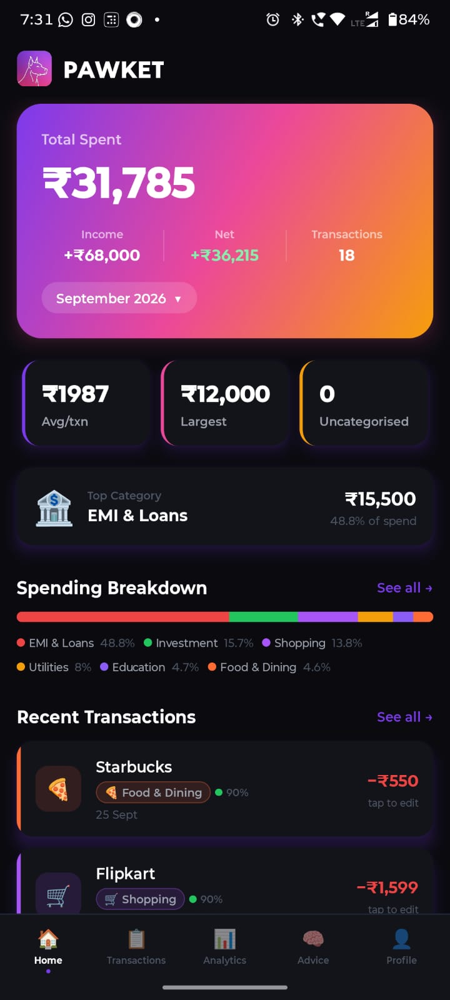
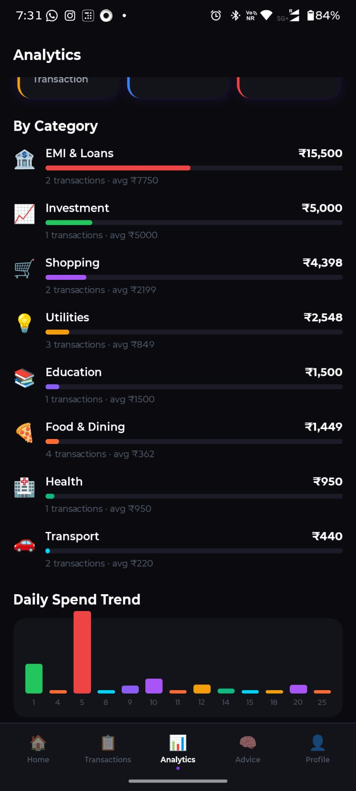
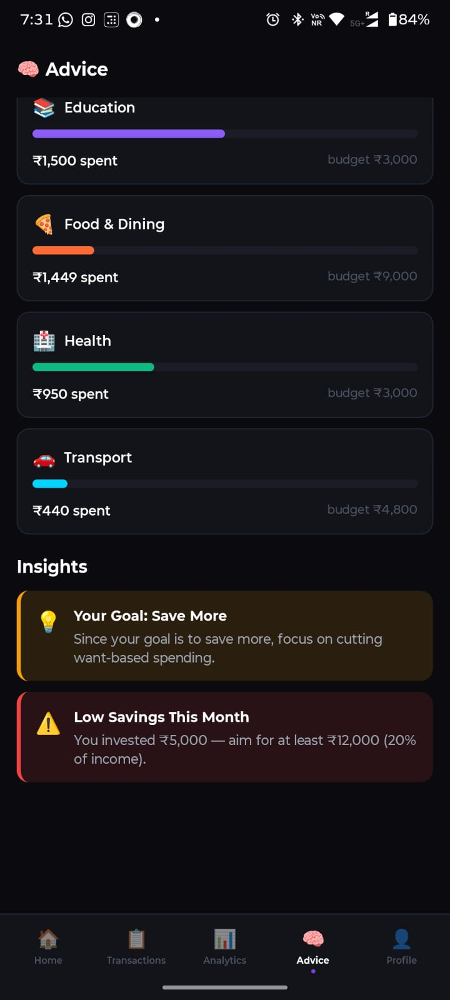
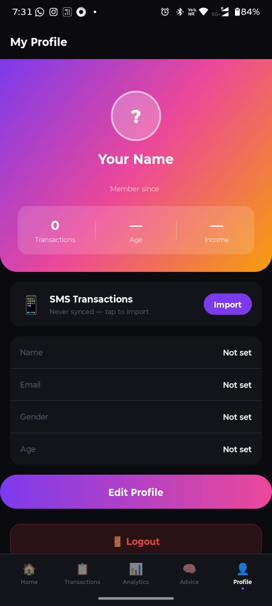

# PAWKET — Your Wise Financial Watchdog

> **v1.1.0** (Android build 3) — An AI-powered personal finance app that automatically reads bank SMS messages, categorises spending into 10 categories using machine learning, detects recurring financial patterns, delivers personalised budgeting advice based on the 50/30/20 rule, and answers money questions through a built-in AI chat assistant — all from your phone.

---

## Screenshots

### Current screens

| Welcome | Login | Dashboard |
|---------|-------|-----------|
|  |  |  |

| Analytics | Transactions | Advice | Profile |
|-----------|-------------|--------|---------|
|  |  |  |  |

### Phone screenshots — new in v1.1.0 (placeholders)

> Drop PNG captures into `docs/screenshots/` using the file names below and they will render automatically.

| Chart Detail (full screen) | AI Chat reply | Chat + keyboard |
|----------------------------|---------------|-----------------|
|  |  |  |

| Dashboard stacked bar (tap) | Daily trend (tap) |
|------------------------------|-------------------|
|  |  |

<!-- SCREENSHOT PLACEHOLDER: add phone captures (1080×2340 recommended) for:
     chart-detail.png, ai-chat.png, chat-keyboard.png,
     stacked-bar.png, daily-trend.png -->

> **Note:** Screenshots may show test/seed data. See [Data Sources](#data-sources--real-exported-data) for how real data flows in.

---

## What's New in v1.1.0

- **Pawket AI Chat** — ask questions like *"Where am I overspending?"* and get answers grounded in your actual monthly analytics (Groq / Llama 3.3 70B with a rule-based fallback so it always replies)
- **Full-screen Chart Explorer** — tap any graph (donut, 3-month trend, daily spend, dashboard bar) to open a dedicated detail screen with an enlarged chart, instant rule-based insights, and an optional *"Explain with AI"* deep-dive
- **Android keyboard fix** — the chat input now rises above the soft keyboard (`softwareKeyboardLayoutMode: resize`), the tab bar hides while typing, and the conversation auto-scrolls to the latest message
- **App stability** — response-shape crash fixed (app no longer closes when the agent replies) and a global `ErrorBoundary` now catches render errors instead of killing the app
- **Smarter multi-turn chat** — conversation history role-mapping fixed so follow-up questions keep their context; chat timeout raised to 20s for slow LLM replies
- **3-Month Category Trend** — compare the last three months of category spending on Analytics

---

## How It Works — End-to-End Flow

PAWKET follows a multi-stage pipeline to transform raw SMS text into actionable financial insights:

```
Android SMS Inbox / Exported SMS batch
       │
       ▼
┌─────────────────┐
│  SMS Reader      │  react-native-get-sms-android (90-day window, APK builds)
│  (Mobile App)    │  or POST /parse/batch for exported SMS text
└────────┬────────┘
         │
         ▼
┌─────────────────┐
│  Filter Model    │  TF-IDF + SGDClassifier (binary)
│  (ML Stage 1)    │  Classifies: bank SMS (1) vs OTP/spam/promo (0)
│  Accuracy: 98%   │  Non-financial messages are discarded here
└────────┬────────┘
         │ financial SMS only
         ▼
┌─────────────────┐
│  Regex Parser    │  Extracts: amount, transaction type, bank, merchant, date, account
│  (Backend)       │  15 Indian bank patterns, 30+ merchant recognitions
└────────┬────────┘
         │
         ▼
┌─────────────────┐
│  Deduplication   │  Detects UPI app + bank duplicate SMS
│  (Backend)       │  Exact text match + amount+time window (5 min, ±₹1)
└────────┬────────┘
         │ unique transactions only
         ▼
┌─────────────────┐
│  Category Model  │  TF-IDF + SGDClassifier (10-class)
│  (ML Stage 2)    │  Confidence > 60% → use ML prediction
│  Accuracy: 98%   │  Confidence < 60% → fallback to pattern engine
└────────┬────────┘
         │
         ▼
┌─────────────────┐
│  User Correction │  Tap any transaction to fix category
│  (Active Learn)  │  User corrections override ML + pattern engine
└────────┬────────┘
         │
         ▼
┌─────────────────┐     ┌──────────────────────┐
│  Analytics       │     │  Pawket AI Chat       │  POST /chat → Groq Llama 3.3 70B
│  + Advice        │────▶│  Chart Explorer       │  analytics context injected per request
│  50/30/20, KPIs, │     │  rule-based + AI      │  rule-based fallback if LLM unavailable
│  insights, trends│     │  explanations         │
└─────────────────┘     └──────────────────────┘
```

---

## Features

### Core Functionality
- **Auto SMS Reading** — reads bank messages on first launch (Android APK builds with `READ_SMS`), no manual entry required
- **Batch Import of Exported SMS** — paste or API-import exported SMS text (`POST /parse/batch`, up to 500 at a time)
- **Two-Stage ML Pipeline** — filter model discards non-financial SMS, category model classifies spending
- **Smart Deduplication** — detects UPI app + bank duplicate SMS automatically using amount+time window matching
- **Confidence Scoring** — colour-coded prediction confidence (green > 80%, yellow 60–80%, red < 60%)
- **User Corrections** — tap any transaction to fix its category (active learning loop)

### AI Assistant (new)
- **Pawket AI Chat** — natural-language questions about your spending, answered with your real monthly analytics injected into the prompt
- **Multi-turn memory** — last 10 messages sent as context; correct `bot`→`assistant` role mapping for the LLM
- **Always available** — rule-based fallback answers (spend totals, savings, top expenses, category questions) even when the LLM is down
- **Quick-action chips** — one-tap starter questions on first use
- **Keyboard-aware composer** — input rises with the keyboard, tab bar hides, conversation auto-scrolls; multiline input up to 500 chars

### Analytics & Insights
- **Monthly KPIs** — total spend, average/median/largest transaction, net income, transaction count
- **Category Breakdown donut** — tap → full-screen explorer with enlarged chart + descriptive insights
- **3-Month Category Trend** — multi-series line chart of the top 6 categories across 3 months; tap → full screen
- **Daily Spend Trend** — last-20-days bars coloured by dominant category; tap → full screen
- **Top Merchants** — ranked list of merchants by total spend
- **Dashboard stacked bar** — top-6 category share bar; tap → full-screen explorer
- **Full-screen Chart Explorer (new)** — every graph opens a detail screen with:
  - enlarged chart
  - instant rule-based description (top category, concentration, month-over-month change, peak days…)
  - *Explain with AI* button that returns a personalised narrative via `/chat`
- **50/30/20 Rule** — needs/wants/savings analysis based on income and spending
- **Budget Limits** — per-category budget recommendations as percentage of income
- **Recurring Detection** — identifies EMIs, subscriptions, rent, and other recurring payments
- **Personalised Insights** — overspending warnings, savings tips, food budget alerts

### Profile & Auth
- **OTP Login** — phone number authentication (currently in dev mode, see [Development Mode](#development-mode))
- **User Profile** — name, email, gender, age, financial goal, monthly income
- **Financial Goals** — goal-specific advice (save more, reduce debt, build emergency fund, invest more)

### UI/UX
- **Animated Welcome** — Doberman logo traces itself on launch
- **Dark Theme** — Cred-inspired design with violet accents
- **5-Tab Navigation** — Home, Transactions, Analytics, Advice, Profile (+ stack-pushed Chart Detail)
- **Filterable Transaction List** — filter by category with paginated results
- **Global Error Boundary** — unexpected render errors show a retry screen instead of crashing the app

---

## Data Sources & Real Exported Data

PAWKET is built to work on **real Indian bank SMS data**, not just demos:

| Source | What it is | Status |
|--------|-----------|--------|
| **Training corpus** | ~100,000 real Indian SMS messages (`ml_pipeline/data/SMS-Data.csv`, ~30MB) used to train both ML models | Real data ✅ |
| **Live phone SMS** | On Android APK builds, the app requests `READ_SMS` and auto-syncs the last 90 days of inbox messages on launch and on app resume | Real data ✅ (requires APK + permission grant) |
| **Exported SMS batch** | Users can export SMS from their default messenger/backup tool and import the text via the app or `POST /parse/batch` (500 messages per call) | Real data ✅ |
| **Seed / demo data** | `backend/test_seed.py` (~70 realistic fake SMS) and `backend/services/auto_seed.py` (50+ transactions on empty DB) for demos and CI | Simulated ⚠️ |

**ML models are always trained on the real corpus** — the pipeline (filter → parser → dedup → categorise) is production-grade regardless of which transaction source the device currently uses.

### Data disclaimer (Play Store distribution)

Reading SMS as a third-party app violates Google Play's SMS/Call Log policy for store distribution. PAWKET is therefore distributed as a **sideloaded APK / internal build**, where the user explicitly grants `READ_SMS`. For Play Store release, switch to an Account Aggregator (RBI-regulated) bank-data API or manual export import only.

---

## ML Models — Technical Details

### Architecture

Both models use **TF-IDF vectorisation** followed by **SGDClassifier** (Stochastic Gradient Descent with logistic loss). This combination was chosen for:

- **Speed**: SGD trains in seconds on 100K samples, suitable for frequent retraining
- **Memory**: TF-IDF sparse matrices + linear classifier = ~4MB total model size
- **Accuracy**: competitive with more complex models on text classification tasks

```
Pipeline: TfidfVectorizer(max_features=50000, ngram_range=(1,2), sublinear_tf=True)
           → SGDClassifier(loss='log_loss', max_iter=1000, random_state=42)
```

### Filter Model (Bank SMS vs Non-Financial)

| Metric | Value |
|--------|-------|
| **Task** | Binary classification — bank transaction SMS vs OTP/spam/promotional |
| **Accuracy** | 98% |
| **Algorithm** | TF-IDF + SGDClassifier |
| **Features** | Up to 50,000 unigram + bigram features |
| **Training Data** | ~100,000 real Indian SMS messages (`SMS-Data.csv`, 30MB) |
| **Model File** | `filter_model.pkl` (1.4 MB) |
| **Label Generation** | Automated keyword rules in `label_rules.py` (not human-annotated) |

**How it works**: The filter model acts as the first gate. Every incoming SMS is classified as either a bank/financial message (class 1) or non-financial (class 0). OTP messages, promotional SMS, spam, and unrelated messages are discarded at this stage, preventing false positives from entering the categorisation pipeline.

### Category Model (10-Class Spending Classifier)

| Metric | Value |
|--------|-------|
| **Task** | Multi-class classification across 10 spending categories |
| **Accuracy** | 98% (weighted average F1) |
| **Algorithm** | TF-IDF + SGDClassifier |
| **Features** | Up to 50,000 unigram + bigram features |
| **Training Data** | Same ~100,000 real SMS dataset |
| **Model File** | `category_model.pkl` (2.9 MB) |

**Categories and per-class performance:**

| Category | F1 Score | Description |
|----------|----------|-------------|
| `education` | 1.00 | Udemy, Coursera, tuition, school fees |
| `utilities` | 0.98 | Airtel, Jio, Netflix, Spotify, electricity |
| `investment` | 0.98 | Zerodha, Groww, mutual funds, SIP |
| `emi` | 0.97 | Loan EMIs, credit card payments |
| `food` | 0.96 | Swiggy, Zomato, Starbucks, restaurants |
| `shopping` | 0.96 | Amazon, Flipkart, Myntra |
| `transfer` | 0.95 | UPI transfers, bank-to-bank |
| `others` | 0.93 | Uncategorized financial transactions |
| `health` | 0.88 | Apollo, PharmEasy, medical expenses |
| `transport` | 0.84 | Uber, Ola, petrol, parking |

**Two-stage categorisation logic:**

1. **Stage 1 — ML Prediction**: TF-IDF + SGDClassifier predicts category with confidence score
2. **Stage 2 — Pattern Fallback**: If ML confidence < 60% or prediction is "others", the pattern engine kicks in using merchant name matching and amount+time-of-day rules
3. **Priority**: User correction > pattern engine > ML prediction

### Training Pipeline

```bash
# Train both models
cd ml_pipeline
py train_filter.py --data data/SMS-Data.csv
py train_category.py --data data/SMS-Data.csv

# Evaluate with confusion matrices + classification reports
py evaluate.py --data data/SMS-Data.csv

# Copy trained models to backend
xcopy models ..\backend\ml\models /E /I
```

Output includes:

- `filter_model.pkl` — binary filter model
- `category_model.pkl` — 10-class category model
- `filter_confusion_matrix.png` — confusion matrix for filter
- `category_confusion_matrix.png` — confusion matrix for category
- `category_report.txt` — precision/recall/F1 per category

### Pattern Engine Fallback

When the ML model is uncertain, the pattern engine uses rule-based logic:

1. **Merchant Matching**: 30+ known merchants mapped to categories (Swiggy→food, Uber→transport, etc.)
2. **Amount + Time-of-Day Rules**: Large evening transactions → food, small late-night → transport
3. **Bank-Specific Patterns**: HDFC loan debits → emi, Zerodha credits → investment
4. **Keyword Fallback**: "subscription" → utilities, "tuition" → education

---

## API Endpoints

| Method | Endpoint | Description |
|--------|----------|-------------|
| `GET` | `/` | Health check with ML model status |
| `GET` | `/health` | Full health check (DB + ML models) |
| `POST` | `/auth/request-otp` | Request OTP for phone login |
| `POST` | `/auth/verify-otp` | Verify OTP, create session |
| `GET` | `/auth/me` | Get current user profile |
| `DELETE` | `/auth/logout` | Invalidate session |
| `POST` | `/parse` | Parse single SMS text |
| `POST` | `/parse/batch` | Parse up to 500 exported SMS in batch |
| `GET` | `/analytics` | Monthly KPIs, category breakdown, daily trend |
| `GET` | `/analytics/months` | List available months |
| `GET` | `/analytics/transactions` | Paginated transaction list |
| `GET` | `/analytics/compare?months=a,b,c` | Multi-month category comparison (3-month trend) |
| `PATCH` | `/correct` | User corrects a transaction category |
| `GET` | `/advice` | 50/30/20 analysis, budgets, insights, recurring |
| `POST` | `/chat` | AI assistant — `{message, month, history}` → `{reply}` (Groq Llama 3.3, rule-based fallback) |

Full interactive API docs available at `/docs` (Swagger UI) when the backend is running.

---

## Development Mode

### OTP Authentication

In development, the OTP system operates in **dev mode**:

- When a user requests an OTP, it is **printed to the backend console** instead of being sent via SMS
- The OTP is valid for 5 minutes and works identically to a production OTP flow
- This eliminates the need for an SMS gateway integration during development

```
[DEV MODE] OTP for +919876543210: 482916
```

### AI Chat

- Requires `GROQ_API_KEY` in `backend/.env` for LLM answers
- Without the key (or on LLM failure) the rule-based engine still answers common questions — the chat never dies

### SMS Import

- **Auto-read**: APK builds read real inbox SMS (90-day window) after the user grants `READ_SMS`
- **Manual paste / export import**: paste raw exported SMS text into the app or call `POST /parse/batch`
- **Test seed data**: pre-loaded realistic transactions for demo purposes

---

## Architecture

```
PAWKET/
├── ml_pipeline/              Python — ML training pipeline
│   ├── data/
│   │   └── SMS-Data.csv      ~30MB dataset (~100K real Indian SMS)
│   ├── models/
│   │   ├── filter_model.pkl        Bank vs spam classifier (1.4MB)
│   │   └── category_model.pkl      10-category classifier (2.9MB)
│   ├── label_rules.py        Keyword rules for auto-labelling training data
│   ├── train_filter.py       Trains binary filter model
│   ├── train_category.py     Trains 10-class category model
│   └── evaluate.py           Confusion matrices + classification reports
│
├── backend/                  Python FastAPI — REST API server
│   ├── main.py               App entrypoint, lifespan, CORS, router registration
│   ├── routers/              REST endpoint handlers
│   │   ├── auth.py           OTP login, session tokens, /me, logout
│   │   ├── parse.py          POST /parse and /parse/batch — core SMS processing
│   │   ├── analytics.py      GET /analytics, /transactions, /months, /compare
│   │   ├── correct.py        PATCH /correct — user category corrections
│   │   ├── advice.py         GET /advice — 50/30/20, insights, recurring
│   │   ├── chat.py           POST /chat — AI assistant (Groq + fallback)
│   │   └── profile.py        GET/PATCH /profile — user profile management
│   ├── services/             Business logic layer
│   │   ├── parser.py         Regex-based SMS field extraction
│   │   ├── categorizer.py    Two-stage: ML model + pattern engine fallback
│   │   ├── analytics.py      Monthly KPIs, category breakdown, daily trend
│   │   ├── finance_rules.py  50/30/20 rule, budgets, recurring detection
│   │   ├── chat_engine.py    Groq Llama 3.3 client + rule-based reply fallback
│   │   ├── deduplication.py  UPI + bank duplicate SMS detection
│   │   └── auto_seed.py      Auto-seeds test data on empty DB
│   ├── ml/
│   │   └── ml_loader.py      Loads .pkl models at startup, prediction interface
│   ├── database/
│   │   └── database.py       SQLAlchemy models (User, OTP, Session, Transaction, etc.)
│   └── models/
│       └── schemas.py        Pydantic request/response schemas
│
├── docs/screenshots/         Phone screenshots for this README
│
└── mobile/                   React Native (Expo) — Android app
    ├── App.js                Root: Welcome → Login → Onboarding → ErrorBoundary → Navigator
    ├── app.json              Expo config (v1.1.0, READ_SMS, keyboard resize mode)
    ├── eas.json              EAS build profiles (preview = APK)
    ├── sms-plugin.js         Expo config plugin for SMS permissions
    └── src/
        ├── screens/          Welcome, Login, Onboarding, Dashboard, Transactions,
        │                     Analytics, Advice, Profile, ChartDetail, AddSMS
        ├── components/       TransactionCard, KPICard, PieChart, MultiLineChart,
        │                     ErrorBoundary, CategoryPicker, etc.
        ├── services/         api.js (REST client), auth, config, smsReader,
        │                     chartInsights (rule-based chart descriptions)
        ├── store/            Zustand global state (analytics, transactions, chat)
        ├── navigation/       Stack (Main, ChartDetail) + bottom tabs (5 tabs),
        │                     keyboard-aware custom tab bar
        └── constants/        Theme, colours, category metadata
```

---

## Tech Stack

| Layer | Technology | Purpose |
|-------|-----------|---------|
| **ML Pipeline** | Python 3.12+, scikit-learn | TF-IDF + SGDClassifier for SMS classification |
| **Backend** | Python 3.11+, FastAPI, SQLAlchemy 2.0 | REST API server with async support |
| **Database** | SQLite (SQLAlchemy ORM) | Transaction storage, user data, sessions |
| **Validation** | Pydantic 2.0 | Request/response schema validation |
| **AI Chat** | Groq API, Llama 3.3 70B | Grounded financial Q&A with rule-based fallback |
| **Mobile** | React Native 0.81, Expo SDK 54 | Cross-platform mobile app |
| **Charts** | react-native-svg (hand-rolled) | Donut, multi-line, bar charts |
| **State** | Zustand 4.5 | Lightweight global state management |
| **Navigation** | React Navigation 6 | Stack + bottom tab navigator |
| **Auth** | Phone OTP, session tokens | `secrets.token_urlsafe` for token generation |
| **SMS Reader** | react-native-get-sms-android | Android native SMS access (90-day window) |
| **Deployment** | Cloud backend (see `mobile/src/services/config.js`), EAS Build (mobile) | Hosting + native APK builds |

---

## Getting Started

### Prerequisites

- Python 3.11+
- Node.js 18+
- Expo CLI (`npm install -g eas-cli` for builds)
- Android device or emulator (for SMS reading feature)

### 1. Train the ML Models

```bash
cd ml_pipeline
pip install -r requirements.txt

# Place your SMS dataset in ml_pipeline/data/SMS-Data.csv
py train_filter.py --data data/SMS-Data.csv
py train_category.py --data data/SMS-Data.csv
py evaluate.py --data data/SMS-Data.csv

# Copy trained models to backend
xcopy models ..\backend\ml\models /E /I
```

### 2. Run the Backend

```bash
cd backend
py -m uvicorn main:app --reload --host 0.0.0.0 --port 8000

# API docs: http://localhost:8000/docs
```

Create `backend/.env`:

```
ML_MODELS_DIR=ml/models
DATABASE_URL=sqlite:///./finance.db
CORS_ORIGINS=*
GROQ_API_KEY=your_groq_key        # optional — enables AI chat answers
```

### 3. Run the Mobile App

```bash
cd mobile
npm install
npx expo start -c
```

Scan the QR code with **Expo Go** on your Android phone (use `-c` after config changes).

### 4. Build the Android APK

```bash
cd mobile
npx eas-cli build --platform android --profile preview   # cloud APK via EAS
```

Install the produced APK to get auto SMS reading (Expo Go cannot read SMS).

### 5. Seed Test Data

The backend auto-seeds 50+ test transactions on startup when the database is empty. To manually seed:

```bash
cd backend
py test_seed.py
```

This authenticates via OTP (dev mode), then sends ~70 realistic fake SMS to the parse endpoint.

---

## Deployment

- **Backend**: cloud-hosted FastAPI (current base URL lives in `mobile/src/services/config.js`)
- **Mobile**: EAS Build — `preview` profile produces a signed **APK**, `production` produces an AAB

### Releases

| Version | Build | APK |
|---------|-------|-----|
| **v1.1.0** | [EAS build `e064ca8d`](https://expo.dev/accounts/satyam_pani/projects/pawket/builds/e064ca8d-448b-4dbc-bae3-f8d86e9587b3) | [Download APK](https://expo.dev/artifacts/eas/slIqaX-qPyBQvX2spRwFSYh_eKV-XiFH8sAxP57Xlxc.apk) (also built locally as `PAWKET-v1.1.0.apk`) |

### Deploy Your Own

1. Push this repo to GitHub
2. Deploy `backend/` to your platform of choice (Render, Fly.io, Northflank, or local network)
3. Update `API_BASE` in `mobile/src/services/config.js`
4. Set `GROQ_API_KEY` for AI chat, then rebuild the APK if config changed

---

## Database Schema

Six tables via SQLAlchemy ORM:

| Table | Purpose |
|-------|---------|
| `users` | Phone, name, email, gender, age, financial_goal, monthly_income |
| `otp_records` | OTP storage with expiry and usage tracking |
| `sessions` | Session tokens with user_id, expiry, active flag |
| `transactions` | Full transaction record: raw SMS, parsed fields, ML prediction, user correction |
| `recurring_patterns` | Detected recurring payments: label, merchant, amount, frequency |
| `monthly_summaries` | Pre-computed monthly aggregates for fast dashboard loading |

---

## Known Limitations

1. **Play Store SMS policy** — `READ_SMS` apps are rejected by Google Play; current distribution is sideloaded APK / internal builds only (see [Data Sources](#data-sources--real-exported-data))
2. **Android only for auto-import** — SMS reading uses Android-specific APIs; iOS has no auto-import (app UI runs, manual import only)
3. **Dev OTP only** — OTP is printed to the backend console, not sent via SMS (no SMS gateway yet)
4. **Seed data on fresh installs** — a brand-new account with no granted SMS permission and no import starts empty until SMS is read/imported or seed data is used
5. **Single bank account view** — no multi-account or multi-wallet separation yet
6. **LLM dependency for open-ended chat** — free-form questions need `GROQ_API_KEY` + network; otherwise only rule-based answers (spend, savings, top merchants, categories) are available
7. **Chat/backed latency** — LLM replies can take up to ~15s; the client aborts after 20s and shows an error bubble (never crashes — ErrorBoundary is the last line of defence)
8. **No push notifications** — budget or large-transaction alerts are not implemented
9. **Charts are 20-day / 3-month windows** — daily trend shows the last 20 days; category compare uses the last 3 months
10. **No offline analytics** — the app needs a reachable backend for fresh analytics and AI features

---

## Roadmap

- [x] AI chat assistant grounded in real analytics
- [x] Full-screen chart exploration with AI explanations
- [x] Month vs previous month compare (3-month trend)
- [x] Keyboard-aware chat composer on Android
- [ ] Push notifications for large transactions
- [ ] Budget alerts when category limit exceeded
- [ ] Export to PDF / CSV
- [ ] Multi-bank account support
- [ ] Account Aggregator API integration (bypass Google SMS restrictions for Play Store)
- [ ] Web dashboard
- [ ] iOS App Store release
- [ ] SMS gateway integration for OTP delivery

---

## License

MIT License — free to use, modify, and distribute.
