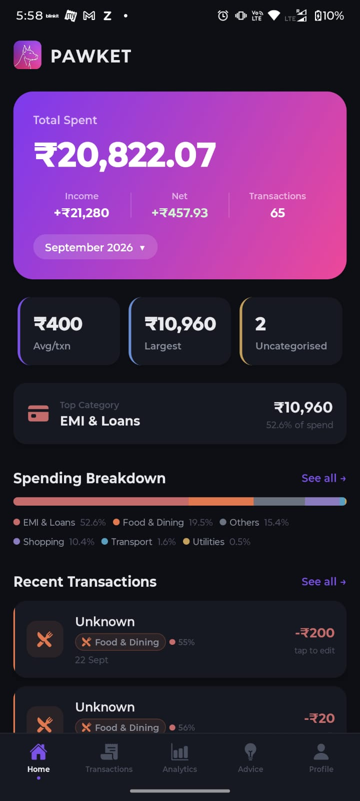
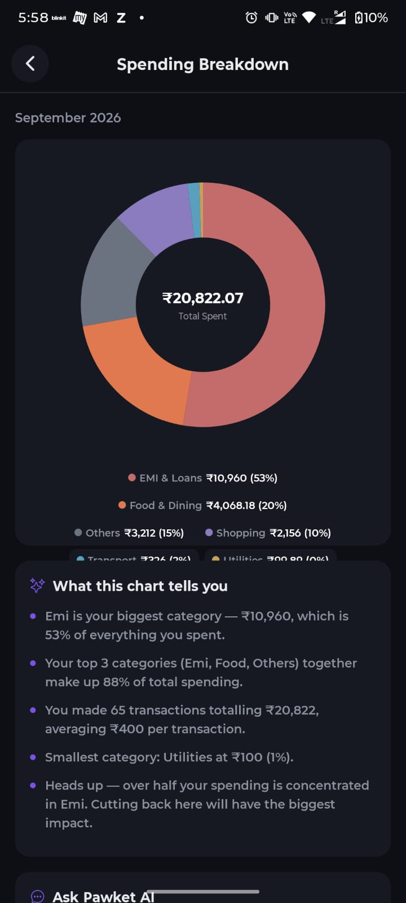
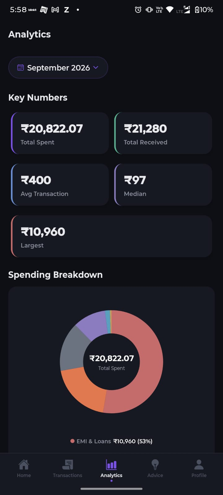
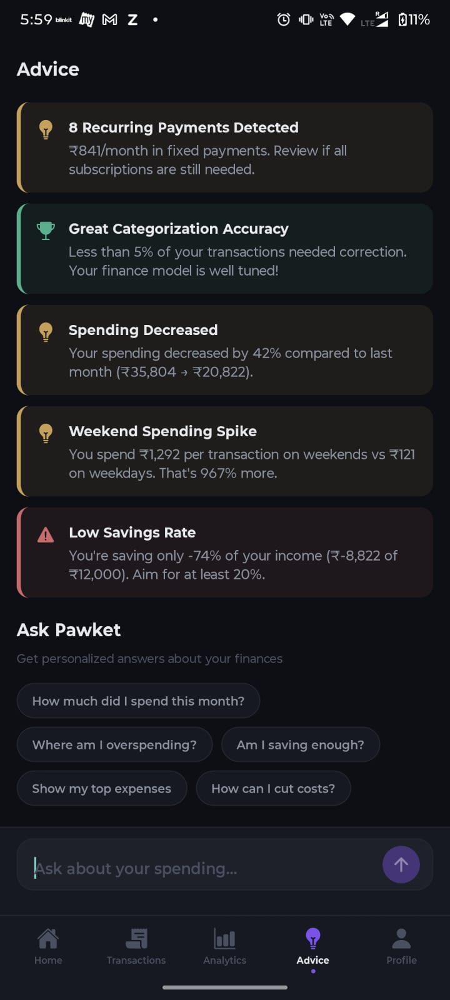
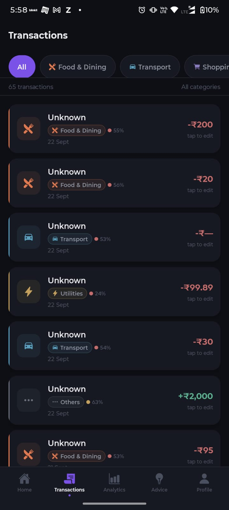
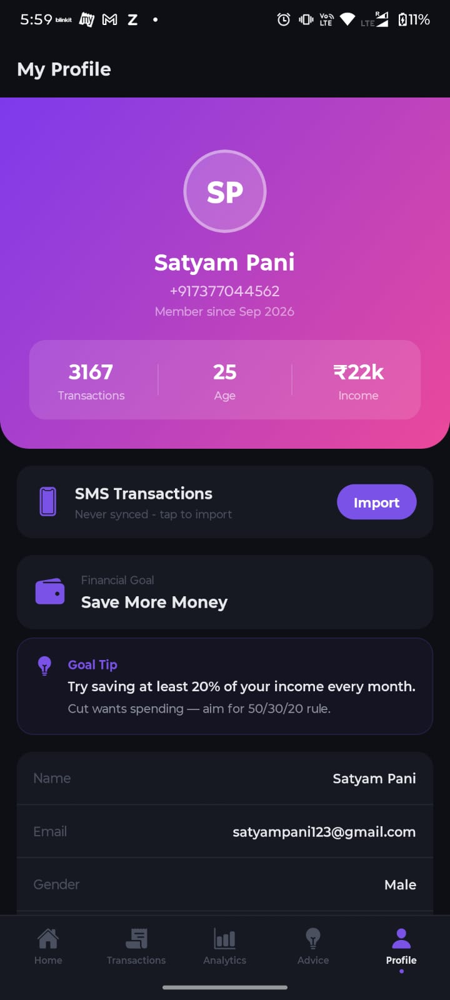
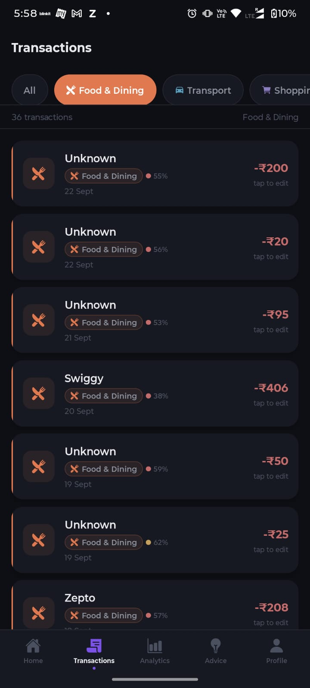
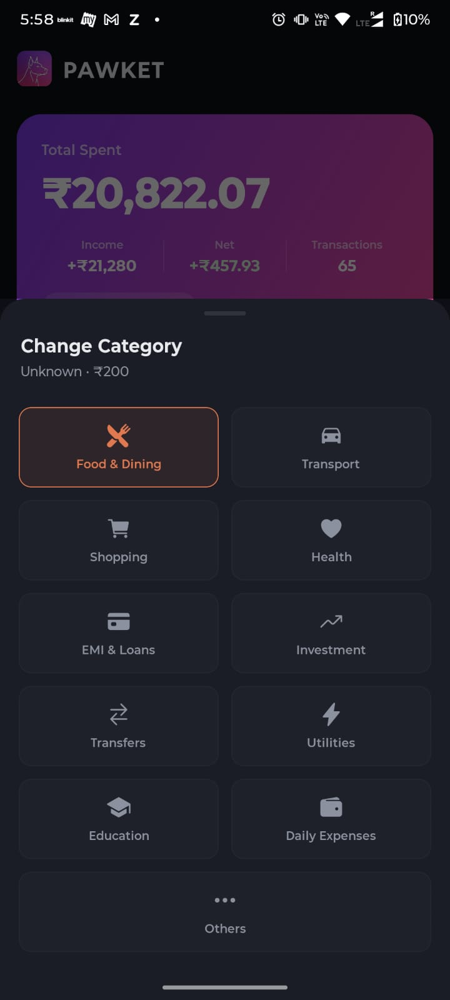
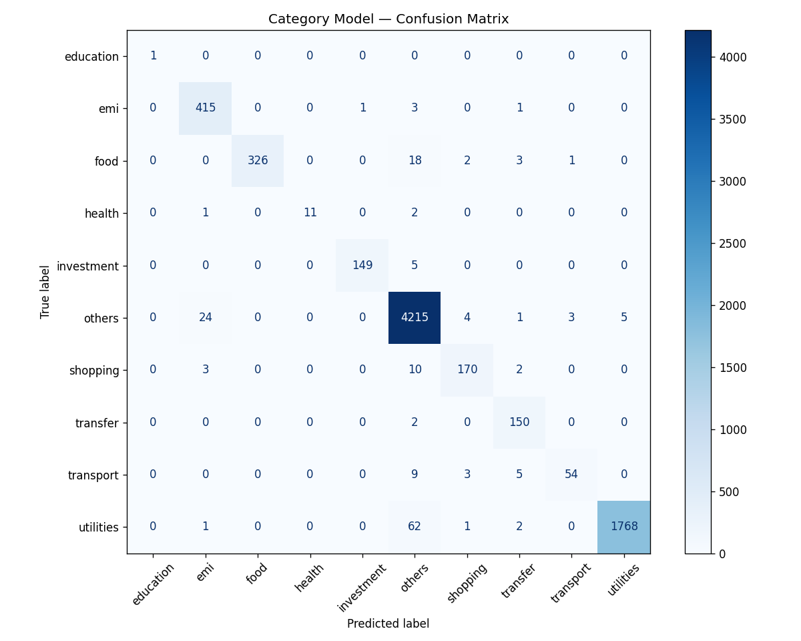
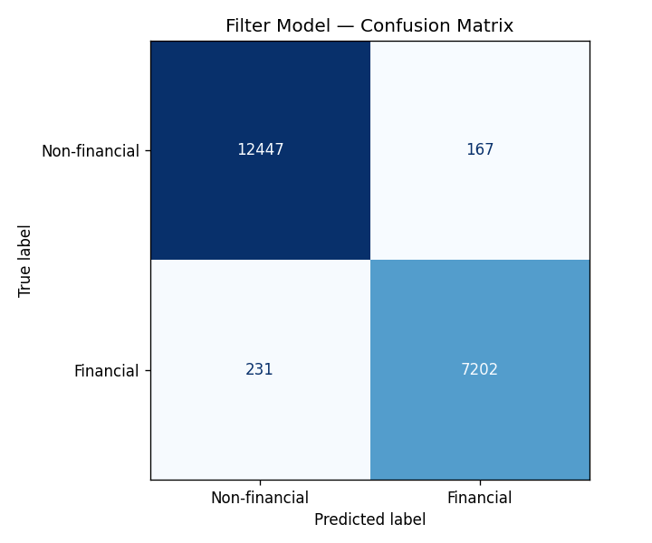

# PAWKET — Your Wise Financial Watchdog

> **v1.1.1** (Android build 4, versionCode 4) — An AI-powered personal finance app for India that automatically reads bank SMS, categorises every transaction with a two-stage machine-learning pipeline, detects recurring payments, grades your spending against the 50/30/20 rule, and answers money questions in plain English through an AI chat advisor grounded in your real numbers.

[](mobile/)
[](backend/)
[](ml_pipeline/)
[](#license)

---

## Contents

- [Overview](#overview)
- [Screenshots](#screenshots)
- [Download](#download)
- [Features](#features)
- [How It Works](#how-it-works)
- [Technical Deep Dive](#technical-deep-dive)
  - [ML Model Architecture](#ml-model-architecture)
  - [Model Accuracy](#model-accuracy)
  - [AI Chat Advisor](#ai-chat-advisor)
  - [SMS Parsing and Deduplication](#sms-parsing-and-deduplication)
- [API Endpoints](#api-endpoints)
- [Project Structure](#project-structure)
- [Tech Stack](#tech-stack)
- [Getting Started](#getting-started)
- [Data Sources](#data-sources)
- [Development Mode](#development-mode)
- [Deployment](#deployment)
- [Database Schema](#database-schema)
- [Known Limitations](#known-limitations)
- [Roadmap](#roadmap)
- [License](#license)

---

## Overview

PAWKET turns the bank SMS sitting in your inbox into a complete personal-finance picture. You install the APK, grant SMS access once, and the app:

1. **Ingests** the last 90 days of messages (or any exported SMS batch),
2. **Filters** out OTPs, spam and promos with a 98%-accurate ML classifier,
3. **Parses** amount, bank, merchant, date and direction from raw SMS text,
4. **Deduplicates** the double SMS you get from every UPI payment (app + bank),
5. **Categorises** the transaction into 10 spending categories (ML with rule-based fallback),
6. **Analyses** your month — KPIs, donut breakdown, daily trends, top merchants, 50/30/20,
7. **Advises** — recurring payments, budget limits, overspending warnings, savings tips, and
8. **Answers questions** about your money through a built-in AI chat advisor.

No spreadsheets, no manual entry, no linking bank credentials — just SMS you already receive.

---

## Screenshots

Real device captures (Android, September 2026 data). Screenshots may show test/seed data — see [Data Sources](#data-sources).

| Dashboard (Home) | Analytics | Analytics Clicked |
|---------|-------|-----------|
|  |  |  |

**Home** shows the month's total spend, income, net and transaction count, quick KPI cards (avg txn, largest, uncategorised), top category, the stacked spending-breakdown bar, and recent transactions. **Analytics** gives key numbers, the category donut, 3-month trends and daily spend charts (tap any chart for the full-screen explorer). **Transactions** is the filterable list — every row shows the category chip, ML confidence colour, and *tap to edit*.

| Chart Explorer (Advice + Ask Pawket) | Transaction | Profile |
|----------------------------|---------------|---------|
|  |  |  |

**Chart Explorer** is the full-screen detail view: enlarged donut, instant rule-based insights ("What this chart tells you"), and an *Ask Pawket AI* button for a personalised narrative. **Advice** surfaces personalised insights (recurring payments, categorisation accuracy, spending changes, weekend spikes, savings-rate warnings) plus the AI chat with one-tap starter questions. **Profile** holds your identity, financial goal, income, SMS import control and goal tips.

| Filter by category | Correct a prediction (active learning) |
|-------------------|----------------------------------------|
|  |  |

**Filter chips** slice the list by category (e.g. 36 Food & Dining transactions of 65). **Change Category** is the correction sheet — tap any transaction, pick the right category, and your correction permanently overrides the ML model for that transaction (and is counted toward the app's accuracy insight).

---

## Download

### Latest release — v1.1.1 (build 4) · APK ~72 MB

| Source | Link |
|--------|------|
| **GitHub (this repo)** | [PAWKET-v1.1.1.apk](https://github.com/satyampani159/PAWKET/raw/main/PAWKET-v1.1.1.apk) |
| **Google Drive (mirror)** | [PAWKET APK on Google Drive](https://drive.google.com/file/d/1IaEWwYh-cZeufSEsBZQKHqapfWvQ9LFd/view?usp=drivesdk) · [direct download](https://drive.google.com/uc?export=download&id=1IaEWwYh-cZeufSEsBZQKHqapfWvQ9LFd) |
| EAS cloud build | [v1.1.0 build `e064ca8d`](https://expo.dev/accounts/satyampani159/projects/pawket/builds/e064ca8d-448b-4dbc-bae3-f8d86e9587b3) ([old APK artifact](https://expo.dev/artifacts/eas/slIqaX-qPyBQvX2spRwFSYh_eKV-XiFH8sAxP57Xlxc.apk)) |

### Install

1. Download the APK from **GitHub** or **Google Drive** (either works).
2. On your Android phone, allow your browser/file manager to **install unknown apps** when prompted.
3. Install and open PAWKET — grant the **SMS permission** when asked (needed for auto-import; skip it if you plan to paste exported SMS instead).
4. Log in with your phone number. OTP is in [dev mode](#development-mode): it is returned in the app/backend console, so during demos it is entered manually.
5. Go to **Profile → SMS Transactions → Import** (or wait for the auto-sync of the last 90 days on first launch).

> Sideloaded APK only — PAWKET is not on Google Play because of the Play SMS/Call Log policy (see [Known Limitations](#known-limitations)).

---

## Features

### SMS Ingestion & Processing
- **Auto SMS reading** — on Android APK builds the app requests `READ_SMS` and auto-syncs the last **90 days** of inbox on launch and on resume. No manual entry.
- **Batch import** — paste exported SMS text or `POST /parse/batch` (up to 500 messages per call) for non-Android/manual workflows.
- **Two-stage ML pipeline** — filter model discards non-financial SMS, category model classifies spending into 10 categories.
- **Smart deduplication** — UPI-app + bank duplicate SMS are collapsed automatically (exact text match, or same amount within a 5-minute / ±₹1 window).
- **Confidence scoring** — colour-coded per transaction: green > 80%, yellow 60–80%, red < 60%.
- **Pattern-engine fallback** — when ML confidence < 60% (or predicts "others"), a merchant/keyword/amount-time rule engine decides instead.
- **Active learning** — tap any transaction to correct its category; user corrections beat both the pattern engine and the ML model.

### AI Assistant
- **Pawket AI Chat** (Advice tab) — natural-language questions about your spending, answered using your **real monthly analytics injected into the prompt** (Groq LLM).
- **Specific-first rule engine** — common questions (*"How much did I spend?"*, *"Where am I overspending?"*, *"Am I saving enough?"*) are answered instantly and deterministically before any LLM call.
- **Multi-turn memory** — the client sends the last 10 messages, the server feeds the last 8 to the LLM with correct `bot` → `assistant` role mapping, so follow-ups keep context.
- **Never dead-ends** — if the LLM is slow, down, or has no API key, a rule-based reply or an offline data summary is returned instead of an error.
- **Quick-action chips** — one-tap starter questions on first use; multiline input up to 500 chars.
- **Keyboard-aware composer** — input rises with the soft keyboard (`softwareKeyboardLayoutMode: resize`), the tab bar hides while typing, conversation auto-scrolls.
- **Explain with AI on charts** — the full-screen Chart Explorer can generate a personalised narrative for any graph via the same `/chat` endpoint.

### Analytics & Insights
- **Monthly KPIs** — total spend, total received, net, average/median/largest transaction, transaction count, uncategorised count.
- **Category donut** — tap → full-screen explorer with enlarged chart + rule-based insights + AI explanation.
- **3-Month Category Trend** — multi-series line chart of the top 6 categories across 3 months.
- **Daily Spend Trend** — last 20 days of bars coloured by dominant category.
- **Dashboard stacked bar** — top-category share bar; tap → full-screen explorer.
- **Top Merchants** — ranked list of merchants by total spend.
- **50/30/20 Rule** — needs / wants / savings analysis based on income and spending.
- **Budget Limits** — per-category budget recommendations as a percentage of income.
- **Recurring Detection** — identifies EMIs, subscriptions, rent and other repeating payments.
- **Personalised Insights** — overspending warnings, weekend-spike detection, savings tips, food-budget alerts, model-accuracy achievement ("less than 5% of your transactions needed correction").

### Profile & Auth
- **OTP login** — phone-number authentication with session tokens (dev mode, see below).
- **Profile** — name, email, gender, age, financial goal, monthly income.
- **Financial goals** — goal-specific advice (save more, reduce debt, build emergency fund, invest more) with a goal tip card.

### UI/UX
- **Animated welcome** — Doberman logo traces itself on launch.
- **Dark theme** — Cred-inspired design with violet/pink gradient accents.
- **5-tab navigation** — Home, Transactions, Analytics, Advice, Profile (+ stack-pushed Chart Detail).
- **Global error boundary** — unexpected render errors show a retry screen instead of crashing.

---

## How It Works

```
Android SMS Inbox / Exported SMS batch
       │
       ▼
┌──────────────────┐
│  SMS Reader       │  react-native-get-sms-android (90-day window, APK builds)
│  (Mobile App)     │  or POST /parse/batch for exported SMS text
└────────┬─────────┘
         │
         ▼
┌──────────────────┐
│  Filter Model     │  TF-IDF + SGDClassifier (binary)
│  (ML Stage 1)     │  bank SMS (1) vs OTP/spam/promo (0)
│  Accuracy: 98.2%  │  non-financial messages are discarded here
└────────┬─────────┘
         │ financial SMS only
         ▼
┌──────────────────┐
│  Regex Parser     │  extracts amount, type, bank, merchant, date, account
│  (Backend)        │  15 Indian bank formats, 30+ merchant recognitions
└────────┬─────────┘
         │
         ▼
┌──────────────────┐
│  Deduplication    │  UPI app + bank duplicate SMS collapsed
│  (Backend)        │  exact text match, or amount within 5 min / ±₹1
└────────┬─────────┘
         │ unique transactions only
         ▼
┌──────────────────┐
│  Category Model   │  TF-IDF + SGDClassifier (10-class)
│  (ML Stage 2)     │  confidence ≥ 60% → ML prediction
│  Accuracy: 94–98% │  confidence < 60% or "others" → pattern engine
└────────┬─────────┘
         │
         ▼
┌──────────────────┐
│  User Correction  │  tap any transaction to fix its category
│  (Active Learn)   │  user correction > pattern engine > ML prediction
└────────┬─────────┘
         │
         ▼
┌──────────────────┐     ┌───────────────────────────────────────────┐
│  Analytics        │     │  Pawket AI Chat / Chart Explorer          │
│  + Advice         │────▶│  1) specific-first rule engine            │
│  50/30/20, KPIs,  │     │  2) Groq LLM (gpt-oss-120b) with your     │
│  insights, trends │     │     monthly analytics injected as context  │
│                   │     │  3) offline data summary fallback         │
└──────────────────┘     └───────────────────────────────────────────┘
```

---

## Technical Deep Dive

### System Architecture

```
┌─────────────────────────┐        HTTPS/JSON         ┌──────────────────────────┐
│  React Native (Expo)    │ ────────────────────────▶ │  FastAPI backend         │
│  • screens / charts     │   session token auth      │  • routers (REST)        │
│  • Zustand store        │ ◀──────────────────────── │  • services (business)   │
│  • smsReader (Android)  │                           │  • SQLAlchemy + SQLite   │
└─────────────────────────┘                           │  • ML .pkl models (RAM)  │
                                                      └───────┬──────────┬──────┘
                                                              │          │
                                            on-device SMS     │          │ HTTPS
                                            (90-day window)   │          ▼
                                                      ┌───────┴───┐  ┌──────────┐
                                                      │  .pkl     │  │  Groq    │
                                                      │  models   │  │  LLM API │
                                                      └───────────┘  └──────────┘
```

- The **mobile app** is a thin client: UI, charts (hand-rolled `react-native-svg`), SMS reading, and state (Zustand). All parsing/ML/analytics happen on the backend.
- The **backend** loads both `.pkl` pipelines into memory at startup (`ml_loader.py`) and serves predictions synchronously inside the request — no separate inference service.
- The **LLM** is only called for open-ended chat questions; everything else is computed locally in Python.

### ML Model Architecture

Both models are **scikit-learn pipelines**: `TfidfVectorizer` → `SGDClassifier` (logistic loss). This was chosen over deep learning deliberately:

| Reason | Detail |
|--------|--------|
| **Speed** | Trains on ~100K SMS in seconds — enables frequent retraining as banks change SMS formats |
| **Memory** | Sparse TF-IDF + linear model = ~4.3 MB total, loaded once at backend startup |
| **Interpretability** | Feature weights are inspectable; wrong predictions are debuggable |
| **Accuracy** | Linear models on TF-IDF are state-of-the-art for short-text classification tasks of this size |
| **No GPU** | Runs on any cheap CPU host — no inference infrastructure |

```python
# Filter model (train_filter.py)
TfidfVectorizer(ngram_range=(1, 2), max_features=30_000, sublinear_tf=True,
                strip_accents="unicode", min_df=2)
→ SGDClassifier(loss="log_loss", alpha=1e-4, max_iter=100, class_weight="balanced")

# Category model (train_category.py)
TfidfVectorizer(ngram_range=(1, 2), max_features=40_000, sublinear_tf=True,
                strip_accents="unicode", min_df=2)
→ SGDClassifier(loss="log_loss", alpha=5e-5, max_iter=200, class_weight="balanced")
```

`class_weight="balanced"` compensates for the heavily skewed class distribution (`others` alone is ~57% of financial messages). The category trainer also runs 5-fold stratified cross-validation during training.

#### Stage 1 — Filter Model (bank SMS vs everything else)

| Metric | Value |
|--------|-------|
| **Task** | Binary classification — bank transaction SMS vs OTP/spam/promo |
| **Algorithm** | TF-IDF (30K features) + SGDClassifier (logistic) |
| **Training data** | ~100,000 real Indian SMS (`SMS-Data.csv`, ~30 MB — not in git, see [Data Sources](#data-sources)) |
| **Model file** | `filter_model.pkl` (1.4 MB) |
| **Labels** | Generated by keyword rules in `label_rules.py` (not human-annotated) |

Every incoming SMS hits this gate first; OTPs, promotional and spam messages never reach the parser or database.

#### Stage 2 — Category Model (10-class spending classifier)

| Metric | Value |
|--------|-------|
| **Task** | Multi-class classification across 10 spending categories |
| **Algorithm** | TF-IDF (40K features) + SGDClassifier (logistic) |
| **Split** | Stratified 80/20 train/test |
| **Model file** | `category_model.pkl` (2.9 MB) |

**Categories with per-class performance** (held-out test set, `ml_pipeline/models/category_report.txt`):

| Category | Precision | Recall | F1 | Typical merchants |
|----------|-----------|--------|----|-------------------|
| `education` | 1.00 | 1.00 | **1.00** | Udemy, Coursera, tuition |
| `utilities` | 1.00 | 0.96 | **0.98** | Airtel, Jio, Netflix, Spotify, electricity |
| `investment` | 0.99 | 0.97 | **0.98** | Zerodha, Groww, mutual funds, SIP |
| `others` | 0.97 | 0.99 | **0.98** | uncategorised financial transactions |
| `emi` | 0.93 | 0.99 | **0.96** | loan EMIs, credit-card payments |
| `food` | 1.00 | 0.93 | **0.96** | Swiggy, Zomato, Starbucks, restaurants |
| `transfer` | 0.91 | 0.99 | **0.95** | UPI transfers, bank-to-bank |
| `shopping` | 0.94 | 0.92 | **0.93** | Amazon, Flipkart, Myntra |
| `health` | 1.00 | 0.79 | **0.88** | Apollo, PharmEasy, medical |
| `transport` | 0.93 | 0.76 | **0.84** | Uber, Ola, petrol, parking |

**Two-stage categorisation at inference time:**

1. **Stage 1 — ML prediction**: the classifier returns a category + per-class probability; confidence = max probability.
2. **Stage 2 — Pattern fallback**: if confidence < 60% *or* the prediction is `others`, a rule engine takes over: 30+ known merchant names → category, then amount + time-of-day heuristics (large evening → food, small late-night → transport), bank-specific rules (HDFC loan debit → emi, Zerodha credit → investment), then keyword fallbacks ("subscription" → utilities, "tuition" → education).
3. **Priority**: **user correction > pattern engine > ML prediction** — a tapped correction is stored on the transaction and wins forever after.

#### Confidence tiers (shown colour-coded in the app)

| Confidence | Colour | Meaning |
|------------|--------|---------|
| ≥ 80% | 🟢 green | ML is certain — prediction used as-is |
| 60–80% | 🟡 yellow | Moderate — ML used, worth a glance |
| < 60% | 🔴 red | Pattern engine decides instead |

Across the full corpus the category model's average confidence is **0.79**, and **86%** of predictions clear the 60% threshold (i.e. roughly 1 in 7 transactions is routed through the pattern engine or flagged red for review).

#### Active learning loop

Corrections are not just data fixes — they feed the app's self-assessment: the Advice tab computes your correction rate and celebrates it ("Less than 5% of your transactions needed correction — your finance model is well tuned!"). The corrected label is persisted per transaction, so the same SMS never needs fixing twice.

### Model Accuracy

**How accuracy is measured.** Training labels are produced automatically by the keyword/regex rules in `ml_pipeline/label_rules.py` (the dataset has no human annotations), so all metrics below measure *agreement with those rules on text the model hasn't memorised*. Retraining + evaluation takes ~30 seconds; `evaluate.py` regenerates the reports any time.

**Verified evaluation results** (re-run against the full 100,233-message corpus with the current shipped models):

| Model | Evaluation | Accuracy | F1 (weighted / macro) | Notes |
|-------|-----------|----------|------------------------|-------|
| **Filter** | full corpus, 100,233 SMS | **98.2%** | 0.98 / 0.98 | precision/recall on "financial": 0.98 / 0.97 |
| **Category** | held-out 20% test split (7,433 msgs) | **98.0%** | 0.98 / 0.95 | saved as `category_report.txt` |
| **Category** | full corpus, 37,164 financial SMS | **94.3%** | 0.94 / 0.85 | stricter: includes messages the split never saw *and* label-rule edge cases |

- The filter model is the more reliable gate (98%), which is what matters most: a leaked OTP or promo is far more damaging than a borderline category, because it pollutes every downstream number.
- Category weaknesses are concentrated in **low-sample classes** — `transport` (F1 0.84) and `health` (F1 0.88) have only 71 and 14 test samples respectively, versus 4,252 for `others`. The pattern engine (Uber/Ola/Apollo/PharmEasy merchants) is specifically there to patch these classes.
- Confusion matrices are committed to the repo: [`category_confusion_matrix.png`](ml_pipeline/models/category_confusion_matrix.png) · [`filter_confusion_matrix.png`](ml_pipeline/models/filter_confusion_matrix.png)





**Retraining pipeline:**

```bash
cd ml_pipeline
py train_filter.py --data data/SMS-Data.csv     # ~seconds
py train_category.py --data data/SMS-Data.csv   # includes 5-fold CV
py evaluate.py --data data/SMS-Data.csv         # reports + end-to-end simulation
xcopy models ..\backend\ml\models /E /I         # hot-swap into backend, restart
```

Output: `filter_model.pkl`, `category_model.pkl`, both confusion matrices, and `category_report.txt`.

### AI Chat Advisor

The chat is designed around one principle: **grounded answers, never a dead end.**

#### Request flow

```
User question (Advice tab chips / keyboard / chart "Explain with AI")
   │
   ▼
POST /chat  {message, month, history[≤10]}
   │
   ├─ server loads: this month's analytics + previous month's analytics + user profile
   │
   ▼
① Specific-first rule engine (instant, deterministic, no network)
   greetings → identity → per-category questions → "cut/reduce/budget" →
   top/highest → overspending/savings → month-over-month compare → generic totals
   │  answered? ──▶ reply returned immediately
   ▼ not matched
② Groq LLM call
   model: openai/gpt-oss-120b (override with GROQ_API_KEY/GROQ_MODEL env)
   system prompt: "Pawket" persona — ₹ amounts, 2-3 sentence max, honest, no invented numbers
   context injected: month, total spent/received, txn count, avg/median/largest,
                     top category, category breakdown (top 8), top merchants (top 5),
                     user name + financial goal
   history: last 8 turns, bot → assistant role mapping
   timeouts: 15s server (httpx) / 20s client (AbortController)
   │  success? ──▶ LLM reply returned
   ▼ failed / no API key / empty content (reasoning-token exhaustion)
③ Offline data summary
   "Quick snapshot: you spent ₹X across N transactions… biggest category…
    top merchant… net savings… (Pawket AI is briefly unavailable…)"
```

#### Why rule-engine-first?

Calling an LLM for *"how much did I spend this month"* wastes 3–10 seconds and risks hallucination for a number we already have in the database. The rule engine answers those **in milliseconds, exactly right**, and the LLM is reserved for questions that actually need reasoning (*"Where am I overspending and what should I cut first?"*). The ordering is specific-first so generic intents can't swallow narrow questions.

#### Guarantees

- **Always answers** — every layer fails *forward* to the next; the client shows an error bubble only if the whole 20s budget is exhausted (plus a global `ErrorBoundary` as last resort).
- **Always grounded** — the LLM sees the user's real monthly numbers as context and is instructed to say so when something isn't in the data, never to invent figures.
- **Multi-turn** — follow-up questions keep context through the last 8 turns of history.
- **Cheap** — Groq's free tier; the rule engine absorbs the high-volume simple questions.

### SMS Parsing and Deduplication

- **Regex parser** (`services/parser.py`) — 15 Indian bank SMS formats; extracts amount, debit/credit direction, bank, merchant, date/time, and account tail. 30+ merchants recognised by name before the ML model even runs.
- **Deduplication** (`services/deduplication.py`) — UPI payments generate two SMS (app + bank). Duplicates are collapsed by exact text match, or by same direction + amount within a **5-minute window and ±₹1**.
- **Ingest window** — Android auto-read pulls the last 90 days on launch/resume; batch import accepts up to 500 messages per call.

---

## API Endpoints

| Method | Endpoint | Description |
|--------|----------|-------------|
| `GET` | `/` | Health check with ML model status |
| `GET` | `/health` | Full health check (DB + ML models) |
| `POST` | `/auth/request-otp` | Request OTP for phone login |
| `POST` | `/auth/verify-otp` | Verify OTP, create session |
| `GET` | `/auth/me` | Get current user profile |
| `DELETE` | `/auth/logout` | Invalidate session |
| `POST` | `/parse` | Parse single SMS text |
| `POST` | `/parse/batch` | Parse up to 500 exported SMS in batch |
| `GET` | `/analytics` | Monthly KPIs, category breakdown, daily trend |
| `GET` | `/analytics/months` | List available months |
| `GET` | `/analytics/transactions` | Paginated transaction list |
| `GET` | `/analytics/compare?months=a,b,c` | Multi-month category comparison (3-month trend) |
| `PATCH` | `/correct` | User corrects a transaction category |
| `GET` | `/advice` | 50/30/20 analysis, budgets, insights, recurring |
| `POST` | `/chat` | AI assistant — `{message, month, history}` → `{reply}` |
| `POST` | `/admin/load-batch` | (admin key) load a stored real-SMS batch |

Interactive API docs at `/docs` (Swagger UI) while the backend is running.

---

## Project Structure

```
PAWKET/
├── ml_pipeline/              Python — ML training pipeline
│   ├── data/
│   │   └── SMS-Data.csv      ~30MB dataset (~100K real Indian SMS) — gitignored
│   ├── models/
│   │   ├── filter_model.pkl           Bank vs spam classifier (1.4MB)
│   │   ├── category_model.pkl         10-category classifier (2.9MB)
│   │   ├── filter_confusion_matrix.png
│   │   ├── category_confusion_matrix.png
│   │   └── category_report.txt        Per-class precision/recall/F1
│   ├── label_rules.py        Keyword rules for auto-labelling training data
│   ├── train_filter.py       Trains binary filter model
│   ├── train_category.py     Trains 10-class category model (stratified + CV)
│   ├── evaluate.py           Classification reports + end-to-end simulation
│   └── analyze_real.py       Evaluate on a real exported batch
│
├── backend/                  Python FastAPI — REST API server
│   ├── main.py               App entrypoint, lifespan, CORS, router registration
│   ├── routers/              REST endpoint handlers
│   │   ├── auth.py           OTP login, session tokens, /me, logout
│   │   ├── parse.py          POST /parse and /parse/batch — core SMS processing
│   │   ├── analytics.py      GET /analytics, /transactions, /months, /compare
│   │   ├── correct.py        PATCH /correct — user category corrections
│   │   ├── advice.py         GET /advice — 50/30/20, insights, recurring
│   │   ├── chat.py           POST /chat — AI assistant (rules → Groq → summary)
│   │   └── profile.py        GET/PATCH /profile — user profile management
│   ├── services/             Business logic layer
│   │   ├── parser.py         Regex-based SMS field extraction
│   │   ├── categorizer.py    Two-stage: ML model + pattern engine fallback
│   │   ├── analytics.py      Monthly KPIs, category breakdown, daily trend
│   │   ├── finance_rules.py  50/30/20 rule, budgets, recurring detection, insights
│   │   ├── chat_engine.py    Rule engine + Groq client + offline summary
│   │   ├── deduplication.py  UPI + bank duplicate SMS detection
│   │   ├── ingest.py         Startup auto-ingest from stored real batch
│   │   └── auto_seed.py      Auto-seeds test data on empty DB (AUTO_SEED gated)
│   ├── ml/
│   │   ├── ml_loader.py      Loads .pkl models at startup, prediction interface
│   │   └── models/           Committed copies of both trained models
│   ├── database/database.py  SQLAlchemy models (User, OTP, Session, Transaction…)
│   └── models/schemas.py     Pydantic request/response schemas
│
├── docs/screenshots/         Real device screenshots used in this README
├── PAWKET-v1.1.1.apk         Latest installable Android build (72MB)
│
└── mobile/                   React Native (Expo) — Android app
    ├── App.js                Root: Welcome → Login → Onboarding → ErrorBoundary → Navigator
    ├── app.json              Expo config (v1.1.1, READ_SMS, keyboard resize mode)
    ├── eas.json              EAS build profiles (preview = APK)
    ├── sms-plugin.js         Expo config plugin for SMS permissions
    └── src/
        ├── screens/          Welcome, Login, Onboarding, Dashboard, Transactions,
        │                     Analytics, Advice, Profile, ChartDetail, AddSMS
        ├── components/       TransactionCard, KPICard, PieChart, MultiLineChart,
        │                     ErrorBoundary, CategoryPicker…
        ├── services/         api.js (REST client), auth, config, smsReader,
        │                     chartInsights (rule-based chart descriptions)
        ├── store/            Zustand global state (analytics, transactions, chat)
        ├── navigation/       Stack (Main, ChartDetail) + bottom tabs (5 tabs),
        │                     keyboard-aware custom tab bar
        └── constants/        Theme, colours, category metadata
```

---

## Tech Stack

| Layer | Technology | Purpose |
|-------|-----------|---------|
| **ML Pipeline** | Python 3.12, scikit-learn 1.9 | TF-IDF + SGDClassifier SMS classification |
| **Backend** | Python 3.11+, FastAPI, SQLAlchemy 2.0 | Async REST API |
| **Database** | SQLite (SQLAlchemy ORM) | Transactions, users, sessions |
| **Validation** | Pydantic 2.0 | Request/response schemas |
| **AI Chat** | Groq API (`openai/gpt-oss-120b` default) | Grounded financial Q&A with rule + summary fallback |
| **Mobile** | React Native 0.81, Expo SDK 54 | Android app |
| **Charts** | react-native-svg (hand-rolled) | Donut, multi-line, bar, stacked bar |
| **State** | Zustand 4.5 | Lightweight global state |
| **Navigation** | React Navigation 6 | Stack + bottom tabs |
| **Auth** | Phone OTP + session tokens | `secrets.token_urlsafe` tokens |
| **SMS Reader** | react-native-get-sms-android | Native Android SMS (90-day window) |
| **Build/Deploy** | EAS Build (APK), cloud FastAPI host | Native builds + hosting |

---

## Getting Started

### Prerequisites

- Python 3.11+
- Node.js 18+
- Expo/EAS CLI (`npm install -g eas-cli`) for APK builds
- Android device or emulator (for SMS reading)

### 1. Train the ML models

```bash
cd ml_pipeline
pip install -r requirements.txt

# Place the SMS dataset at ml_pipeline/data/SMS-Data.csv (not in git — see Data Sources)
py train_filter.py --data data/SMS-Data.csv
py train_category.py --data data/SMS-Data.csv
py evaluate.py --data data/SMS-Data.csv

# Copy trained models into the backend
xcopy models ..\backend\ml\models /E /I
```

### 2. Run the backend

```bash
cd backend
py -m uvicorn main:app --reload --host 0.0.0.0 --port 8000

# API docs: http://localhost:8000/docs
```

Create `backend/.env`:

```
ML_MODELS_DIR=ml/models
DATABASE_URL=sqlite:///./finance.db
CORS_ORIGINS=*
GROQ_API_KEY=your_groq_key        # optional — enables LLM chat answers
GROQ_MODEL=openai/gpt-oss-120b    # optional — override the Groq model
ADMIN_KEY=change_me_admin         # required for /admin/* endpoints
AUTO_SEED=true                    # seed test data on empty DB (false in production)
# REAL_SMS_BATCH=/data/real_sms_batch.json   # startup auto-ingest of real SMS
# REAL_PHONE=+911234567890                    # phone used for auto-ingest
```

### 3. Run the mobile app

```bash
cd mobile
npm install
npx expo start -c
```

Scan the QR code with **Expo Go** on Android (use `-c` after config changes).

### 4. Build the Android APK

```bash
cd mobile
npx eas-cli build --platform android --profile preview   # cloud APK via EAS
```

Install the produced APK to get auto SMS reading — **Expo Go cannot read SMS**.

### 5. Seed / restore data

On startup the backend bootstraps an empty database in priority order:

1. **Auto-ingest** the stored real batch if `REAL_SMS_BATCH` points to an existing file
2. **Seed test data** (68 fake transactions) if `AUTO_SEED=true`
3. Otherwise leave the DB empty

Load real exported SMS (and store the batch for future auto-ingest):

```bash
cd backend
py load_real_sms.py --batch "../ml_pipeline/data/real_sms_batch.json" --reset --store --admin-key <ADMIN_KEY>
```

Or push ~70 realistic fake SMS through the API (dev OTP flow):

```bash
cd backend
py test_seed.py
```

---

## Data Sources

PAWKET is built for **real Indian bank SMS data**, not just demos:

| Source | What it is | Status |
|--------|-----------|--------|
| **Training corpus** | ~100,000 real Indian SMS (`ml_pipeline/data/SMS-Data.csv`, ~30MB) used to train both ML models | Real ✅ (gitignored — request a copy or use your own export) |
| **Live phone SMS** | APK builds request `READ_SMS` and auto-sync the last 90 days on launch/resume | Real ✅ (requires APK + permission grant) |
| **Exported SMS batch** | Import SMS text via the app or `POST /parse/batch` (500 per call) | Real ✅ |
| **Seed / demo data** | `backend/test_seed.py` (~70 fake SMS) and `backend/services/auto_seed.py` (68 transactions, gated by `AUTO_SEED=true`) | Simulated ⚠️ |

**ML models are always trained on the real corpus** — the pipeline (filter → parser → dedup → categorise) is production-grade regardless of which transaction source the device currently uses.

### Data disclaimer (Play Store distribution)

Reading SMS as a third-party app violates Google Play's SMS/Call Log policy for store distribution. PAWKET is therefore distributed as a **sideloaded APK / internal build**, where the user explicitly grants `READ_SMS`. For a Play Store release, switch to an Account Aggregator (RBI-regulated) bank-data API or manual export import only.

---

## Development Mode

### OTP authentication

In development the OTP is **printed to the backend console and returned in the API response** (`OTP sent. [DEV: 123456]`) instead of being delivered by an SMS gateway. It expires in 5 minutes and otherwise behaves like production. Integration with an SMS gateway is on the [roadmap](#roadmap).

### AI chat

- Without `GROQ_API_KEY`, the rule engine and offline summary still answer — chat never dies.
- With the key, open-ended questions go to Groq (`GROQ_MODEL`, default `openai/gpt-oss-120b`).

### SMS import

- **Auto-read**: APK builds read real inbox SMS (90-day window) after `READ_SMS` is granted.
- **Manual paste / batch API**: exported SMS text via the app or `POST /parse/batch`.
- **Test seed data**: pre-loaded realistic transactions for demos.

---

## Deployment

- **Backend**: cloud-hosted FastAPI (base URL lives in `mobile/src/services/config.js`)
- **Mobile**: EAS Build — `preview` produces a signed **APK**, `production` an AAB

### Deploy your own

1. Clone/push this repo
2. Deploy `backend/` to your platform of choice (Render, Fly.io, Northflank, or local network)
3. **Attach a persistent volume/disk** and point the DB at it so restarts don't wipe data (e.g. mount `/data`, set `DATABASE_URL=sqlite:////data/finance.db`)
4. Set env vars:
   - `AUTO_SEED=false` — never fill production with fake data
   - `REAL_SMS_BATCH=/data/real_sms_batch.json` — startup auto-ingest source
   - `ADMIN_KEY` — required for `/admin/*`
   - `GROQ_API_KEY` / `GROQ_MODEL` — for LLM chat answers
5. Load real data once: `py backend/load_real_sms.py --batch ... --reset --store --admin-key <ADMIN_KEY>`
6. Update `API_BASE` in `mobile/src/services/config.js`, then rebuild the APK if config changed

---

## Database Schema

Six tables via SQLAlchemy ORM:

| Table | Purpose |
|-------|---------|
| `users` | Phone, name, email, gender, age, financial_goal, monthly_income |
| `otp_records` | OTP storage with expiry and usage tracking |
| `sessions` | Session tokens with user_id, expiry, active flag |
| `transactions` | Full record: raw SMS, parsed fields, ML prediction + confidence, user correction |
| `recurring_patterns` | Detected recurring payments: label, merchant, amount, frequency |
| `monthly_summaries` | Pre-computed monthly aggregates for fast dashboard loading |

---

## Known Limitations

1. **Not on Google Play** — `READ_SMS` apps are rejected under Google Play's SMS/Call Log policy. Distribution is sideloaded APK / internal builds only (see [Data Sources](#data-sources)). A Play Store release requires an RBI-regulated Account Aggregator API or manual import.

2. **Android-only auto import** — SMS reading uses Android-specific APIs (`react-native-get-sms-android`). On iOS the UI runs but there is no auto-import; you'd need manual/exported SMS input.

3. **Dev-mode OTP** — OTPs are printed to the backend console and returned in the API response, not sent by SMS (no gateway integrated yet). For sideloaded installs the login OTP must be obtained from whoever runs the backend — an SMS gateway is required before wider distribution.

4. **LLM needed for open-ended chat** — free-form questions require `GROQ_API_KEY` + network. Without them you still get rule-based answers (spend totals, savings, top merchants, category questions, month-over-month) and offline summaries, but no creative reasoning.

5. **Chat latency** — LLM replies can take up to ~15s server-side; the client aborts after 20s and shows an error bubble (never crashes — `ErrorBoundary` is the last line of defence). Rule-engine answers are instant.

6. **ML labels are rule-generated** — training labels come from `label_rules.py` keyword rules, not human annotation, so measured accuracy is agreement with those rules. Weak classes: `transport` (F1 0.84) and `health` (F1 0.88) are low-sample; new banks, novel merchants or SMS format changes need retraining (fast — ~30s — but manual).

7. **"Unknown" merchants** — transactions whose SMS don't name a merchant show as *Unknown* (the category can still be correct). Multi-account, multi-wallet or card-to-card transfers are treated as one stream — no per-account separation yet.

8. **Privacy / data custody** — raw bank SMS is uploaded to the backend and stored with the transaction (needed for re-parsing and corrections). Anyone self-hosting owns that data; there is no end-to-end encryption or local-only mode. Treat the hosted DB as sensitive.

9. **Ephemeral DB without a volume** — container-local SQLite with no persistent disk means every redeploy starts empty (then `REAL_SMS_BATCH` auto-ingest or `AUTO_SEED` repopulates it). Attach a volume in production.

10. **No push notifications** — budget alerts and large-transaction warnings are not implemented; the Advice tab only updates when opened.

11. **Fixed chart windows** — daily trend shows the last 20 days; category compare uses the last 3 months.

12. **No offline analytics** — the app needs a reachable backend for fresh analytics and AI features; previously loaded screens may show stale data.

13. **No export** — no PDF/CSV statement export yet.

14. **Single-user SQLite** — fine for personal use, but SQLite + sync sessions won't scale to many concurrent users; a client/server DB swap would be needed for that.

---

## Roadmap

- [x] AI chat assistant grounded in real analytics
- [x] Full-screen chart exploration with AI explanations
- [x] 3-month category compare
- [x] Keyboard-aware chat composer on Android
- [x] Specific-first rule engine + offline summary fallback (never dead-end chat)
- [x] Persistent data across deploys (auto-ingest + `AUTO_SEED` gating)
- [ ] Push notifications for large transactions
- [ ] Budget alerts when a category limit is exceeded
- [ ] Export to PDF / CSV
- [ ] Multi-bank / multi-account support
- [ ] Account Aggregator API integration (bypass Google SMS restrictions for Play Store)
- [ ] SMS gateway integration for real OTP delivery
- [ ] Human-annotated eval set to measure true model accuracy
- [ ] Web dashboard
- [ ] iOS App Store release

---

## License

MIT License — free to use, modify, and distribute.
